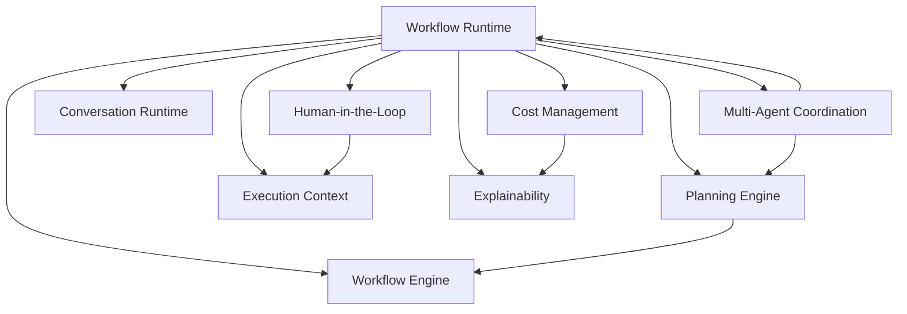

# ADR-018: Enterprise Orchestration Platform

**Status:** Accepted  
**Date:** 2026-07-05  
**Sprint:** O1  
**Author:** Chief Enterprise Architect

## Context

Xennic requires an Enterprise Orchestration Platform — the execution runtime that coordinates intelligence capabilities across the entire platform. This layer sits above the Enterprise Intelligence Platform (Sprint I1).

No business-specific agents are built in this sprint. The deliverable is a reusable orchestration runtime.

## Decision

We decompose the platform into 9 independently-versioned modules within `apps/api/src/modules/enterprise-orchestration/`:

| Phase | Module                   | Responsibility                                                          |
| ----- | ------------------------ | ----------------------------------------------------------------------- |
| 1     | Workflow Engine          | Declarative workflow definitions, templates, validation                 |
| 2     | Planning Engine          | Goal decomposition, task graphs, dependency analysis, replanning        |
| 3     | Workflow Runtime         | Sequential/parallel/conditional execution, retry, timeout, compensation |
| 4     | Human-in-the-Loop        | Approvals, reviews, corrections, escalation, audit                      |
| 5     | Multi-Agent Coordination | Planner/Coordinator/Worker/Reviewer/Critic/Supervisor primitives        |
| 6     | Execution Context        | Shared context, artifacts, memory between workflow steps                |
| 7     | Conversation Runtime     | Conversation state, execution history, session management               |
| 8     | Cost Management          | Provider/token/skill/workflow cost tracking and analysis                |
| 9     | Explainability           | Decision logs, selection rationale, confidence scores, full audit       |

## Architecture Principles

1. **No business-specific agents** — all agent roles are coordination primitives
2. **Compensation-first** — every workflow step can be compensated via reverse-order execution
3. **Human-in-the-loop ready** — approval/review steps are first-class workflow primitives
4. **@Global() modules** — all sub-modules are global, imported by the root orchestration module
5. **In-memory first** — persistence interfaces defined for future DB swap

## Module Relationships

## Consequences

**Positive:**

- Complete workflow lifecycle: define → plan → execute → monitor → explain
- Coordination primitives can be composed into any agent pattern
- Every action is explainable and auditable
- Compensation ensures reliability through partial failure recovery

**Negative:**

- In-memory stores need persistent backing for production
- 9 global modules add startup complexity
- Multi-agent coordination currently simulates execution — real agent logic will replace simulations

**Mitigations:**

- All stores use interfaces (`IWorkflowRepository`, `IExecutionRepository`, etc.)
- Clear @Global() documentation
- Primitives are designed to be extended, not replaced

## References

- ADR-017: Enterprise Intelligence Platform
- docs/enterprise-orchestration-architecture.md
