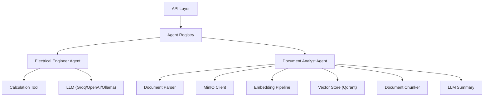
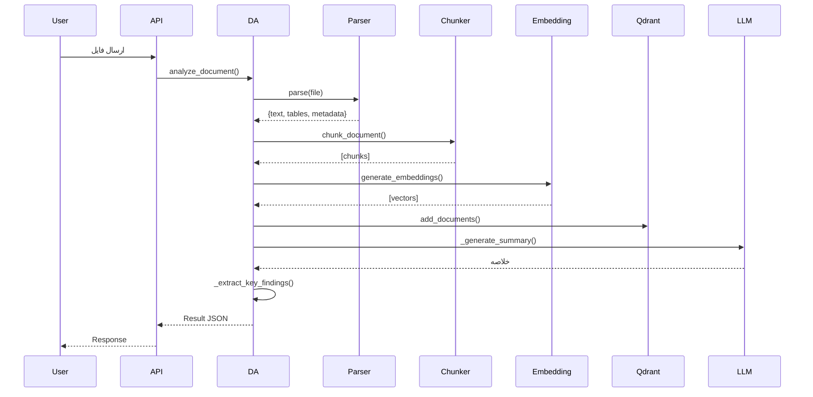

# AI Agents — عامل‌های هوش مصنوعی

**نسخه**: ۱.۰.۰ | **سرویس**: AI Service (پورت ۸۰۰۲) | **وضعیت**: فعال

---

## نمای کلی

AI Service شامل دو عامل (Agent) هوش مصنوعی قابل توسعه است که هر کدام مسئول دامنه خاصی از دانش مهندسی هستند. این عامل‌ها از معماری BaseAgent با قابلیت streaming و tool calling پشتیبانی می‌کنند.

---

## معماری Agent



---

## 1. Electrical Engineer Agent

| ویژگی | مقدار |
|-------|-------|
| Agent ID | `electrical_engineer` |
| Permission | `ai.chat` |
| Tool Calling | CalculationTool |
| Streaming | ✅ |

### قابلیت‌ها
- پاسخ به سوالات مهندسی برق بر اساس استانداردهای IEC/IEEE/NEC
- انجام محاسبات مهندسی با ابزار CalculationTool
- تحلیل نتایج محاسبات و ارائه توصیه‌های فنی
- پشتیبانی از مباحث کابل‌کشی، ترانسفورماتور، حفاظت

### دامنه‌های تحت پوشش
| دامنه | استاندارد مرجع | ابزار محاسباتی |
|--------|----------------|----------------|
| Cable Sizing | IEC 60364-5-52 | CABLE-001 |
| Voltage Drop | IEC 60364-5-52 | CABLE-002 |
| Short Circuit Withstand | IEC 60949 | CABLE-003 |
| Transformer Sizing | IEC 60076 | TRF-001 |
| Transformer Losses | IEC 60076 | TRF-002 |
| Ohm's Law | - | BASIC-001 |
| Active Power | - | BASIC-002 |
| Apparent Power | - | BASIC-003 |
| Reactive Power | - | BASIC-004 |
| Power Factor | - | BASIC-005 |

### معماری
```
ElectricalEngineerAgent
├── ._generate_response()         # fallback responses
├── process()                     # non-streaming chat
├── stream()                      # streaming chat
├── tools.calculate_ohms_law()
├── tools.calculate_active_power()
├── tools.calculate_cable_sizing()
├── tools.calculate_voltage_drop()
├── tools.calculate_transformer_sizing()
└── tools.calculate_transformer_losses()
```

### نمونه سوالات
```
"اندازه کابل برای جریان ۱۰۰ آمپر چقدر است؟"
"محاسبه جریان برای ۲۳۰ ولت و ۲۳ اهم"
"سایز ترانسفورماتور برای ۱۰۰kVA, 11kV/400V"
```

---

## 2. Document Analyst Agent

| ویژگی | مقدار |
|-------|-------|
| Agent ID | `document_analyst` |
| Permission | `ai.document_analysis` |
| RAG Integration | ✅ (auto-index in Qdrant) |
| Streaming | ✅ |

### قابلیت‌ها
- Parse فایل‌های PDF، DOCX و Image
- استخراج متن، جداول و metadata
- تولید خلاصه هوشمند با LLM
- Index خودکار در Qdrant برای RAG
- استخراج key findings
- Workspace isolation
- Chunking هوشمند (chunk_size=۵۰۰, overlap=۵۰)

### جریان پردازش سند


### Key Findings Extraction
استخراج جملات کلیدی بر اساس کلمات:
`shall, must, requires, specifies, maximum, minimum, warning, caution`

---

## توسعه Agent جدید

تمامی Agentها از کلاس `BaseAgent` ارث‌بری می‌کنند:

```python
class BaseAgent:
    AGENT_ID: str           # شناسه یکتا
    AGENT_NAME: str         # نام نمایشی
    DESCRIPTION: str        # توضیحات
    REQUIRED_PERMISSION: str  # مجوز دسترسی
    
    async def process(self, input: ChatInput) -> ChatOutput
    async def stream(self, input: ChatInput)
    def get_system_prompt(self, context: dict) -> str
```

برای افزودن Agent جدید:
1. دایرکتوری در `app/agents/` ایجاد کنید
2. کلاس جدید از `BaseAgent` بسازید
3. در `agent_registry.py` ثبت کنید

---

## وضعیت فعلی

- Electrical Engineer Agent با fallback responses فعال است (بدون API key کار می‌کند)
- Document Analyst Agent با قابلیت‌های کامل (parser, chunker, embedding, Qdrant index) فعال است
- خلاصه‌سازی با LLM در حضور API key انجام می‌شود
- هر دو agent از streaming پشتیبانی می‌کنند
