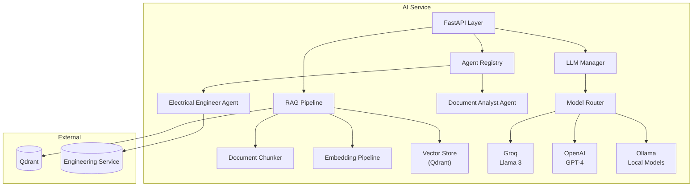

# موتور هوش مصنوعی — AI Engine

**نسخه**: ۱.۰.۰ | **وضعیت**: Approved | **آخرین بروزرسانی**: خرداد ۱۴۰۵

---

## Purpose

معماری جامع موتور هوش مصنوعی پلتفرم Xennic را توصیف می‌کند.

---

## Scope

AI Service (پورت ۸۰۰۲), LLM Integration, RAG, Agents, Embeddings.

---

## Architecture Overview



---

## Agent System

| Agent | ID | Permission | Tools |
|-------|-----|------------|-------|
| Electrical Engineer | `electrical_engineer` | `ai.chat` | CalculationTool, Rule Engine |
| Document Analyst | `document_analyst` | `ai.document_analysis` | DocumentParser, MinIO, Embedding |

### Agent Lifecycle
```
Request → Agent Selection → Permission Check → Prompt Building
  → Tool Calling (if needed) → LLM Generation → Response
```

---

## Model Router

```python
class ModelRouter:
    def route(self, task_type: TaskType, complexity: Complexity) -> str:
        if complexity == Complexity.LOW:
            return "llama-3.1-8b-instant"  # Groq - fast
        elif complexity == Complexity.MEDIUM:
            return "gpt-4o-mini"            # OpenAI - balanced
        else:
            return "gpt-4o"                 # OpenAI - powerful
```

---

## Usage Tracking

```prisma
model ai_usage {
  provider          String    // groq, openai, ollama
  model             String    // llama-3.1-8b-instant, gpt-4o
  prompt_tokens     Int
  completion_tokens Int
  total_tokens      Int
  cost              Decimal
}
```

---

## Related Documents

| سند | مسیر |
|-----|------|
| AI Agents | `ai/AI_AGENTS.md` |
| RAG Architecture | `ai/RAG_ARCHITECTURE.md` |
| LLM Integration | `ai/LLM_INTEGRATION.md` |
| Model Selection | `ai/MODEL_SELECTION.md` |

---

## Revision History

| نسخه | تاریخ | تغییرات |
|------|-------|---------|
| ۱.۰.۰ | خرداد ۱۴۰۵ | انتشار اولیه |
