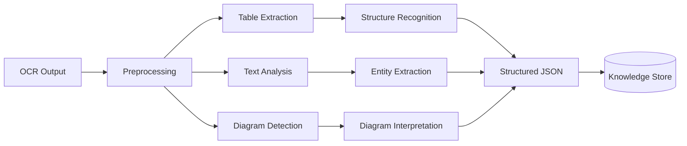

# تحلیل اسناد — Document Analysis

**نسخه**: ۱.۰.۰ | **وضعیت**: Approved | **آخرین بروزرسانی**: خرداد ۱۴۰۵

---

## Purpose

قابلیت تحلیل و استخراج اطلاعات از اسناد فنی مهندسی برق را توصیف می‌کند.

---

## Scope

OCR output processing, table extraction, diagram interpretation.

---

## Pipeline

---

## Text Analysis

| مرحله | توضیح |
|-------|--------|
| Tokenization | تقسیم متن به توکن‌ها |
| NER | شناسایی موجودیت‌های مهندسی |
| Relation Extraction | شناسایی روابط بین موجودیت‌ها |
| Classification | دسته‌بندی سند |
| Summarization | خلاصه‌سازی خودکار |

## Table Extraction

| نوع جدول | روش استخراج |
|----------|-------------|
| Single Line | Regex patterns |
| Multi Line | Grid-based detection |
| Nested Tables | Hierarchical parsing |
| Merged Cells | Span detection |

## Diagram Detection

| نوع نمودار | روش تشخیص |
|------------|----------|
| Single Line | Line detection (Hough) |
| Schematic | Symbol recognition |
| Graph | Node-edge detection |

---

## Related Documents

| سند | مسیر |
|-----|------|
| OCR Pipeline | `ai/OCR_PIPELINE.md` |
| Vision Pipeline | `ai/VISION_PIPELINE.md` |
| AI Engine | `ai/AI_ENGINE.md` |
| Vision AI | `ai/VISION_AI.md` |

---

## Revision History

| نسخه | تاریخ | تغییرات |
|------|-------|---------|
| ۱.۰.۰ | خرداد ۱۴۰۵ | انتشار اولیه |
