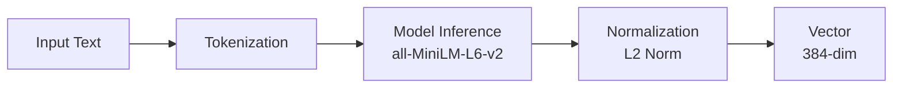

# Pipeline Embedding — Embedding Pipeline

**نسخه**: ۱.۰.۰ | **وضعیت**: Approved | **آخرین بروزرسانی**: خرداد ۱۴۰۵

---

## Purpose

Pipeline تولید Embedding در پلتفرم Xennic را توصیف می‌کند.

---

## Scope

Sentence Transformers, embedding generation, batch processing.

---

## Architecture



---

## Model

| ویژگی | مقدار |
|--------|-------|
| Name | `sentence-transformers/all-MiniLM-L6-v2` |
| Dimension | ۳۸۴ |
| Max Length | ۲۵۶ tokens |
| Batch Size | ۳۲ |
| Normalization | L2 |

---

## Implementation

```python
class EmbeddingPipeline:
    def __init__(self):
        self.model = SentenceTransformer(
            "sentence-transformers/all-MiniLM-L6-v2"
        )
    
    async def generate_embeddings(
        self, texts: list[str]
    ) -> list[list[float]]:
        # Batch processing
        embeddings = self.model.encode(
            texts,
            batch_size=32,
            show_progress_bar=False,
            normalize_embeddings=True,
        )
        return embeddings.tolist()
    
    async def generate_embedding(
        self, text: str
    ) -> list[float]:
        return (await self.generate_embeddings([text]))[0]
```

---

## Integration

```
Document Chunker → Embedding Pipeline → Qdrant Store
                                         ↓
User Query → Embedding Pipeline → Qdrant Search
```

---

## Performance

| معیار | مقدار |
|-------|-------|
| Latency (single) | < ۵۰ms |
| Latency (batch 32) | < ۲۰۰ms |
| Throughput | ~۱۶۰ texts/second |
| Memory Usage | ~۵۰۰MB |

---

## Related Documents

| سند | مسیر |
|-----|------|
| RAG Architecture | `ai/RAG_ARCHITECTURE.md` |
| Vector Database | `ai/VECTOR_DATABASE.md` |
| AI Engine | `ai/AI_ENGINE.md` |

---

## Revision History

| نسخه | تاریخ | تغییرات |
|------|-------|---------|
| ۱.۰.۰ | خرداد ۱۴۰۵ | انتشار اولیه |
