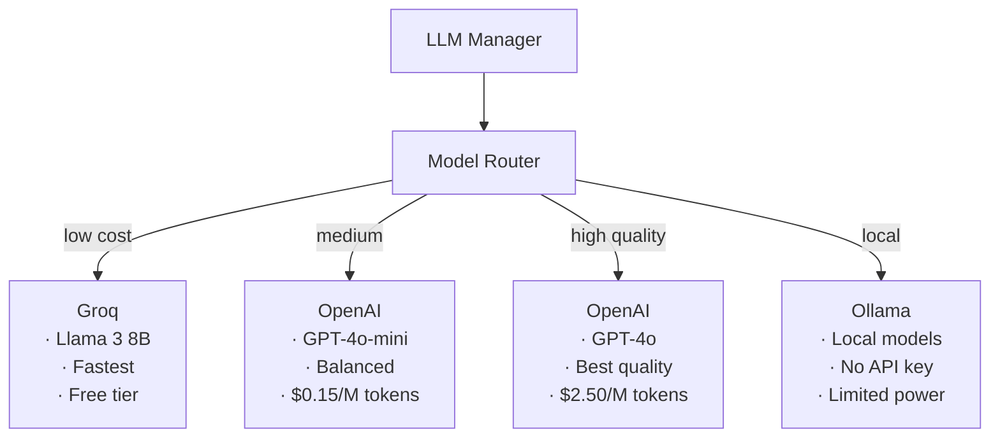

# یکپارچه‌سازی LLM — LLM Integration

**نسخه**: ۱.۰.۰ | **وضعیت**: Approved | **آخرین بروزرسانی**: خرداد ۱۴۰۵

---

## Purpose

نحوه یکپارچه‌سازی مدل‌های زبانی بزرگ (LLM) در پلتفرم Xennic.

---

## Scope

LLM Providers, Model Router, Fallback Strategy.

---

## Provider Architecture



---

## Provider Configuration

```python
# config/providers.py
GROQ_API_KEY = env("GROQ_API_KEY")
GROQ_MODEL = env("GROQ_MODEL", "llama-3.1-8b-instant")

OPENAI_API_KEY = env("OPENAI_API_KEY")
OPENAI_MODEL = env("OPENAI_MODEL", "gpt-4o-mini")

OLLAMA_BASE_URL = env("OLLAMA_BASE_URL", "http://localhost:11434")
OLLAMA_MODEL = env("OLLAMA_MODEL", "llama3.2")
```

---

## Task Routing

| Task | Provider | Model | Priority |
|------|----------|-------|----------|
| Simple Chat | Groq | Llama 3 8B | Speed |
| Document Analysis | OpenAI | GPT-4o-mini | Quality |
| Engineering Calculation | Groq | Llama 3 8B | Speed |
| Complex Analysis | OpenAI | GPT-4o | Quality |
| Local Dev | Ollama | Llama 3.2 | Cost |

---

## Fallback Strategy

```python
async def generate(prompt: str, task: TaskType) -> str:
    try:
        # Try primary provider
        return await groq.generate(prompt)
    except RateLimitError:
        # Fallback to secondary
        return await openai.generate(prompt)
    except AllProvidersFailed:
        # Return fallback response
        return "I apologize, but I'm unable to process this request right now."
```

---

## Response Streaming

```typescript
// Frontend SSE consumption
const response = await fetch('/api/v1/ai/chat', {
  method: 'POST',
  body: JSON.stringify({ message, stream: true }),
});

const reader = response.body.getReader();
while (true) {
  const { done, value } = await reader.read();
  if (done) break;
  // Append chunk to UI
}
```

---

## Usage & Cost Tracking

```
╔═══════════════════════════════════════════╗
║           Monthly AI Usage                ║
╠═══════════════════════════════════════════╣
║ Total Tokens:  1,234,567                 ║
║ Total Cost:    $18.52                    ║
║ Avg Latency:   1.2s                      ║
║ Success Rate:  99.3%                     ║
╚═══════════════════════════════════════════╝
```

---

## Related Documents

| سند | مسیر |
|-----|------|
| AI Engine | `ai/AI_ENGINE.md` |
| Model Selection | `ai/MODEL_SELECTION.md` |
| Prompt Engineering | `ai/PROMPT_ENGINEERING.md` |
| RAG Architecture | `ai/RAG_ARCHITECTURE.md` |

---

## Revision History

| نسخه | تاریخ | تغییرات |
|------|-------|---------|
| ۱.۰.۰ | خرداد ۱۴۰۵ | انتشار اولیه |
