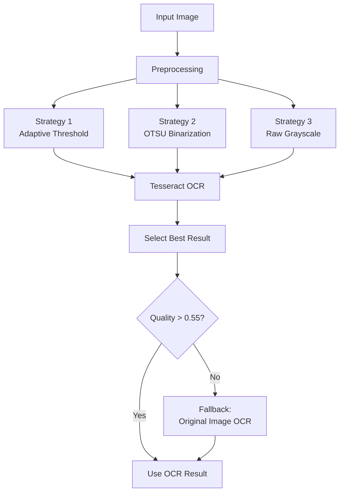

# Pipeline OCR — OCR Pipeline

**نسخه**: ۱.۰.۰ | **وضعیت**: Approved | **آخرین بروزرسانی**: خرداد ۱۴۰۵

---

## Purpose

Pipeline تشخیص متن (OCR) پلتفرم Xennic را توصیف می‌کند.

---

## Scope

Vision Service, Tesseract, EasyOCR, OCR strategies.

---

## معماری Pipeline



---

## OCR Strategies

### 1. Adaptive Threshold
```python
thresh = cv2.adaptiveThreshold(
    gray, 255, cv2.ADAPTIVE_THRESH_GAUSSIAN_C,
    cv2.THRESH_BINARY, blockSize=15, C=2
)
```

### 2. OTSU Binarization
```python
_, thresh = cv2.threshold(gray, 0, 255, cv2.THRESH_BINARY + cv2.THRESH_OTSU)
```

### 3. Raw Grayscale
```python
# بدون باینری‌سازی، مستقیم grayscale
ocr_result = pytesseract.image_to_string(gray, lang='eng+fas')
```

---

## Cascade OCR

```
1. EasyOCR (اگر مدل‌ها کش شده باشند)
   ↓ fail
2. Tesseract (۳ استراتژی - بهترین نتیجه)
   ↓ fail
3. Vision LLM (در صورت وجود API key)
```

---

## Quality Metrics

| معیار | فرمول | آستانه |
|-------|-------|---------|
| Character Readability | `alpha / total_chars` | > ۰.۵۵ |
| Length | کل کاراکترها | > ۱۰ |
| Alphanumeric Ratio | `alnum / total` | > ۰.۴ |

---

## Related Documents

| سند | مسیر |
|-----|------|
| Vision Pipeline | `ai/VISION_PIPELINE.md` |
| Vision AI | `ai/VISION_AI.md` |
| Vision Service | `services/vision-service.md` |

---

## Revision History

| نسخه | تاریخ | تغییرات |
|------|-------|---------|
| ۱.۰.۰ | خرداد ۱۴۰۵ | انتشار اولیه |
