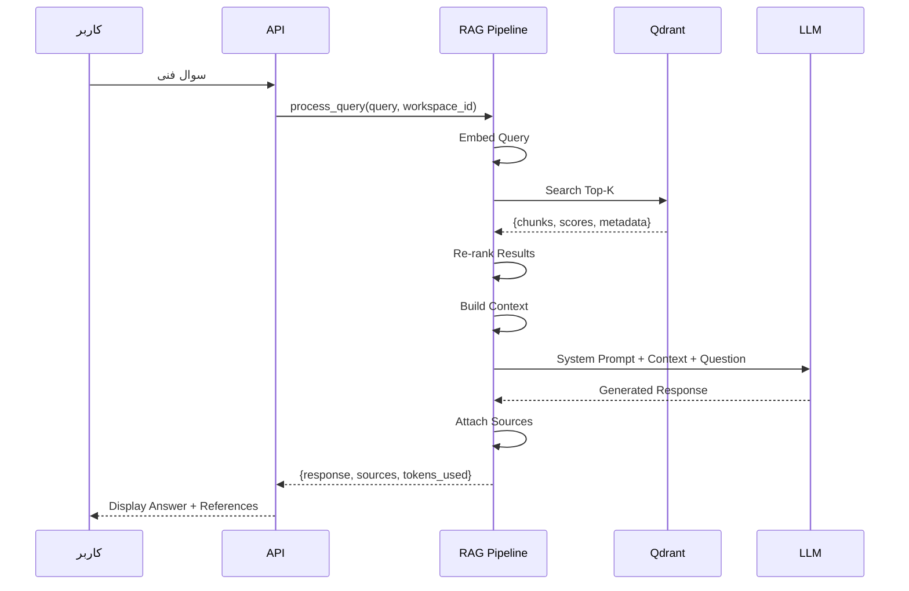

# معماری RAG — Retrieval-Augmented Generation

**نسخه**: ۱.۰.۰ | **وضعیت**: Approved | **آخرین بروزرسانی**: خرداد ۱۴۰۵

---

## Purpose

معماری RAG (بازیابی و تولید) پلتفرم Xennic را توصیف می‌کند.

---

## Scope

AI Service, Qdrant, Embedding Pipeline, Retriever.

---

## RAG Flow



---

## Chunking Strategy

```python
class DocumentChunker:
    def __init__(self, chunk_size=500, chunk_overlap=50):
        self.chunk_size = chunk_size
        self.chunk_overlap = chunk_overlap
    
    def chunk_document(self, document: dict) -> list[Chunk]:
        # 1. Split by paragraphs
        # 2. Merge small paragraphs
        # 3. Split large paragraphs at chunk_size
        # 4. Add overlap between chunks
        # 5. Attach metadata (source, page, workspace_id)
```

---

## Embedding Pipeline

```python
class EmbeddingPipeline:
    model_name = "sentence-transformers/all-MiniLM-L6-v2"
    dimension = 384
    batch_size = 32
    
    async def generate_embeddings(self, texts: list[str]) -> list[list[float]]:
        # Process in batches
        # Return normalized vectors
```

---

## Vector Search (Qdrant)

```python
class QdrantStore:
    collection = "xennic_knowledge"
    distance = "Cosine"
    
    async def search(self, query_vector, workspace_id, limit=5):
        return await self.client.search(
            collection_name=self.collection,
            query_vector=query_vector,
            query_filter=Filter(must=[
                FieldCondition(key="workspace_id", match=MatchValue(value=workspace_id))
            ]),
            limit=limit
        )
```

---

## RAG Performance

| معیار | هدف |
|-------|------|
| Search Latency | < ۱۰۰ms |
| Chunks Retrieved | ۵ (Top-K) |
| Context Length | ~۲۰۰۰ tokens |
| Total RAG Latency | < ۲s |
| Hit Rate | > ۸۰٪ |

---

## Related Documents

| سند | مسیر |
|-----|------|
| AI Engine | `ai/AI_ENGINE.md` |
| LLM Integration | `ai/LLM_INTEGRATION.md` |
| Embedding Pipeline | `ai/EMBEDDING_PIPELINE.md` |
| Vector Database | `ai/VECTOR_DATABASE.md` |

---

## Revision History

| نسخه | تاریخ | تغییرات |
|------|-------|---------|
| ۱.۰.۰ | خرداد ۱۴۰۵ | انتشار اولیه |
