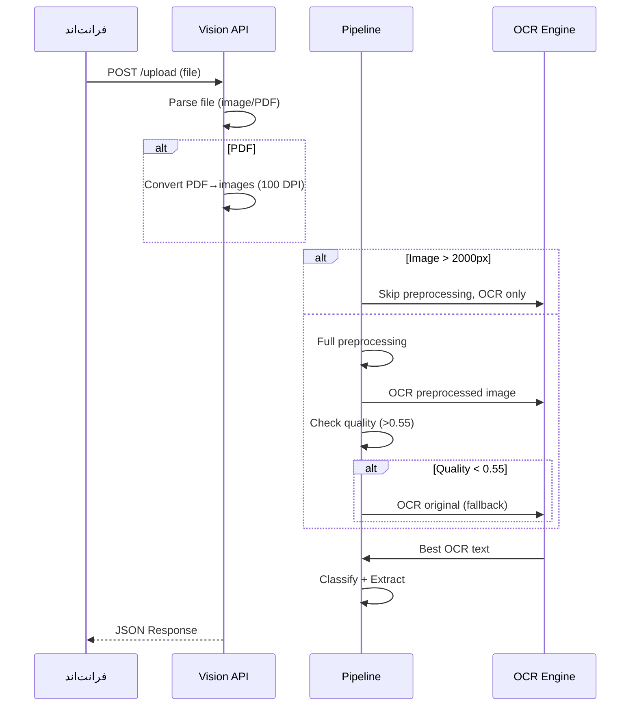

# Vision AI — موتور بینایی و OCR

**نسخه**: ۱.۰.۰ | **آخرین بروزرسانی**: خرداد ۱۴۰۵

---

## جریان Upload (Upload Flow)



---

## Partial Match Algorithm

برای مقاومت در برابر خطاهای OCR (مثلاً `HEATZ`→`heat`):

```python
def _partial_match(text, keyword, threshold=0.5):
    t, kw = text.lower().strip(), keyword.lower().strip()
    if len(t) < 3 or len(kw) < 3:
        return False
    if kw in t or t in kw:
        return True
    common = len(set(t) & set(kw))
    return common / max(len(kw), len(t)) >= threshold
```

---

## سنجش کیفیت OCR

```python
def _ocr_quality(text: str) -> float:
    alpha = sum(c.isalpha() or c.isdigit() or c in ' .,-:/()' for c in text)
    return alpha / len(text) if text else 0.0
```

آستانه: **۰٫۵۵** — اگر کیفیت کمتر باشد، fallback به تصویر اصلی فعال می‌شود.

---

## Nameplate Extractor

| فیلد | الگو |
|------|------|
| manufacturer | لیست برندها (SIEMENS, ABB, HITACHI, ...) |
| model | MODEL/MOD/TYPE + کد |
| power | عدد + HP/kW/W |
| voltage | عدد + V/Volt |
| current | عدد + A/Amp |
| frequency | عدد + Hz |
| speed | عدد + RPM |
| phase | 1-Phase/3-Phase/PH |
| power_factor | عدد + PF/cosφ |
| insulation_class | F, H, B |
| enclosure | IP + عدد |

---

## PDF Processing

```python
DPI = 100  # ~825x1169px برای A4
zoom = DPI / 72
```

تصاویر با عرض > ۲۰۰۰px preprocessing نمی‌خورند. PDFهای A4 در DPI=۱۰۰ حدود ۸۲۵px عرض دارند ← preprocessing کامل اجرا می‌شود.

---

## EasyOCR Integration

```python
class EasyOCREngine:
    def _models_available(self) -> bool:
        model_dir = self.get_model_dir()
        required = ['english_g2.pth', 'arabic.pth']
        return all((model_dir / f).exists() for f in required)
```

**وضعیت فعلی**: مدل‌های EasyOCR کش نشده‌اند ← فقط Tesseract استفاده می‌شود.

---

## Cascade OCR Strategy

```
1. EasyOCR (اگر مدل‌ها کش شده باشند)
2. Tesseract (۳ استراتژی: adaptive, otsu, raw grayscale)
3. Vision LLM (در صورت وجود API key)
```
