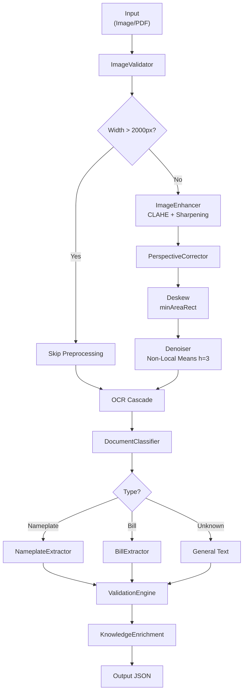

# Pipeline بینایی — Vision Pipeline

**نسخه**: ۱.۰.۰ | **وضعیت**: Approved | **آخرین بروزرسانی**: خرداد ۱۴۰۵

---

## Purpose

Pipeline کامل بینایی ماشین از ورودی تا خروجی را توصیف می‌کند.

---

## Scope

تمام مراحل: Input → Preprocessing → OCR → Detection → Extraction → Validation.

---

## Full Pipeline

---

## Pipeline Stages

| Stage | Input | Output | Async |
|-------|-------|--------|-------|
| ImageValidator | file bytes | validated image | ✅ |
| ImageEnhancer | image | enhanced image | ✅ |
| PerspectiveCorrector | image | corrected image | ✅ |
| DeskewStage | image | deskewed image | ✅ |
| Denoiser | image | denoised image | ✅ |
| OCR Cascade | image | {text, confidence} | ✅ |
| DocumentClassifier | text | document type | ✅ |
| NameplateExtractor | text | {manufacturer, model...} | ✅ |
| BillExtractor | text | {bill#, consumption...} | ✅ |
| ValidationEngine | extracted data | validated data | ✅ |
| KnowledgeEngine | validated data | enriched data | ✅ |

---

## Performance

| مرحله | زمان تقریبی |
|-------|-------------|
| Validation | < ۱۰ms |
| Enhancement | ۵۰-۱۰۰ms |
| Deskew | ۲۰-۵۰ms |
| Denoise | ۱۰۰-۲۰۰ms |
| OCR (Tesseract) | ۵۰۰-۲۰۰۰ms |
| Classification | < ۱۰ms |
| Extraction | < ۵۰ms |
| **Total** | **~۱-۳s** |

---

## Related Documents

| سند | مسیر |
|-----|------|
| OCR Pipeline | `ai/OCR_PIPELINE.md` |
| Document Analysis | `ai/DOCUMENT_ANALYSIS.md` |
| Vision AI | `ai/VISION_AI.md` |
| Vision Service | `services/vision-service.md` |

---

## Revision History

| نسخه | تاریخ | تغییرات |
|------|-------|---------|
| ۱.۰.۰ | خرداد ۱۴۰۵ | انتشار اولیه |
