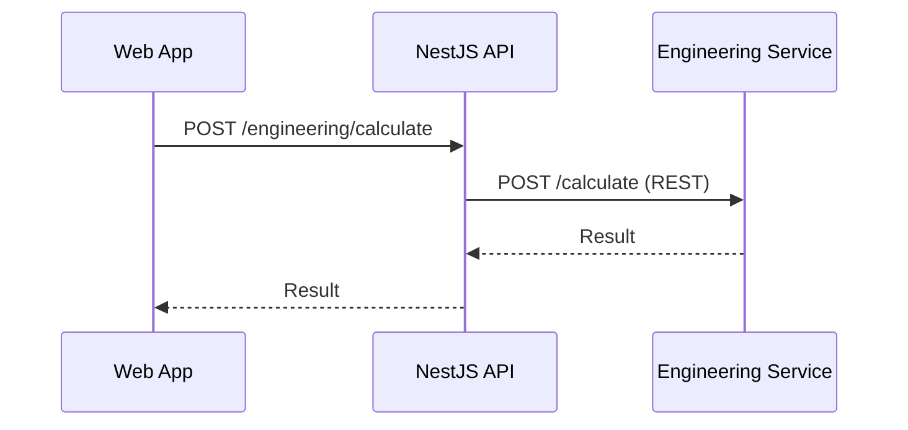
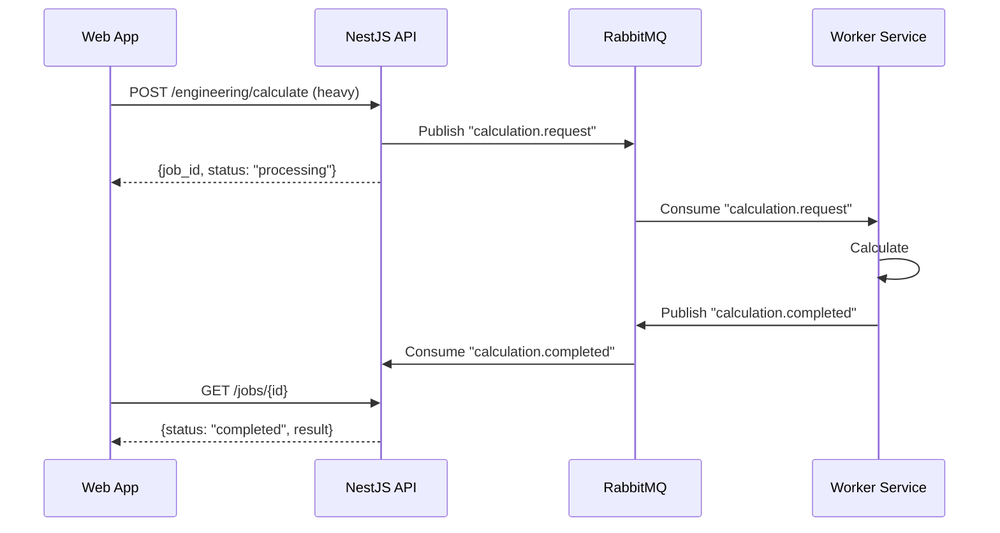

# جریان رویدادها — Event Flow

**نسخه**: ۱.۰.۰ | **وضعیت**: Draft | **آخرین بروزرسانی**: خرداد ۱۴۰۵

---

## Purpose

این سند چگونگی جریان رویدادها (Events) و پیام‌ها را در پلتفرم Xennic توصیف می‌کند.

---

## Scope

رویدادهای سیستمی: ثبت‌نام، ایجاد پروژه، تغییر اشتراک، مصرف AI.

---

## RabbitMQ Integration

RabbitMQ 4 به عنوان message broker پلتفرم پیکربندی شده است. **در حال حاضر استفاده از RabbitMQ برای موارد زیر برنامه‌ریزی شده است:**

| صف (Queue) | Producer | Consumer | وضعیت |
|------------|----------|----------|--------|
| `ai.usage` | AI Service | Worker | 📋 Planned |
| `email.send` | NestJS API | Notification Service | 📋 Planned |
| `file.process` | Vision Service | Worker | 📋 Planned |
| `audit.log` | تمام سرویس‌ها | Audit Service | 📋 Planned |

---

## رویدادهای فعلی (Synchronous)

در وضعیت فعلی، ارتباطات سرویس‌ها به صورت **همزمان (Synchronous REST)** انجام می‌شود:

---

## رویدادهای هدف (Asynchronous)

هدف نهایی استفاده از RabbitMQ برای ارتباطات **ناهمزمان (Asynchronous)**:

---

## رویدادهای پیشنهادی

| رویداد | توضیح | Payload |
|--------|-------|---------|
| `user.registered` | ثبت‌نام کاربر جدید | {user_id, workspace_id} |
| `workspace.created` | ایجاد workspace | {workspace_id, owner_id} |
| `calculation.completed` | پایان محاسبه | {calculation_id, type, result} |
| `ai.usage.recorded` | مصرف AI | {workspace_id, tokens, cost} |
| `subscription.changed` | تغییر اشتراک | {workspace_id, plan_id} |
| `file.uploaded` | آپلود فایل | {file_id, workspace_id} |
| `knowledge.published` | انتشار مقاله | {knowledge_id, workspace_id} |

---

## Related Documents

| سند | مسیر |
|-----|------|
| Request Flow | `architecture/REQUEST_FLOW.md` |
| Sequence Diagrams | `architecture/SEQUENCE_DIAGRAMS.md` |
| Background Jobs | `backend/BACKGROUND_JOBS.md` |

---

## Revision History

| نسخه | تاریخ | تغییرات |
|------|-------|---------|
| ۱.۰.۰ | خرداد ۱۴۰۵ | انتشار اولیه |
