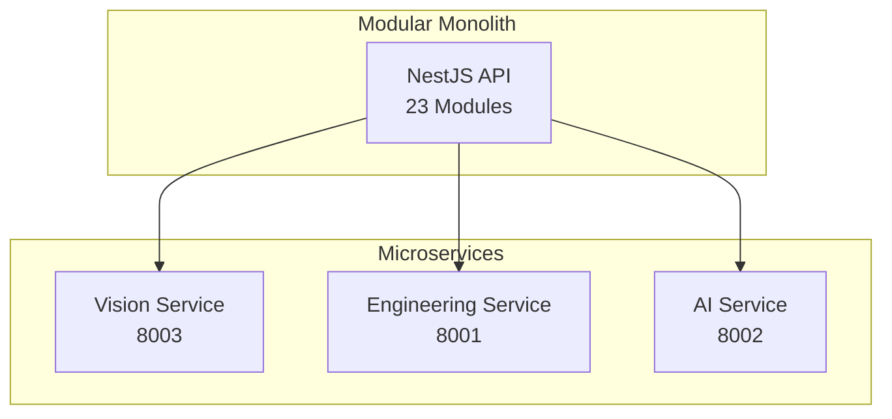
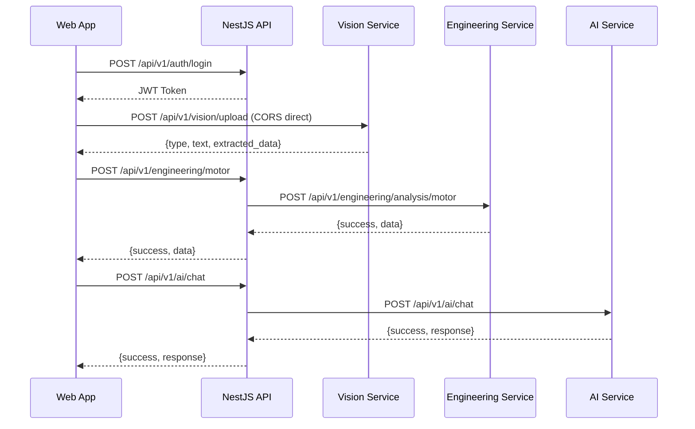

# معماری میکروسرویس‌ها — Microservices Architecture

**نسخه**: ۱.۰.۰ | **وضعیت**: Approved | **آخرین بروزرسانی**: خرداد ۱۴۰۵

**نویسنده**: تیم معماری Xennic

---

## Purpose

این سند معماری میکروسرویس‌های پلتفرم Xennic، ارتباطات،协议和数据 flow بین آنها را توصیف می‌کند.

---

## Scope

میکروسرویس‌های فعال: Vision Service (Python), Engineering Service (Python), AI Service (Python).

---

## نمای کلی

پلتفرم Xennic از معماری **Hybrid Monolith-Microservices** استفاده می‌کند:
- **NestJS API**: ماژولار (Modular Monolith) با قابلیت استخراج به میکروسرویس
- **Python Services**: میکروسرویس‌های مستقل با FastAPI

---

## ارتباطات بین سرویس‌ها

---

## Service Registry (ثبت سرویس‌ها)

| سرویس | آدرس | Port | Health Endpoint |
|-------|------|------|-----------------|
| NestJS API | `http://localhost` | ۳۰۰۰ | `/api/v1/health` |
| Vision Service | `http://localhost` | ۸۰۰۳ | `/health` |
| Engineering Service | `http://localhost` | ۸۰۰۱ | `/health` |
| AI Service | `http://localhost` | ۸۰۰۲ | `/health` |

---

## Service Dependencies

| سرویس | وابستگی‌های مستقیم | وابستگی‌های خارجی |
|-------|-------------------|-------------------|
| NestJS API | PostgreSQL, Redis | - |
| Vision Service | Tesseract, (EasyOCR) | - |
| Engineering Service | PostgreSQL (read) | - |
| AI Service | Qdrant, LLM Providers | Groq, OpenAI, Ollama |

---

## Fault Isolation (جداسازی خطا)

| سناریو | تأثیر | راه‌حل |
|--------|-------|--------|
| Vision Service Down | OCR کار نمی‌کند | Cascade fallback به LLM |
| Engineering Down | محاسبات کار نمی‌کنند | خطای دوستانه به کاربر |
| AI Service Down | چت و جستجو کار نمی‌کنند | Fallback responses |
| PostgreSQL Down | تمام API از کار می‌افتد | Read replicas (آینده) |

---

## Future Improvements

1. **API Gateway**: مسیریابی متمرکز
2. **Service Mesh**: Istio برای observability
3. **Health Checks پیشرفته**: liveness + readiness
4. **Circuit Breaker**: مقاوم‌سازی در برابر خطا
5. **Auto-scaling**: مقیاس‌دهی خودکار

---

## Related Documents

| سند | مسیر |
|-----|------|
| System Architecture | `architecture/SYSTEM_ARCHITECTURE.md` |
| Service Architecture | `architecture/SERVICE_ARCHITECTURE.md` |
| Request Flow | `architecture/REQUEST_FLOW.md` |
| Deployment | `deployment/DOCKER.md` |

---

## Revision History

| نسخه | تاریخ | تغییرات |
|------|-------|---------|
| ۱.۰.۰ | خرداد ۱۴۰۵ | انتشار اولیه |
