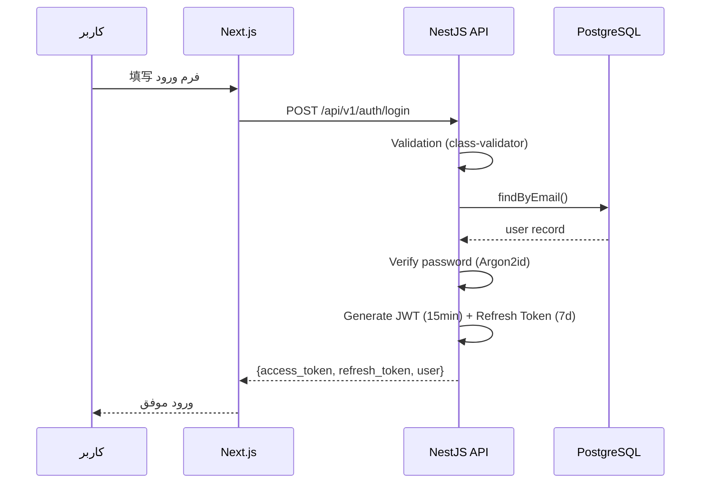
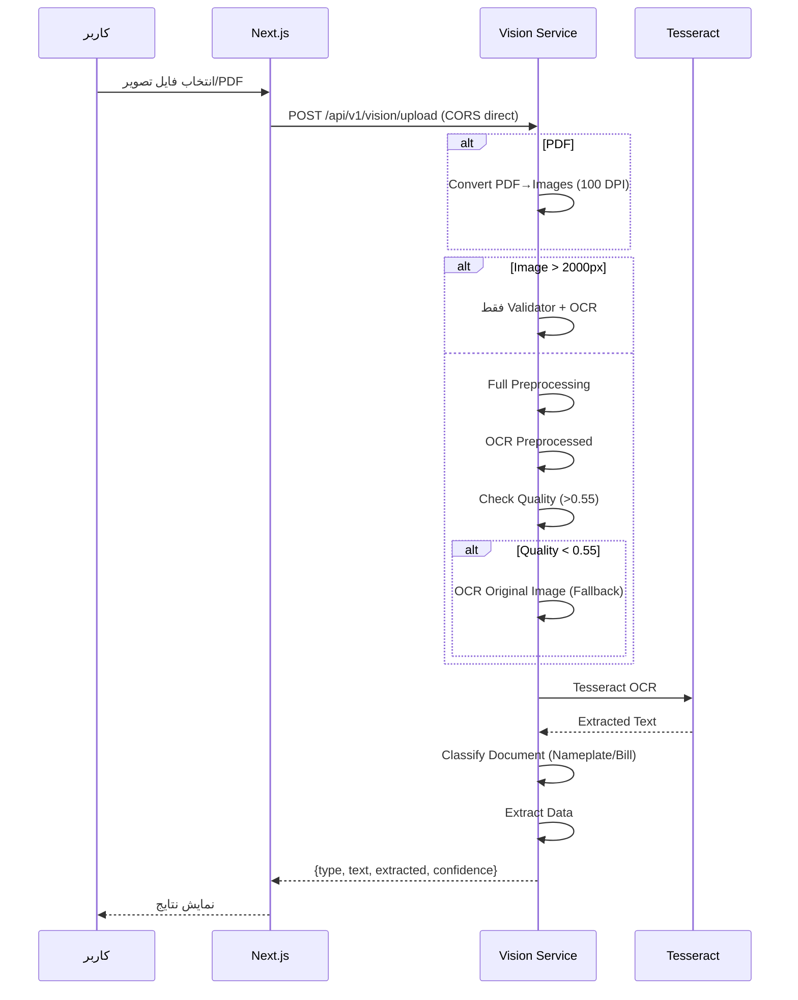
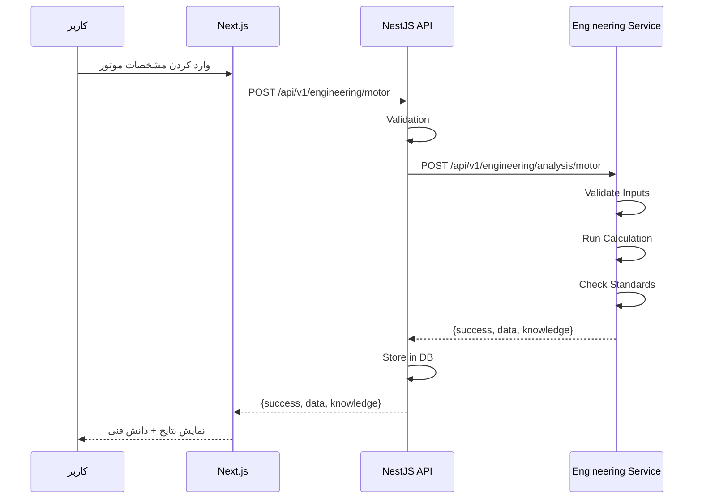
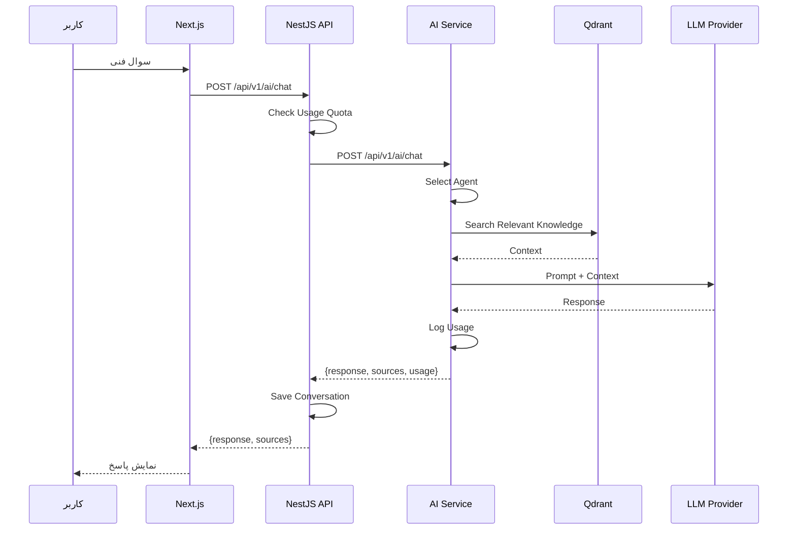

# جریان درخواست‌ها — Request Flow

**نسخه**: ۱.۰.۰ | **وضعیت**: Approved | **آخرین بروزرسانی**: خرداد ۱۴۰۵

**نویسنده**: تیم معماری Xennic

---

## Purpose

این سند چگونگی جریان درخواست‌ها از فرانت‌اند تا پاسخ نهایی را در پلتفرم Xennic توصیف می‌کند.

---

## Scope

تمامی مسیرهای اصلی درخواست: احراز هویت، OCR، محاسبات مهندسی، AI چت.

---

## ۱. احراز هویت (Authentication Flow)

---

## ۲. OCR / Upload (Vision Flow)

---

## ۳. محاسبات مهندسی (Engineering Flow)

---

## ۴. AI Chat Flow

---

## مسیرهای درخواست — خلاصه

| سناریو | مسیر | سرویس‌ها | پروتکل |
|--------|------|-----------|--------|
| Login | `/api/v1/auth/login` | Web → NestJS | HTTP/REST |
| Upload | `/api/v1/vision/upload` | Web → Vision | HTTP/CORS |
| Motor Calc | `/api/v1/engineering/motor` | Web → NestJS → Eng | HTTP/REST |
| AI Chat | `/api/v1/ai/chat` | Web → NestJS → AI | HTTP/REST |
| Knowledge Search | `/api/v1/ai/knowledge` | Web → NestJS → AI → Qdrant | HTTP/gRPC |

---

## Related Documents

| سند | مسیر |
|-----|------|
| System Architecture | `architecture/SYSTEM_ARCHITECTURE.md` |
| Sequence Diagrams | `architecture/SEQUENCE_DIAGRAMS.md` |
| Event Flow | `architecture/EVENT_FLOW.md` |
| API Design | `backend/API_DESIGN.md` |

---

## Revision History

| نسخه | تاریخ | تغییرات |
|------|-------|---------|
| ۱.۰.۰ | خرداد ۱۴۰۵ | انتشار اولیه |
