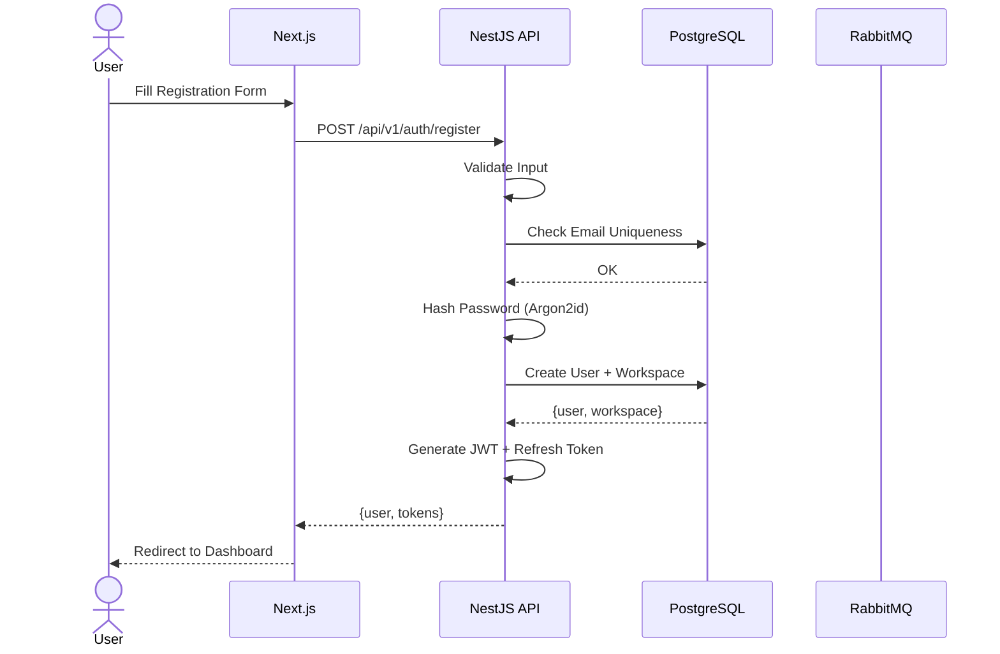
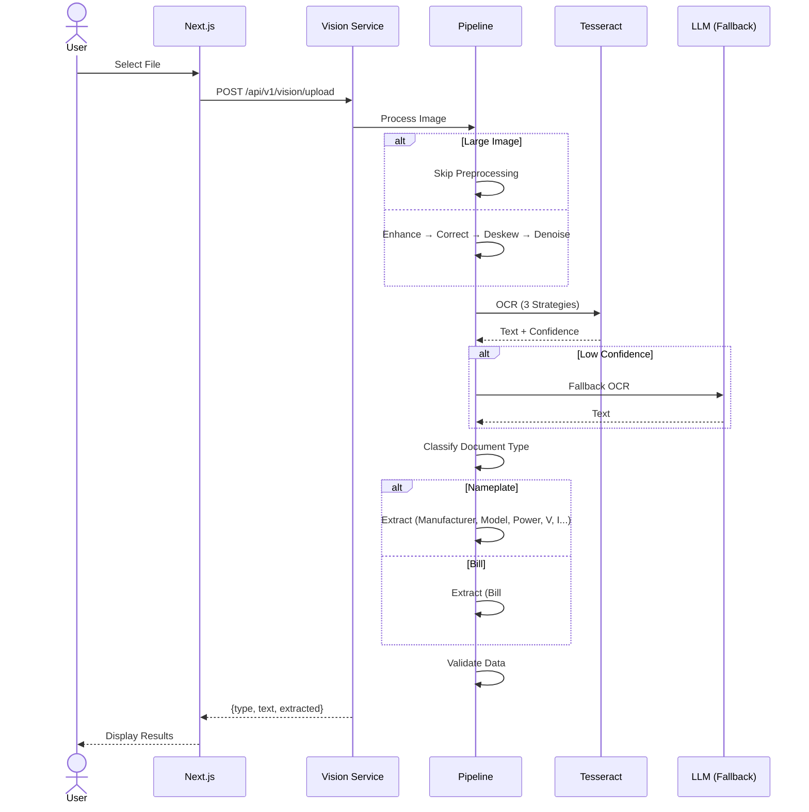
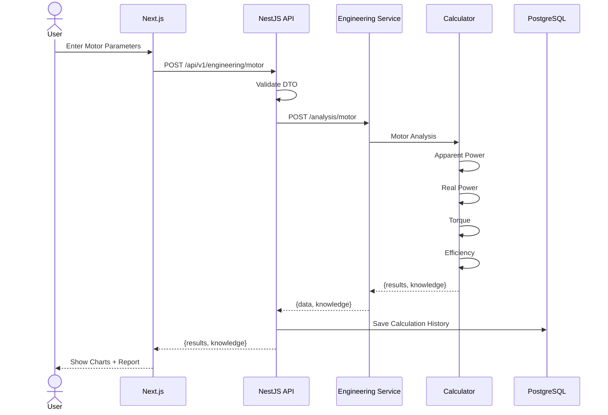
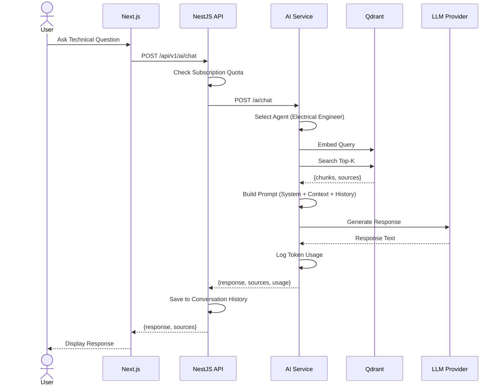
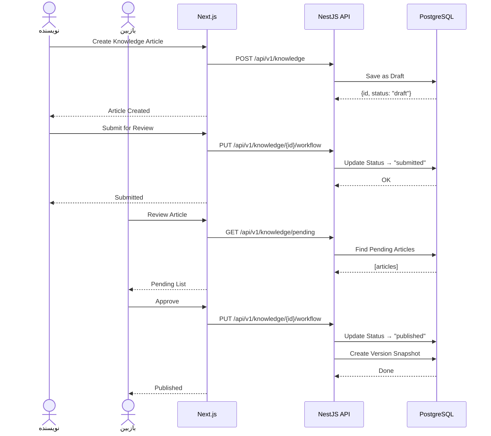

# نمودارهای توالی — Sequence Diagrams

**نسخه**: ۱.۰.۰ | **وضعیت**: Approved | **آخرین بروزرسانی**: خرداد ۱۴۰۵

---

## Purpose

مجموعه نمودارهای توالی (Sequence Diagrams) برای سناریوهای کلیدی پلتفرم Xennic.

---

## ۱. ثبت‌نام کاربر

---

## ۲. OCR Pipeline کامل

---

## ۳. محاسبه موتور الکتریکی

---

## ۴. AI Chat با RAG

---

## ۵. مدیریت دانش (Publish Flow)

---

## Related Documents

| سند | مسیر |
|-----|------|
| Request Flow | `architecture/REQUEST_FLOW.md` |
| Event Flow | `architecture/EVENT_FLOW.md` |
| Service Architecture | `architecture/SERVICE_ARCHITECTURE.md` |

---

## Revision History

| نسخه | تاریخ | تغییرات |
|------|-------|---------|
| ۱.۰.۰ | خرداد ۱۴۰۵ | انتشار اولیه |
