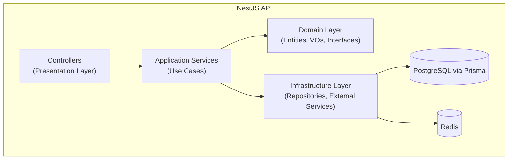
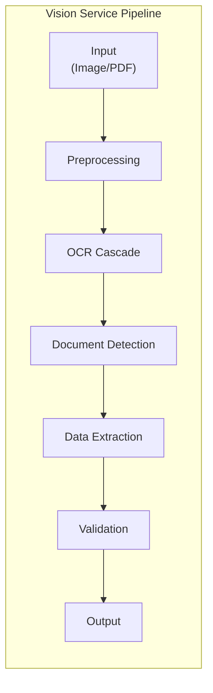
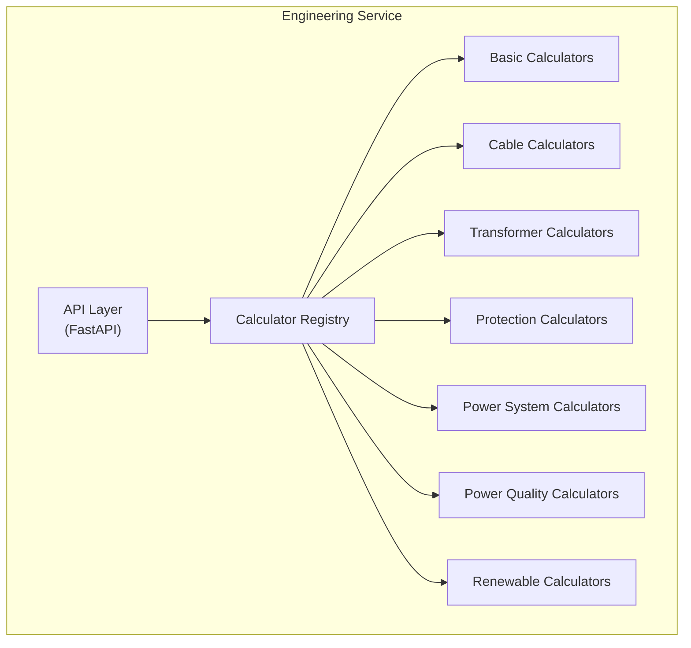
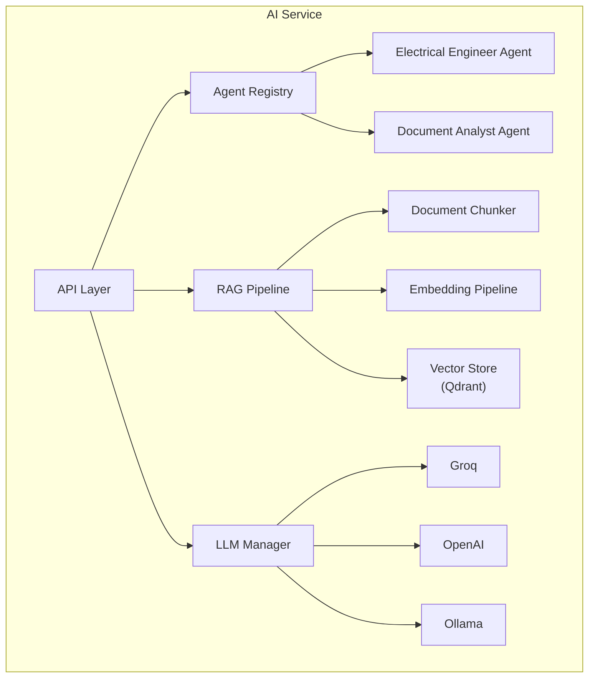

# معماری سرویس‌ها — Service Architecture

**نسخه**: ۱.۰.۰ | **وضعیت**: Approved | **آخرین بروزرسانی**: خرداد ۱۴۰۵

**نویسنده**: تیم معماری Xennic

---

## Purpose

این سند معماری داخلی هر سرویس پلتفرم Xennic را توصیف می‌کند.

---

## Scope

تمام سرویس‌های فعال پلتفرم: NestJS API، Vision Service، Engineering Service، AI Service.

---

## معماری NestJS API



### ساختار ماژول (DDD/CQRS)
```
module/
├── application/    # Use cases, application services
├── domain/         # Entities, value objects, interfaces
├── infrastructure/ # Repositories, external services
├── presentation/   # Controllers, DTOs
└── {module}.module.ts
```

### ماژول‌های NestJS API

| ماژول | دامنه | endpointها |
|-------|-------|------------|
| `auth` | احراز هویت | register, login, refresh, profile |
| `user` | مدیریت کاربران | CRUD, roles |
| `workspace` | فضای کاری | CRUD, members, invitations |
| `engineering` | محاسبات مهندسی | calculate, calculators, history |
| `ai` | هوش مصنوعی | chat, embeddings, search |
| `knowledge` | مدیریت دانش | CRUD, versions, workflow |
| `marketplace` | بازارگاه | products, vendors, orders |
| `subscription` | اشتراک | plans, subscribe, cancel |
| `billing` | صورتحساب | invoices, payments, payment-methods |
| `project` | پروژه‌ها | CRUD, members, notes |
| `storage` | فایل‌ها | upload, list, versions |
| `notification` | اعلان‌ها | list, read, delete |
| `rbac` | نقش و مجوز | roles, permissions |
| `vision` | بینایی | (proxy به Vision Service) |
| `api-keys` | کلید API | CRUD |
| `webhooks` | وب‌هوک | subscribe, events |
| `admin` | مدیریت پلتفرم | dashboard, users, settings |
| `health` | سلامت | health, database, redis |
| `search` | جستجو | search, index |
| `standards` | استانداردها | CRUD |
| `consultations` | مشاوره | CRUD |
| `email` | ایمیل | send, templates |
| `feature-flags` | ویژگی‌ها | manage, check |

---

## معماری Vision Service



### مراحل Pipeline

| Stage | کلاس‌ها | مسئولیت |
|-------|---------|----------|
| **Preprocessing** | Validator, Enhancer, Corrector, Deskew, Denoiser | آماده‌سازی تصویر |
| **OCR Cascade** | EasyOCR, Tesseract, VisionLLM | تشخیص متن با fallback |
| **Detection** | DocumentClassifier | تشخیص نوع سند (پلاک/قبض) |
| **Extraction** | NameplateExtractor, BillExtractor | استخراج داده‌های فنی |
| **Validation** | ValidationEngine, KnowledgeEngine | اعتبارسنجی و غنی‌سازی |

---

## معماری Engineering Service



### Calculator Registry (Singleton)
- ثبت خودکار تمام ماشین‌حساب‌ها در زمان راه‌اندازی
- جستجوی ماشین‌حساب با کد یکتا
- Validation pipeline

---

## معماری AI Service



---

## Related Documents

| سند | مسیر |
|-----|------|
| System Architecture | `architecture/SYSTEM_ARCHITECTURE.md` |
| Microservices | `architecture/MICROSERVICES.md` |
| NestJS Modules | `architecture/NESTJS_MODULES.md` |
| Vision Service | `services/vision-service.md` |
| Engineering Service | `services/engineering-service.md` |
| AI Service | `services/ai-service.md` |

---

## Revision History

| نسخه | تاریخ | تغییرات |
|------|-------|---------|
| ۱.۰.۰ | خرداد ۱۴۰۵ | انتشار اولیه |
