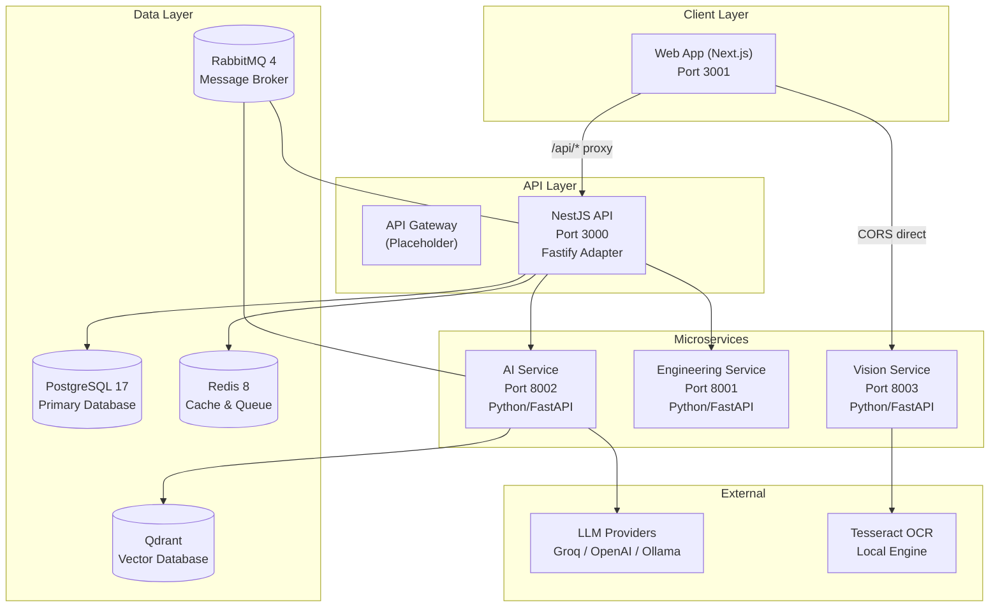

# معماری سیستم — System Architecture

**نسخه**: ۱.۰.۰ | **وضعیت**: Approved | **آخرین بروزرسانی**: خرداد ۱۴۰۵

**نویسنده**: تیم معماری Xennic

---

## Purpose (هدف)

این سند نمای کلی معماری سیستم Xennic را توصیف می‌کند. هدف آن ارائه درک جامع از ساختار، مؤلفه‌ها و ارتباطات بین سرویس‌های پلتفرم است.

---

## Scope (دامنه)

این سند تمام مؤلفه‌های اصلی پلتفرم Xennic را پوشش می‌دهد:
- Frontend (Next.js)
- Backend API (NestJS)
- Microservices (Vision, Engineering, AI)
- Data Layer (PostgreSQL, Redis, Qdrant)
- Infrastructure (Docker, RabbitMQ)

---

## Architecture Overview (نمای کلی معماری)

---

## معماری لایه‌ای (Layered Architecture)

| لایه | مؤلفه‌ها | مسئولیت |
|------|----------|----------|
| **Presentation** | Next.js Web App | رابط کاربری، i18n، SSR |
| **API Gateway** | Placeholder | مسیریابی، rate limiting (آینده) |
| **Application** | NestJS API | منطق کسب‌وکار، validation، orchestration |
| **Microservices** | Vision, Engineering, AI | دامنه‌های تخصصی |
| **Infrastructure** | PostgreSQL, Redis, RabbitMQ, Qdrant | ذخیره‌سازی، کش، صف، جستجو |

---

## اصول معماری (Architecture Principles)

| اصل | توضیح |
|------|--------|
| **Separation of Concerns** | هر سرویس مسئول یک دامنه مشخص |
| **Resilience** | خرابی یک سرویس کل سیستم را از کار نمی‌اندازد |
| **Extensibility** | Pipeline و Strategy Pattern برای توسعه آسان |
| **Multi-tenant** | جداسازی داده‌ها با workspace_id |
| **API First** | OpenAPI/Swagger برای تمام APIها |
| **Security by Design** | JWT, RBAC, Input Validation |

---

## آمار معماری (Architecture Stats)

| معیار | مقدار |
|-------|-------|
| تعداد سرویس‌ها | ۴ (API, Vision, Engineering, AI) |
| تعداد ماژول‌های NestJS | ۲۳ |
| تعداد مدل‌های Prisma | ۴۷ |
| زبان‌های برنامه‌نویسی | TypeScript, Python |
| Container Runtime | Docker |
| Package Manager | pnpm (JS), pip (Python) |

---

## Future Improvements

1. **API Gateway واقعی**: جایگزینی placeholder با Kong/NGINX
2. **Service Mesh**: افزودن Istio برای مدیریت ترافیک
3. **Kubernetes**: مهاجرت از Docker Compose به K8s
4. **Event Driven**: استفاده کامل از RabbitMQ برای ارتباطات ناهمزمان
5. **GraphQL**: افزودن GraphQL برای queries پیچیده

---

## Related Documents

| سند | مسیر |
|-----|------|
| Service Architecture | `architecture/SERVICE_ARCHITECTURE.md` |
| Microservices | `architecture/MICROSERVICES.md` |
| Request Flow | `architecture/REQUEST_FLOW.md` |
| Master Architecture | `architecture/XENNIC_MASTER_ARCHITECTURE.md` |
| Architecture Spec | `architecture/XENNIC_ARCHITECTURE_SPEC_v1.md` |

---

## Revision History

| نسخه | تاریخ | تغییرات |
|------|-------|---------|
| ۱.۰.۰ | خرداد ۱۴۰۵ | انتشار اولیه |
