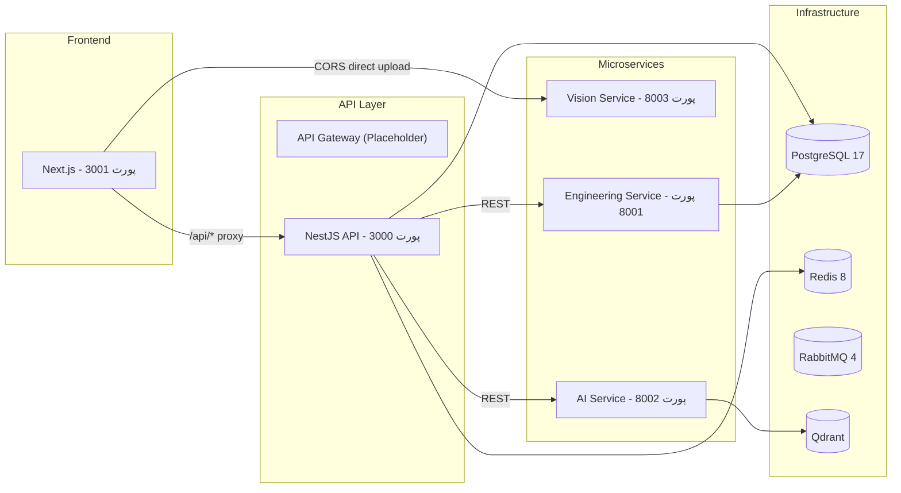

# معماری جاری Xennic

**نسخه**: ۱.۰.۰ | **آخرین بروزرسانی**: خرداد ۱۴۰۵

> این سند وضعیت **فعلی** پلتفرم را توصیف می‌کند. برای معماری هدف و蓝图 بلندمدت به `XENNIC_ARCHITECTURE_SPEC_v1.md` مراجعه کنید.

---

## مرزهای دامنه (Domain Boundaries)



---

## مسئولیت‌های سرویس‌ها

### Web Frontend (Next.js — پورت ۳۰۰۱)
- رابط کاربری اصلی با Next.js App Router
- پروکسی API به NestJS از طریق rewrites
- اتصال CORS مستقیم به Vision Service برای آپلود فایل
- بین‌المللی‌سازی با next-intl (فارسی/انگلیسی)

### NestJS API (پورت ۳۰۰۰)
- API مرکزی با Fastify adapter
- احراز هویت JWT
- مدیریت کاربران و workspace
- validation با whitelist + forbidNonWhitelisted
- مستندات Swagger در `/api/docs`

### Vision Service (Python/FastAPI — پورت ۸۰۰۳)
- OCR با Tesseract (و EasyOCR اختیاری)
- معماری Pipeline با Chain of Responsibility
- Cascade OCR: EasyOCR → Tesseract → LLM
- تشخیص خودکار نوع سند (پلاک/قبض)
- استخراج داده‌های ساخت‌یافته

### Engineering Service (Python/FastAPI — پورت ۸۰۰۱)
- محاسبات تخصصی مهندسی برق
- تحلیل موتور و ترانسفورماتور
- تحلیل حفاظت و کابل

### AI Service (Python/FastAPI — پورت ۸۰۰۲)
- سرویس هوش مصنوعی و LLM
- پشتیبانی از Groq, OpenAI, Ollama
- جستجوی برداری با Qdrant
- RAG Pipeline

---

## جریان داده (Data Flow)

### آپلود تصویر (Vision)
```
فرانت‌اند → POST /api/v1/vision/upload → Vision Service
                                    ↓
                              پیش‌پردازش (Validator, Enhancer, Deskew, Denoiser)
                                    ↓
                              Cascade OCR (EasyOCR → Tesseract → LLM)
                                    ↓
                              تشخیص نوع سند (پلاک/قبض)
                                    ↓
                              استخراج داده‌ها
                                    ↓
                              پاسخ JSON
```

### محاسبات مهندسی
```
فرانت‌اند → NestJS → POST /calculate → Engineering Service
                                    ↓
                              Validation → Calculation Engine
                                    ↓
                              ذخیره در PostgreSQL → پاسخ
```

---

## ارتباطات بین سرویس‌ها

| مبدأ | مقصد | روش | پروتکل |
|------|------|------|--------|
| فرانت‌اند | NestJS | Next.js rewrites | HTTP |
| فرانت‌اند | Vision Service | CORS مستقیم | HTTP |
| NestJS | Engineering Service | REST | HTTP |
| NestJS | AI Service | REST | HTTP |
| AI Service | LLM Provider | API Call | HTTP |
| AI Service | Qdrant | gRPC | HTTP |

---

## وضعیت فعلی — نکات مهم

### پیاده‌سازی‌شده
- ✅ معماری Monorepo با pnpm + Turborepo
- ✅ NestJS API با Prisma ORM
- ✅ Vision Service با Pipeline معماری
- ✅ Cascade OCR (Tesseract فعال، EasyOCR اختیاری)
- ✅ تشخیص خودکار پلاک/قبض با partial match
- ✅ استخراج مشخصات فنی از پلاک
- ✅ محاسبات موتور و ترانسفورماتور
- ✅ جستجوی برداری با Qdrant
- ✅ احراز هویت JWT

### در حال توسعه
- 🔄 EasyOCR (مدل‌ها نیاز به دانلود دارند)
- 🔄 API Gateway واقعی
- 🔄 سیستم دانش مهندسی
- 🔄 بهبود OCR برای اسناد واقعی

### برنامه‌ریزی‌شده
- 📋 بازارگاه محتوا
- 📋 اپلیکیشن موبایل
- 📋 سیستم اشتراک و صورتحساب
- 📋 سیستم فایل (MinIO)
- 📋 پنل ادمین

---

## بدهی فنی (Technical Debt)

### بحرانی
1. **API Gateway**: سرویس `services/api-gateway/` خالی است — فرانت‌اند مستقیم به Vision Service وصل شده
2. **nest-cli.json**: `root` اشاره به `apps/xennic` دارد درحالی که مسیر صحیح `apps/api` است
3. **EasyOCR**: مدل‌ها در سرور کش نشده، دانلود زمان‌بر است
4. **PDF Timeout**: پردازش PDF ممکن است timeout بخورد (نیاز به async processing)

### متوسط
1. **تست Vision**: تست‌ها محدود به happy path هستند
2. **Error handling**: Pipeline نیاز به بهبود مدیریت خطا دارد
3. **Logging**: سطح لاگینگ در سرویس‌ها یکسان نیست
4. **TypeScript strict**: در برخی پکیج‌ها فعال نیست

### جزئی
1. **Environment variables**: مستندات env ناقص است
2. **Docker**: برخی سرویس‌ها Dockerfile ندارند
3. **PaddleOCR**: وابستگی ناقص (نیاز به GPU)
