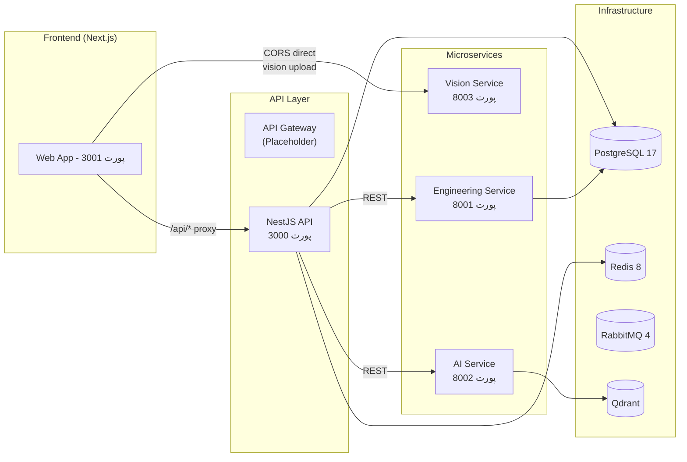
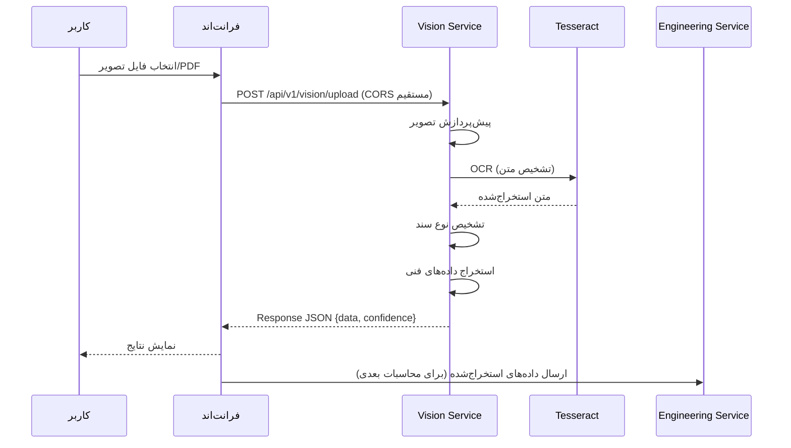
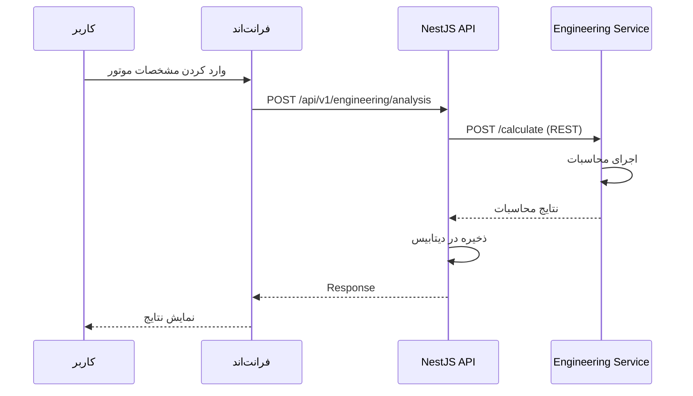
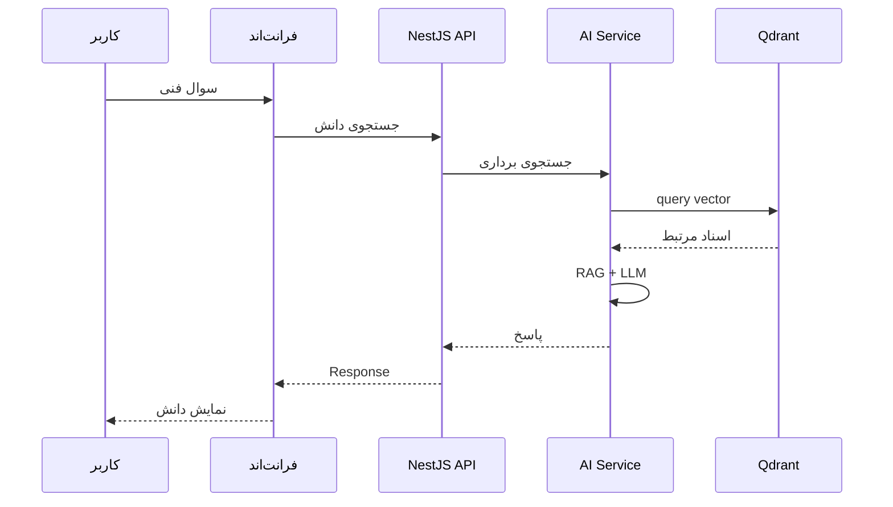
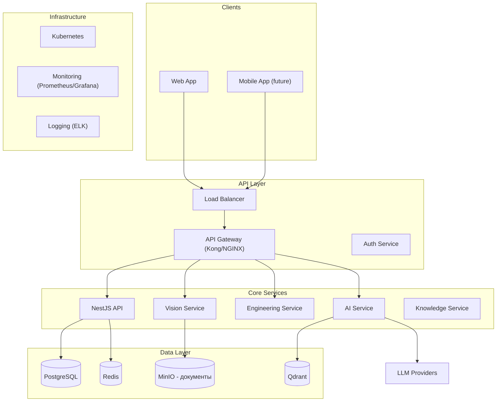

# معماری جامع Xennic

**نسخه**: ۱.۰.۰ | **آخرین بروزرسانی**: خرداد ۱۴۰۵

---

## چشم‌انداز معماری

Xennic به عنوان یک پلتفرم مهندسی برق هوشمند با معماری میکروسرویس و رویکرد **مستندسازی خودکار** و **تحلیل هوشمند** طراحی شده است. معماری فعلی یک MVP (محصول حداقلی قابل ارائه) را هدف گرفته که قابلیت scaling به محصول enterprise را دارد.

---

## اصول معماری

۱. **جداسازی مسئولیت‌ها (Separation of Concerns)**: هر سرویس مسئول یک دامنه مشخص است
۲. **مقاوم در برابر خطا (Resilience)**: خرابی یک سرویس نباید کل سیستم را از کار بیندازد
۳. **قابلیت توسعه (Extensibility)**: افزودن قابلیت‌های جدید از طریق Pipeline و Strategy Pattern
۴. **چندزبانه (i18n)**: پشتیبانی کامل از فارسی و انگلیسی
۵. **چندمستأجری (Multi-tenant)**: جداسازی داده‌های مشتریان با `workspace_id`
۶. **مستندسازی خودکار**: OpenAPI/Swagger برای تمام APIها

---

## مرزهای دامنه (Domain Boundaries)



---

## مسئولیت‌های سرویس‌ها

### Web Frontend (Next.js)
- رابط کاربری اصلی
- پروکسی API از طریق rewrites به NestJS
- اتصال مستقیم CORS به Vision Service برای آپلود
- بین‌المللی‌سازی (next-intl)
- پورت: ۳۰۰۱

### NestJS API
- API مرکزی پلتفرم
- احراز هویت و مدیریت کاربران (JWT)
- مدیریت محاسبات مهندسی
- یکپارچه‌سازی با میکروسرویس‌ها
- مدیریت workspace (چندمستأجری)
- مستندات Swagger در `/api/docs`
- پورت: ۳۰۰۰

### Vision Service
- OCR تصاویر و PDF
- تشخیص خودکار نوع سند (پلاک / قبض)
- استخراج داده‌های ساخت‌یافته
- معماری Pipeline با Chain of Responsibility
- Cascade OCR: EasyOCR → Tesseract → LLM
- پورت: ۸۰۰۳

### Engineering Service
- محاسبات تخصصی مهندسی برق
- تحلیل موتور الکتریکی
- تحلیل ترانسفورماتور
- تحلیل حفاظت و کابل
- Validation و قوانین مهندسی
- پورت: ۸۰۰۱

### AI Service
- سرویس هوش مصنوعی و LLM
- پردازش زبان طبیعی
- تولید دانش فنی
- جستجوی معنایی با Qdrant
- پورت: ۸۰۰۲

---

## جریان داده (Data Flow)

### جریان آپلود تصویر (Vision Pipeline)


### جریان محاسبات مهندسی


### جریان دانش (Knowledge Flow)


---

## ارتباطات بین سرویس‌ها (Communication Flow)

| مبدأ | مقصد | پروتکل | روش |
|------|------|--------|-----|
| فرانت‌اند | NestJS | HTTP | Next.js rewrites |
| فرانت‌اند | Vision Service | HTTP | CORS مستقیم |
| NestJS | Engineering Service | HTTP/REST | API Call |
| NestJS | AI Service | HTTP/REST | API Call |
| AI Service | LLM Provider | HTTP | API Call |
| AI Service | Qdrant | gRPC | Vector Search |

---

## گراف وابستگی (Dependency Graph)

```
Web Frontend
├── NestJS API (rewrites)
└── Vision Service (CORS direct)

NestJS API
├── Engineering Service (REST)
├── AI Service (REST)
├── PostgreSQL
└── Redis

Vision Service
├── Tesseract OCR
├── EasyOCR (optional)
└── LLM Provider (optional)

Engineering Service
└── PostgreSQL (read)

AI Service
├── LLM Provider (Groq/OpenAI/Ollama)
├── Qdrant
└── PostgreSQL (read)
```

---

## معماری فعلی (Current State)

### نکات مثبت
- جداسازی مناسب سرویس‌ها
- معماری Pipeline با قابلیت توسعه
- Cascade OCR برای resilience
- پشتیبانی از چند LLM Provider
- Swagger/OpenAPI خودکار

### نقاط ضعف
- API Gateway خالی (placeholder) — فرانت‌اند مستقیم به Vision Service وصل است
- وابستگی به دسترسی مستقیم CORS به Vision Service
- PaddleOCR نصب نیست (EasyOCR مدل‌ها کش نشده)
- مستندات ناقص
- تست‌های یکپارچه‌سازی محدود
- Metrics و monitoring پیاده‌سازی نشده

---

## بدهی فنی (Technical Debt)

### بحرانی
1. **API Gateway**: سرویس `services/api-gateway/` خالی است
2. **nest-cli.json**: مسیر اشتباه به `apps/xennic` به جای `apps/api`
3. **PaddleOCR**: وابستگی ناقص (paddlepaddle نیاز به GPU دارد)
4. **EasyOCR**: مدل‌ها در سرویس کش نشده، دانلود در اولین درخواست زمان‌بر است

### متوسط
1. **تست Vision**: تست‌ها فقط سناریوهای happy path را پوشش می‌دهند
2. **Error handling**: مدیریت خطاها در Pipeline نیاز به بهبود دارد
3. **Timeouts**: زمان timeout برای فایل‌های PDF بزرگ کافی نیست
4. **Logging**: سطح logging در microservices یکسان نیست

### جزئی
1. **TypeScript strict mode**: در برخی پکیج‌ها فعال نیست
2. **Environment variables**: مستندات env کامل نیست
3. **Docker**: بعضی سرویس‌ها Dockerfile ندارند

---

## معماری هدف (Target Architecture)



---

## تصمیمات معماری (ADRs)

### ADR-001: انتخاب FastAPI به جای Flask برای سرویس‌های Python
- **زمینه**: نیاز به سرویس‌های Python با performance بالا
- **تصمیم**: FastAPI با پشتیبانی از async/await
- **دلایل**: عملکرد بالا، Pydantic validation، OpenAPI خودکار، async nativ
- **پیامدها**: سازگاری کامل با Python asyncio

### ADR-002: معماری Pipeline برای Vision Service
- **زمینه**: نیاز به پردازش چندمرحله‌ای تصاویر با قابلیت توسعه
- **تصمیم**: Chain of Responsibility + Strategy Pattern
- **دلایل**: قابلیت افزودن/حذف مراحل، تست‌پذیری، جداسازی مسئولیت‌ها
- **پیامدها**: هر Stage می‌تواند مستقلاً توسعه و تست شود

### ADR-003: Cascade OCR 
- **زمینه**: عدم قطعیت در دسترس بودن موتورهای OCR مختلف
- **تصمیم**: Cascade Fallback: EasyOCR → Tesseract → LLM
- **دلایل**: مقاوم‌سازی در برابر خطا، استفاده از بهترین موتور موجود
- **پیامدها**: پیچیدگی بیشتر در مدیریت نتایج، نیاز به clear کردن errors بعد از success

### ADR-004: CORS مستقیم فرانت‌اند به Vision Service
- **زمینه**: API Gateway هنوز پیاده‌سازی نشده
- **تصمیم**: اتصال مستقیم فرانت‌اند به Vision Service از طریق CORS
- **دلایل**: راه‌اندازی سریع‌تر، کاهش latency برای فایل‌های حجیم
- **پیامدها**: ریسک امنیتی (CORS به * باز است)، نیاز به API Gateway در آینده

### ADR-005: UUID برای شناسه‌های موجودیت
- **زمینه**: نیاز به شناسه‌های یکتا در سطح سیستم
- **تصمیم**: UUID v4 برای همه موجودیت‌ها
- **دلایل**: قابلیت توزیع‌شوندگی، عدم وابستگی به توالی، امنیت بیشتر
- **پیامدها**: حجم بیشتر در دیتابیس، عدم قابلیت مرتب‌سازی بر اساس ID

---

## معماری آینده (Future Architecture)

- **API Gateway کامل**: Kong یا NGINX به عنوان Gateway با rate limiting
- **سرویس احراز هویت مستقل**: جداسازی auth از NestJS
- **Message Queue کامل**: استفاده از RabbitMQ برای ارتباطات ناهمزمان
- **سرویس دانش مستقل**: جداسازی سیستم دانش از AI Service
- **MinIO**: ذخیره‌سازی اسناد و تصاویر
- **Kubernetes**: orchestration خودکار
- **Monitoring**: Prometheus + Grafana
- **Mobile App**: اپلیکیشن موبایل برای مهندسان
