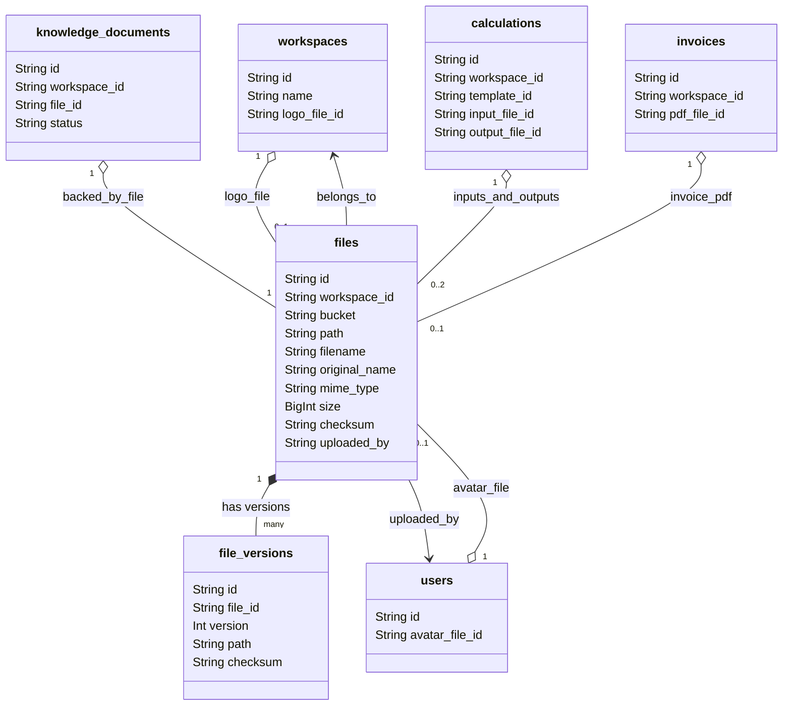
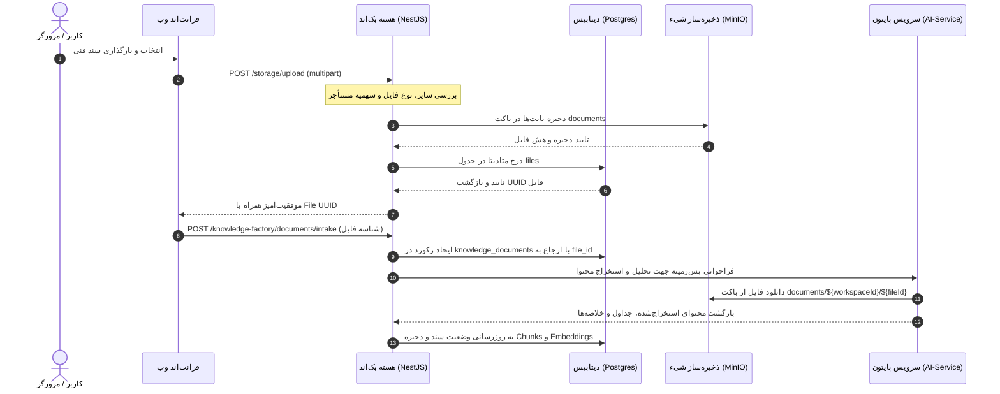

# سند معماری هدف پلتفرم ذخیره‌سازی جامع و یکپارچه زنیک (Target Architecture)
========================================================================

**شناسه سند:** XENNIC-STORAGE-ARCH-002  
**تاریخ سند:** ۲۸ تیر ۱۴۰۵ (2026-07-18)  
**نسخه:** 1.0.0  
**تدوین‌کننده:** دستیار معماری و حاکمیت Storage (شناسه: `XENNIC-STORAGE-ARCH-001`)  
**مخاطب:** Chief Executive AI (CEAI)، معماران ارشد و تیم‌های توسعه  
**وضعیت معماری:** در انتظار بررسی (IN_REVIEW)  

---

## ۱. بیانیه چشم‌انداز معماری (Architectural Vision)

پلتفرم ذخیره‌سازی مرکزی زنیک باید به عنوان **منبع واحد حقیقت (Single Source of Truth - SSoT)** برای تمام موجودیت‌های غیرساختاریافته (فایل‌ها، اسناد فنی، تصاویر، نقشه‌ها، پیوست‌ها و نسخه‌های دارایی‌ها) عمل کند. این معماری با هدف یکپارچه‌سازی کامل فرآیندهای ذخیره‌سازی بک‌اند NestJS، ماژول هوش مصنوعی (Knowledge Factory) و میکروسرویس پایتون طراحی شده است تا تعاملات استوریج را ساده، فوق‌العاده امن، مقیاس‌پذیر و مستقل از دامنه‌های جانبی سازد.

### اصول کلیدی طراحی (Core Design Principles):
1. **تمرکزگرایی و تجمیع (Centralization):** هیچ دامنه‌ای مجاز نیست کلاینت مستقل یا استراتژی باکت‌بندی متفاوتی برای تعامل مستقیم با MinIO پیاده‌سازی کند. تمام ارتباطات از طریق ماژول مرکزی `storage` انجام می‌شود.
2. **یکپارچگی مفهومی (Canonical Modeling):** تعریف تمایز ساختاری دقیق بین File، Document، Asset و Attachment در سطح بیزینس و پایگاه داده.
3. **امنیت پیش‌فرض و ایزوله‌سازی کامل (Secure by Default & Multi-Tenancy):** جداسازی کامل داده‌های مشتریان (Workspaces) در عین ارائه مکانیزمی امن و کارآمد برای دسترسی بدون نیاز به احراز هویت به دارایی‌های عمومی (مانند آیکون‌ها و لوگوها).
4. **تطابق کامل کد و مستندات (Zero-Drift Enforcement):** هرگونه تغییر در بستر ذخیره‌سازی باید از طریق مکانیزم‌های بازبینی کیفیت حاکمیتی کنترل و تایید شود.

---

## ۲. تعاریف مفاهیم پایه‌ای پلتفرم (Canonical Taxonomy)

جهت جلوگیری از سردرگمی توسعه‌دهندگان، واژگان و ماهیت موجودیت‌های ذخیره‌سازی به شکل زیر تعریف و تفکیک می‌شوند:

```
                                  ┌─────────────────┐
                                  │   FileEntity    │ (پایه تمام موجودیت‌ها)
                                  └────────┬────────┘
                                           │
         ┌────────────────────────┬────────┴────────┬────────────────────────┐
         ▼                        ▼                 ▼                        ▼
┌─────────────────┐     ┌─────────────────┐ ┌─────────────────┐     ┌─────────────────┐
│    Document     │     │      Asset      │ │   Attachment    │     │   FileVersion   │
├─────────────────┤     ├─────────────────┤ ├─────────────────┤     ├─────────────────┤
│ اسناد متنی، فنی │     │ دارایی‌های برند  │ │  پیوست‌های موقت │ │   تاریخچه تغییرات  │
│  نقشه‌ها، PDFها │     │ لوگو، آواکار... │ │ محاسبات، قبوض.. │ │   و ارجاعات فایل   │
└─────────────────┘     └─────────────────┘ └─────────────────┘     └─────────────────┘
```

1. **فایل (File):** آبجکت پایه‌ای و خام ذخیره شده در Object Storage که دارای شناسه‌ای منحصربه‌فرد (UUID)، متادیتای پایه (سایز، پسوند، نوع فایل، هش بیزینسی) و متعلق به یک مستأجر (Workspace) مشخص است.
2. **سند (Document):** موجودیتی با ارزش معنایی بالا (Semantic-Rich File) که وارد فرآیند پردازش کارخانه دانش (Knowledge Factory) یا موتورهای هوش مصنوعی می‌شود. اسناد قابلیت تکه‌تکه شدن (Chunking)، استخراج محتوا (Extraction)، تحلیل مفاهیم (OCR) و نمایه‌سازی برداری (Vector Indexing) را دارا هستند.
3. **دارایی رابط کاربری (Asset):** فایلی که در دامنه‌های عمومی فرانت‌اند و برندینگ استفاده می‌شود (مانند Favicon، لوگوی شرکت، تصاویر برندینگ سازمان و آواتار کاربران). این دارایی‌ها ویژگی دسترسی عمومی بدون لاگین (Public Access) را دارا می‌باشند.
4. **پیوست دامنه‌ای (Attachment):** فایلی که به یکی از هویت‌های دامنه‌ای کسب‌وکار متصل است (مانند فایل اکسل ضمیمه‌شده به یک گزارش محاسباتی، تصویر فیش یک قبض پرداختی، یا پیوست‌های متنی تسک‌ها). پیوست‌ها چرخه حیات خود را از موجودیت مرجع خود به ارث می‌برند.
5. **نسخه فایل (FileVersion):** تاریخچه‌ای از وضعیت فایل در زمان‌های مختلف. پلتفرم ذخیره‌سازی امکان جایگزینی یک فایل با نسخه جدیدتر را بدون تغییر در شناسه مرجع فایل (File ID) ارائه می‌دهد.

---

## ۳. مدل ساختاری و ارتباطات بین‌دامنه‌ای (Domain Relationships)

در معماری هدف، موجودیت مرکزی `files` از طریق جدول‌های رابط یا ارتباطات اختیاری (Optional Relations)، نقش چسب متصل‌کننده تمام دامنه‌ها را به فایل‌ها ایفا می‌کند:



---

## ۴. استراتژی باکت‌بندی و جداسازی داده‌ها (Unified Bucketing Strategy)

برای یکپارچه‌سازی فرآیند ذخیره‌سازی در کل زیست‌بوم زنیک، تمام کلاینت‌ها (شامل پایتون و کارخانه دانش) ملزم به استفاده از مدل ۶ باکتی توافق‌شده هستند. استراتژی باکت‌بندی یکپارچه به صورت زیر اصلاح و یکپارچه می‌شود:

| نام باکت | طبقه‌بندی دسترسی | کاربردهای تعیین شده | نحوه جداسازی مستأجر (Tenant Isolation) |
| :--- | :--- | :--- | :--- |
| **`public`** | کاملاً عمومی (Public-Read) | لوگوی سازمان، آواتار کاربر، دارایی‌های عمومی برندینگ | استفاده از پیشوند آدرس: `public/${workspaceId}/${fileId}` |
| **`private`** | کاملاً محرمانه (Restricted) | اسناد کاری کاربران، گزارش‌ها، ضمیمه‌های حساس دامنه‌ای | استفاده از پیشوند آدرس: `${workspaceId}/private/${fileId}` |
| **`reports`** | کاملاً محرمانه (Restricted) | قبوض مالیاتی، گزارش‌های عملکرد خروجی از سیستم | استفاده از پیشوند آدرس: `${workspaceId}/reports/${fileId}` |
| **`documents`** | کاملاً محرمانه (Restricted) | اسناد ورودی کارخانه دانش برای پردازش RAG و هوش مصنوعی | استفاده از پیشوند آدرس: `${workspaceId}/documents/${fileId}` |
| **`engineering`**| کاملاً محرمانه (Restricted) | فایل‌های محاسباتی مهندسی، نقشه‌های CAD و محاسبات | استفاده از پیشوند آدرس: `${workspaceId}/engineering/${fileId}` |
| **`ai`** | کاملاً محرمانه (Restricted) | فایل‌های مدل‌های محلی، وزن‌ها، کانتکست‌های بزرگ چت | استفاده از پیشوند آدرس: `${workspaceId}/ai/${fileId}` |

### حل چالش فایل‌های عمومی (Public vs Private Access Strategy):
- برای باکت `public`، یک سیاست دسترسی عمومی (Anonymous Read S3 Bucket Policy) روی MinIO تنظیم می‌شود.
- در بک‌اند NestJS، اندپوینتی ویژه با آدرس `/storage/public/:id` بدون هیچ گارد احراز هویتی تعریف می‌شود. این اندپوینت فقط درخواست‌های مرتبط با باکت `public` را پذیرفته و آبجکت را به صورت مستقیم یا در قالب presigned لود می‌کند.
- برای سایر باکت‌ها، احراز هویت قوی توکن و بررسی دقیق عضویت در Workspace (`WorkspaceGuard`) اجباری است.

---

## ۵. اینترفیس جامع و همگرای استوریج (Centralized IStorageService)

جهت حل چالش کرش و ناهماهنگی در ماژول‌های دیگر، اینترفیس واحد زیر طراحی شده است. کلاس `StorageService` هسته موظف است این اینترفیس را به طور کامل پیاده‌سازی کند:

```typescript
export interface IUnifiedStorageService {
  /**
   * آپلود فایل به همراه ثبت در پایگاه داده
   */
  upload(data: {
    workspaceId: string;
    uploadedBy: string;
    buffer: Buffer;
    originalName: string;
    mimeType: string;
    bucket?: FileBucket;
    customPath?: string;
  }): Promise<FileEntity>;

  /**
   * دانلود مستقیم فایل
   */
  download(id: string, workspaceId: string): Promise<{ buffer: Buffer; file: FileEntity }>;

  /**
   * دریافت آدرس موقت Presigned جهت دانلود کلاینت
   */
  getDownloadUrl(id: string, workspaceId: string, expirySeconds?: number): Promise<{ url: string; file: FileEntity }>;

  /**
   * آپلود یک نسخه جدید از فایل
   */
  uploadNewVersion(id: string, workspaceId: string, buffer: Buffer, uploadedBy: string): Promise<FileVersionEntity>;

  /**
   * حذف نرم (غیرفعال‌سازی در پایگاه داده)
   */
  softDelete(id: string, workspaceId: string): Promise<void>;

  /**
   * حذف سخت (پاکسازی از دیتابیس و MinIO)
   */
  hardDelete(id: string, workspaceId: string): Promise<void>;

  /**
   * بررسی وجود فایل
   */
  exists(id: string, workspaceId: string): Promise<boolean>;
}
```

---

## ۶. فرآیند همگام‌سازی و رفع باگ کارخانه دانش (Knowledge Factory Integration)

برای برطرف کردن باگ کرش و همسان‌سازی پردازش اسناد با پلتفرم مرکزی:
1. ارجاع `'IStorageService'` در `KnowledgeFactoryModule` به کلاس اصلاح شده و مطابق با اینترفیس جدید نگاشت داده می‌شود.
2. موجودیت `KnowledgeDocument` از این پس یک ارجاع مستقیم به شناسه فیزیکی فایل ثبت‌شده در جدول `files` خواهد داشت (`file_id`).
3. در فرآیند ثبت سند فنی:
   - ابتدا متد `StorageService.upload` با تعیین باکت `documents` فراخوانی می‌شود.
   - شناسه فایل بازگردانده شده (`file.id`) در فراداده‌های `knowledge_documents` ذخیره می‌شود.
   - پردازش اسناد همواره با خواندن متادیتا از جدول `files` مرجع یکتا انجام می‌گیرد.

---

## ۷. فرآیند همگام‌سازی میکروسرویس پایتون (Python AI-Service Alignment)

میکروسرویس پایتون از این پس حق ساخت باکت مستقل به فرمت `{workspace_id}-documents` را ندارد.
1. کلاینت پایتونی `MinIOClient` ویرایش شده تا ساختار باکت‌های پروژه را منطبق بر نام‌های شش‌گانه هسته (`documents`, `ai`, ...) بشناسد.
2. برای خواندن فایل‌هایی که هوش مصنوعی باید پردازش کند (مثلاً استخراج جداول)، سرویس پایتون شناسه فایل (`file_id`) و شناسه مستأجر (`workspace_id`) را دریافت می‌کند. سپس فایل را از مسیر استاندارد `${workspace_id}/documents/${file_id}.{ext}` در باکت `documents` فراخوانی می‌نماید.
3. ارتباطات در لایه API بین NestJS و پایتون همواره بر پایه شناسه‌های یکتای فایل تعبیه شده در جدول دیتابیس مشترک (`files`) صورت می‌پذیرد.

---

## ۸. ماشین‌های وضعیت چرخه حیات موجودیت‌ها (Lifecycle State Machines)

زنیک باید چرخه حیات فایل‌ها را در قالب ماشین وضعیت‌های دقیق مدیریت کند تا همواره ردیابی و ممیزی سیستم شفاف باشد.

### الف) چرخه حیات فایل و نسخه‌ها (File & Version Lifecycle)
```
[Uploaded] ───► [Active] ───► [Archived] ───► [Soft-Deleted] ───► [Purged/Hard-Deleted]
                     ▲                                │
                     │                                │ (Restore action)
                     └────────────────────────────────┘
```
- **Uploaded:** فایل در MinIO قرار گرفته و متادیتای اولیه ثبت شده است.
- **Active:** فایل تایید شده و نسخه‌های آن در دسترس برنامه‌ها قرار دارد.
- **Archived:** فایل به بایگانی منتقل شده (آبجکت MinIO به کلاس ذخیره‌سازی ارزان‌تر مانند Cold Storage انتقال می‌یابد).
- **Soft-Deleted:** رکورد از دید کاربر مخفی شده اما داده‌ها در سیستم جهت بازگردانی تا بازه زمانی مشخص نگهداری می‌شوند.
- **Purged:** پاکسازی کامل فیزیکی فایل و تمام نسخه‌های تاریخی آن از دیتابیس و MinIO.

### ب) چرخه حیات اسناد کارخانه دانش (Knowledge Document Lifecycle)
```
[Registered] ──► [Intaken/Saved] ──► [Classified] ──► [Parsed] ──► [Chunked & Embedded] ──► [Published]
                                                                                                  │ (On error)
                                                                                                  ▼
                                                                                              [Failed]
```

---

## ۹. استراتژی مدیریت نسخه‌ها، حذف و نگهداری (Retention & Versioning Strategy)

### الف) مکانیزم نسخه‌گذاری فایل‌ها
- هر آپلود جدید روی یک شناسه فایل موجود، یک رکورد در جدول `file_versions` ایجاد می‌کند.
- شماره نسخه به صورت افزایشی (`version = version + 1`) درج می‌شود.
- در دیتابیس، ارجاع اصلی همواره به آخرین نسخه معتبر نگاشت دارد، اما کلاینت‌ها با پارامتر اختیاری `?v=1` می‌توانند نسخه‌های قدیمی‌تر را دانلود کنند.

### ب) سیاست نگهداری و پاک‌سازی (Retention and Deletion Rules)
1. **پاکسازی فایل‌های حذف نرم شده (Soft-Delete Retention):** فایل‌هایی که به وضعیت Soft-Deleted تغییر یافته‌اند، پس از گذشت **۳۰ روز** به صورت کاملاً خودکار توسط یک Scheduler جاب (NestJS Cron/BullMQ) از MinIO و دیتابیس به صورت سخت حذف می‌شوند.
2. **سقف تعداد نسخه‌ها (Max Version Threshold):** هر فایل حداکثر می‌تواند **۵ نسخه تاریخی** داشته باشد. با آپلود نسخه ششم، قدیمی‌ترین نسخه تاریخی به صورت خودکار حذف سخت می‌شود.

### ج) سیاست سهمیه مصرفی مستأجرین (Storage Quota Model)
- هر Workspace دارای یک سقف فضای ذخیره‌سازی بر اساس طرح اشتراک (Subscription Plan) خود است (مثلاً طرح پایه: ۱ گیگابایت، طرح پیشرفته: ۲۰ گیگابایت).
- در متد `upload` پیش از شروع دریافت جریان بایت‌ها، مجموع حجم مصرفی مستأجر از جدول `files` استعلام شده و با سقف مجاز مقایسه می‌شود. در صورت تجاوز از سقف، خطای `403 Quota Exceeded` صادر می‌شود.

---

## ۱۰. دیاگرام فرآیندهای بارگذاری و دسترسی (Sequence Diagrams)

### فرآیند بارگذاری امن و موازی اسناد به کارخانه دانش (Unified Document Intake Flow)


---

## ۱۱. تاییدیه گیت‌های کیفیت معماری (Quality Gates Approval)

به عنوان راهبر معماری و حاکمیت استوریج زنیک، اجرای فاز یک توسعه پیاده‌سازی این پلتفرم منوط به پاس کردن گیت‌های کیفی زیر است:
- [ ] **Architecture Gate:** تایید نهایی این سند توسط Chief Executive AI.
- [ ] **Database Gate:** اعمال موفق مهاجرت‌های ساختار جدول‌ها در Prisma و دیتابیس بدون از دست رفتن اطلاعات موجود.
- [ ] **Security Gate:** تست موفق عدم دسترسی به فایل مستأجر الف توسط مستأجر ب در تمام سطوح دیتابیس و MinIO.
- [ ] **Integration Gate:** راه‌اندازی فرآیند پردازش RAG با کلاینت استوریج همگرا بدون وجود خطاهای ناسازگاری لایه هوش مصنوعی.
- [ ] **Infrastructure Gate:** اضافه شدن موفق کانتینر MinIO به کدهای بیس Docker Compose پروژه و قبولی در سناریوی Disaster Recovery.
- [ ] **Test Coverage Gate:** پوشش تست بالای ۸۰ درصد برای ماژول استوریج جدید.
- [ ] **Tenant Isolation Check:** تایید تفکیک مستأجرین در سطح پایگاه داده و آبجکت استوریج به صورت یکتا.
- [ ] **Performance Review:** تایید کارکرد سریع لودینگ و دانلود مستقیم فایل‌ها بدون تاثیر منفی بر رم سرور بک‌اند.
- [ ] **API Registry Approval:** تایید نهایی سوابق و مستندات اتصالات عمومی و محرمانه استوریج.
