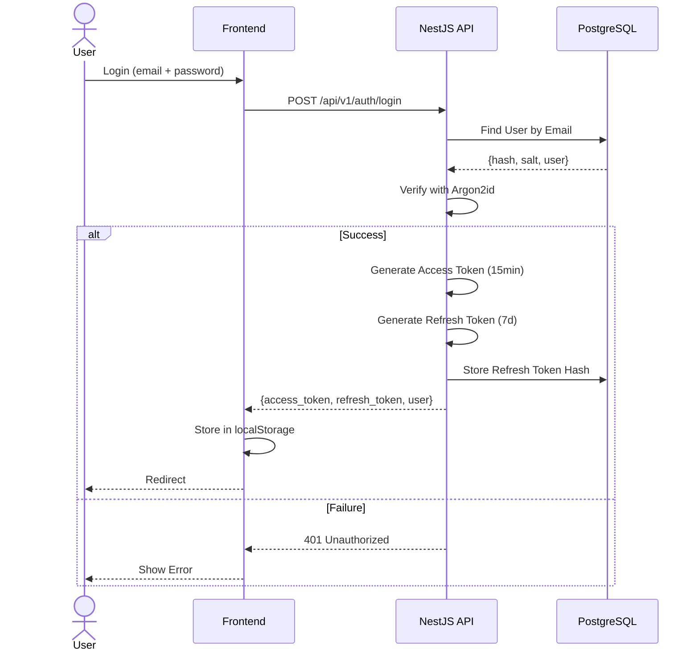
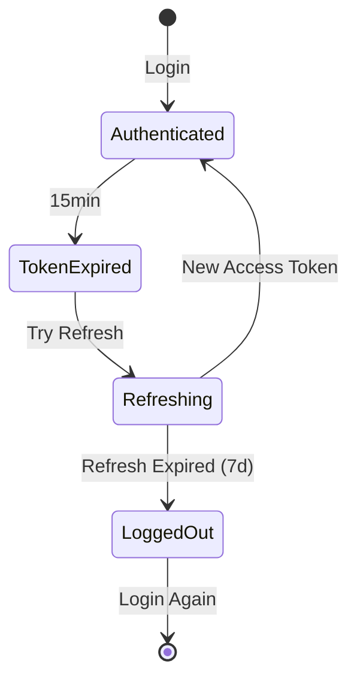

# احراز هویت — Authentication

**نسخه**: ۱.۰.۰ | **وضعیت**: Approved | **آخرین بروزرسانی**: خرداد ۱۴۰۵

---

## Purpose

این سند مکانیزم احراز هویت پلتفرم Xennic را توصیف می‌کند.

---

## Scope

تمامی روش‌های احراز هویت: JWT, Refresh Token, Password Hashing.

---

## مکانیزم



---

## JWT Configuration

```typescript
{
  secret: process.env.JWT_SECRET,
  signOptions: {
    expiresIn: '15m',    // Access Token
    algorithm: 'RS256',   // RSA Signature
  },
  refreshToken: {
    expiresIn: '7d',     // Refresh Token
  }
}
```

### Payload
```json
{
  "sub": "user-uuid",
  "email": "user@example.com",
  "workspace_id": "workspace-uuid",
  "role": "ENGINEER",
  "iat": 1719000000,
  "exp": 1719000900
}
```

---

## Token Flow



---

## Password Hashing

| الگوریتم | Argon2id |
|----------|----------|
| Salt Length | ۱۶ bytes |
| Memory Cost | ۱۹MB |
| Time Cost | ۲ iterations |
| Parallelism | ۱ thread |

---

## API Endpoints

| مسیر | متد | توضیح |
|------|------|-------|
| `/api/v1/auth/register` | POST | ثبت‌نام کاربر جدید |
| `/api/v1/auth/login` | POST | ورود (دریافت JWT) |
| `/api/v1/auth/logout` | POST | خروج (revoke refresh token) |
| `/api/v1/auth/refresh` | POST | refresh access token |
| `/api/v1/auth/me` | GET | اطلاعات کاربر جاری |
| `/api/v1/auth/profile` | PUT | به‌روزرسانی پروفایل |
| `/api/v1/auth/change-password` | POST | تغییر رمز عبور |
| `/api/v1/auth/forgot-password` | POST | فراموشی رمز |
| `/api/v1/auth/reset-password` | POST | بازنشانی رمز |

---

## امنیت

- **Rate Limiting**: ۵ تلاش ناموفق → ۱۵ دقیقه مسدود
- **HTTPS**: اجباری (در production)
- **Token Rotation**: refresh token پس از استفاده جدید صادر می‌شود
- **Token Revocation**: امکان ابطال تمام tokens کاربر
- **Session Management**: مشاهده و پایان sessionهای فعال

---

## Related Documents

| سند | مسیر |
|-----|------|
| Authorization | `backend/AUTHORIZATION.md` |
| JWT Details | `security/JWT.md` |
| API Design | `backend/API_DESIGN.md` |
| Security Model | `security/SECURITY_MODEL.md` |

---

## Revision History

| نسخه | تاریخ | تغییرات |
|------|-------|---------|
| ۱.۰.۰ | خرداد ۱۴۰۵ | انتشار اولیه |
