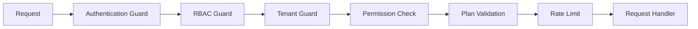

# مجوزدهی — Authorization

**نسخه**: ۱.۰.۰ | **وضعیت**: Approved | **آخرین بروزرسانی**: خرداد ۱۴۰۵

---

## Purpose

مدل مجوزدهی (Authorization) پلتفرم Xennic را توصیف می‌کند.

---

## Scope

RBAC, Permission System, Guard Pipeline.

---

## معماری مجوزدهی



---

## RBAC (Role-Based Access Control)

### نقش‌های سیستمی

| نقش | slug | سطح |
|------|------|------|
| Super Admin | `super_admin` | Global |
| Platform Admin | `platform_admin` | Global |
| Support Admin | `support_admin` | Global |

### نقش‌های Workspace

| نقش | slug | دسترسی‌ها |
|------|------|-----------|
| Owner | `owner` | دسترسی کامل به workspace |
| Admin | `admin` | مدیریت اعضا و تنظیمات |
| Engineer | `engineer` | محاسبات و OCR |
| Consultant | `consultant` | مشاوره و دانش |
| Member | `member` | دسترسی پایه |
| Viewer | `viewer` | فقط مشاهده |

---

## Permission Model

```prisma
model permissions {
  id          String   @id @default(uuid())
  name        String
  slug        String   @unique
  description String?
  domain      String   // engineering, ai, knowledge, etc.
}

model role_permissions {
  role_id       String
  permission_id String
}
```

### Permission Format
```
{domain}.{action}
```

مثال: `engineering.calculate`, `ai.chat`, `knowledge.create`, `users.read`

---

## Guard Pipeline

```typescript
// JWT Guard: بررسی اعتبار token
@UseGuards(JwtAuthGuard)

// Role Guard: بررسی نقش
@UseGuards(RolesGuard)
@Roles('ENGINEER', 'ADMIN')

// Permission Guard: بررسی مجوز
@UseGuards(PermissionGuard)
@Permissions('engineering.calculate')

// Plan Guard: بررسی اشتراک
@UseGuards(PlanGuard)
@Plan('pro', 'enterprise')

// Throttler Guard: rate limiting
@UseGuards(ThrottlerGuard)
@Throttle(60, 60) // 60 requests per 60 seconds
```

---

## مجوزهای هر دامنه

| domain | مجوزها |
|--------|--------|
| `auth` | login, register, profile |
| `users` | read, create, update, delete |
| `workspaces` | read, create, update, delete, manage_members |
| `engineering` | calculate, read_history, export |
| `ai` | chat, document_analysis, embeddings |
| `knowledge` | read, create, update, delete, publish, review |
| `marketplace` | browse, purchase, sell |
| `storage` | upload, download, delete |
| `admin` | manage_users, manage_workspaces, manage_system |

---

## Related Documents

| سند | مسیر |
|-----|------|
| Authentication | `backend/AUTHENTICATION.md` |
| Access Control | `security/ACCESS_CONTROL.md` |
| JWT | `security/JWT.md` |
| Authorization Spec | `architecture/XENNIC_AUTHORIZATION_SPEC_v1.md` |

---

## Revision History

| نسخه | تاریخ | تغییرات |
|------|-------|---------|
| ۱.۰.۰ | خرداد ۱۴۰۵ | انتشار اولیه |
