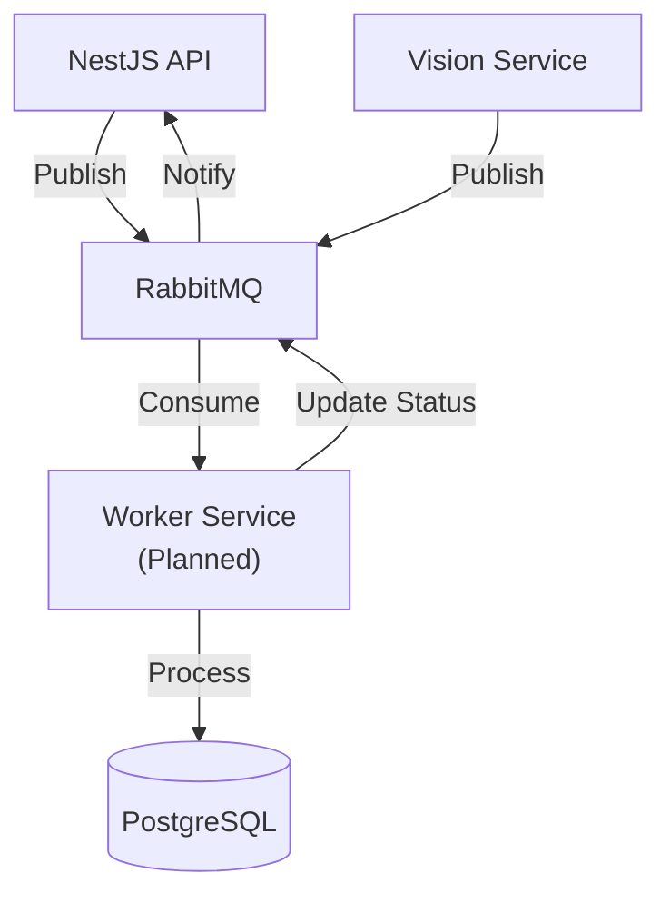

# وظایف پس‌زمینه — Background Jobs

**نسخه**: ۱.۰.۰ | **وضعیت**: Draft | **آخرین بروزرسانی**: خرداد ۱۴۰۵

---

## Purpose

وظایف پس‌زمینه (Background Jobs) در پلتفرم Xennic را توصیف می‌کند.

---

## Scope

RabbitMQ integration, job processing, queue management.

---

## وضعیت فعلی

**در حال حاضر تمام پردازش‌ها به صورت synchronous انجام می‌شود.** RabbitMQ پیکربندی شده اما استفاده نمی‌شود. برنامه‌ریزی برای آینده:

| Job | توضیح | Queue | اولویت |
|-----|-------|-------|--------|
| PDF Processing | OCR فایل‌های PDF بزرگ | `vision.pdf` | بالا |
| Email Sending | ارسال ایمیل (خوش‌آمدگویی، گزارش) | `email.send` | متوسط |
| Report Generation | تولید گزارش‌های PDF | `reports.generate` | متوسط |
| Data Export | خروجی گرفتن داده‌ها | `data.export` | کم |
| Knowledge Indexing | ایندکس کردن مقالات در Qdrant | `knowledge.index` | بالا |
| Usage Aggregation | جمع‌آوری آمار مصرف | `usage.aggregate` | کم |

---

## معماری هدف



---

## Job Structure

```json
{
  "jobId": "job-uuid",
  "type": "document.process",
  "payload": {
    "workspace_id": "ws-uuid",
    "file_id": "file-uuid",
    "options": { "ocr_engine": "tesseract" }
  },
  "status": "pending",
  "createdAt": "2026-06-23T10:00:00Z",
  "priority": 5,
  "retryCount": 0,
  "maxRetries": 3
}
```

---

## Related Documents

| سند | مسیر |
|-----|------|
| Event Flow | `architecture/EVENT_FLOW.md` |
| Cache | `backend/CACHE.md` |
| Logging | `backend/LOGGING.md` |

---

## Revision History

| نسخه | تاریخ | تغییرات |
|------|-------|---------|
| ۱.۰.۰ | خرداد ۱۴۰۵ | انتشار اولیه |
