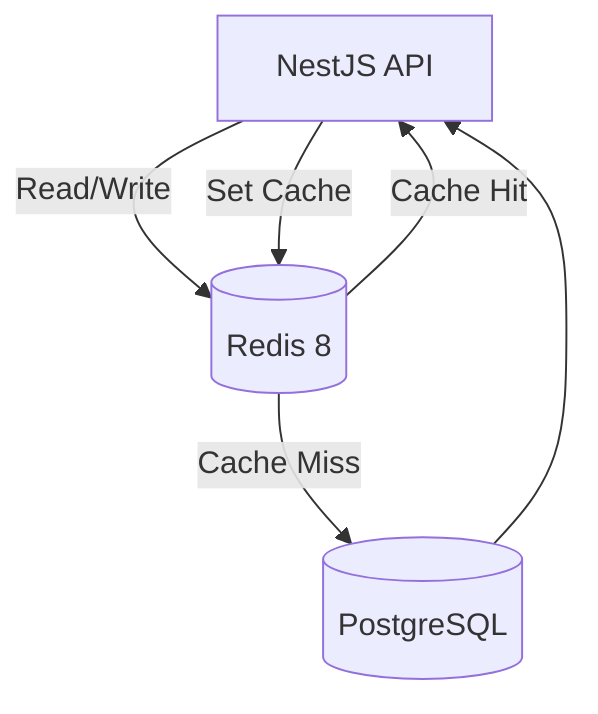

# کش (Cache) — استراتژی کشینگ

**نسخه**: ۱.۰.۰ | **وضعیت**: Approved | **آخرین بروزرسانی**: خرداد ۱۴۰۵

---

## Purpose

استراتژی کشینگ (Caching) در پلتفرم Xennic را توصیف می‌کند.

---

## Scope

Redis 8 integration, cache strategies, TTL policies.

---

## معماری کش



---

## Cache Strategies

### 1. Cache-Aside (Lazy Loading)
```typescript
async function getUser(id: string) {
  let user = await redis.get(`user:${id}`);
  if (user) return JSON.parse(user);
  
  user = await prisma.users.findUnique({ where: { id } });
  await redis.set(`user:${id}`, JSON.stringify(user), 'EX', 3600);
  return user;
}
```

### 2. Write-Through
```typescript
async function updateUser(id: string, data: any) {
  const user = await prisma.users.update({ where: { id }, data });
  await redis.set(`user:${id}`, JSON.stringify(user), 'EX', 3600);
  return user;
}
```

### 3. Invalidation
```typescript
async function deleteUser(id: string) {
  await prisma.users.update({ where: { id }, data: { deleted_at: new Date() } });
  await redis.del(`user:${id}`);
  await redis.del(`user:${id}:roles`);
}
```

---

## Cache Keys Convention

| الگو | مثال | TTL |
|------|------|-----|
| `user:{id}` | `user:abc-123` | ۱ ساعت |
| `workspace:{id}` | `workspace:xyz-789` | ۱ ساعت |
| `session:{token}` | `session:eyJ...` | ۱۵ دقیقه |
| `rate_limit:{ip}` | `rate_limit:192.168.1.1` | ۱ دقیقه |
| `calculation:{id}` | `calculation:calc-001` | ۱ روز |
| `knowledge:{id}` | `knowledge:know-001` | ۱ روز |

---

## Data Categories

| دسته | استراتژی | TTL | توضیح |
|------|----------|-----|-------|
| User Sessions | Write-Through | ۱۵ دقیقه | اطلاعات session کاربر |
| User Profile | Cache-Aside | ۱ ساعت | پروفایل کاربر |
| Workspace Settings | Cache-Aside | ۱ ساعت | تنظیمات workspace |
| Calculations | Cache-Aside | ۱ روز | نتایج محاسبات |
| Knowledge Articles | Cache-Aside | ۱ روز | مقالات دانش |
| Rate Limits | Write-Through | ۱ دقیقه | محدودیت نرخ |
| Feature Flags | Write-Through | ۵ دقیقه | وضعیت ویژگی‌ها |

---

## Performance Targets

| معیار | هدف |
|-------|------|
| Cache Hit Ratio | > ۸۰٪ |
| Average Latency | < ۵ms (cached) |
| Memory Usage | < ۲GB |
| Eviction Policy | allkeys-lru |

---

## Related Documents

| سند | مسیر |
|-----|------|
| Background Jobs | `backend/BACKGROUND_JOBS.md` |
| Logging | `backend/LOGGING.md` |
| Infrastructure | `infrastructure/INFRASTRUCTURE.md` |

---

## Revision History

| نسخه | تاریخ | تغییرات |
|------|-------|---------|
| ۱.۰.۰ | خرداد ۱۴۰۵ | انتشار اولیه |
