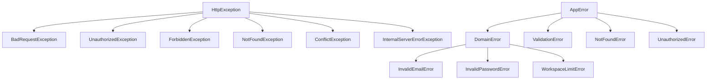

# مدیریت خطا — Error Handling

**نسخه**: ۱.۰.۰ | **وضعیت**: Approved | **آخرین بروزرسانی**: خرداد ۱۴۰۵

---

## Purpose

استانداردهای مدیریت خطا در پلتفرم Xennic را توصیف می‌کند.

---

## Scope

تمامی سرویس‌ها: NestJS API, Python Services.

---

## Exception Hierarchy (NestJS)



---

## فرمت خطا

### NestJS
```json
{
  "success": false,
  "error": {
    "code": "VALIDATION_ERROR",
    "message": "اعتبارسنجی ناموفق",
    "details": [
      { "field": "email", "message": "ایمیل نامعتبر است", "code": "IS_EMAIL" }
    ],
    "timestamp": "2026-06-23T10:30:00Z",
    "path": "/api/v1/auth/register",
    "requestId": "req-abc-123"
  }
}
```

### Python (FastAPI)
```json
{
  "success": false,
  "error": {
    "code": "OCR_FAILED",
    "message": "تشخیص متن ناموفق",
    "details": {
      "engine": "tesseract",
      "confidence": 0.12,
      "stage": "ocr"
    }
  }
}
```

---

## Global Exception Filter (NestJS)

```typescript
// shared/filters/all-exceptions.filter.ts
@Catch()
export class AllExceptionsFilter implements ExceptionFilter {
  catch(exception: unknown, host: ArgumentsHost) {
    // 1. Log exception with request context
    // 2. Map to standard error format
    // 3. Return consistent response
  }
}
```

---

## Error Codes

| کد | HTTP Status | توضیح |
|-----|------------|-------|
| `VALIDATION_ERROR` | ۴۰۰ | خطای اعتبارسنجی ورودی |
| `UNAUTHORIZED` | ۴۰۱ | نیاز به احراز هویت |
| `FORBIDDEN` | ۴۰۳ | دسترسی غیرمجاز |
| `NOT_FOUND` | ۴۰۴ | resource یافت نشد |
| `CONFLICT` | ۴۰۹ | تداخل (ایمیل تکراری) |
| `RATE_LIMITED` | ۴۲۹ | محدودیت نرخ |
| `QUOTA_EXCEEDED` | ۴۲۹ | سقف مصرف |
| `INTERNAL_ERROR` | ۵۰۰ | خطای داخلی سرور |
| `SERVICE_UNAVAILABLE` | ۵۰۳ | سرویس در دسترس نیست |

---

## Python Service Errors

### Custom Exception Classes
```python
class AppError(Exception):
    def __init__(self, code: str, message: str, details: dict = None):
        self.code = code
        self.message = message
        self.details = details or {}

class VisionError(AppError):
    """Pipeline stage errors"""
    pass

class OCRFailedError(VisionError):
    """OCR detection failed"""
    pass
```

### Exception Handler
```python
@app.exception_handler(AppError)
async def app_error_handler(request, exc: AppError):
    return JSONResponse(
        status_code=exc.http_status or 500,
        content={"success": False, "error": {
            "code": exc.code, "message": exc.message, "details": exc.details
        }}
    )
```

---

## Related Documents

| سند | مسیر |
|-----|------|
| API Design | `backend/API_DESIGN.md` |
| Logging | `backend/LOGGING.md` |
| Coding Standards | `reference/CODING_STANDARDS.md` |

---

## Revision History

| نسخه | تاریخ | تغییرات |
|------|-------|---------|
| ۱.۰.۰ | خرداد ۱۴۰۵ | انتشار اولیه |
