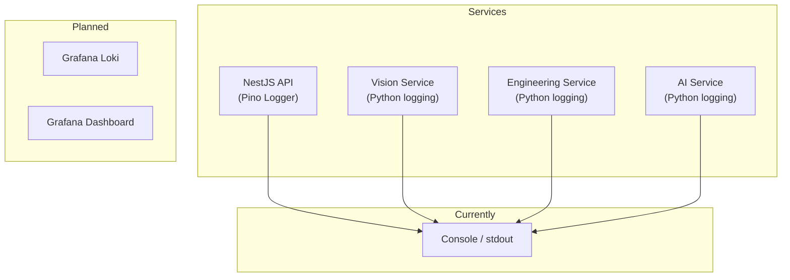

# لاگینگ — Logging

**نسخه**: ۱.۰.۰ | **وضعیت**: Approved | **آخرین بروزرسانی**: خرداد ۱۴۰۵

---

## Purpose

استانداردهای لاگینگ (Logging) در پلتفرم Xennic را توصیف می‌کند.

---

## Scope

تمامی سرویس‌ها: NestJS (Pino), Python Services.

---

## معماری لاگینگ



---

## Log Format (NestJS — Pino)

```json
{
  "level": 30,
  "time": 1719000000000,
  "pid": 1234,
  "hostname": "xennic-api-1",
  "requestId": "req-abc-123",
  "userId": "user-uuid",
  "workspaceId": "ws-uuid",
  "service": "api",
  "module": "auth",
  "action": "login",
  "msg": "User login successful",
  "latency": 45,
  "statusCode": 200
}
```

---

## Log Levels

| سطح | مقدار Pino | کاربرد |
|------|-----------|--------|
| TRACE | ۱۰ | Debugging عمیق |
| DEBUG | ۲۰ | اطلاعات توسعه |
| INFO | ۳۰ | رویدادهای عادی |
| WARN | ۴۰ | هشدارها |
| ERROR | ۵۰ | خطاهای قابل بازیابی |
| FATAL | ۶۰ | خطاهای بحرانی |

---

## Log Categories

| دسته | رویدادها | سطح |
|------|----------|------|
| **Request** | Method, Path, Status, Latency | INFO |
| **Auth** | Login, Register, Token Refresh | INFO |
| **Error** | Exceptions, Failures | ERROR |
| **Database** | Query (slow), Connection | WARN |
| **Cache** | Miss, Hit, Eviction | DEBUG |
| **External** | LLM API, OCR Engine | INFO |
| **Audit** | Sensitive Operations | INFO |

---

## Python Logging Configuration

```python
# config/providers.py
import logging

logging.basicConfig(
    level=logging.INFO,
    format='%(asctime)s | %(levelname)s | %(name)s | %(message)s',
    datefmt='%Y-%m-%d %H:%M:%S',
)

logger = logging.getLogger("vision_service")
```

---

## NestJS Logger Setup

```typescript
// main.ts
import { Logger } from 'nestjs-pino';

app.useLogger(app.get(Logger));

// Usage in service
this.logger.log({ userId, action: 'calculate' }, 'Motor calculation completed');
this.logger.error({ error, calculationId }, 'Calculation failed');
```

---

## Best Practices

1. **همیشه requestId را لاگ کنید** - برای ردیابی درخواست
2. **userId و workspaceId را اضافه کنید** - برای tenant isolation
3. **هرگز secrets را لاگ نکنید** - رمز عبور، token، API key
4. **از structured logging استفاده کنید** - JSON format
5. **خطاها را با stack trace کامل لاگ کنید**
6. **از log aggregation در production استفاده کنید**

---

## Related Documents

| سند | مسیر |
|-----|------|
| Error Handling | `backend/ERROR_HANDLING.md` |
| Monitoring | `devops/MONITORING.md` |
| Logging Infrastructure | `devops/LOGGING_INFRASTRUCTURE.md` |

---

## Revision History

| نسخه | تاریخ | تغییرات |
|------|-------|---------|
| ۱.۰.۰ | خرداد ۱۴۰۵ | انتشار اولیه |
