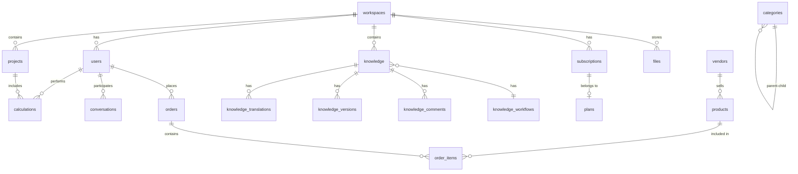

# طراحی دیتابیس — Database Design

**نسخه**: ۱.۰.۰ | **وضعیت**: Approved | **آخرین بروزرسانی**: خرداد ۱۴۰۵

---

## Purpose

طراحی پایگاه داده پلتفرم Xennic را توصیف می‌کند.

---

## Scope

PostgreSQL 17, Prisma ORM, ۴۷ مدل.

---

## اصول طراحی

| اصل | توضیح |
|------|--------|
| **Multi-Tenant** | جداسازی با workspace_id |
| **UUID Primary Keys** | همه موجودیت‌ها UUID v4 |
| **Soft Delete** | `deleted_at` به جای حذف فیزیکی |
| **Audit Fields** | created_at, updated_at, created_by, updated_by |
| **JSONB** | برای تنظیمات، metadata, نتایج |
| **Indexes** | workspace_id + created_at در همه جدول‌ها |

---

## Domain Model Overview

---

## Domain Breakdown

### Identity (۸ مدل)
| مدل | کلید | ایندکس‌ها |
|------|-------|-----------|
| users | UUID | email UNIQUE, created_at, deleted_at |
| sessions | UUID | user_id, expires_at |
| refresh_tokens | UUID | token_hash UNIQUE, user_id |
| roles | UUID | slug UNIQUE |
| permissions | UUID | slug UNIQUE, domain |
| role_permissions | UUID | role_id + permission_id UNIQUE |
| user_roles | UUID | user_id + role_id + workspace_id UNIQUE |

### Workspace (۴ مدل)
| مدل | کلید | توضیح |
|------|-------|--------|
| workspaces | UUID | code UNIQUE |
| workspace_members | UUID | user_id + workspace_id UNIQUE |
| workspace_invitations | UUID | token UNIQUE |
| workspace_settings | UUID | workspace_id UNIQUE, JSONB |

### Subscription & Billing (۹ مدل)
plans, subscriptions, subscription_payments, usage_logs, feature_flags, invoices, payments, transactions, payment_methods

### Engineering (۴ مدل)
calculations, calculation_templates, engineering_standards, knowledge_standards

### AI (۴ مدل)
agents, conversations, messages, ai_usage

### Knowledge (۱۶ مدل)
categories, topics, tags, disciplines, audiences, knowledge, knowledge_translations, knowledge_taxonomy, knowledge_media, knowledge_formulas, knowledge_examples, knowledge_standards, knowledge_versions, knowledge_comments, knowledge_workflows, knowledge_workflow_history, knowledge_analytics

### Marketplace (۴ مدل)
vendors, products, product_translations, orders, order_items

### Storage (۲ مدل)
files, file_versions

### API (۲ مدل)
api_keys, webhooks

### Notification (۱ مدل)
notifications

### Admin (۲ مدل)
system_settings, audit_logs

---

## Soft Delete Policy

| جدول | Soft Delete | توضیح |
|------|-------------|-------|
| users | ✅ | deleted_at |
| workspaces | ✅ | deleted_at |
| projects | ✅ | deleted_at |
| calculations | ✅ | deleted_at |
| knowledge | ✅ | archived_at |
| files | ✅ | deleted_at |
| products | ✅ | deleted_at |
| orders | ✅ | deleted_at |
| sessions | ❌ | حذف فیزیکی |
| refresh_tokens | ❌ | حذف فیزیکی |
| messages | ❌ | حذف فیزیکی |

---

## Naming Conventions

| عنصر | کنوانسیون | مثال |
|------|-----------|------|
| Tables | snake_case, plural | `users`, `workspace_members` |
| Columns | snake_case | `created_at`, `workspace_id` |
| Indexes | `idx_{table}_{column}` | `idx_users_email` |
| Foreign Keys | `fk_{table}_{ref}` | `fk_users_workspace` |
| Primary Keys | UUID v4 | `abc-123-def-456` |

---

## Related Documents

| سند | مسیر |
|-----|------|
| ERD | `database/ERD.md` |
| Indexing | `database/INDEXING.md` |
| Migrations | `database/MIGRATIONS.md` |
| Database Spec | `architecture/XENNIC_DATABASE_SPEC_v2.md` |
| ERD Spec | `architecture/XENNIC_ERD_v1.md` |

---

## Revision History

| نسخه | تاریخ | تغییرات |
|------|-------|---------|
| ۱.۰.۰ | خرداد ۱۴۰۵ | انتشار اولیه |
