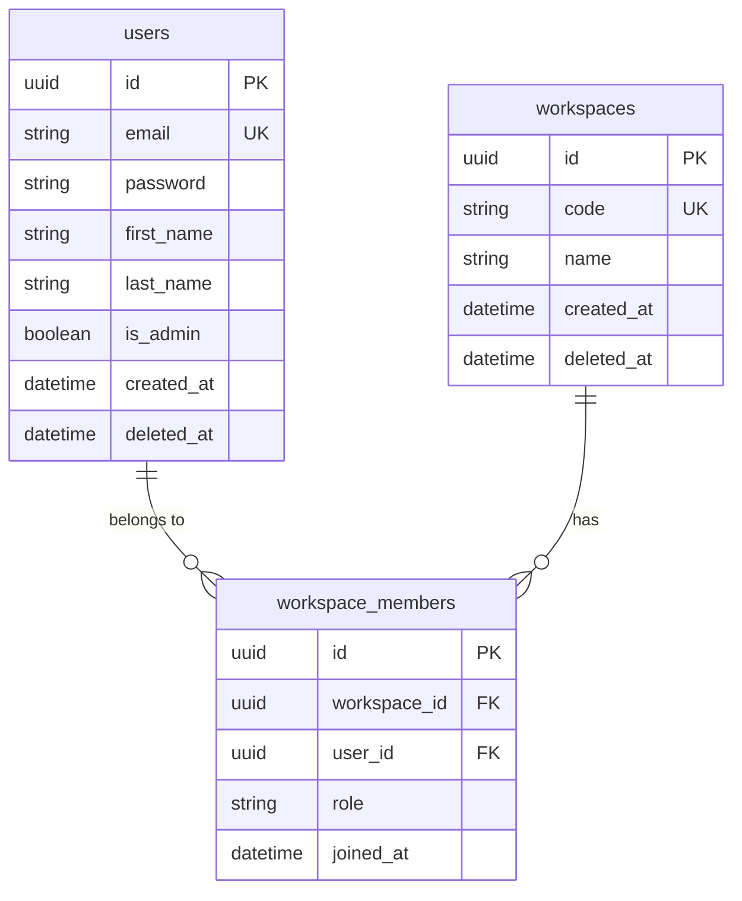
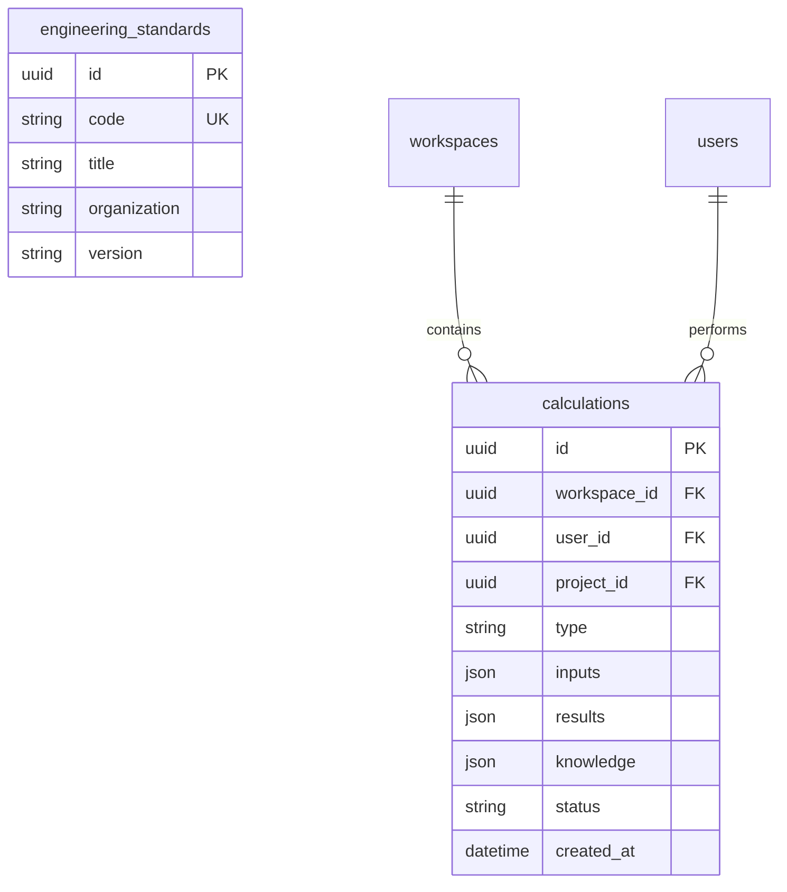
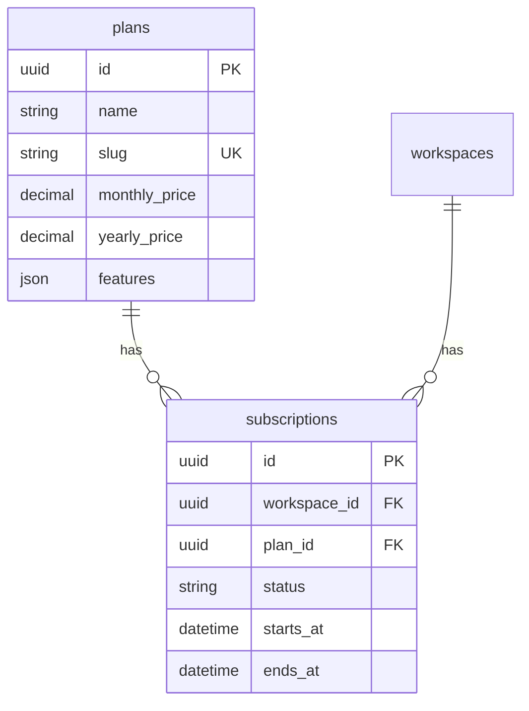

# نمودار ERD — Entity Relationship Diagram

**نسخه**: ۱.۰.۰ | **وضعیت**: Approved | **آخرین بروزرسانی**: خرداد ۱۴۰۵

---

## Purpose

نمودار ارتباط موجودیت‌ها (ERD) پلتفرم Xennic.

---

## Scope

۴۷ مدل Prisma در ۱۰ دامنه.

> نمودار کامل در `architecture/XENNIC_ERD_v1.md` با ۸۴۰ خط جزئیات موجود است.

---

## Core Entities



---

## Engineering Domain



---

## Knowledge Domain

```mermaid
erDiagram
    knowledge {
        uuid id PK
        uuid workspace_id FK
        string slug UK
        string status
        string visibility
        string language
        int version
        json content
        datetime created_at
    }
    
    knowledge_translations {
        uuid id PK
        uuid knowledge_id FK
        string language
        string title
        json content
    }
    
    knowledge_versions {
        uuid id PK
        uuid knowledge_id FK
        int version
        json snapshot
        datetime created_at
    }
    
    knowledge_workflows {
        uuid id PK
        uuid knowledge_id FK UK
        string current_status
        uuid assigned_to FK
        uuid reviewer_id FK
    }
    
    knowledge ||--o{ knowledge_translations : "has"
    knowledge ||--o{ knowledge_versions : "has"
    knowledge ||--o| knowledge_workflows : "has"
```

---

## Subscription Domain



---

## Related Documents

| سند | مسیر |
|-----|------|
| Database Design | `database/DATABASE_DESIGN.md` |
| Indexing | `database/INDEXING.md` |
| ERD Spec | `architecture/XENNIC_ERD_v1.md` |
| Database Spec | `architecture/XENNIC_DATABASE_SPEC_v2.md` |

---

## Revision History

| نسخه | تاریخ | تغییرات |
|------|-------|---------|
| ۱.۰.۰ | خرداد ۱۴۰۵ | انتشار اولیه |
