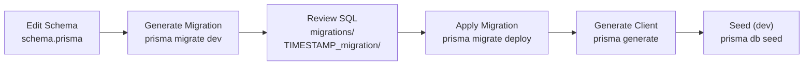

# مهاجرت دیتابیس — Database Migrations

**نسخه**: ۱.۰.۰ | **وضعیت**: Approved | **آخرین بروزرسانی**: خرداد ۱۴۰۵

---

## Purpose

استراتژی مهاجرت (Migration) دیتابیس پلتفرم Xennic.

---

## Scope

Prisma Migrate, migration workflow, seed data.

---

## Migration Strategy

| ابزار | Prisma Migrate |
|-------|----------------|
| Schema Source | `apps/api/prisma/schema.prisma` |
| Migration Directory | `apps/api/prisma/migrations/` |
| ORM | @prisma/client |

---

## Workflow



---

## Commands

```bash
# Development
pnpm db:apply    # prisma migrate deploy + generate + seed
pnpm db:reset    # prisma migrate reset --force + seed
pnpm db:generate # prisma generate

# Production
npx prisma migrate deploy   # Apply pending migrations
npx prisma migrate deploy   # Apply pending migrations (safe)
```

---

## Migration Rules

| قانون | توضیح |
|-------|--------|
| **No Direct DB Changes** | تغییر مستقیم دیتابیس ممنوع |
| **Review SQL** | SQL تولیدی را review کنید |
| **Version Control** | migrations/ را commit کنید |
| **Rollback Plan** | قبل از migration برنامه rollback داشته باشید |
| **Seed Data** | seed data را همیشه به‌روز نگه دارید |

---

## Seed Data

```javascript
// prisma/seed.js
async function main() {
  // Create default roles
  await prisma.roles.createMany({
    data: [
      { name: 'Owner', slug: 'owner' },
      { name: 'Admin', slug: 'admin' },
      { name: 'Engineer', slug: 'engineer' },
      { name: 'Member', slug: 'member' },
    ],
  });
  
  // Create default plans
  await prisma.plans.createMany({
    data: [
      { name: 'Free', slug: 'free', monthly_price: 0 },
      { name: 'Pro', slug: 'pro', monthly_price: 29.99 },
      { name: 'Enterprise', slug: 'enterprise', monthly_price: 99.99 },
    ],
  });
}
```

---

## Related Documents

| سند | مسیر |
|-----|------|
| Database Design | `database/DATABASE_DESIGN.md` |
| Backup Strategy | `database/BACKUP_STRATEGY.md` |
| Migration ADR | `decisions/ADR-007-database-migration-strategy.md` |

---

## Revision History

| نسخه | تاریخ | تغییرات |
|------|-------|---------|
| ۱.۰.۰ | خرداد ۱۴۰۵ | انتشار اولیه |
