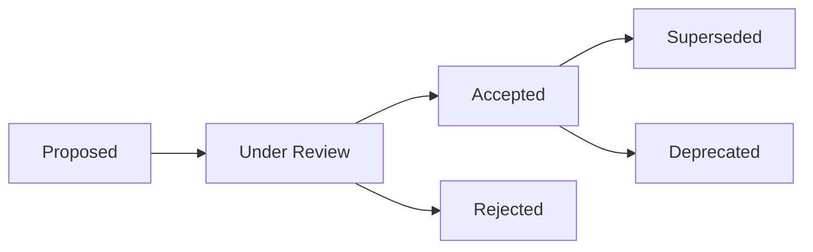

# فهرست تصمیمات معماری — Architecture Decision Records (ADR)

**نسخه**: ۱.۰.۰ | **وضعیت**: Active | **آخرین بروزرسانی**: خرداد ۱۴۰۵

---

## Purpose

فهرست مرکزی تمام تصمیمات معماری (ADR) پلتفرم Xennic.

---

## Index

| # | عنوان | وضعیت | تاریخ | حوزه |
|---|-------|--------|-------|------|
| ۰۰۱ | Monorepo Structure | Accepted | ۱۴۰۴/۰۱ | Architecture |
| ۰۰۲ | Package Manager: pnpm | Accepted | ۱۴۰۴/۰۱ | Tooling |
| ۰۰۳ | NestJS + Fastify | Accepted | ۱۴۰۴/۰۲ | Backend |
| ۰۰۴ | PostgreSQL + Prisma | Accepted | ۱۴۰۴/۰۲ | Database |
| ۰۰۵ | Microservices Strategy | Accepted | ۱۴۰۴/۰۳ | Architecture |
| ۰۰۶ | Dependency Management | Accepted | ۱۴۰۵/۰۲ | Tooling |
| ۰۰۷ | Database Migration Strategy | Accepted | ۱۴۰۵/۰۳ | Database |
| ۰۰۸ | Documentation as Code | Accepted | ۱۴۰۵/۰۳ | Governance |
| ۰۰۹ | API Versioning Strategy | Accepted | ۱۴۰۵/۰۳ | Backend |
| ۰۱۰ | Testing Strategy | Accepted | ۱۴۰۵/۰۳ | QA |

---

## Status Legend

| وضعیت | معنی |
|-------|-------|
| Proposed | پیشنهادی، در حال بررسی |
| Accepted | پذیرفته شده و در حال اجرا |
| Deprecated | منسوخ شده |
| Superseded | جایگزین شده |

---

## ADR Lifecycle

---

## Related Documents

| سند | مسیر |
|-----|------|
| ADR Template | `templates/ADR_TEMPLATE.md` |
| System Architecture | `architecture/SYSTEM_ARCHITECTURE.md` |
| Developer Guide | `development/DEVELOPER_GUIDE.md` |

---

## Revision History

| نسخه | تاریخ | تغییرات |
|------|-------|---------|
| ۱.۰.۰ | خرداد ۱۴۰۵ | انتشار اولیه |
