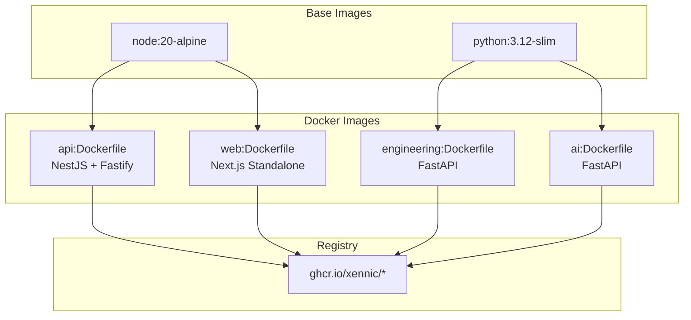

# Docker

**نسخه**: ۱.۰.۰ | **وضعیت**: Approved | **آخرین بروزرسانی**: خرداد ۱۴۰۵

---

## Purpose

راهنمای Docker Containerization پلتفرم Xennic.

---

## Scope

Dockerfiles, image building, registry.

---

## Structure



---

## Dockerfiles

```dockerfile
# apps/api/Dockerfile
FROM node:20-alpine AS builder
WORKDIR /app
COPY pnpm-lock.yaml ./
COPY package.json ./
RUN pnpm install
COPY . .
RUN pnpm build

FROM node:20-alpine AS runner
WORKDIR /app
COPY --from=builder /app/dist ./dist
COPY --from=builder /app/node_modules ./node_modules
EXPOSE 3000
CMD ["node", "dist/main"]
```

```dockerfile
# workspace/services/engineering/Dockerfile
FROM python:3.12-slim
WORKDIR /app
COPY requirements.txt .
RUN pip install --no-cache-dir -r requirements.txt
COPY src/ ./src/
EXPOSE 8001
CMD ["uvicorn", "src.main:app", "--host", "0.0.0.0", "--port", "8001"]
```

---

## Related Documents

| سند | مسیر |
|-----|------|
| Docker Compose | `deployment/DOCKER_COMPOSE.md` |
| Server Setup | `deployment/SERVER_SETUP.md` |
| CI/CD | `devops/CI_CD.md` |

---

## Revision History

| نسخه | تاریخ | تغییرات |
|------|-------|---------|
| ۱.۰.۰ | خرداد ۱۴۰۵ | انتشار اولیه |
