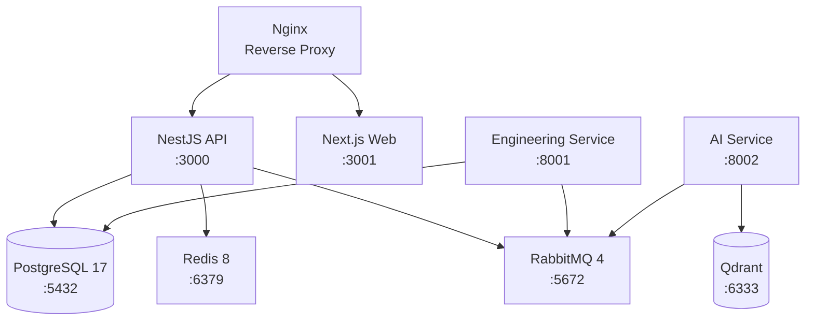

# Docker Compose

**نسخه**: ۱.۰.۰ | **وضعیت**: Approved | **آخرین بروزرسانی**: خرداد ۱۴۰۵

---

## Purpose

راهنمای Docker Compose برای استقرار پلتفرم Xennic.

---

## Scope

Development compose, production compose, service topology.

---

## Service Topology

---

## Compose Files

| فایل | مکان | کاربرد |
|------|------|--------|
| Base Infrastructure | `infrastructure/docker/compose/base/docker-compose.yml` | Postgres, Redis, RabbitMQ |
| Qdrant | `workspace/docker-compose.yml` | Vector Database |
| Full Stack | Root-level | All services |

---

## Related Documents

| سند | مسیر |
|-----|------|
| Docker | `deployment/DOCKER.md` |
| Server Setup | `deployment/SERVER_SETUP.md` |
| Infrastructure | `infrastructure/INFRASTRUCTURE.md` |

---

## Revision History

| نسخه | تاریخ | تغییرات |
|------|-------|---------|
| ۱.۰.۰ | خرداد ۱۴۰۵ | انتشار اولیه |
