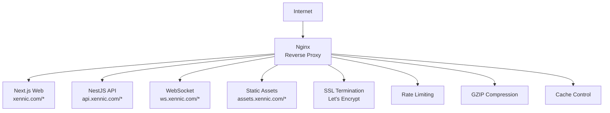

# پروکسی معکوس — Reverse Proxy

**نسخه**: ۱.۰.۰ | **وضعیت**: Approved | **آخرین بروزرسانی**: خرداد ۱۴۰۵

---

## Purpose

راهنمای پروکسی معکوس (Reverse Proxy) برای پلتفرم Xennic.

---

## Scope

Nginx configuration, routing, SSL termination.

---

## Architecture

---

## Routing Rules

| Domain | Target | Type |
|--------|--------|------|
| xennic.com/* | Next.js (:3001) | Web |
| api.xennic.com/* | NestJS (:3000) | API |
| ws.xennic.com/* | NestJS (:3000) | WebSocket |
| assets.xennic.com/* | S3/CDN | Static |

---

## Related Documents

| سند | مسیر |
|-----|------|
| Nginx | `deployment/NGINX.md` |
| HTTPS | `deployment/HTTPS.md` |
| Domain Configuration | `deployment/DOMAIN_CONFIGURATION.md` |

---

## Revision History

| نسخه | تاریخ | تغییرات |
|------|-------|---------|
| ۱.۰.۰ | خرداد ۱۴۰۵ | انتشار اولیه |
