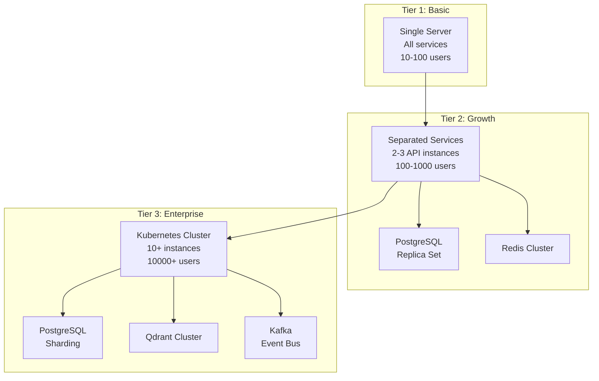

# مقیاس‌پذیری — Scaling

**نسخه**: ۱.۰.۰ | **وضعیت**: Approved | **آخرین بروزرسانی**: خرداد ۱۴۰۵

---

## Purpose

راهبرد مقیاس‌پذیری (Scaling) پلتفرم Xennic را توصیف می‌کند.

---

## Scope

Horizontal scaling, vertical scaling, auto-scaling.

---

## Scaling Strategy

---

## Horizontal Scaling

| Service | Strategy | Stateless |
|---------|----------|-----------|
| NestJS API | Multiple instances behind LB | ✓ |
| Next.js Web | Multiple instances behind LB | ✓ |
| Engineering Service | Multiple workers | ✓ |
| AI Service | Queue-based workers | ✓ |
| Vision Service | Queue-based workers | ✓ |

## Database Scaling

| Stage | Configuration |
|-------|---------------|
| 1 | Single PostgreSQL + connection pool |
| 2 | Read replicas (1 primary, 2 replicas) |
| 3 | Sharding by workspace_id |
| 4 | Read replicas per shard |

## Auto-scaling Rules

| معیار | حداقل | حداکثر | معیار افزایش |
|-------|-------|---------|-------------|
| API CPU | 2 | 10 | > 70% for 5 min |
| API Memory | 2 | 10 | > 80% for 5 min |
| Queue Depth | 1 | 5 | > 100 messages |
| DB Connections | 20 | 200 | Connection pool |

---

## Related Documents

| سند | مسیر |
|-----|------|
| Infrastructure | `infrastructure/INFRASTRUCTURE.md` |
| Performance Testing | `testing/PERFORMANCE_TESTING.md` |
| Docker Compose | `deployment/DOCKER_COMPOSE.md` |
| Infrastructure Spec | `deployment/XENNIC_INFRASTRUCTURE_SPEC_v1.md` |

---

## Revision History

| نسخه | تاریخ | تغییرات |
|------|-------|---------|
| ۱.۰.۰ | خرداد ۱۴۰۵ | انتشار اولیه |
