# طرح پشتیبان‌گیری — Backup Plan

**نسخه**: ۱.۰.۰ | **وضعیت**: Approved | **آخرین بروزرسانی**: خرداد ۱۴۰۵

---

## Purpose

طرح پشتیبان‌گیری (Backup) پلتفرم Xennic.

---

## Scope

Database, file storage, configuration.

---

## Backup Strategy

```mermaid
graph TB
    subgraph "Daily"
        PG_DUMP["PostgreSQL\npg_dumpall"]
        PG_DUMP --> ENCRYPT["AES-256\nEncrypt"]
        ENCRYPT --> S3_DAILY["S3: Daily\n30-day retention"]
    end
    
    subgraph "Weekly"
        PG_FULL["PostgreSQL\nFull Backup"]
        PG_FULL --> ENCRYPT_W["AES-256\nEncrypt"]
        ENCRYPT_W --> S3_WEEKLY["S3: Weekly\n90-day retention"]
    end
    
    subgraph "Monthly"
        PG_ARCHIVE["PostgreSQL\nArchive"]
        PG_ARCHIVE --> ENCRYPT_M["AES-256\nEncrypt"]
        ENCRYPT_M --> S3_MONTHLY["S3: Monthly\n1 year retention"]
    end
    
    subgraph "Real-time"
        WAL["WAL Archiving\nContinuous"]
        WAL --> S3_WAL["S3: WAL\n7-day retention"]
    end
```

---

## Backup Schedule

| نوع | زمان | Retention | هدف |
|-----|------|-----------|------|
| WAL Archive | Continuous | 7 days | Point-in-time recovery |
| Daily | 03:00 UTC | 30 days | Quick recovery |
| Weekly | Sunday 03:00 | 90 days | Medium-term |
| Monthly | 1st 03:00 | 1 year | Compliance |
| Pre-deploy | Before each deploy | 14 days | Rollback safety |

## Recovery Testing

| فرکانس | نوع تست | معیار موفقیت |
|---------|---------|-------------|
| Monthly | Full restore | < 2 hours RTO |
| Quarterly | Point-in-time | < 15 min data loss |
| Bi-annual | Disaster recovery | Complete DR drill |

## RPO / RTO Targets

| سناریو | RPO | RTO |
|--------|-----|-----|
| Server failure | 1 hour | 15 min |
| Data corruption | 24 hours | 1 hour |
| Region failure | 24 hours | 4 hours |

---

## Related Documents

| سند | مسیر |
|-----|------|
| Disaster Recovery | `devops/DISASTER_RECOVERY.md` |
| Database Backup | `database/BACKUP_STRATEGY.md` |
| Infrastructure | `infrastructure/INFRASTRUCTURE.md` |

---

## Revision History

| نسخه | تاریخ | تغییرات |
|------|-------|---------|
| ۱.۰.۰ | خرداد ۱۴۰۵ | انتشار اولیه |
