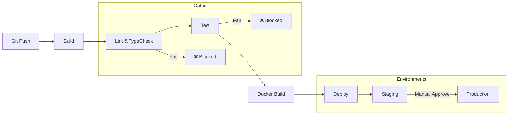

# CI/CD — Continuous Integration & Deployment

**نسخه**: ۱.۰.۰ | **وضعیت**: Approved | **آخرین بروزرسانی**: خرداد ۱۴۰۵

---

## Purpose

راهبرد CI/CD پلتفرم Xennic را توصیف می‌کند.

---

## Scope

Build, test, deploy pipelines.

---

## Pipeline



---

## Environment Strategy

| محیط | Trigger | تایید | هدف |
|------|---------|-------|------|
| Development | Every push | Automatic | Feature testing |
| Staging | PR merge | Automatic | Integration testing |
| Production | Release tag | Manual approval | Customer-facing |

## Pipeline Steps

```yaml
name: Xennic CI/CD
on: [push, pull_request]

jobs:
  build:
    runs-on: ubuntu-latest
    steps:
      - uses: actions/checkout@v4
      - uses: pnpm/action-setup@v3
      - run: pnpm install
      - run: pnpm lint
      - run: pnpm typecheck
      - run: pnpm test
      - run: pnpm build
```

## Deployment Strategy

| Service | Strategy | Rollback | Health Check |
|---------|----------|----------|--------------|
| API | Rolling update | Immediate | /health endpoint |
| Web | Blue/Green | DNS switch | HTTP 200 |
| Python Services | Rolling | Last stable | /health endpoint |

---

## Related Documents

| سند | مسیر |
|-----|------|
| GitHub Actions | `devops/GITHUB_ACTIONS.md` |
| Release Process | `project/RELEASE_PROCESS.md` |
| Deployment | `deployment/SERVER_SETUP.md` |
| Docker | `deployment/DOCKER.md` |

---

## Revision History

| نسخه | تاریخ | تغییرات |
|------|-------|---------|
| ۱.۰.۰ | خرداد ۱۴۰۵ | انتشار اولیه |
