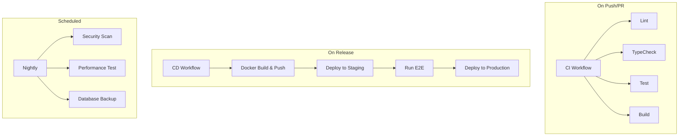

# GitHub Actions

**نسخه**: ۱.۰.۰ | **وضعیت**: Approved | **آخرین بروزرسانی**: خرداد ۱۴۰۵

---

## Purpose

پیکربندی و توضیح Workflowهای GitHub Actions پلتفرم Xennic.

---

## Scope

CI workflows, deployment actions, scheduled jobs.

---

## Workflow Structure



---

## Workflow Files

```yaml
# .github/workflows/ci.yml
name: CI
on:
  push:
    branches: [main, develop]
  pull_request:
    branches: [main]

jobs:
  test:
    runs-on: ubuntu-latest
    services:
      postgres:
        image: postgres:17
        env:
          POSTGRES_PASSWORD: xennic
        options: >-
          --health-cmd pg_isready
          --health-interval 10s
          --health-timeout 5s
          --health-retries 5
```

## Scheduled Jobs

| Job | Schedule | Description |
|-----|----------|-------------|
| Security Scan | Daily 2 AM | Dependency vulnerability check |
| Performance Test | Weekly Sunday | Load test suite |
| DB Backup | Daily 3 AM | PostgreSQL pg_dump |

---

## Related Documents

| سند | مسیر |
|-----|------|
| CI/CD | `devops/CI_CD.md` |
| Deployment | `deployment/SERVER_SETUP.md` |
| Release Process | `project/RELEASE_PROCESS.md` |

---

## Revision History

| نسخه | تاریخ | تغییرات |
|------|-------|---------|
| ۱.۰.۰ | خرداد ۱۴۰۵ | انتشار اولیه |
