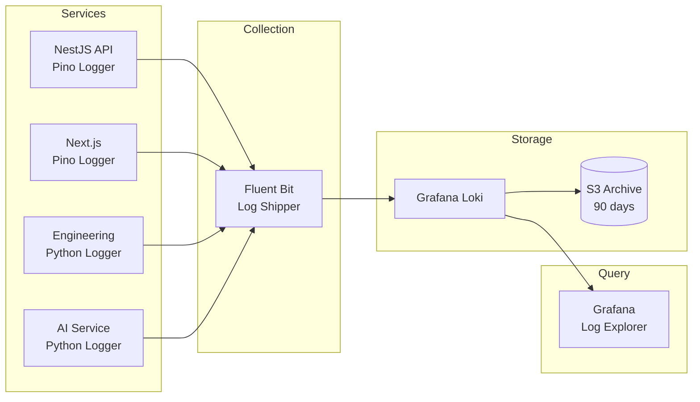

# زیرساخت لاگینگ — Logging Infrastructure

**نسخه**: ۱.۰.۰ | **وضعیت**: Approved | **آخرین بروزرسانی**: خرداد ۱۴۰۵

---

## Purpose

زیرساخت لاگینگ متمرکز پلتفرم Xennic را توصیف می‌کند.

---

## Scope

Log collection, aggregation, retention, search.

---

## Architecture



---

## Log Levels

| سطح | کاربرد | Retention |
|------|-------|-----------|
| ERROR | Runtime failures | 90 days |
| WARN | Degraded operations | 30 days |
| INFO | Business events | 14 days |
| DEBUG | Development | 3 days |
| TRACE | Request tracing | 1 day |

## Log Format (JSON)

```json
{
  "level": "info",
  "timestamp": "2025-06-22T10:00:00.000Z",
  "service": "api",
  "trace_id": "abc123",
  "user_id": "user-uuid",
  "action": "calculation.execute",
  "duration_ms": 145,
  "metadata": {
    "calculator_id": "CABLE-001",
    "project_id": "proj-uuid"
  }
}
```

---

## Related Documents

| سند | مسیر |
|-----|------|
| Monitoring | `devops/MONITORING.md` |
| Backend Logging | `backend/LOGGING.md` |
| Infrastructure | `infrastructure/INFRASTRUCTURE.md` |

---

## Revision History

| نسخه | تاریخ | تغییرات |
|------|-------|---------|
| ۱.۰.۰ | خرداد ۱۴۰۵ | انتشار اولیه |
