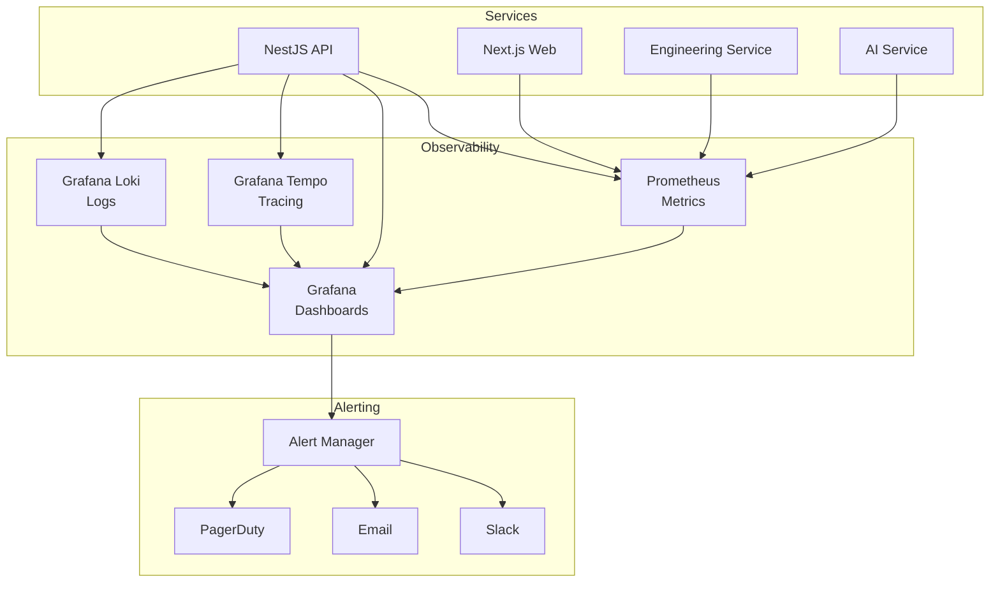

# مانیتورینگ — Monitoring

**نسخه**: ۱.۰.۰ | **وضعیت**: Approved | **آخرین بروزرسانی**: خرداد ۱۴۰۵

---

## Purpose

راهبرد مانیتورینگ و observability پلتفرم Xennic را توصیف می‌کند.

---

## Scope

Metrics, tracing, alerting, dashboards.

---

## Stack

---

## Key Metrics

| معیار | منبع | هشدار |
|-------|------|-------|
| API Response Time (p95) | NestJS | > 500ms |
| Error Rate | All services | > 1% |
| CPU Usage | Each service | > 80% |
| Memory Usage | Each service | > 85% |
| DB Connection Pool | PostgreSQL | > 80% used |
| Queue Depth | RabbitMQ | > 1000 messages |

## Dashboards

| Dashboard | Target Audience | Metrics |
|-----------|----------------|---------|
| System Health | DevOps | CPU, Memory, Disk, Network |
| API Performance | Backend Team | Response times, error rates |
| Business Metrics | Product Team | Active users, calculations, revenue |
| AI Pipeline | AI Team | OCR throughput, embeddings |

## Alert Severities

| Severity | Response Time | Channel | Example |
|----------|---------------|---------|---------|
| P0 - Critical | 5 min | PagerDuty + Slack | Service down |
| P1 - High | 15 min | Slack + Email | Error rate spike |
| P2 - Medium | 1 hour | Slack | High latency |
| P3 - Low | 24 hours | Email | Disk space > 80% |

---

## Related Documents

| سند | مسیر |
|-----|------|
| Logging Infrastructure | `devops/LOGGING_INFRASTRUCTURE.md` |
| Infrastructure | `infrastructure/INFRASTRUCTURE.md` |
| Performance Testing | `testing/PERFORMANCE_TESTING.md` |

---

## Revision History

| نسخه | تاریخ | تغییرات |
|------|-------|---------|
| ۱.۰.۰ | خرداد ۱۴۰۵ | انتشار اولیه |
