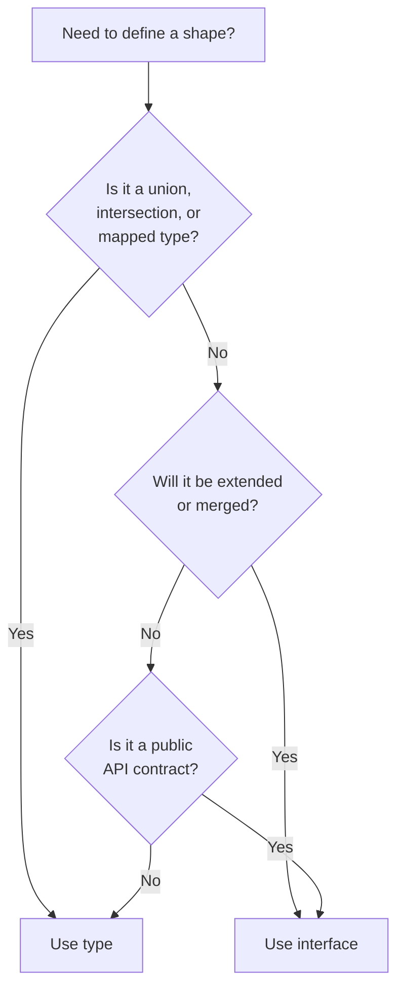
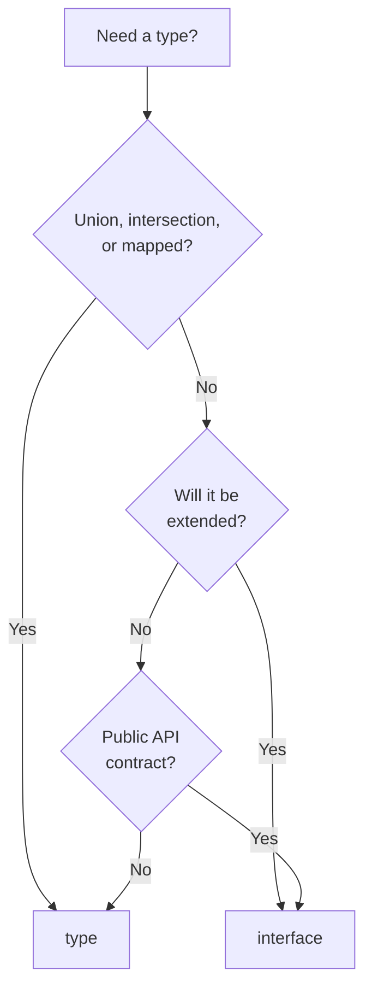
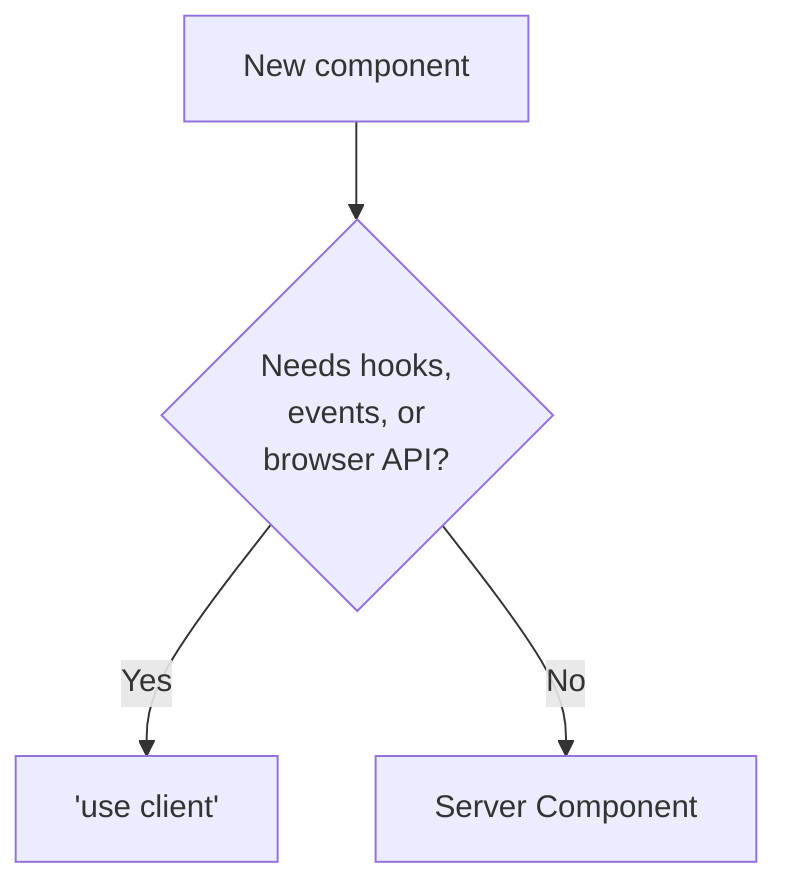
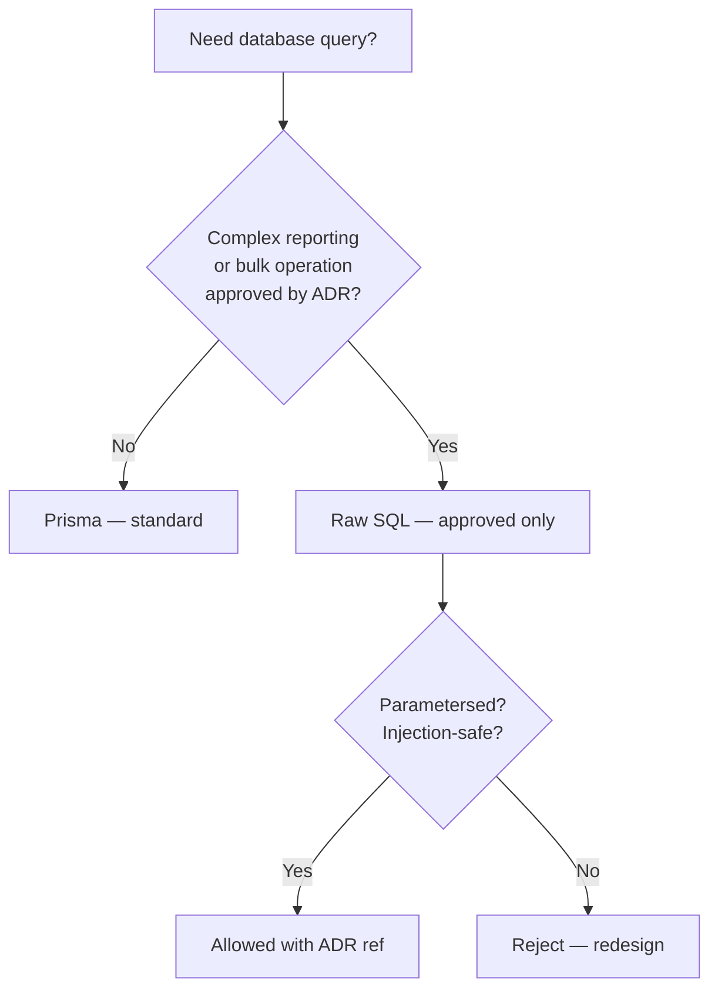

# Xennic Coding Standards

> **Canonical Language & Framework Coding Rules**
> Version: 1.0.0 — Sprint K3.2
> Status: Living Document
> Primary Audience: All developers writing code for the Xennic Platform
> Cross-Reference: → docs/engineering-constitution/01-engineering-constitution.md, → docs/engineering-constitution/03-git-workflow.md

---

## Document Navigation

| Section | Content |
|---------|---------|
| **1** | TypeScript Standards |
| **2** | NestJS Standards |
| **3** | Next.js Standards |
| **4** | Python Standards |
| **5** | FastAPI Standards |
| **6** | Prisma Standards |
| **7** | SQL Standards |
| **8** | Docker Standards |
| **9** | Shell Standards |
| **10** | Naming Conventions |
| **11** | Folder Organization |
| **12** | Dependency Management |
| **13** | Imports |
| **14** | Logging |
| **15** | Exceptions & Error Handling |
| **16** | DTO & Validation |
| **17** | Configuration |
| **18** | Async Programming |
| **19** | Performance Standards |
| **20** | Caching Standards |
| **21** | Event Naming |
| **22** | Code Comments |
| **23** | File Size Limits |
| **24** | Complexity Limits |

---

## 1. TypeScript Standards

### 1.1 Strict Mode

**Statement:** All TypeScript code MUST be compiled with `strict: true` in `tsconfig.json`. This enables `strictNullChecks`, `noImplicitAny`, `strictFunctionTypes`, `strictBindCallApply`, `strictPropertyInitialization`, `noImplicitThis`, and `alwaysStrict`.

**Why:** Strict mode enables the full power of TypeScript's type system, catching null reference errors, implicit any bugs, and type mismatches at compile time.

**Rationale:** Every bug caught at compile time is a bug that never reaches production. Strict mode eliminates entire categories of runtime errors.

**Good Example:**
```json
{
  "compilerOptions": {
    "strict": true,
    "noUncheckedIndexedAccess": true,
    "exactOptionalPropertyTypes": true
  }
}
```

**Bad Example:**
```json
{
  "compilerOptions": {
    "strict": false,
    "noImplicitAny": false
  }
}
```

### 1.2 Types vs Interfaces

**Statement:** Use `interface` for public API contracts and object shapes that may be extended. Use `type` for unions, intersections, mapped types, and non-object types. Be consistent within a module.

**Why:** Interfaces are declarative, extendable, and produce better error messages. Types are more flexible for non-object use cases.

**Rationale:** The distinction between `interface` and `type` is a matter of convention. Consistency matters more than which one is chosen. Public API shapes benefit from interface's declaration merging and better IDE support.

**Good Example:**
```typescript
// Interface for public API contracts (extendable)
interface CalculationResponse {
  id: string;
  result: number;
  status: CalculationStatus;
  createdAt: Date;
}

// Type for unions, primitives, computed shapes
type CalculationStatus = 'pending' | 'running' | 'completed' | 'failed';
type CalculationResult = CalculationResponse | ErrorResponse;
type DeepPartial<T> = { [P in keyof T]?: DeepPartial<T[P]> };
```

**Bad Example:**
```typescript
// Using type everywhere inconsistently
type CalculationResponse = {
  id: string;
  result: number;
};

// Using interface for a union (not valid)
interface CalculationStatus = 'pending' | 'running'; // Syntax error
```

**Decision Tree:**


### 1.3 Generics

**Statement:** Use generics to create reusable, type-safe abstractions. Name generic parameters descriptively (not single letters) unless the convention is universal (`T`, `K`, `V`).

**Why:** Generics enable code reuse without sacrificing type safety. Descriptive names make generic code readable.

**Rationale:** Single-letter generic names (`T`, `U`, `V`) are acceptable for simple, standard patterns. For complex generics with multiple parameters, descriptive names are required.

**Good Example:**
```typescript
// Descriptive generic names for complex APIs
class Repository<TEntity extends BaseEntity, TId extends string | number> {
  async findById(id: TId): Promise<TEntity | null> { /* ... */ }
  async findAll(filter: Partial<TEntity>): Promise<TEntity[]> { /* ... */ }
}

// Single-letter is acceptable for simple cases
function identity<T>(value: T): T {
  return value;
}
```

**Bad Example:**
```typescript
// Cryptic single-letter names in complex contexts
function process<T, U, V>(a: T, b: U, c: V): V {
  // What are T, U, V? No one knows.
}

// Overly complex without generics
function processCalculations(calcs: Calculation[]): CalculationResult[] {
  return calcs.map(c => processCalculation(c));
}
```

### 1.4 Null Handling

**Statement:** Use `undefined` for missing values (optional properties, missing return values). Use `null` only for explicit "no value" semantics from external APIs or database queries. Prefer `??` over `||` for default values.

**Why:** `undefined` is the natural TypeScript/JavaScript default for missing values. `null` is ambiguous — it could mean "not set," "unknown," or "errored."

**Rationale:** TypeScript `strictNullChecks` forces handling of both `null` and `undefined`. Consistency in usage reduces cognitive load.

**Good Example:**
```typescript
// Use undefined for optional/missing values
function findCalculation(id: string): Calculation | undefined {
  return calculations.find(c => c.id === id);
}

// Use ?? for defaults (handles only null/undefined, not other falsy values)
const timeout = config.timeout ?? 30000;
const name = user.name ?? 'Anonymous';

// Handle null from Prisma/database
const calc = await prisma.calculation.findUnique({ where: { id } });
if (!calc) throw new NotFoundException('Calculation not found');
```

**Bad Example:**
```typescript
// Using || when 0 or empty string is valid
const timeout = config.timeout || 30000; // Bug: timeout=0 becomes 30000

// Using null for "not found" instead of undefined
function findCalculation(id: string): Calculation | null {
  return calculations.find(c => c.id === id) ?? null;
}
```

### 1.5 Discriminated Unions

**Statement:** Use discriminated unions for states that can be one of several distinct shapes. The discriminant MUST be a literal string field.

**Why:** Discriminated unions enable type-safe narrowing. TypeScript narrows the type based on the discriminant value, eliminating runtime checks.

**Rationale:** Pattern matching through discriminated unions is the most type-safe way to handle variant states.

**Good Example:**
```typescript
type CalculationState =
  | { status: 'pending'; createdAt: Date }
  | { status: 'running'; startedAt: Date; progress: number }
  | { status: 'completed'; result: number; completedAt: Date }
  | { status: 'failed'; error: string; failedAt: Date };

function handleCalculation(state: CalculationState): string {
  switch (state.status) {
    case 'pending': return `Queued at ${state.createdAt}`; // TS knows shape
    case 'running': return `${state.progress}% complete`;  // TS knows shape
    case 'completed': return `Result: ${state.result}`;     // TS knows shape
    case 'failed': return `Error: ${state.error}`;          // TS knows shape
  }
}
```

**Bad Example:**
```typescript
// Non-discriminated union — unsafe
type CalculationState = {
  status: string; // Not a literal discriminant
  data?: any;     // Unsafe
};
```

### 1.6 Type Guards

**Statement:** Use user-defined type guards (`is` predicates) for runtime type checking of complex types. Validate unknown data at boundaries with type guards.

**Why:** Type guards bridge the gap between runtime and compile-time type checking. They ensure that data entering the system from external sources is type-safe.

**Rationale:** The `unknown` type forces validation before use. Type guards make validation composable and testable.

**Good Example:**
```typescript
function isCalculation(data: unknown): data is Calculation {
  return (
    typeof data === 'object' &&
    data !== null &&
    'id' in data &&
    'status' in data &&
    typeof (data as Calculation).id === 'string'
  );
}

function parseCalculation(data: unknown): Calculation {
  if (!isCalculation(data)) throw new ValidationError('Invalid calculation data');
  return data; // TypeScript knows this is Calculation
}
```

**Bad Example:**
```typescript
// Type assertion without validation
function parseCalculation(data: unknown): Calculation {
  return data as Calculation; // Unsafe — assumes without checking
}
```

### 1.7 Enums vs Unions

**Statement:** Prefer `string` literal unions over TypeScript `enum` for simple enumerations. Use `const enum` or `as const` objects with `typeof` only when numeric values or computed members are needed.

**Why:** String literal unions are simpler, tree-shakeable, and compile to zero runtime code. TypeScript `enum` produces runtime code and has complex semantics.

**Good Example:**
```typescript
// String literal union — simple, zero runtime cost
type CalculationStatus = 'pending' | 'running' | 'completed' | 'failed';

// Use const object + typeof for iterable enums
const CALCULATION_STATUS = {
  PENDING: 'pending',
  RUNNING: 'running',
  COMPLETED: 'completed',
  FAILED: 'failed',
} as const;
type CalculationStatus = typeof CALCULATION_STATUS[keyof typeof CALCULATION_STATUS];
```

**Bad Example:**
```typescript
// Runtime enum with unnecessary overhead
enum CalculationStatus {
  PENDING = 'pending',
  RUNNING = 'running',
  COMPLETED = 'completed',
  FAILED = 'failed',
}
```

### 1.8 Function Signatures

**Statement:** Functions MUST have explicit return types. Parameters MUST be explicitly typed. Avoid optional parameters where default values suffice.

**Why:** Explicit return types document what a function produces. They also prevent accidental changes to the return shape from going unnoticed.

**Rationale:** TypeScript can infer return types, but explicit annotations serve as documentation and safety guarantees.

**Good Example:**
```typescript
async function createCalculation(dto: CreateCalculationDto): Promise<CalculationResponse> {
  const calculation = await calculationService.create(dto);
  return mapToResponse(calculation);
}

function formatDuration(milliseconds: number, showMs: boolean = false): string {
  // Implementation
}
```

**Bad Example:**
```typescript
// No return type — change may go unnoticed
async function createCalculation(dto: any) { // any type!
  return calculationService.create(dto);
}

// Too many optional parameters — use an options object
function createUser(name: string, age?: number, email?: string, phone?: string, role?: string) {
  // ...
}
```

---

## 2. NestJS Standards

### 2.1 Module Structure

**Statement:** Every feature module MUST follow the standard structure with controller, service, repository (or Prisma service), DTOs, and module file.

**Why:** Consistent module structure reduces cognitive load. Any developer can navigate any module without learning a new layout.

**Rationale:** The modular structure aligns with NestJS conventions and enables clear separation of concerns.

**Good Example:**
```
calculations/
├── calculations.controller.ts
├── calculations.service.ts
├── calculations.module.ts
├── calculations.repository.ts
├── dto/
│   ├── create-calculation.dto.ts
│   ├── update-calculation.dto.ts
│   └── calculation-response.dto.ts
├── interfaces/
│   └── calculation.interface.ts
└── tests/
    ├── calculations.controller.spec.ts
    ├── calculations.service.spec.ts
    └── calculations.repository.spec.ts
```

### 2.2 Controller/Service/Repository Pattern

**Statement:** Controllers handle HTTP concerns (request parsing, response formatting). Services handle business logic. Repositories handle data access. Each layer has a single responsibility.

**Why:** This separation enables independent testing, clear responsibility boundaries, and modular replaceability.

**Rationale:** NestJS is architected around this pattern. Violating it creates hard-to-test, tightly coupled code.

**Good Example:**
```typescript
// Controller — HTTP concerns only
@Controller('calculations')
export class CalculationController {
  constructor(private readonly calculationService: CalculationService) {}

  @Post()
  async create(@Body() dto: CreateCalculationDto): Promise<CalculationResponse> {
    return this.calculationService.create(dto);
  }
}

// Service — business logic only
@Injectable()
export class CalculationService {
  constructor(
    private readonly calcRepository: CalculationRepository,
    private readonly calculatorEngine: CalculatorEngine,
  ) {}

  async create(dto: CreateCalculationDto): Promise<CalculationResponse> {
    const calculation = await this.calcRepository.create(dto);
    const result = await this.calculatorEngine.evaluate(calculation);
    return { ...calculation, result };
  }
}

// Repository — data access only
@Injectable()
export class CalculationRepository {
  constructor(private readonly prisma: PrismaService) {}

  async create(dto: CreateCalculationDto): Promise<Calculation> {
    return this.prisma.calculation.create({ data: dto });
  }
}
```

**Bad Example:**
```typescript
@Controller('calculations')
export class CalculationController {
  constructor(private readonly prisma: PrismaService) {}

  @Post()
  async create(@Req() req: Request, @Body() body: any): Promise<any> {
    // HTTP handling, business logic, and data access all in one method
    if (!req.headers['x-workspace-id']) throw new Error('Missing workspace');
    const calc = await this.prisma.calculation.create({ data: body });
    const result = await someComplexLogic(calc);
    return { success: true, data: result };
  }
}
```

### 2.3 DTOs

**Statement:** Every endpoint MUST have a dedicated DTO class with validation decorators. DTOs are defined using `class-validator` decorators and `class-transformer` for serialisation.

**Why:** DTOs define the explicit contract for each endpoint. Validation decorators enforce constraints at the boundary (→ §16).

**Rationale:** NestJS integrates deeply with `class-validator` and `class-transformer`. Global `ValidationPipe` with `whitelist: true` and `forbidNonWhitelisted: true` provides automatic validation.

**Good Example:**
```typescript
import { IsString, IsUUID, IsOptional, IsNumber, Min } from 'class-validator';
import { Type } from 'class-transformer';

export class CreateCalculationDto {
  @IsString()
  @IsNotEmpty()
  readonly name: string;

  @IsUUID()
  readonly workspaceId: string;

  @IsString()
  readonly formula: string;

  @IsOptional()
  @IsNumber()
  @Min(0)
  @Type(() => Number)
  readonly tolerance?: number;
}
```

### 2.4 Guards

**Statement:** Use NestJS guards for authentication and authorization. Guards MUST be used at the controller or module level — never inline in service methods.

**Why:** Guards are the NestJS-native way to handle cross-cutting security concerns. They are composable, testable, and declarative.

**Rationale:** Inline auth checks in services violate separation of concerns and make security auditing difficult.

**Good Example:**
```typescript
@Controller('calculations')
@UseGuards(AuthGuard, WorkspaceGuard)
export class CalculationController {
  @Post()
  @UseGuards(RoleGuard(Role.ENGINEER))
  async create(@Body() dto: CreateCalculationDto): Promise<CalculationResponse> {
    return this.calculationService.create(dto);
  }
}
```

**Bad Example:**
```typescript
@Injectable()
export class CalculationService {
  async create(dto: CreateCalculationDto): Promise<CalculationResponse> {
    const user = this.request.user; // Accessing request in service
    if (!user) throw new UnauthorizedException(); // Auth check in service
    // Business logic mixed with auth
  }
}
```

### 2.5 Interceptors

**Statement:** Use interceptors for cross-cutting concerns: logging, response transformation, timeout handling, and transaction management.

**Why:** Interceptors wrap request handling, enabling consistent cross-cutting behaviour without polluting business logic.

**Good Example:**
```typescript
@Injectable()
export class ResponseInterceptor<T> implements NestInterceptor<T, UnifiedResponse<T>> {
  intercept(context: ExecutionContext, next: CallHandler): Observable<UnifiedResponse<T>> {
    return next.handle().pipe(
      map(data => ({
        success: true,
        data,
        meta: extractMeta(context),
      })),
      catchError(error => of({
        success: false,
        error: { code: error.code, message: error.message },
      })),
    );
  }
}
```

### 2.6 Pipes

**Statement:** Use global `ValidationPipe` for DTO validation. Use custom pipes for specialized transformations and validations.

**Why:** Pipes are NestJS's mechanism for input validation and transformation. The global `ValidationPipe` enforces DTO rules automatically.

**Good Example:**
```typescript
// main.ts — global validation
app.useGlobalPipes(new ValidationPipe({
  whitelist: true,
  forbidNonWhitelisted: true,
  transform: true,
  transformOptions: { enableImplicitConversion: true },
}));

// Custom pipe for UUID validation
@Injectable()
export class ParseUUIDPipe implements PipeTransform<string, string> {
  transform(value: string): string {
    if (!isUUID(value)) throw new BadRequestException('Invalid UUID');
    return value;
  }
}
```

### 2.7 Exception Filters

**Statement:** Use a global exception filter to transform all exceptions into the unified error envelope format. Create custom exception classes for domain-specific errors.

**Why:** Consistent error responses are required by the unified envelope invariant (→ §4.5 Engineering Constitution).

**Good Example:**
```typescript
@Catch()
export class GlobalExceptionFilter implements ExceptionFilter {
  catch(exception: unknown, host: ArgumentsHost): void {
    const ctx = host.switchToHttp();
    const response = ctx.getResponse<FastifyReply>();
    
    const status = exception instanceof HttpException
      ? exception.getStatus()
      : 500;
    
    const error = exception instanceof HttpException
      ? exception.getResponse()
      : { code: 'INTERNAL_ERROR', message: 'An unexpected error occurred' };
    
    response.status(status).send({
      success: false,
      error,
    });
  }
}
```

---

## 3. Next.js Standards

### 3.1 App Router

**Statement:** All new pages MUST use the App Router (`app/` directory). The Pages Router (`pages/`) is deprecated and MUST NOT be used for new features.

**Why:** App Router provides server components, streaming, nested layouts, and improved data fetching. It is the future of Next.js.

**Rationale:** Mixing App Router and Pages Router creates confusion and limits the use of modern Next.js features.

**Good Example:**
```
app/
├── (dashboard)/
│   ├── layout.tsx
│   ├── page.tsx
│   ├── calculations/
│   │   ├── page.tsx
│   │   ├── [id]/
│   │   │   └── page.tsx
│   │   └── new/
│   │       └── page.tsx
```

### 3.2 Server Components vs Client Components

**Statement:** Prefer Server Components by default. Use Client Components ONLY when interactivity (event handlers, hooks, browser APIs) is required.

**Why:** Server Components render on the server, reducing JavaScript bundle size and improving initial page load performance.

**Rationale:** The "server-first" approach is Next.js's recommended pattern. Moving a component to the client is a conscious decision with performance implications.

**Decision Tree:**
```mermaid
flowchart TD
    A[Need to build a component?] --> B{Needs interactivity?\n(onClick, onChange,\nstate, effects)}
    B -->|No| C{Needs hooks?\n(useState, useEffect,\nuseContext)}
    C -->|No| D{Needs browser APIs?\n(window, document,\nnavigator)}
    D -->|No| E[Server Component]
    B -->|Yes| F[Client Component\n'use client']
    C -->|Yes| F
    D -->|Yes| F
    E --> G[Benefits: Smaller bundle,\ndirect DB access,\nsecret-safe]
    F --> H[Benefits: Interactivity,\nbrowser APIs,\nlifecycle hooks]
```

**Good Example:**
```typescript
// Server Component — data fetching on server
// app/calculations/page.tsx
import { getCalculations } from '@/lib/data';
import { CalculationList } from './calculation-list';

export default async function CalculationsPage() {
  const calculations = await getCalculations(); // Server-side fetch
  return <CalculationList calculations={calculations} />;
}
```

**Bad Example:**
```typescript
// Client Component when server would suffice
'use client';
import { useEffect, useState } from 'react';

export default function CalculationsPage() {
  const [calculations, setCalculations] = useState([]);
  
  useEffect(() => {
    fetch('/api/calculations').then(res => res.json()).then(setCalculations);
  }, []);
  
  return <div>{/* render */}</div>;
}
```

### 3.3 Data Fetching

**Statement:** Use Server Components with async data fetching for initial page data. Use React Query (TanStack Query) for client-side data that needs real-time updates or revalidation.

**Why:** Server-side data fetching eliminates client-server waterfalls and provides data during server-side rendering.

**Rationale:** Server Components can fetch data directly (DB, API, file system) without exposing credentials to the client.

**Good Example:**
```typescript
// Server component data fetching
async function getCalculation(id: string): Promise<Calculation> {
  const calc = await prisma.calculation.findUnique({
    where: { id },
    include: { author: true, results: true },
  });
  if (!calc) notFound();
  return calc;
}

export default async function CalculationPage({ params }: Props) {
  const calculation = await getCalculation(params.id);
  return <CalculationDetail calculation={calculation} />;
}
```

### 3.4 ISR/SSR/SSG Decisions

| Rendering Strategy | When to Use | Example |
|-------------------|-------------|---------|
| **Static (SSG)** | Content rarely changes, public pages | Landing page, documentation, blog posts |
| **Dynamic (SSR)** | Per-request data, authenticated content | Dashboard, calculation results, user settings |
| **ISR** | Content changes periodically, needs freshness | Standards catalog, reference data, public lists |

**Good Example:**
```typescript
// ISR — regenerate every hour
export const revalidate = 3600;

export default async function StandardsPage() {
  const standards = await getStandards();
  return <StandardsList standards={standards} />;
}
```

### 3.5 Route Handlers

**Statement:** Route handlers (API routes in App Router) MUST NOT be used as proxies to the NestJS backend. Use them only for Next.js-specific needs (webhooks, server actions, middleware).

**Why:** All API logic should live in NestJS. Route handlers create a second API surface that must be maintained.

**Rationale:** Duplicate API surfaces lead to inconsistent behaviour, duplicated logic, and maintenance burden.

**Good Example:**
```typescript
// Route handler for a webhook specific to web functionality
export async function POST(request: Request) {
  const formData = await request.formData();
  // Upload to MinIO directly, not through NestJS
  return Response.json({ success: true });
}
```

**Bad Example:**
```typescript
// Route handler duplicating NestJS API
export async function GET() {
  const res = await fetch('http://localhost:3000/api/v1/calculations');
  const data = await res.json();
  return Response.json(data);
}
```

---

## 4. Python Standards

### 4.1 Type Hints

**Statement:** ALL Python code MUST use type hints (Python 3.10+ syntax with `|` for unions). Use `mypy` for static type checking with strict mode.

**Why:** Type hints enable static type checking, improve IDE support, and document expected types.

**Rationale:** Python's dynamic nature makes types especially valuable for catching errors early. Mypy strict mode catches None-related errors, type mismatches, and missing return types.

**Good Example:**
```python
from __future__ import annotations
from typing import Optional
from uuid import UUID

class CalculationService:
    def __init__(self, repository: CalculationRepository, logger: Logger) -> None:
        self._repository = repository
        self._logger = logger

    async def get_by_id(self, calc_id: UUID) -> Calculation | None:
        return await self._repository.find_by_id(calc_id)
```

**Bad Example:**
```python
class CalculationService:
    def __init__(self, repository, logger):  # Missing type hints
        self.repository = repository
        self.logger = logger

    async def get_by_id(self, calc_id):  # Missing return type
        return await self.repository.find_by_id(calc_id)  # Might return None — unchecked
```

### 4.2 FastAPI Patterns

**Statement:** Follow the service-repository pattern in FastAPI. Handlers (route functions) are thin — they call services, which contain business logic.

**Why:** Thin handlers keep HTTP concerns separate from business logic, enabling testability and reuse.

**Rationale:** This mirrors the NestJS pattern (→ §2.2) for consistency across the codebase.

**Good Example:**
```python
# routes/calculations.py
from fastapi import APIRouter, Depends

router = APIRouter(prefix="/calculations", tags=["calculations"])

@router.post("/")
async def create_calculation(
    dto: CreateCalculationDTO,
    service: CalculationService = Depends(get_calculation_service),
) -> CalculationResponse:
    return await service.create(dto)


# services/calculation_service.py
class CalculationService:
    def __init__(self, repository: CalculationRepository, engine: CalculationEngine):
        self._repository = repository
        self._engine = engine

    async def create(self, dto: CreateCalculationDTO) -> CalculationResponse:
        calculation = await self._repository.create(dto)
        result = await self._engine.evaluate(calculation)
        return CalculationResponse.from_domain(calculation, result)
```

### 4.3 Async vs Sync

**Statement:** ALL I/O operations MUST be async. CPU-bound operations should use a thread pool or be delegated to a separate worker process.

**Why:** Async I/O enables concurrent request handling without the overhead of threads. Blocking the event loop with sync I/O kills performance.

**Rationale:** FastAPI is async-native. Mixing sync and async without proper executor usage creates event loop blocks.

**Good Example:**
```python
async def process_calculation(self, calc_id: UUID) -> CalculationResult:
    # Async I/O — non-blocking
    calculation = await self._repository.find_by_id(calc_id)
    # CPU-bound delegated to thread pool
    result = await asyncio.to_thread(self._heavy_computation, calculation)
    await self._repository.update_status(calc_id, "completed")
    return result
```

**Bad Example:**
```python
async def process_calculation(self, calc_id: UUID) -> CalculationResult:
    calculation = await self._repository.find_by_id(calc_id)
    result = self._heavy_computation(calculation)  # Blocks the event loop!
    return result
```

### 4.4 Pydantic Models

**Statement:** Use Pydantic v2 models for all data validation, serialization, and configuration. Use `model_validator` and `field_validator` for custom validation logic.

**Why:** Pydantic provides automatic validation, serialization, and schema generation (OpenAPI). V2 is significantly faster than V1.

**Rationale:** FastAPI integrates natively with Pydantic for request/response validation and OpenAPI generation.

**Good Example:**
```python
from pydantic import BaseModel, Field, field_validator
from uuid import UUID, uuid4

class CreateCalculationDTO(BaseModel):
    name: str = Field(..., min_length=1, max_length=200)
    workspace_id: UUID
    formula: str = Field(..., min_length=1)
    tolerance: float | None = Field(default=None, ge=0)

    @field_validator('name')
    @classmethod
    def name_must_not_be_empty(cls, v: str) -> str:
        if not v.strip():
            raise ValueError('Name must not be empty')
        return v.strip()
```

### 4.5 Service Layer Pattern

**Statement:** Business logic MUST live in service classes, not in route handlers or models. Services depend on repositories (data access) and engines (domain logic).

**Why:** The service layer is where business logic belongs. It is testable, reusable, and independent of HTTP concerns.

**Cross-Reference:** → §2.2 NestJS Standards (same pattern applies)

---

## 5. FastAPI Standards

### 5.1 Route Organization

**Statement:** Group routes by domain in separate route modules. Each domain has its own router with `prefix` and `tags` for OpenAPI grouping.

**Why:** Consistent route organization makes the API predictable and navigable. OpenAPI tags enable automatic grouping in Swagger UI.

**Good Example:**
```python
# routes/__init__.py
from fastapi import APIRouter
from .calculations import router as calculations_router
from .projects import router as projects_router

router = APIRouter()
router.include_router(calculations_router)
router.include_router(projects_router)

# routes/calculations.py
router = APIRouter(prefix="/calculations", tags=["Calculations"])
```

### 5.2 Dependency Injection

**Statement:** Use FastAPI's `Depends` for all dependency injection. Services, repositories, and clients are wired through dependency injection.

**Why:** FastAPI's DI system enables clean dependency management, testing (overriding deps), and request-scoped lifecycle.

**Good Example:**
```python
async def get_db() -> AsyncGenerator[AsyncSession, None]:
    async with async_session() as session:
        yield session

@router.get("/{calc_id}")
async def get_calculation(
    calc_id: UUID,
    db: AsyncSession = Depends(get_db),
    service: CalculationService = Depends(get_calculation_service),
) -> CalculationResponse:
    return await service.get_by_id(db, calc_id)
```

### 5.3 Validation

**Statement:** Use Pydantic models for request validation and response serialization. Use FastAPI's `Path`, `Query`, and `Body` validators for parameter validation.

**Why:** Pydantic provides comprehensive validation with clear error messages. FastAPI's parameter validators add path/query-specific constraints.

**Good Example:**
```python
from fastapi import Query

@router.get("/")
async def list_calculations(
    workspace_id: UUID = Query(..., description="Workspace ID"),
    page: int = Query(default=1, ge=1, description="Page number"),
    limit: int = Query(default=20, ge=1, le=100, description="Items per page"),
    status: CalculationStatus | None = Query(default=None),
):
    """List calculations with pagination and filtering."""
```

### 5.4 Response Models

**Statement:** Every route MUST define a `response_model` for automatic validation and documentation. Response models MUST use the unified envelope.

**Why:** Response models provide OpenAPI documentation, response validation, and type safety.

**Good Example:**
```python
@router.post("/", response_model=UnifiedResponse[CalculationResponse])
async def create_calculation(dto: CreateCalculationDTO, service = Depends(...)):
    result = await service.create(dto)
    return UnifiedResponse(data=result)
```

### 5.5 Middleware

**Statement:** Use middleware for cross-cutting concerns: CORS, request ID injection, timing, and logging. Business logic MUST NOT be in middleware.

**Why:** Middleware operates at the HTTP level, before routing. It is appropriate for global HTTP concerns but not business logic.

**Good Example:**
```python
@app.middleware("http")
async def add_process_time_header(request: Request, call_next):
    start_time = time.time()
    response = await call_next(request)
    process_time = time.time() - start_time
    response.headers["X-Process-Time"] = str(process_time)
    return response
```

---

## 6. Prisma Standards

### 6.1 Schema Organization

**Statement:** Models are organized by domain. Related models are grouped with comments. Enums precede the models that use them.

**Why:** A well-organized schema file is the foundation of the data model. Engineers should find related models near each other.

**Rationale:** The Prisma schema is the single source of truth for the database schema. It must be readable and navigable.

**Good Example:**
```prisma
// ─── Enums ─────────────────────────────────────────────
enum CalculationStatus {
  PENDING
  RUNNING
  COMPLETED
  FAILED
}

// ─── Calculations ──────────────────────────────────────
model Calculation {
  id          String             @id @default(uuid()) @db.Uuid
  workspaceId String             @map("workspace_id") @db.Uuid
  name        String             @db.VarChar(200)
  formula     String             @db.Text
  status      CalculationStatus  @default(PENDING)
  result      Float?
  createdAt   DateTime           @default(now()) @map("created_at")
  updatedAt   DateTime           @updatedAt @map("updated_at")

  // Relations
  author   User?     @relation(fields: [authorId], references: [id])
  authorId String?   @map("author_id") @db.Uuid

  @@map("calculations")
  @@index([workspaceId])
  @@index([status, createdAt])
}
```

### 6.2 Model Naming

**Statement:** Models are PascalCase, singular. Fields are camelCase. Database columns are snake_case (via `@map`).

**Why:** Convention across the codebase aligns TypeScript (camelCase) with SQL (snake_case) conventions.

**Good Example:**
```prisma
model CalculationResult {
  id           String   @id @default(uuid()) @db.Uuid
  calculationId String  @map("calculation_id") @db.Uuid
  value        Float
  createdAt    DateTime @default(now()) @map("created_at")

  calculation Calculation @relation(fields: [calculationId], references: [id])

  @@map("calculation_results")
}
```

### 6.3 Field Types

**Statement:** Use `@db.Uuid` for UUID fields. Use `@db.VarChar(n)` with explicit max length for string fields. Use `@db.TimestampTz()` for timestamps. Use `@default(now())` for createdAt and `@updatedAt` for updatedAt.

**Why:** PostgreSQL-specific type annotations ensure optimal storage and performance.

**Good Example:**
```prisma
model User {
  id        String   @id @default(uuid()) @db.Uuid
  email     String   @unique @db.VarChar(255)
  name      String   @db.VarChar(200)
  createdAt DateTime @default(now()) @map("created_at") @db.TimestampTz()
  updatedAt DateTime @updatedAt @map("updated_at") @db.TimestampTz()
}
```

### 6.4 Relation Patterns

**Statement:** Relations are explicit with both `@relation` and foreign key fields. Use `@@index` on foreign keys. Avoid circular relations.

**Why:** Explicit relations make the schema self-documenting. Indexes on foreign keys prevent N+1 performance issues.

**Cross-Reference:** → §7 SQL Standards for index naming

### 6.5 Enums

**Statement:** Prisma enums are preferred over scalar string fields when the set of valid values is fixed and known at schema time.

**Why:** Prisma enums provide type safety, database-level validation, and clear documentation of valid values.

### 6.6 Compound Keys and Indexes

**Statement:** Use compound `@@id` or `@@unique` for natural keys. Use compound `@@index` for query patterns that filter on multiple columns.

**Why:** Compound indexes dramatically improve query performance for multi-column filter patterns.

**Good Example:**
```prisma
model CalculationTag {
  calculationId String @map("calculation_id") @db.Uuid
  tagId         String @map("tag_id") @db.Uuid

  calculation Calculation @relation(fields: [calculationId], references: [id])
  tag         Tag         @relation(fields: [tagId], references: [id])

  @@id([calculationId, tagId]) // Compound primary key
  @@index([tagId])
  @@map("calculation_tags")
}
```

### 6.7 Soft Deletes

**Statement:** Use `deletedAt` nullable timestamp for soft deletes instead of physical row deletion. Add `@@where` clauses to all queries to filter out soft-deleted records.

**Why:** Soft deletes enable data recovery, audit trails, and cascade-safe deletions.

**Good Example:**
```prisma
model Calculation {
  id        String    @id @default(uuid()) @db.Uuid
  deletedAt DateTime? @map("deleted_at") @db.TimestampTz()

  @@where("deleted_at IS NULL")
}
```

---

## 7. SQL Standards

### 7.1 Query Patterns

**Statement:** All SQL queries go through Prisma. Raw SQL is prohibited (→ §5.8 Engineering Constitution). For the rare approved raw SQL case, use parameterised queries to prevent SQL injection.

**Why:** Prisma provides type safety and migration management. Raw SQL bypasses both.

**Rationale:** When raw SQL is absolutely necessary (complex reporting, bulk operations), parameterised queries prevent injection attacks.

### 7.2 Naming Conventions

**Tables:** snake_case, plural
**Columns:** snake_case
**Indexes:** `idx_{table}_{column(s)}`
**Unique constraints:** `uq_{table}_{column(s)}`
**Foreign keys:** `fk_{child_table}_{parent_table}`

**Good Example:**
```sql
CREATE TABLE calculation_results (
    id UUID PRIMARY KEY DEFAULT gen_random_uuid(),
    calculation_id UUID NOT NULL,
    value DOUBLE PRECISION NOT NULL,
    created_at TIMESTAMPTZ NOT NULL DEFAULT NOW(),
    
    CONSTRAINT fk_calculation_results_calculations
        FOREIGN KEY (calculation_id) REFERENCES calculations(id)
);

CREATE INDEX idx_calculation_results_calculation_id
    ON calculation_results(calculation_id);
```

### 7.3 CTE Usage

**Statement:** Use Common Table Expressions (CTEs) for complex queries that require multiple steps or recursive traversal. Avoid excessive nesting of subqueries.

**Why:** CTEs improve readability and maintainability of complex queries compared to deeply nested subqueries.

### 7.4 Function Usage

**Statement:** Prefer application-level logic over PostgreSQL functions and triggers. Database functions are reserved for performance-critical operations that cannot be expressed in application code.

**Why:** Business logic in the database is harder to test, version, and maintain than application code.

---

## 8. Docker Standards

### 8.1 Image Size

**Statement:** Production images MUST be under 500MB. Use distroless or Alpine-based base images.

**Why:** Smaller images reduce deployment time, attack surface, and storage costs.

**Good Example:**
```dockerfile
FROM node:20-alpine AS builder
WORKDIR /app
COPY package*.json ./
RUN npm ci --only=production

FROM node:20-alpine AS runner
WORKDIR /app
COPY --from=builder /app/node_modules ./node_modules
COPY dist ./dist
USER node
CMD ["node", "dist/main"]
```

**Bad Example:**
```dockerfile
FROM node:20-slim AS builder
# No multi-stage — includes dev dependencies and build tools in final image
COPY . .
RUN npm install
RUN npm run build
CMD ["node", "dist/main"]
```

### 8.2 Multi-Stage Builds

**Statement:** ALL Dockerfiles MUST use multi-stage builds. The builder stage includes build tools and dev dependencies. The runner stage includes only runtime dependencies.

**Why:** Multi-stage builds produce minimal images by separating build-time from runtime dependencies.

### 8.3 Layer Ordering

**Statement:** Order Dockerfile commands from least to most frequently changing. Dependency installation before code copy. This maximises layer cache utilisation.

**Why:** Docker caches layers. Correct ordering means dependency layers are cached and reused across builds.

**Good Example:**
```dockerfile
FROM python:3.11-slim AS builder
WORKDIR /app
# Dependencies rarely change — cache these layers
COPY requirements.txt .
RUN pip install --user -r requirements.txt
# Code changes frequently — put last
COPY src ./src
```

### 8.4 Base Images

**Statement:** Use officially maintained base images with specific version tags (never `latest`). Pin the digest for production-critical images.

**Why:** `latest` tags change and break builds. Specific tags provide reproducible builds. Digests provide cryptographic pinning.

**Good Example:**
```dockerfile
FROM python:3.11-slim@sha256:abc123...
FROM node:20-alpine@sha256:def456...
```

**Bad Example:**
```dockerfile
FROM node:latest
FROM python:latest
```

### 8.5 Security Scanning

**Statement:** ALL images MUST be scanned for vulnerabilities before deployment. Use `docker scan`, Trivy, or Snyk. Critical/high vulnerabilities MUST be resolved before production deployment.

**Why:** Container images are a common attack vector. Scanning prevents deploying known-vulnerable software.

---

## 9. Shell Standards

### 9.1 Bash Strict Mode

**Statement:** ALL shell scripts MUST use strict mode: `set -euo pipefail` and reference `$0` for usage.

**Why:** Strict mode catches unset variables, pipeline failures, and errors early instead of silently continuing.

**Good Example:**
```bash
#!/usr/bin/env bash
set -euo pipefail

# Script logic
```

**Bad Example:**
```bash
#!/bin/bash
# No strict mode — errors are silently ignored
```

### 9.2 Error Handling

**Statement:** Check exit codes of all commands. Use trap for cleanup (temp files, background processes). Provide meaningful error messages.

**Good Example:**
```bash
#!/usr/bin/env bash
set -euo pipefail

cleanup() {
    rm -rf "$TEMP_DIR"
    echo "Cleaned up temporary files"
}
trap cleanup EXIT

TEMP_DIR=$(mktemp -d)
if ! curl -sS "$URL" -o "$TEMP_DIR/data.json"; then
    echo "ERROR: Failed to download data from $URL" >&2
    exit 1
fi
```

**Bad Example:**
```bash
#!/bin/bash
curl $URL -o data.json  # No error check, no error message
# Continues even if download failed
```

### 9.3 Quoting

**Statement:** Always quote variables (`"$VAR"`). Use `$@` for arguments. Use `$*` only when intentionally concatenating.

**Why:** Unquoted variables undergo word splitting and glob expansion, which causes subtle bugs with spaces and special characters.

**Good Example:**
```bash
for file in "$@"; do
    if [[ -f "$file" ]]; then
        echo "Processing: $file"
    fi
done
```

**Bad Example:**
```bash
for file in $@; do  # Unquoted — breaks with spaces in filenames
    if [ -f $file ]; then  # Unquoted — word splitting bug
        echo $file  # Unquoted — glob expansion bug
    fi
done
```

### 9.4 Function Naming

**Statement:** Functions are snake_case. Use `local` for function-scoped variables. Prefix with `_` for internal functions.

**Good Example:**
```bash
log_info() {
    local message="$1"
    echo "[INFO] $(date '+%Y-%m-%d %H:%M:%S') $message"
}

_validate_environment() {
    local required_vars=("DB_URL" "API_KEY")
    for var in "${required_vars[@]}"; do
        if [[ -z "${!var:-}" ]]; then
            log_info "ERROR: $var is not set"
            return 1
        fi
    done
}
```

---

## 10. Naming Conventions

| Element | Convention | Example |
|---------|------------|---------|
| **Files (TypeScript)** | kebab-case | `calculation.service.ts`, `create-calculation.dto.ts` |
| **Files (Python)** | snake_case | `calculation_service.py`, `create_calculation_dto.py` |
| **Files (shell)** | snake_case | `deploy_production.sh`, `run_migrations.sh` |
| **Folders** | kebab-case | `calculation-engine/`, `data-access/` |
| **Classes (TS)** | PascalCase | `CalculationService`, `CreateCalculationDto` |
| **Classes (Python)** | PascalCase | `CalculationService`, `CreateCalculationDTO` |
| **Functions (TS)** | camelCase | `createCalculation()`, `findById()` |
| **Functions (Python)** | snake_case | `create_calculation()`, `find_by_id()` |
| **Variables (TS)** | camelCase | `calculationId`, `workspaceName` |
| **Variables (Python)** | snake_case | `calculation_id`, `workspace_name` |
| **Constants** | UPPER_SNAKE_CASE | `MAX_RETRY_COUNT`, `DEFAULT_TIMEOUT_MS` |
| **Enums (TS)** | PascalCase (type), UPPER_SNAKE (values) | `type CalculationStatus`, `CalculationStatus.PENDING` |
| **Enums (Prisma)** | PascalCase | `enum CalculationStatus { PENDING }` |
| **Events** | past-tense, dot-notation | `calculation.created`, `calculation.result.calculated` |
| **Environment variables** | UPPER_SNAKE_CASE | `DATABASE_URL`, `REDIS_URL`, `LOG_LEVEL` |
| **Database tables** | snake_case, plural | `calculation_results`, `workspace_members` |
| **Database columns** | snake_case | `created_at`, `workspace_id` |
| **Git branches** | `type/description` | `feature/knowledge-search`, `bugfix/login-redirect` |

---

## 11. Folder Organization

### 11.1 NestJS Module Structure

```
apps/api/src/
├── common/                        # Shared across modules
│   ├── guards/                    # AuthGuard, WorkspaceGuard
│   ├── interceptors/              # ResponseInterceptor, LoggingInterceptor
│   ├── pipes/                     # ParseUUIDPipe, ValidationPipe config
│   ├── filters/                   # GlobalExceptionFilter
│   ├── decorators/                # @CurrentUser, @Workspace
│   └── utils/                     # Shared utility functions
├── modules/                       # Feature modules
│   ├── calculations/
│   │   ├── calculations.controller.ts
│   │   ├── calculations.service.ts
│   │   ├── calculations.module.ts
│   │   ├── calculations.repository.ts
│   │   ├── dto/
│   │   │   ├── create-calculation.dto.ts
│   │   │   ├── update-calculation.dto.ts
│   │   │   └── calculation-response.dto.ts
│   │   └── tests/
│   └── auth/
│       ├── auth.controller.ts
│       ├── auth.service.ts
│       ├── auth.module.ts
│       └── strategies/
├── config/                        # Configuration modules
│   ├── database.config.ts
│   ├── redis.config.ts
│   └── app.config.ts
└── main.ts
```

### 11.2 Python Service Structure

```
workspace/services/engineering-service/
├── src/
│   ├── __init__.py
│   ├── main.py                    # FastAPI app creation
│   ├── routes/                    # Route handlers
│   │   ├── __init__.py
│   │   ├── calculations.py
│   │   ├── projects.py
│   │   └── health.py
│   ├── services/                  # Business logic
│   │   ├── __init__.py
│   │   ├── calculation_service.py
│   │   └── project_service.py
│   ├── repositories/              # Data access
│   │   ├── __init__.py
│   │   ├── calculation_repository.py
│   │   └── project_repository.py
│   ├── models/                    # Pydantic models
│   │   ├── __init__.py
│   │   ├── calculation.py
│   │   └── project.py
│   ├── core/                      # Core utilities
│   │   ├── config.py
│   │   ├── database.py
│   │   ├── logging.py
│   │   └── exceptions.py
│   └── dependencies.py            # FastAPI dependencies
├── tests/
│   ├── conftest.py
│   ├── test_calculations.py
│   └── test_projects.py
├── requirements.txt
├── pyproject.toml
└── Dockerfile
```

### 11.3 Shared Code Placement

**Always place shared code in the appropriate workspace package:**

| Package | Purpose |
|---------|---------|
| `packages/shared/` | Types, interfaces, constants shared across all services |
| `packages/config/` | Shared configuration, ESLint base, tsconfig base |
| `packages/openapi/` | Auto-generated OpenAPI spec (never manually edited) |
| `packages/validation/` | Shared validation rules and helpers |

---

## 12. Dependency Management

### 12.1 Adding Dependencies

**Statement:** Every new dependency MUST be justified. Justification includes: what problem does it solve, why existing code cannot solve it, what alternatives were considered.

**Why:** Every dependency adds maintenance burden, security risk, and bundle size. No dependency is free.

**Good Example:**
```bash
# Justification: zod provides runtime validation with TypeScript inference
# Alternatives considered: class-validator (needs classes, no inference)
# Decision: zod for simple validation, class-validator for NestJS DTOs
pnpm add zod
```

### 12.2 Peer Dependencies vs Dev Dependencies

- **dependencies**: Runtime dependencies (NestJS, Prisma, FastAPI)
- **devDependencies**: Build/test/lint tools (TypeScript, ESLint, Jest, ts-node)
- **peerDependencies**: For shared libraries, declare peer deps for framework packages

### 12.3 Version Pinning

**Statement:** Pin exact versions for production dependencies (no `^` or `~`). Use range specifiers for dev dependencies.

**Why:** Production dependency versions MUST be reproducible. Exact pinning prevents unexpected breaking changes from entering production.

**Good Example:**
```json
{
  "dependencies": {
    "@nestjs/core": "10.3.0",
    "zod": "3.22.0"
  },
  "devDependencies": {
    "typescript": "^5.3.0",
    "jest": "^29.7.0"
  }
}
```

### 12.4 Audit and Update Frequency

- **Weekly**: Automated dependency audit (pnpm audit, npm audit)
- **Monthly**: Dependency update PR via Renovate/Dependabot
- **Immediate**: Security vulnerabilities — patch within 48h for critical, 7d for high
- **Quarterly**: Major version upgrades with full regression testing

---

## 13. Imports

### 13.1 Ordering

**Statement:** Imports MUST be ordered in groups, separated by a blank line:

1. Node built-in modules (`fs`, `path`)
2. External dependencies (`@nestjs/*`, `express`, `react`)
3. Internal absolute imports (`@/modules/calculations`)
4. Relative imports (`./calculation.service`)

**Why:** Consistent import ordering makes dependencies visible and navigable.

**Good Example:**
```typescript
import { existsSync } from 'fs';
import { join } from 'path';

import { Injectable, Logger } from '@nestjs/common';
import { z } from 'zod';

import { CalculationRepository } from '@/modules/calculations/calculations.repository';

import { formatResult } from './helpers/format-result';
```

### 13.2 Barrel Files

**Statement:** Barrel files (`index.ts`) are allowed for public API surfaces of packages and modules. Barrel files must only re-export — they must not contain implementation code.

**Why:** Barrel files provide a clean public API surface while hiding internal structure.

**Good Example:**
```typescript
// modules/calculations/index.ts
export { CalculationService } from './calculation.service';
export { CalculationController } from './calculation.controller';
export { CalculationModule } from './calculation.module';
export { CreateCalculationDto } from './dto/create-calculation.dto';
export { CalculationResponse } from './dto/calculation-response.dto';
```

### 13.3 Path Aliases

**Statement:** Use TypeScript path aliases (`@/`) configured in `tsconfig.json` for all internal imports. Never use deep relative paths.

**Why:** Path aliases eliminate `../../../` chains that make refactoring difficult and code hard to read.

**Good Example:**
```json
{
  "compilerOptions": {
    "paths": {
      "@/*": ["src/*"],
      "@modules/*": ["src/modules/*"],
      "@common/*": ["src/common/*"]
    }
  }
}
```

### 13.4 Circular Dependency Prevention

**Statement:** Circular dependencies are prohibited (→ §5.11 Engineering Constitution). Use `forwardRef()` only as a last resort when circular deps cannot be avoided. Prefer restructuring modules.

**Cross-Reference:** → §5.11 Engineering Constitution

---

## 14. Logging

### 14.1 Structured JSON Logging

**Statement:** ALL logs MUST be structured JSON with standard fields:

```typescript
{
  timestamp: string; // ISO 8601
  level: string;     // 'debug' | 'info' | 'warn' | 'error'
  message: string;
  service: string;   // Service name
  correlationId: string; // Request trace ID
  [key: string]: any;    // Additional context
}
```

**Why:** Structured JSON enables automated log aggregation (Loki), search, and alerting. Unstructured logs are noise.

**Good Example:**
```typescript
this.logger.log('Calculation executed', {
  calculationId: calc.id,
  durationMs: 150,
  status: 'completed',
  correlationId: requestCorrelationId,
});
```

### 14.2 Log Levels

| Level | Usage | Examples |
|-------|-------|----------|
| **debug** | Development debugging, verbose details | Query details, variable dumps |
| **info** | Normal operations, significant events | Request started, calculation completed, user created |
| **warn** | Unexpected but handled situations | Rate limit approaching, deprecated API used, retry occurred |
| **error** | Errors that affect functionality | Database connection failed, validation failed, service unavailable |
| **fatal** | System cannot continue | Startup failure, unrecoverable error |

### 14.3 What to Log

- All API requests (at info level)
- All database queries (at debug level)
- All external service calls (at info level)
- All errors with stack traces (at error level)
- Business events (calculation completed, document processed)
- Authentication and authorization events
- Deprecation warnings

### 14.4 What NOT to Log

- Passwords, tokens, secrets, API keys
- Personal Identifiable Information (PII) beyond what is necessary
- Full request/response bodies in production (use debug level)
- Binary data
- Credit card numbers, health data, or other sensitive information

### 14.5 Correlation IDs

**Statement:** Every request MUST have a correlation ID that is propagated across all service boundaries via HTTP headers (`X-Correlation-Id`) and event message headers.

**Why:** Correlation IDs enable tracing a single request across multiple services, which is essential for debugging distributed systems.

---

## 15. Exceptions & Error Handling

### 15.1 Exception Hierarchy

```
Error
├── HttpException (NestJS)
│   ├── BadRequestException      → 400
│   ├── UnauthorizedException    → 401
│   ├── ForbiddenException       → 403
│   ├── NotFoundException        → 404
│   ├── ConflictException        → 409
│   ├── UnprocessableEntityException → 422
│   └── ServiceUnavailableException → 503
├── DomainException              → Business rule violation
└── TechnicalException           → Infrastructure/system error
```

### 15.2 Error Codes

Every error MUST include a machine-readable error code:

```typescript
export const ErrorCodes = {
  VALIDATION_ERROR: 'VALIDATION_ERROR',
  NOT_FOUND: 'NOT_FOUND',
  UNAUTHORIZED: 'UNAUTHORIZED',
  FORBIDDEN: 'FORBIDDEN',
  CONFLICT: 'CONFLICT',
  RATE_LIMITED: 'RATE_LIMITED',
  INTERNAL_ERROR: 'INTERNAL_ERROR',
  SERVICE_UNAVAILABLE: 'SERVICE_UNAVAILABLE',
  IDEMPOTENCY_CONFLICT: 'IDEMPOTENCY_CONFLICT',
} as const;
```

### 15.3 User-Facing Messages

**Statement:** Error messages sent to clients MUST be user-friendly and actionable. Do not expose internal implementation details (stack traces, SQL queries, internal paths).

**Good Example:**
```typescript
throw new BadRequestException({
  code: 'VALIDATION_ERROR',
  message: 'The calculation name must be between 1 and 200 characters',
});
```

**Bad Example:**
```typescript
throw new Error('NullPointerException at line 42 in CalculationService.ts');
```

### 15.4 Error Wrapping

**Statement:** Wrap low-level exceptions in domain-appropriate exceptions. Never let infrastructure errors (Prisma errors, network errors) leak to the API layer.

**Good Example:**
```typescript
try {
  return await this.prisma.calculation.findUniqueOrThrow({ where: { id } });
} catch (error) {
  if (error instanceof Prisma.PrismaClientKnownRequestError) {
    throw new NotFoundException(`Calculation ${id} not found`);
  }
  throw new ServiceUnavailableException('Database unavailable');
}
```

### 15.5 Error Boundaries (Frontend)

**Statement:** Every major UI section MUST have a React Error Boundary. Errors in one section must not crash the entire page.

**Good Example:**
```typescript
<ErrorBoundary fallback={<ErrorFallback />}>
  <CalculationResults />
</ErrorBoundary>
```

---

## 16. DTO & Validation

### 16.1 DTO Patterns

**Statement:** Every API endpoint has dedicated request and response DTOs. Request DTOs use `class-validator` decorators. Response DTOs use `@Expose()` for serialization control.

**Why:** Dedicated DTOs define explicit API contracts. Validation decorators enforce input constraints.

**Good Example:**
```typescript
// Request DTO
export class CreateCalculationDto {
  @IsString()
  @IsNotEmpty()
  @MaxLength(200)
  name: string;

  @IsString()
  @IsUUID()
  workspaceId: string;

  @IsString()
  @IsNotEmpty()
  formula: string;
}

// Response DTO
export class CalculationResponseDto {
  @Expose()
  id: string;

  @Expose()
  name: string;

  @Expose()
  status: CalculationStatus;

  @Expose()
  createdAt: Date;
}
```

### 16.2 Validation Decorators

**Why:** Validation at the boundary prevents invalid data from entering the system. Explicit decorators document constraints.

**Good Example:**
```typescript
@IsString()
@IsNotEmpty()
@MaxLength(200)
@Transform(({ value }) => value.trim())
name: string;

@IsOptional()
@IsNumber()
@Min(0)
@Max(100)
@Type(() => Number)
tolerance?: number;
```

### 16.3 Sanitization

**Statement:** All string inputs MUST be sanitised: trimmed, whitespace-normalized, and stripped of HTML tags unless HTML is explicitly expected.

**Why:** Input sanitisation prevents injection attacks and data quality issues.

### 16.4 Transformation

**Statement:** Use `@Transform()` and `@Type()` from `class-transformer` for input transformation. Transformation happens before validation, so transformed values are validated.

**Good Example:**
```typescript
@Transform(({ value }) => value.trim().toLowerCase())
@IsEmail()
email: string;

@Type(() => Number)
@IsInt()
@Min(1)
page: number = 1;
```

---

## 17. Configuration

### 17.1 Environment Variables

**Statement:** ALL configuration values come from environment variables. Use a validated configuration module that loads and validates all variables at startup.

**Why:** Fail fast at startup — if configuration is invalid, the service should not start.

**Good Example:**
```typescript
// config/app.config.ts
import { z } from 'zod';

const envSchema = z.object({
  NODE_ENV: z.enum(['development', 'staging', 'production']),
  PORT: z.coerce.number().default(3000),
  DATABASE_URL: z.string().url(),
  REDIS_URL: z.string().url(),
  RABBITMQ_URL: z.string().url(),
  LOG_LEVEL: z.enum(['debug', 'info', 'warn', 'error']).default('info'),
});

export type AppConfig = z.infer<typeof envSchema>;

export function loadConfig(): AppConfig {
  const result = envSchema.safeParse(process.env);
  if (!result.success) {
    console.error('Invalid configuration:', result.error.format());
    process.exit(1);
  }
  return result.data;
}
```

### 17.2 Per-Environment Configs

**Statement:** Use `.env` files with a hierarchy: `.env` (defaults), `.env.local` (local overrides, gitignored), `.env.{environment}` (environment-specific).

**Why:** Clear environment hierarchy prevents configuration drift and accidental production misconfiguration.

**Cross-Reference:** → §5.5 Engineering Constitution (no hardcoded config)

---

## 18. Async Programming

### 18.1 Async/Await

**Statement:** Prefer `async/await` over raw Promise chains (`.then()`, `.catch()`). Exceptions: when combining multiple parallel promises with `Promise.all`.

**Why:** `async/await` produces linear, readable code compared to nested `.then()` chains. It also enables consistent error handling with `try/catch`.

**Good Example:**
```typescript
async function processCalculation(id: string): Promise<CalculationResult> {
  const calc = await this.calcRepo.findById(id);
  const result = await this.engine.evaluate(calc);
  return result;
}
```

**Bad Example:**
```typescript
function processCalculation(id: string): Promise<CalculationResult> {
  return this.calcRepo.findById(id)
    .then(calc => this.engine.evaluate(calc))
    .catch(error => { /* ... */ });
}
```

### 18.2 Promises

**Statement:** All asynchronous functions MUST return Promises explicitly typed. Use `Promise.all` for independent parallel operations. Use `Promise.allSettled` when some failures are acceptable.

**Good Example:**
```typescript
// Parallel independent operations
const [calc, standards, user] = await Promise.all([
  this.calcRepo.findById(id),
  this.standardsService.getApplicable(calc.type),
  this.userService.findById(calc.authorId),
]);

// Handle partial failure
const results = await Promise.allSettled(notifications);
const failures = results.filter(r => r.status === 'rejected');
```

**Bad Example:**
```typescript
// Sequential when parallel is possible
const calc = await this.calcRepo.findById(id);
const standards = await this.standardsService.getApplicable(calc.type); // Could run in parallel
```

### 18.3 Error Handling in Async

**Statement:** ALL async operations MUST have error handling. Unhandled Promise rejections crash the process in Node.js.

**Good Example:**
```typescript
async function processCalculation(id: string): Promise<CalculationResult> {
  try {
    const calc = await this.calcRepo.findByIdOrThrow(id);
    return await this.engine.evaluate(calc);
  } catch (error) {
    this.logger.error('Failed to process calculation', { id, error });
    throw new ServiceException('Calculation processing failed', { cause: error });
  }
}
```

### 18.4 Race Conditions

**Statement:** Protect against race conditions with database-level locking (`SELECT ... FOR UPDATE` via Prisma `$transaction` with isolation level), idempotency keys, and unique constraints.

**Why:** Race conditions are the most common concurrency bug in distributed systems. They cause data corruption that is hard to reproduce and debug.

**Good Example:**
```typescript
await this.prisma.$transaction(async (tx) => {
  const calc = await tx.calculation.findUniqueOrThrow({
    where: { id },
    lock: { mode: 'pessimistic' },
  });
  if (calc.status !== 'pending') {
    throw new ConflictException('Calculation already processing');
  }
  return tx.calculation.update({
    where: { id },
    data: { status: 'running' },
  });
});
```

### 18.5 Cancellation

**Statement:** Long-running async operations MUST support cancellation via `AbortController` / `asyncio.CancelledError`.

**Why:** Users should be able to cancel long-running operations. Uncontrolled async operations waste resources.

---

## 19. Performance Standards

### 19.1 N+1 Prevention

**Statement:** N+1 queries are prohibited. Use Prisma `include` and `select` for eager loading. Verify query counts in tests.

**Why:** N+1 queries are the #1 performance killer in ORM-based applications. A single endpoint that triggers N+1 queries can bring down a database.

**Good Example:**
```typescript
// Single query with eager loading
const calculations = await prisma.calculation.findMany({
  where: { workspaceId },
  include: {
    author: true,
    tags: true,
    results: { orderBy: { createdAt: 'desc' }, take: 5 },
  },
});
```

**Bad Example:**
```typescript
// N+1: 1 query for calculations + N queries for authors
const calculations = await prisma.calculation.findMany({ where: { workspaceId } });
for (const calc of calculations) {
  const author = await prisma.user.findUnique({ where: { id: calc.authorId } });
  // ...
}
```

### 19.2 Lazy Loading

**Statement:** Use lazy loading for optional relations that are not always needed. Prisma lazy loading via separate queries when the relation is conditionally needed.

**Why:** Eager loading everything creates unnecessarily large queries. Lazy loading fetches only what is needed.

### 19.3 Caching Strategy

**Statement:** Cache aggressively but invalidate correctly. Use cache-aside pattern (→ §20). Cache at the service layer, not the data layer.

**Why:** Proper caching reduces database load by orders of magnitude. Incorrect caching serves stale data.

### 19.4 Memory Limits

| Service | Memory Limit | CPU Limit |
|---------|-------------|-----------|
| NestJS API | 512MB | 1 CPU |
| Next.js Web | 512MB | 1 CPU |
| Engineering Service | 1GB | 2 CPU |
| AI Service | 2GB | 4 CPU |
| Workers (BullMQ) | 256MB | 0.5 CPU |

### 19.5 Response Size Limits

**Statement:** API responses MUST be under 10MB. Pagination is required for list endpoints. Large payloads use streaming or chunked responses.

**Why:** Large responses consume memory, network bandwidth, and degrade client UX.

---

## 20. Caching Standards

### 20.1 When to Cache

Cache when:
- Data is read frequently, written infrequently
- Data is expensive to compute or fetch
- Stale data is acceptable within a TTL window
- The same data is requested by multiple users/workspaces

Do NOT cache when:
- Data must be real-time
- Data is user/request-specific without common patterns
- Cache invalidation would be more complex than direct reads

### 20.2 Cache Keys

**Statement:** Cache keys MUST include the workspace ID (for multi-tenant isolation) and use a consistent prefix pattern:

```typescript
const CACHE_PREFIX = 'xennic';
const cacheKey = `${CACHE_PREFIX}:${workspaceId}:calculations:${id}`;
```

### 20.3 TTL

| Data Type | Default TTL | Max TTL |
|-----------|-------------|---------|
| Reference data (standards, constants) | 1 hour | 24 hours |
| User data (profile, permissions) | 5 minutes | 1 hour |
| Calculation results | 10 minutes | 1 hour |
| Search results | 1 minute | 5 minutes |
| Session data | 30 minutes | 2 hours |

### 20.4 Invalidation Strategy

**Statement:** Use the cache-aside pattern with explicit invalidation on write operations. Batch invalidations use wildcard patterns.

**Good Example:**
```typescript
async function getCalculation(id: string): Promise<Calculation> {
  const cacheKey = `xennic:${workspaceId}:calculations:${id}`;
  
  // Try cache first
  const cached = await this.redis.get(cacheKey);
  if (cached) return JSON.parse(cached);
  
  // Cache miss — fetch from database
  const calculation = await this.calcRepo.findById(id);
  
  // Store in cache
  await this.redis.setex(cacheKey, 600, JSON.stringify(calculation));
  
  return calculation;
}

async function updateCalculation(id: string, dto: UpdateDto): Promise<Calculation> {
  const calculation = await this.calcRepo.update(id, dto);
  
  // Invalidate cache on write
  const cacheKey = `xennic:${workspaceId}:calculations:${id}`;
  await this.redis.del(cacheKey);
  
  return calculation;
}
```

### 20.5 Cache-Aside Pattern

```
GET: Check cache → Hit → Return
                → Miss → Fetch from DB → Store in cache → Return
SET/UPDATE: Update DB → Invalidate cache
DELETE: Delete from DB → Invalidate cache
```

---

## 21. Event Naming

### 21.1 Past-Tense Convention

**Statement:** Events MUST be named in past tense using dot notation: `domain.entity.action`.

**Why:** Events represent things that have already happened. Past-tense naming reflects this. Dot notation provides hierarchical grouping.

**Good Example:**
```
calculation.created
calculation.updated
calculation.deleted
calculation.result.calculated
calculation.result.failed
workspace.member.added
document.processed
```

**Bad Example:**
```
createCalculation       // Imperative — events are past tense
calculation_create     // Inconsistent naming style
CalculationCreated     // PascalCase — should be dot notation
```

### 21.2 Event Schema

**Statement:** Every event has a schema with `id`, `type`, `timestamp`, `workspaceId`, `correlationId`, and `data` fields. Events are versioned.

**Good Example:**
```typescript
interface Event<T = unknown> {
  id: string;          // UUID
  type: string;        // dot-notation event name
  version: number;     // Schema version
  timestamp: string;   // ISO 8601
  workspaceId: string; // Multi-tenant context
  correlationId: string; // Trace across services
  data: T;             // Event-specific payload
}
```

### 21.3 Domain Events vs Integration Events

- **Domain events**: Internal to a service, emitted and consumed within the same service boundary
- **Integration events**: Cross-service, published to RabbitMQ for consumption by other services

Integration events carry full data needed by consumers (not just IDs), enabling loose coupling.

---

## 22. Code Comments

### 22.1 When to Comment (WHY not WHAT)

**Statement:** Comments MUST explain WHY code exists, not WHAT it does. Code should be self-documenting for WHAT.

**Why:** WHAT changes frequently and comments become stale. WHY rarely changes and provides context.

**Good Example:**
```typescript
// Use a progressive retry with exponential backoff because the upstream
// service has rate limits that reset after 60 seconds and previous attempts
// showed immediate retries always fail.
const delay = Math.min(1000 * Math.pow(2, attempt), 60000);
```

**Bad Example:**
```typescript
// Increment counter by 1
counter++;
```

### 22.2 Docstrings Format

- **TypeScript**: TSDoc (`/** ... */`) for public API surfaces only
- **Python**: Google-style docstrings
- **Shell**: Hash-prefixed comments above functions

**Good Example:**
```typescript
/**
 * Evaluates an electrical calculation formula and returns the result.
 * Supports voltage drop, cable sizing, and short-circuit calculations.
 *
 * @param calculation - The calculation to evaluate with formula and parameters
 * @returns The evaluation result with status and any error information
 * @throws {CalculationError} If the formula is syntactically invalid
 */
async evaluate(calculation: Calculation): Promise<EvaluationResult>;
```

### 22.3 TODO/FIXME/HACK Markers

- `TODO`: Planned future work — include ticket reference and date
- `FIXME`: Known issue that needs fixing — include ticket reference
- `HACK`: Suboptimal code that works — include rationale for why it was necessary

**Good Example:**
```typescript
// TODO(XEN-1234): Replace with proper caching when Redis connection is available
// FIXME(XEN-5678): This throws on empty input — should return empty result
```

### 22.4 No Commented Code

**Statement:** Commented-out code MUST NOT be committed. Delete it. Git history preserves it.

**Why:** Commented code creates confusion (is it needed? is it broken? is it planned?), accumulates over time, and becomes noise.

---

## 23. File Size Limits

| Language | Max Lines Per File | Max Function Lines | Max Parameters |
|----------|-------------------|-------------------|----------------|
| **TypeScript** | 300 | 50 | 4 (or use options object) |
| **Python** | 400 | 60 | 4 (or use kwargs/params object) |
| **Shell** | 200 | 30 | 6 |
| **CSS/SCSS** | 500 | — | — |

Files exceeding these limits MUST be refactored into smaller files.

**Why:** Large files are hard to read, hard to test, and hard to review. They accumulate unrelated code over time.

---

## 24. Complexity Limits

### 24.1 Cyclomatic Complexity

| Language | Max Cyclomatic Complexity | Measurement |
|----------|--------------------------|-------------|
| **TypeScript** | 10 | ESLint `complexity` rule |
| **Python** | 10 | Ruff `mccabe` rule |
| **Shell** | 5 | ShellCheck |

Functions exceeding these limits MUST be refactored into smaller functions.

### 24.2 Nesting Limits

- Maximum nesting depth: 4 levels
- Maximum callback depth: 3 levels
- Maximum conditional complexity (nested ternaries): 1 level (no nested ternaries)

**Good Example:**
```typescript
// Flat structure — easy to read
for (const calc of calculations) {
  if (calc.status !== 'completed') continue;
  // Process at depth 2
}
```

**Bad Example:**
```typescript
// Deep nesting — hard to follow
for (const calc of calculations) {        // 1
  if (calc.workspaceId === workspaceId) {  // 2
    for (const result of calc.results) {   // 3
      if (result.isValid) {                // 4
        // Deep logic at depth 5
      }
    }
  }
}
```

### 24.3 Cognitive Complexity

**Statement:** Cognitive complexity (how hard code is to understand for humans) must be kept low. Prefer early returns, guard clauses, and flat structures over nested if-else.

**Good Example:**
```typescript
function processCalculation(calc: Calculation): Result {
  if (!calc) throw new BadRequestException('Calculation required');
  if (calc.status === 'failed') return { error: calc.error };
  if (calc.status === 'pending') return { status: 'queued' };
  
  const result = evaluate(calc);
  return { status: 'completed', result };
}
```

**Bad Example:**
```typescript
function processCalculation(calc: Calculation): Result | null {
  if (calc) {
    if (calc.status === 'failed') {
      return { error: calc.error };
    } else if (calc.status === 'pending') {
      return { status: 'queued' };
    } else {
      if (calc.formula) {
        return { status: 'completed', result: evaluate(calc) };
      }
    }
  }
  return null;
}
```

---

## Appendix A: Quick Reference

### Decision: TypeScript Interface vs Type



### Decision: Server vs Client Component (Next.js)



### Decision: Prisma vs Raw SQL



## Appendix B: Revision History

| Version | Date | Author | Changes |
|---------|------|--------|---------|
| 1.0.0 | Tir 1405 | Core Engineering | Initial coding standards |
