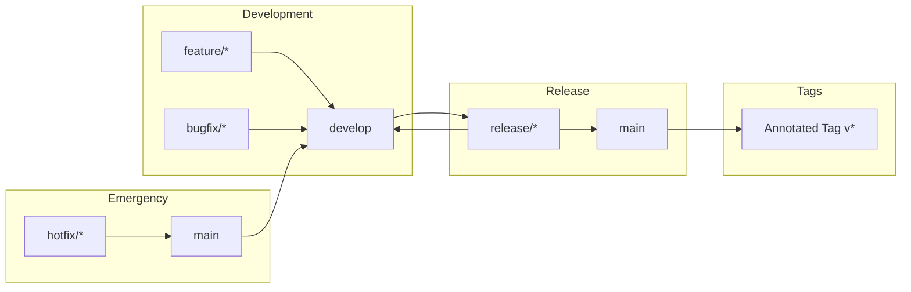

# Xennic Git Workflow

> **Canonical Version Control Standards**
> Version: 1.0.0 — Sprint K3.2
> Status: Living Document
> Primary Audience: All developers, CI/CD pipelines, and AI agents
> Cross-Reference: → docs/engineering-constitution/01-engineering-constitution.md §10 Review Policy, → docs/engineering-constitution/02-coding-standards.md

---

## Document Navigation

| Section | Content |
|---------|---------|
| **1** | Branch Strategy |
| **2** | Branch Naming |
| **3** | Commit Message Convention |
| **4** | Semantic Versioning |
| **5** | Tagging |
| **6** | Pull Request Rules |
| **7** | Merge Policy |
| **8** | Branch Protection |
| **9** | Review Approvals |
| **10** | Git Hooks |
| **11** | Conflict Resolution |
| **12** | Cherry-Pick Policy |
| **13** | Revert Policy |
| **14** | Monorepo Considerations |

---

## 1. Branch Strategy

### 1.1 Branch Hierarchy

```
main
  └── develop
        ├── feature/*      (branches from develop, merges to develop)
        ├── bugfix/*       (branches from develop, merges to develop)
        ├── release/*      (branches from develop, merges to main + develop)
        └── hotfix/*       (branches from main, merges to main + develop)
```

### 1.2 Branch Lifecycle



### 1.3 Branch Descriptions

| Branch | Source | Merge Target | Lifecycle | Purpose |
|--------|--------|-------------|-----------|---------|
| **main** | — | — | Permanent | Production code. Always deployable. Protected. |
| **develop** | main | — | Permanent | Integration branch for feature work. Always stable (passing CI). |
| **feature/*** | develop | develop | Temporary | New features. Deleted after merge. |
| **bugfix/*** | develop | develop | Temporary | Bug fixes on develop. Deleted after merge. |
| **release/*** | develop | main + develop | Temporary | Release preparation. Only bug fixes, no new features. |
| **hotfix/*** | main | main + develop | Temporary | Critical production fixes. Deleted after merge. |

### 1.4 Lifecycle Details

**feature/***:
1. Branch from `develop`
2. Work, commit, push regularly
3. Open PR against `develop` when ready
4. After review and CI pass, squash-merge to `develop`
5. Delete the feature branch

**release/***:
1. Branch from `develop` when ready for release
2. Only bug fixes, documentation, and release configuration changes
3. Bump version number
4. Open PR against `main`
5. Merge commit to `main`, then merge back to `develop`
6. Tag the release on `main`
7. Delete the release branch

**hotfix/***:
1. Branch from `main`
2. Fix the critical issue
3. Open PR against `main`
4. After review and CI pass, rebase-merge to `main`
5. Cherry-pick or merge back to `develop`
6. Tag the hotfix on `main`
7. Delete the hotfix branch

---

## 2. Branch Naming

### 2.1 Convention

**Format:** `type/description`

**Why:** Consistent branch naming enables automatic CI configuration, branch filtering, and clear intent at a glance.

**Rationale:** The `type/` prefix tells everyone what kind of work is on the branch. The description (kebab-case) tells everyone what specifically.

**Good Example:**
```
feature/knowledge-search
feature/document-upload-api
bugfix/login-redirect-loop
bugfix/null-pointer-calculation-result
hotfix/security-vulnerability-auth-bypass
hotfix/database-connection-leak
release/v2.1.0
release/v3.0.0-rc.1
```

**Bad Example:**
```
my-branch               // No type prefix — what is this?
fix-bug                 // Vague description — which bug?
feature_new_design      // Mixed separators — use forward slash
Feature/UserAuth        // PascalCase — use kebab-case
wip-stuff               // Not a real type, not descriptive
```

### 2.2 Accepted Types

| Type | Usage |
|------|-------|
| `feature/` | New features, enhancements |
| `bugfix/` | Bug fixes on develop |
| `hotfix/` | Critical fixes on production |
| `release/` | Release preparation |
| `refactor/` | Code restructuring (no behaviour change) |
| `docs/` | Documentation changes |
| `chore/` | Build, CI, dependency updates |
| `test/` | Adding or fixing tests |
| `perf/` | Performance improvements |

### 2.3 Branch Name Length

- Maximum: 80 characters
- Use abbreviations only if well-known (`auth` for authentication, `calc` for calculation)
- Include ticket number when available: `feature/XEN-1234-knowledge-search`

---

## 3. Commit Message Convention

### 3.1 Conventional Commits

**Statement:** ALL commits MUST follow the Conventional Commits specification:

```
<type>(<scope>): <description>

[optional body]

[optional footer(s)]
```

**Why:** Structured commit messages enable automated changelog generation, semantic version determination, and release note creation.

**Rationale:** Conventional Commits is the industry standard for structured commit messages. Tools like `standard-version` and `semantic-release` depend on this format.

**Good Example:**
```
feat(calculations): add voltage drop calculation endpoint

Implement the voltage drop calculation for electrical circuits.
Supports single-phase and three-phase systems with configurable
power factor and cable temperature.

Closes XEN-1234
```

**Bad Example:**
```
fixed bug
```

### 3.2 Allowed Types

| Type | Description | Version Impact |
|------|-------------|----------------|
| `feat` | New feature | MINOR |
| `fix` | Bug fix | PATCH |
| `docs` | Documentation only | PATCH |
| `style` | Formatting, whitespace | PATCH |
| `refactor` | Code restructuring | PATCH |
| `perf` | Performance improvement | PATCH |
| `test` | Adding/fixing tests | PATCH |
| `chore` | Build, CI, deps | PATCH |
| `security` | Security fix | PATCH or MAJOR |
| `BREAKING CHANGE` | Breaking API change | MAJOR |

### 3.3 Scope

**Scope** indicates the module, service, or area affected:

```
feat(calculations): add idempotency key support
fix(auth): handle token expiry gracefully
chore(deps): upgrade @nestjs/core to 10.3.0
```

### 3.4 Description Format

- Imperative mood ("add" not "added" or "adds")
- Lowercase after type(scope):
- No period at end of description line
- Max 72 characters for description
- Max 72 characters per line in body
- Wrap body at 72 characters

### 3.5 Breaking Changes

Breaking changes are flagged with `BREAKING CHANGE` in the footer or `!` after the type/scope:

```
feat(api)!: change calculation response format

BREAKING CHANGE: The calculation response now returns nested result
object instead of flat fields. Consumers must update their parsing.
```

### 3.6 Commit Granularity

- Each commit is a logical, atomic change
- Do not commit half-broken code
- Do not bundle unrelated changes in one commit
- Use `git add -p` for selective staging

---

## 4. Semantic Versioning

### 4.1 Version Format

**MAJOR.MINOR.PATCH** (SemVer 2.0.0):

| Component | Rule | Example |
|-----------|------|---------|
| **MAJOR** | Breaking changes | `2.0.0` |
| **MINOR** | New features, backward compatible | `1.3.0` |
| **PATCH** | Bug fixes, backward compatible | `1.0.1` |

### 4.2 Pre-release Tags

| Tag | Meaning | Stability |
|-----|---------|-----------|
| `-alpha.1` | Internal testing | Unstable |
| `-beta.1` | Feature-complete, testing | Unstable |
| `-rc.1` | Release candidate | Stable candidate |

### 4.3 What Constitutes a Breaking Change

- API endpoint removal or rename
- Request/response field removal or rename
- Making optional fields required
- Changing field types
- Event schema changes that break consumers
- Database column removal or rename
- Behaviour change of existing functionality

### 4.4 Monorepo Versioning

**Statement:** Each package in the monorepo is independently versioned. The root project version tracks the overall release.

**Why:** Independent versioning allows packages to evolve at their own pace without forcing version bumps on unrelated packages.

**Cross-Reference:** → §14 Monorepo Considerations

---

## 5. Tagging

### 5.1 Annotated Tags

**Statement:** ALL releases MUST use annotated tags (`git tag -a`). Lightweight tags are prohibited for releases.

**Why:** Annotated tags include author, date, and message. They are first-class git objects with full metadata.

**Rationale:** Lightweight tags are just pointers — they lack context. Annotated tags provide release information that remains with the tag.

**Good Example:**
```bash
git tag -a v1.2.0 -m "Release v1.2.0 — Add voltage drop calculation"
git push origin v1.2.0
```

**Bad Example:**
```bash
git tag v1.2.0
git push origin v1.2.0
```

### 5.2 Tag Naming

- Prefix with `v`: `v1.0.0`, `v2.1.0`, `v3.0.0-rc.1`
- Match semver exactly: `v{MAJOR}.{MINOR}.{PATCH}`
- Pre-release: `v1.0.0-beta.2`, `v2.0.0-rc.1`

### 5.3 Tag Signing

**Statement:** All release tags MUST be GPG-signed. Configure git to sign tags by default.

**Why:** Signed tags provide cryptographic verification that the release originated from an authorized developer.

**Good Example:**
```bash
git config --global tag.gpgsign true
git tag -s v1.2.0 -m "Release v1.2.0"
```

### 5.4 When to Tag

- Every release (including patch releases)
- Every release candidate
- Every hotfix

---

## 6. Pull Request Rules

### 6.1 PR Size Limits

**Statement:** PRs MUST NOT exceed 400 lines of changed code (excluding generated files, lockfiles, and test fixtures).

**Why:** Large PRs are hard to review, hide bugs, and delay the release process.

**Rationale:** Research shows that review effectiveness drops significantly above 400 lines. Break large changes into multiple PRs.

**Good Example:**
```
+150 lines — feature endpoint with tests
-30 lines  — removed dead code
= total 180 lines ✓
```

**Bad Example:**
```
+2,000 lines — entire feature with all changes
= total 2,000 lines ✗ — must be broken up
```

### 6.2 Required PR Description Template

Every PR MUST include:

```markdown
## Description
[Brief description of the change]

## Type
[feature | bugfix | hotfix | refactor | docs | chore]

## Related Issues
[Closes/Fixes/Refs XEN-XXXX]

## Testing
[How was this tested? Unit tests? Integration? Manual?]

## Checklist
- [ ] Code follows coding standards (→ docs/engineering-constitution/02-coding-standards.md)
- [ ] Tests added/updated
- [ ] Documentation updated
- [ ] No breaking changes (or ADR created for breaking changes)
- [ ] PR size ≤ 400 lines

## Screenshots (if applicable)
```

### 6.3 Linked Issues

**Statement:** Every feature and bugfix PR MUST link to a GitHub Issue. Use `Closes #123`, `Fixes #123`, or `Refs #123` in the PR description.

**Why:** Linked issues provide traceability from requirement to implementation. They enable automated changelog generation and release notes.

### 6.4 Draft PRs and WIP Convention

- Use Draft PRs for work-in-progress that needs early feedback
- Prefix PR title with `[WIP]` for additional visibility
- Convert to ready-for-review when complete

---

## 7. Merge Policy

### 7.1 Merge Strategy

| Branch Type | Merge Strategy | Why |
|-------------|----------------|-----|
| **feature/* → develop** | Squash merge | Clean history — one commit per feature |
| **bugfix/* → develop** | Squash merge | Clean history — one commit per fix |
| **release/* → main** | Merge commit | Preserves release context — shows the release branch |
| **release/* → develop** | Merge commit | Ensures release changes are merged back |
| **hotfix/* → main** | Rebase merge | Linear history — hotfixes are atomic |
| **hotfix/* → develop** | Merge commit or cherry-pick | Ensures hotfix is included in future releases |

**Why:** Different merge strategies optimise for different goals. Squash merges keep feature history clean. Merge commits preserve release context. Rebase merges keep hotfix history linear.

**Rationale:** `develop` should have linear, clean history (one commit per feature/fix). `main` should preserve release boundaries via merge commits.

### 7.2 No Fast-Forward

**Statement:** Fast-forward merges are disabled. All merges use `--no-ff` to preserve branch topology.

**Why:** Fast-forward merges lose branch context. `--no-ff` creates an explicit merge commit that shows when a feature was integrated.

**Good Example:**
```bash
git merge --no-ff feature/knowledge-search
# Creates merge commit preserving feature branch context
```

**Bad Example:**
```bash
git merge feature/knowledge-search
# Fast-forward — no merge commit, no context
```

### 7.3 PR Merge Flow

```mermaid
flowchart TD
    A[PR Approved + CI Passes] --> B{PR Type}
    
    B -->|Feature/Bugfix| C[Squash & Merge]
    C --> D[Commit message:\nfeat(scope): description (#PR)]
    D --> E[Delete Source Branch]
    
    B -->|Release| F[Merge Commit]
    F --> G[Create Merge Commit:\n'Merge release/vX.X.X into main']
    G --> E
    
    B -->|Hotfix| H[Rebase & Merge]
    H --> I[Rebase onto main, then merge]
    I --> J[Create Tag vX.X.X-hotfix.N]
    J --> E
```

---

## 8. Branch Protection

### 8.1 Protected Branches

| Branch | Protection Rules |
|--------|-----------------|
| **main** | No direct pushes. PR required. Required status checks. Required reviewers. Linear history. |
| **develop** | No direct pushes. PR required. Required status checks. Required reviewers. |

### 8.2 Required Checks (all branches)

Before any merge to `main` or `develop`:

1. **TypeScript type check**: `pnpm typecheck` passes
2. **Lint**: `pnpm lint` passes
3. **Format**: `pnpm format:check` passes
4. **Unit tests**: `pnpm test -- --coverage` passes with threshold
5. **Build**: `pnpm build` succeeds
6. **Security scan**: No critical/high vulnerabilities in new code

### 8.3 Required Reviewers

- **main**: At least 1 approval (2 for architecture changes)
- **develop**: At least 1 approval
- **release/***: At least 2 approvals (including 1 architect)
- **hotfix/***: At least 1 approval (can be post-merge)

### 8.4 Status Checks

- All CI status checks must pass before merge
- Outdated branches must be updated against the target branch before merge
- Stale branches (>30 days without activity) are flagged

### 8.5 Linear History

**Statement:** `main` MUST maintain a linear history. Merge commits are allowed only for release merges.

**Why:** Linear history makes `git bisect` effective, simplifies navigation, and keeps the commit graph readable.

---

## 9. Review Approvals

### 9.1 Approval Requirements

| Change Type | Min Approvals | Required Reviewers |
|-------------|---------------|-------------------|
| Standard feature/bugfix | 1 | Any team member |
| Cross-module change | 2 | Both module owners |
| Architecture change | 2 | 1 must be architect |
| Release branch | 2 | 1 must be architect/lead |
| Hotfix | 1 | Can be post-merge |
| Documentation | 0 | Self-approval (trivial) |
| CI/CD config | 1 | DevOps team member |

### 9.2 CODEOWNERS Auto-Request

**Statement:** CODEOWNERS (→ §11.1 Engineering Constitution) automatically request reviews from the relevant owners. Module owners MUST be requested for any PR touching their module.

**Why:** CODEOWNERS ensures the right people review changes affecting their area of responsibility.

### 9.3 Review Time Expectations

| Priority | Max Review Time |
|----------|----------------|
| P1 (hotfix) | 2 hours |
| P2 (bugfix) | 8 hours |
| Standard feature | 24 hours |
| Architecture change | 48 hours |

Reviews are expected within these timeframes. Reviewers who cannot meet the timeframe should decline or delegate.

---

## 10. Git Hooks

### 10.1 Pre-commit Hook

**Purpose:** Catch formatting and linting issues before they reach CI.

**Checks:**
- `pnpm format:check` — Code formatting
- `pnpm lint -- --quiet` — Linting violations (staged files only)
- No large files (>1MB staged)
- No secrets detected (via git-secrets)
- No `debugger` statements
- No `console.log` in source files

### 10.2 Commit-msg Hook

**Purpose:** Enforce Conventional Commits format.

**Checks:**
- Message matches pattern: `<type>(<scope>): <description>`
- Type is one of: `feat`, `fix`, `docs`, `style`, `refactor`, `perf`, `test`, `chore`, `security`
- Description is lowercase after type(scope):
- Max 72 characters for first line
- Body wrapped at 72 characters

### 10.3 Pre-push Hook

**Purpose:** Ensure code is tested before pushing.

**Checks:**
- `pnpm typecheck` — TypeScript strict mode passes
- `pnpm test -- --related` — Tests for changed files pass
- `pnpm build` — Build succeeds

### 10.4 Hook Installation

Hooks are managed via `husky` (TypeScript) and managed in `.husky/`:

```bash
# Install hooks
pnpm prepare  # Runs husky install

# Hook configuration
.husky/
├── pre-commit
├── commit-msg
└── pre-push
```

**Cross-Reference:** → `docs/engineering-constitution/02-coding-standards.md` §14 Logging (no console.log)

---

## 11. Conflict Resolution

### 11.1 Who Resolves

**Statement:** The PR author is responsible for resolving merge conflicts. The reviewer should not resolve conflicts on behalf of the author.

**Why:** The author understands both sides of the conflict best. Having the author resolve ensures the correct resolution.

### 11.2 Merge Strategy for Conflicts

1. Rebase the feature branch on the target branch
2. Resolve conflicts locally
3. Test the resolved code
4. Force-push to update the PR

**Good Example:**
```bash
git checkout feature/knowledge-search
git fetch origin develop
git rebase origin/develop
# Resolve conflicts
git add -A
git rebase --continue
git push --force-with-lease
```

### 11.3 Conflict Categories

| Conflict Type | Resolution Approach |
|---------------|-------------------|
| **Code conflicts** (same file changed) | Understand both changes, keep both if compatible, discuss with other author if not |
| **Schema conflicts** (Prisma changes) | Ensure migration order is correct, resolve field additions |
| **Dependency conflicts** (package.json) | Keep the newer version unless there is a known incompatibility |
| **Config conflicts** | Resolve based on environment intent, document the resolution |

### 11.4 Large Merge Conflicts

If a PR has large or complex merge conflicts:
1. Create a temporary branch from the target
2. Cherry-pick the feature commits onto it
3. Resolve conflicts incrementally
4. Replace the PR branch with the new one

---

## 12. Cherry-Pick Policy

### 12.1 When Cherry-Picking is Allowed

Cherry-picking is ALLOWED only in the following scenarios:

1. **Hotfix to develop**: A hotfix commit on `main` needs to be applied to `develop`
2. **Selective backport**: A bug fix in a newer version needs to be applied to an older release branch
3. **Single commit from feature branch**: Extracting a specific fix from a large feature branch

Cherry-picking is PROHIBITED for:
- Moving feature work between branches
- "Merging" by cherry-picking individual commits instead of using proper merge
- Creating release branches from cherry-picked commits

### 12.2 Tracking Cherry-Picked Commits

**Statement:** Every cherry-picked commit MUST include the original commit hash in its message body.

**Why:** Tracking enables traceability from the cherry-picked commit back to its origin.

**Good Example:**
```bash
git cherry-pick -x abc123def456
# Appends: (cherry picked from commit abc123def456)
```

### 12.3 Cherry-Pick Log

Maintain a `CHERRY_PICK_LOG.md` file tracking all cherry-picks:

```markdown
| Date | Original Commit | Target Branch | Reason |
|------|----------------|---------------|--------|
| 2026-06-15 | abc123def456 | develop | Hotfix port: auth token validation |
```

---

## 13. Revert Policy

### 13.1 When to Revert vs Fix Forward

**Revert when:**
- The change introduced a production bug that blocks other work
- The change has unintended side effects that are not quickly fixable
- The change violates architectural invariants
- The change introduces a security vulnerability

**Fix forward when:**
- The bug is small and can be fixed quickly
- The fix is less disruptive than a revert
- The revert would be more complex than the fix
- Multiple commits depend on the reverted change

### 13.2 Revert Commit Process

1. Create a revert PR (do not revert directly on main/develop)
2. Use `git revert <commit>` (not `git reset`) to create a revert commit
3. The revert commit message follows: `revert(scope): original description`
4. Include the reason for the revert in the PR description

**Good Example:**
```bash
git revert abc123def456
# Creates commit: revert(calculations): add voltage drop endpoint
# Body: This reverts commit abc123def456.
# Reason: Introduced regression in cable sizing calculations (XEN-5678)
```

### 13.3 Revert Safety

- Never use `git reset --hard` on shared branches
- `git revert` creates a new commit — it is safe for shared branches
- Verify the revert PR with the same review process as any other PR

---

## 14. Monorepo Considerations

### 14.1 Turborepo + pnpm Workspace

**Statement:** The monorepo uses pnpm workspaces with Turborepo for task orchestration. All cross-package operations go through Turborepo.

**Why:** Turborepo provides caching, parallel execution, and dependency graph awareness. pnpm workspaces provide efficient dependency management.

**Good Example:**
```bash
pnpm dev          # turbo run dev
pnpm build        # turbo run build
pnpm test         # turbo run test
pnpm lint         # turbo run lint
pnpm typecheck    # turbo run typecheck
```

### 14.2 Independent Versioning

**Statement:** Each package in the monorepo is independently versioned based on its own changes (→ §4.4). The root `package.json` version tracks the overall platform release.

**Why:** Independent versioning allows packages to evolve independently without forcing version bumps on unrelated packages.

### 14.3 Cross-Package Changes

**Statement:** Cross-package changes (changes that touch multiple packages) MUST be coordinated. The PR description MUST document the dependency relationship.

**Guidelines:**
- Prefer backward-compatible changes to avoid simultaneous releases
- Use the workspace protocol (`workspace:*`) for intra-monorepo dependencies
- Test across packages: `turbo run test --affected`
- Document the dependency graph in the PR

**Cross-Reference:** → `docs/reference-architecture/05-dependency-map.md`

### 14.4 pnpm Filtering

Use pnpm filters for targeted operations:

```bash
# Test only the API package
pnpm --filter @xennic/api test

# Build only changed packages
pnpm --filter="[origin/main]" build

# Run lint on all packages
pnpm -r lint
```

### 14.5 Workspace Configuration

```yaml
# pnpm-workspace.yaml
packages:
  - 'apps/*'
  - 'packages/*'
  - 'services/*'
  - 'workspace/*'
```

---

## Appendix A: Quick Reference

### Daily Workflow

```bash
# Start a feature
git checkout develop
git pull origin develop
git checkout -b feature/knowledge-search

# Work and commit
git add -A
git commit -m "feat(search): add knowledge search endpoint"

# Push and create PR
git push -u origin feature/knowledge-search
# Open PR on GitHub → fill template → request review

# After PR approval and merge
git checkout develop
git pull origin develop
git branch -d feature/knowledge-search
```

### Emergency Hotfix

```bash
git checkout main
git pull origin main
git checkout -b hotfix/auth-bypass

# Fix and commit
git add -A
git commit -m "fix(auth): validate JWT signature on every request"

# Push, PR, review
git push -u origin hotfix/auth-bypass

# After merge, cleanup
git checkout main
git pull origin main
git branch -d hotfix/auth-bypass
git tag -a v2.0.1 -m "Hotfix v2.0.1 — auth bypass fix"
git push origin v2.0.1
```

### Commit Message Examples

```
feat(calculations): add voltage drop calculation
fix(auth): handle expired JWT gracefully
docs(api): update calculation endpoint documentation
refactor(prisma): extract shared query filters
test(calculations): add integration tests for voltage drop
chore(deps): upgrade @nestjs/core to 10.3.0
security: sanitize user input in search endpoint
perf(api): add Redis caching for reference data
```

---

## Appendix B: Revision History

| Version | Date | Author | Changes |
|---------|------|--------|---------|
| 1.0.0 | Tir 1405 | Core Engineering | Initial git workflow |
