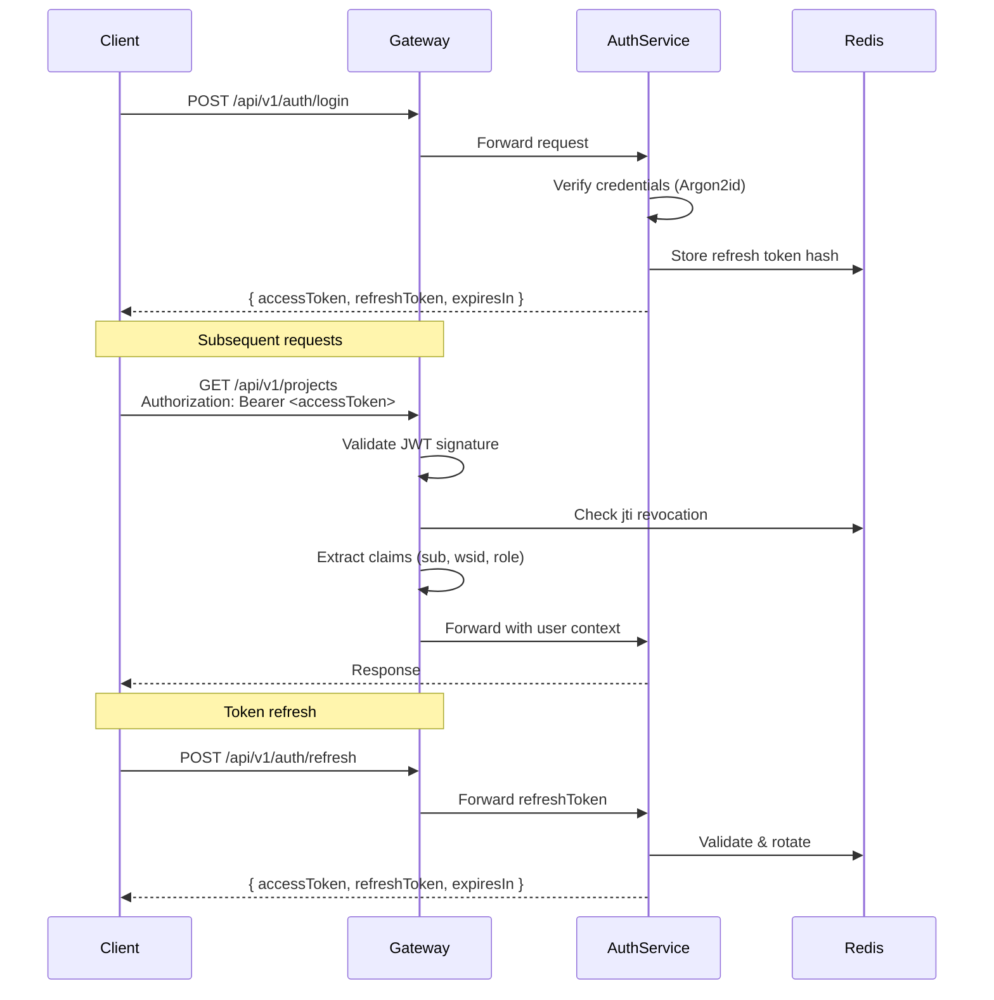
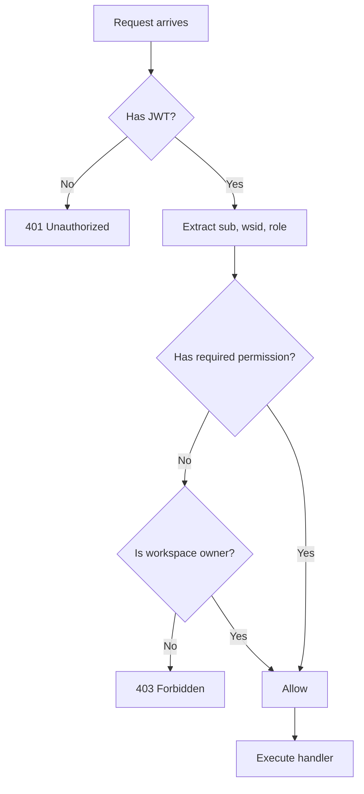
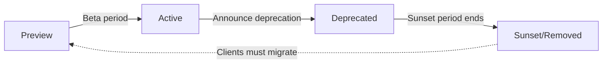
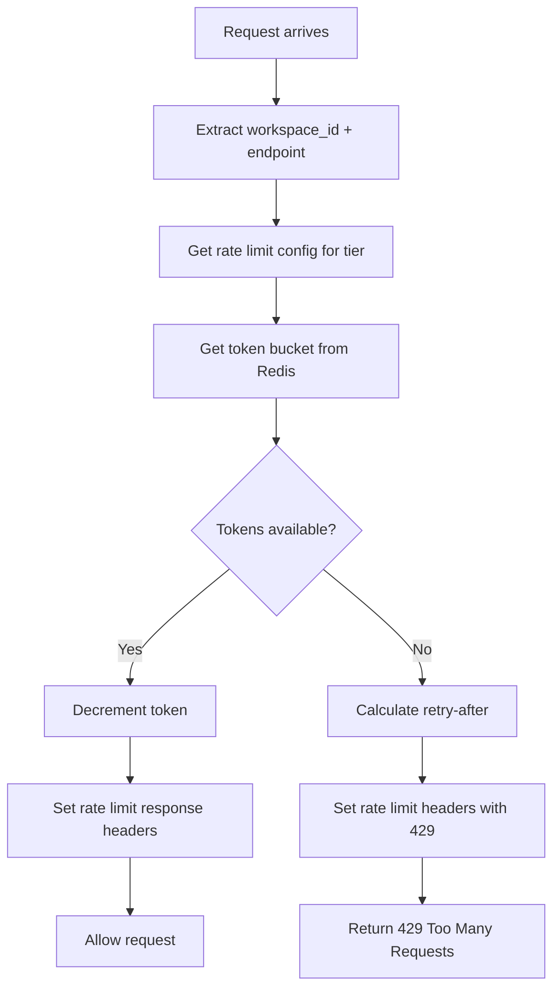
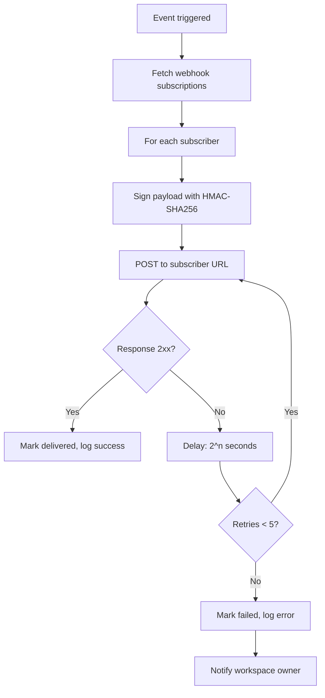

# 4. API Standards

> **Cross-References**: → docs/reference-architecture/03-data-flow.md, → docs/reference-architecture/04-domain-map.md, → docs/engineering-constitution/02-coding-standards.md, → docs/engineering-constitution/06-security-standards.md
>
> **Status**: Adopted · **Version**: 1.0.0 · **Last Updated**: 2026-06-26

---

## Table of Contents

1. [REST Conventions](#1-rest-conventions)
2. [Authentication](#2-authentication)
3. [Authorization](#3-authorization)
4. [Pagination](#4-pagination)
5. [Filtering](#5-filtering)
6. [Sorting](#6-sorting)
7. [Validation](#7-validation)
8. [Error Codes](#8-error-codes)
9. [HTTP Status Usage](#9-http-status-usage)
10. [OpenAPI](#10-openapi)
11. [Versioning](#11-versioning)
12. [Idempotency](#12-idempotency)
13. [Rate Limiting](#13-rate-limiting)
14. [Retry & Timeouts](#14-retry--timeouts)
15. [Correlation IDs](#15-correlation-ids)
16. [Tracing](#16-tracing)
17. [Webhooks](#17-webhooks)
18. [Response Envelope](#18-response-envelope)
19. [API Changelog](#19-api-changelog)

---

## 1. REST Conventions

### WHY

Consistent REST conventions reduce cognitive load, enable predictable API exploration, and ensure that every consumer — frontend, SDK, integration partner, or AI agent — can reason about the API without reading endpoint-specific documentation. A uniform resource model maps directly to the domain map (→ docs/reference-architecture/04-domain-map.md).

### RATIONALE

REST is our primary API style. Resources map to domain entities (projects, users, calculations, knowledge articles). URL structure reflects resource hierarchy. Actions on resources use HTTP methods, not verbs in URLs. HATEOAS (Hypermedia as the Engine of Application State) is not required — our clients are not generic hypermedia consumers — but resource URLs MUST be deterministic and self-describing.

### Resource Naming

| Rule | Standard | Example |
|------|----------|---------|
| Plural nouns | Always plural | `/api/v1/projects`, `/api/v1/users` |
| Kebab-case | Hyphen-separated lowercase | `/api/v1/engineering-standards`, `/api/v1/knowledge-articles` |
| No verbs | Use HTTP methods | `POST /calculations` NOT `POST /calculate` |
| No underscores | Hyphens only | `/api/v1/workspace-members` NOT `/api/v1/workspace_members` |
| No file extensions | No `.json`, `.xml` | `/api/v1/projects/123` NOT `/api/v1/projects/123.json` |
| No trailing slashes | No trailing `/` | `/api/v1/projects` NOT `/api/v1/projects/` |

### URL Hierarchy

Resources are nested to reflect ownership:

```
/api/v1/workspaces/{workspaceId}/projects
/api/v1/workspaces/{workspaceId}/projects/{projectId}/notes
/api/v1/workspaces/{workspaceId}/members
/api/v1/users/{userId}/sessions
```

Top-level resources exist for globally addressable entities:

```
/api/v1/users
/api/v1/roles
/api/v1/permissions
/api/v1/engineering-standards
```

### Action Mapping

| HTTP Method | Action | Idempotent | Safe |
|-------------|--------|------------|------|
| `GET` | Retrieve resource(s) | Yes | Yes |
| `POST` | Create resource | No | No |
| `PUT` | Full replace | Yes | No |
| `PATCH` | Partial update | No | No |
| `DELETE` | Remove resource | Yes | No |

### HATEOAS

**Statement:** HATEOAS is NOT required. Our API consumers are documented, registered clients — not generic hypermedia browsers. However, collection responses MAY include a `links` object for pagination navigation (self, next, prev, first, last).

**GOOD example:**
```http
GET /api/v1/projects?cursor=eyJpZCI6IjEyMyJ9&limit=20
Response:
{
  "success": true,
  "data": [...],
  "meta": {
    "cursor": "eyJpZCI6IjEyMyJ9",
    "hasMore": true,
    "links": {
      "self": "/api/v1/projects?cursor=eyJpZCI6IjEyMyJ9&limit=20",
      "next": "/api/v1/projects?cursor=eyJpZCI6IjI0NSJ9&limit=20"
    }
  }
}
```

**BAD example:**
```http
GET /api/v1/getProjects
POST /api/v1/createNewProject
POST /api/v1/deleteProject/123
```

**BAD example:**
```http
GET /api/v1/projects_list
GET /api/v1/projects/
GET /api/v1/ProjectList
```

---

## 2. Authentication

### WHY

Authentication is the first line of defense. Every request to the API must be authenticated unless explicitly documented as public (e.g., health checks, login, registration, password reset). Consistent authentication ensures that identity is established before any authorization or business logic executes.

### RATIONALE

We use JWT Bearer tokens for user authentication and API keys for service-to-service communication. JWTs are stateless, self-contained, and enable workspace context to travel with the request. API keys provide a simpler credential model for automated integrations. The flow follows the data flow documented in → docs/reference-architecture/03-data-flow.md.

### JWT Bearer Token

All authenticated user requests MUST include:

```
Authorization: Bearer <token>
```

#### Token Format

| Claim | Type | Description |
|-------|------|-------------|
| `sub` | `string` (UUID) | User ID |
| `wsid` | `string` (UUID) | Active workspace ID |
| `role` | `string` | Highest role in workspace |
| `iat` | `number` | Issued at (Unix epoch seconds) |
| `exp` | `number` | Expiration (Unix epoch seconds) |
| `jti` | `string` (UUID) | Unique token ID (for revocation) |
| `iss` | `string` | Issuer: `xennic-api` |

#### Token Validation

1. Validate signature against the public key (RS256)
2. Check `exp` — reject if expired
3. Check `jti` against revocation list (Redis sorted set)
4. Extract `sub`, `wsid`, `role` for downstream use
5. Refresh token rotation: issue new access + refresh pair when access token is within 5 minutes of expiry

### API Key (Service-to-Service)

Service-to-service requests MUST use:

```
X-API-Key: <api_key>
```

| Property | Standard |
|----------|----------|
| Header | `X-API-Key` |
| Format | `xenn_` prefix + 48 chars (base62) |
| Storage | SHA-256 hash in `api_keys` table |
| Rotation | Every 90 days |
| Scope | Limited to specific service(s) |

### Authentication Flow



**GOOD example:**
```typescript
// apps/api/src/auth/guards/jwt-auth.guard.ts
@Injectable()
export class JwtAuthGuard implements CanActivate {
  constructor(
    private readonly jwtService: JwtService,
    private readonly redisService: RedisService,
  ) {}

  async canActivate(context: ExecutionContext): Promise<boolean> {
    const request = context.switchToHttp().getRequest<FastifyRequest>();
    const token = this.extractToken(request);

    if (!token) throw new UnauthorizedException('Missing authentication token');

    try {
      const payload = await this.jwtService.verifyAsync(token, {
        publicKey: this.config.get('jwt.publicKey'),
        algorithms: ['RS256'],
      });

      const revoked = await this.redisService.sismember(
        `revoked_tokens`,
        payload.jti,
      );
      if (revoked) throw new UnauthorizedException('Token revoked');

      request.user = payload;
      return true;
    } catch (err) {
      throw new UnauthorizedException('Invalid or expired token');
    }
  }

  private extractToken(request: FastifyRequest): string | null {
    const auth = request.headers.authorization;
    if (!auth?.startsWith('Bearer ')) return null;
    return auth.slice(7);
  }
}
```

**BAD example:**
```typescript
// Passing tokens in query strings
GET /api/v1/projects?token=eyJhbGci...
```

**BAD example:**
```typescript
// Session cookies (not used in our stack)
// Storing secrets in JWT payload
```

---

## 3. Authorization

### WHY

Authentication establishes identity; authorization establishes permission. Every endpoint must verify that the authenticated principal has the right to perform the requested action on the requested resource. Missing or broken authorization is the #1 source of security vulnerabilities in web APIs (OWASP A01).

### RATIONALE

Authorization is implemented as a layered guard pipeline at the controller/route level. Guards are composable, testable, and follow the NestJS execution model. The workspace context (`wsid` claim from JWT) is the primary isolation boundary. RBAC (Role-Based Access Control) evaluates permissions against the user's assigned roles within the active workspace.

### Permission Evaluation



### RBAC Evaluation Algorithm

```
function evaluatePermission(userId, workspaceId, requiredPermission):
    1. Get user_roles for userId + workspaceId
    2. If no roles found → return DENIED
    3. Find highest role (hierarchy: ADMIN > EDITOR > MEMBER > VIEWER)
    4. Get role_permissions for that role
    5. If requiredPermission in role_permissions → return ALLOWED
    6. If user is workspace_owner → return ALLOWED
    7. Return DENIED
```

### Guard Implementation

**GOOD example:**
```typescript
// apps/api/src/common/guards/roles.guard.ts
@Injectable()
export class RolesGuard implements CanActivate {
  constructor(
    private readonly reflector: Reflector,
    private readonly permissionService: PermissionService,
  ) {}

  async canActivate(context: ExecutionContext): Promise<boolean> {
    const requiredPermissions = this.reflector.getAllAndOverride<string[]>(
      PERMISSIONS_KEY,
      [context.getHandler(), context.getClass()],
    );

    if (!requiredPermissions?.length) return true;

    const { user, params } = context.switchToHttp().getRequest();
    const workspaceId = params.workspaceId || user.wsid;

    for (const permission of requiredPermissions) {
      const allowed = await this.permissionService.evaluate(
        user.sub,
        workspaceId,
        permission,
      );
      if (!allowed) return false;
    }

    return true;
  }
}
```

**BAD example:**
```typescript
// Authorization logic embedded in controller handler
@Get('projects/:id')
async getProject(@Param('id') id: string, @Req() req) {
  if (req.user.role !== 'ADMIN') {
    throw new ForbiddenException();
  }
  // ... business logic
}
```

**BAD example:**
```typescript
// No authorization check at all
@Get('projects/:id')
async getProject(@Param('id') id: string) {
  return this.projectService.findById(id);
}
```

---

## 4. Pagination

### WHY

APIs return collections. Without pagination, a single request could return tens of thousands of records, causing memory exhaustion on both server and client, network timeouts, and poor UX. Pagination is mandatory on all list endpoints.

### RATIONALE

We use cursor-based pagination for user-facing list endpoints because it is stable under live data changes (new records don't shift pages). Offset-based pagination is acceptable for admin/internal endpoints where data is stable or the user needs to jump to arbitrary pages.

### Cursor-Based Pagination (Default)

| Parameter | Type | Default | Description |
|-----------|------|---------|-------------|
| `cursor` | `string` | `null` | Base64-encoded opaque cursor returned from previous response |
| `limit` | `integer` | `20` | Maximum items to return (1-100) |

#### Cursor Format

```typescript
// Encode
const cursor = Buffer.from(JSON.stringify({ id: 'uuid-here', createdAt: '2026-06-01T00:00:00Z' })).toString('base64');

// Decode
const decoded = JSON.parse(Buffer.from(cursor, 'base64').toString('utf-8'));
```

#### Response Metadata

```json
{
  "success": true,
  "data": [...],
  "meta": {
    "cursor": "eyJpZCI6IjEyMyJ9",
    "hasMore": true,
    "links": {
      "self": "/api/v1/projects?cursor=eyJpZCI6IjEyMyJ9&limit=20",
      "next": "/api/v1/projects?cursor=eyJpZCI6IjI0NSJ9&limit=20"
    }
  }
}
```

### Offset-Based Pagination (Admin)

| Parameter | Type | Default | Description |
|-----------|------|---------|-------------|
| `offset` | `integer` | `0` | Number of records to skip |
| `limit` | `integer` | `20` | Maximum items to return (1-100) |
| `total` | `integer` | - | Total record count (in meta) |

```json
{
  "success": true,
  "data": [...],
  "meta": {
    "offset": 0,
    "limit": 20,
    "total": 143,
    "pages": 8
  }
}
```

**GOOD example:**
```typescript
@Get()
@UsePipes(new JoiValidationPipe(cursorPaginationSchema))
async findAll(@Query() query: CursorPaginationDto) {
  return this.projectService.findAllPaginated(query);
}
```

**BAD example:**
```http
GET /api/v1/projects?page=1&size=20
```

**BAD example:**
```http
GET /api/v1/projects (returns ALL records)
```

---

## 5. Filtering

### WHY

Clients need to narrow result sets by specific criteria. Ad-hoc filtering leads to inconsistent query parameter names, injection vulnerabilities, and unpredictable performance. A standardized filter convention enables safe, efficient, and predictable querying.

### RATIONALE

Filters use query parameters with a structured naming convention. Each filterable field can be combined with an operator. Multiple filters are AND-combined. All filter values MUST be validated and sanitized.

### Query Parameter Convention

```
GET /api/v1/projects?filter[status]=eq:active&filter[createdAt]=gte:2026-01-01
```

Format: `filter[{field}]={operator}:{value}`

### Filter Operators

| Operator | Description | Example |
|----------|-------------|---------|
| `eq` | Equals | `filter[status]=eq:active` |
| `neq` | Not equals | `filter[status]=neq:archived` |
| `gt` | Greater than | `filter[amount]=gt:1000` |
| `gte` | Greater than or equal | `filter[createdAt]=gte:2026-01-01` |
| `lt` | Less than | `filter[amount]=lt:5000` |
| `lte` | Less than or equal | `filter[createdAt]=lte:2026-06-01` |
| `in` | In list | `filter[status]=in:active,pending,draft` |
| `contains` | String contains | `filter[name]=contains:transformer` |
| `startsWith` | String starts with | `filter[code]=startsWith:ENG-` |
| `endsWith` | String ends with | `filter[email]=endsWith:@xennic.com` |

### Compound Filters

Multiple filters are AND-combined. OR semantics require a `filterGroup` parameter:

```
# AND
GET /api/v1/projects?filter[status]=eq:active&filter[workspaceId]=eq:ws-123

# OR (groups)
GET /api/v1/projects?filterGroup[0][status]=eq:active&filterGroup[1][status]=eq:pending
```

### Filter Validation

**GOOD example:**
```typescript
@Injectable()
export class FilterValidationPipe implements PipeTransform {
  private readonly ALLOWED_OPERATORS = ['eq', 'neq', 'gt', 'gte', 'lt', 'lte', 'in', 'contains', 'startsWith', 'endsWith'];
  private readonly FILTERABLE_FIELDS: Record<string, 'string' | 'number' | 'date' | 'boolean'> = {
    status: 'string',
    createdAt: 'date',
    amount: 'number',
    isActive: 'boolean',
  };

  transform(value: Record<string, string>) {
    for (const [key, filterStr] of Object.entries(value)) {
      if (!key.startsWith('filter[')) continue;
      const field = key.match(/filter\[(.+?)\]/)?.[1];
      if (!field || !this.FILTERABLE_FIELDS[field]) {
        throw new BadRequestException(`Invalid filter field: ${field}`);
      }
      const [operator, ...valParts] = filterStr.split(':');
      if (!this.ALLOWED_OPERATORS.includes(operator)) {
        throw new BadRequestException(`Invalid filter operator: ${operator}`);
      }
    }
    return value;
  }
}
```

**BAD example:**
```http
GET /api/v1/projects?status=active&name_like=%transformer%
```

**BAD example:**
```http
GET /api/v1/projects?q=active
```

**BAD example:**
```http
GET /api/v1/projects?where[status]=active
```

---

## 6. Sorting

### WHY

Clients need to control the order of results. Standardized sort parameters prevent ad-hoc sorting conventions, SQL injection via ORDER BY clauses, and unpredictable default ordering.

### RATIONALE

Sort uses a single `sort` query parameter with `field:direction` format. Only fields on the endpoint's sort whitelist are accepted. Default sort is by `createdAt:desc` unless otherwise specified.

### Convention

```
GET /api/v1/projects?sort=createdAt:desc
GET /api/v1/projects?sort=name:asc,createdAt:desc
```

| Parameter | Values | Description |
|-----------|--------|-------------|
| `sort` | `field:direction` | Single or comma-separated multi-field sort |

| Direction | Effect |
|-----------|--------|
| `asc` | Ascending (A-Z, 0-9, oldest first) |
| `desc` | Descending (Z-A, 9-0, newest first) |

### Sort Whitelist

Each endpoint MUST define which fields are sortable:

```typescript
const SORT_WHITELIST = ['name', 'createdAt', 'updatedAt', 'status', 'priority'];

@Get()
async findAll(@Query('sort') sort?: string) {
  const sortClauses = this.parseSort(sort, SORT_WHITELIST);
  return this.projectService.findAll({ sort: sortClauses });
}
```

### Multi-Field Sort

```
GET /api/v1/projects?sort=status:asc,createdAt:desc
```

This sorts by status ascending, then by creation date descending within the same status.

**GOOD example:**
```typescript
parseSort(sort: string | undefined, whitelist: string[]): SortClause[] {
  if (!sort) return [{ field: 'createdAt', direction: 'desc' }];

  return sort.split(',').map((clause) => {
    const [field, direction] = clause.split(':');
    if (!whitelist.includes(field)) {
      throw new BadRequestException(`Cannot sort by field: ${field}`);
    }
    if (direction !== 'asc' && direction !== 'desc') {
      throw new BadRequestException(`Invalid sort direction: ${direction}`);
    }
    return { field, direction } as SortClause;
  });
}
```

**BAD example:**
```http
GET /api/v1/projects?_sort=name&_order=asc
```

**BAD example:**
```http
GET /api/v1/projects?orderBy=name+ASC
```

**BAD example:**
```http
GET /api/v1/projects?sort=passwordHash:desc (field not in whitelist)
```

---

## 7. Validation

### WHY

Input validation is the primary defense against injection attacks, malformed data, and business rule violations. Rejecting invalid input early prevents cascading failures, data corruption, and silent errors.

### RATIONALE

We use NestJS `ValidationPipe` with specific configuration options. Class-validator decorators on DTOs define validation rules. Custom validators encapsulate domain-specific rules. Transformation (string-to-number, string-to-date) is applied by the built-in `transform: true` option.

### ValidationPipe Configuration

```typescript
// apps/api/src/main.ts
app.useGlobalPipes(
  new ValidationPipe({
    whitelist: true,             // Strip unknown properties
    forbidNonWhitelisted: true,  // Throw error on unknown properties
    transform: true,             // Auto-transform types (string -> number, etc.)
    transformOptions: {
      enableImplicitConversion: false, // Explicit @Type() decorators required
    },
    exceptionFactory: (errors) => {
      return new UnprocessableEntityException({
        success: false,
        error: {
          code: 'API_VALIDATION_ERROR',
          message: 'Validation failed',
          details: errors.map((e) => ({
            field: e.property,
            constraints: e.constraints,
            value: e.value,
          })),
        },
      });
    },
  }),
);
```

### DTO Example

**GOOD example:**
```typescript
// apps/api/src/projects/dto/create-project.dto.ts
export class CreateProjectDto {
  @IsString()
  @IsNotEmpty()
  @MaxLength(256)
  name: string;

  @IsOptional()
  @IsString()
  @MaxLength(2000)
  description?: string;

  @IsOptional()
  @IsEnum(ProjectStatus)
  status?: ProjectStatus;

  @IsOptional()
  @Type(() => Date)
  @IsDate()
  startDate?: Date;

  @IsOptional()
  @Type(() => Date)
  @IsDate()
  endDate?: Date;
}
```

### Custom Validation Decorator

```typescript
// apps/api/src/common/decorators/validators/is-slug.decorator.ts
@ValidatorConstraint({ name: 'isSlug', async: false })
export class IsSlugConstraint implements ValidatorConstraintInterface {
  validate(value: string): boolean {
    return /^[a-z0-9]+(?:-[a-z0-9]+)*$/.test(value);
  }

  defaultMessage(): string {
    return 'Value ($value) is not a valid slug (lowercase, hyphens only)';
  }
}

export const IsSlug = (validationOptions?: ValidationOptions) =>
  (object: object, propertyName: string) =>
    registerDecorator({
      target: object.constructor,
      propertyName,
      options: validationOptions,
      constraints: [],
      validator: IsSlugConstraint,
    });
```

### Validation Error Format

```json
{
  "success": false,
  "error": {
    "code": "API_VALIDATION_ERROR",
    "message": "Validation failed",
    "details": [
      {
        "field": "email",
        "constraints": {
          "isEmail": "email must be a valid email address"
        },
        "value": "not-an-email"
      },
      {
        "field": "age",
        "constraints": {
          "isInt": "age must be an integer",
          "min": "age must not be less than 18"
        },
        "value": "15"
      }
    ]
  }
}
```

**BAD example:**
```typescript
// No validation — accepting anything
@Post()
async create(@Body() body: any) {
  return this.service.create(body);
}
```

**BAD example:**
```typescript
// Inline validation in controller
@Post()
async create(@Body() body: any) {
  if (!body.name || body.name.length > 256) {
    throw new BadRequestException('Name is required and must be less than 256 chars');
  }
  // ...
}
```

---

## 8. Error Codes

### WHY

Error codes provide a machine-readable identifier for every possible error condition. Consumers can write deterministic error-handling logic without parsing human-readable messages. Error codes enable automated monitoring, alerting, and post-mortem analysis.

### RATIONALE

Codes are organized by module prefix. Each code is a unique string constant. Codes are returned in the `error.code` field of the response envelope. This catalog MUST be kept in sync with actual implementation.

### Error Code Catalog

#### AUTH_* — Authentication & Authorization

| Code | HTTP Status | Description |
|------|-------------|-------------|
| `AUTH_INVALID_CREDENTIALS` | 401 | Email or password is incorrect |
| `AUTH_TOKEN_EXPIRED` | 401 | Access token has expired |
| `AUTH_TOKEN_INVALID` | 401 | Access token is malformed or tampered |
| `AUTH_TOKEN_REVOKED` | 401 | Token has been revoked |
| `AUTH_REFRESH_TOKEN_EXPIRED` | 401 | Refresh token has expired |
| `AUTH_REFRESH_TOKEN_INVALID` | 401 | Refresh token is invalid |
| `AUTH_MFA_REQUIRED` | 401 | Multi-factor authentication challenge required |
| `AUTH_MFA_INVALID` | 401 | MFA code is incorrect |
| `AUTH_SESSION_EXPIRED` | 401 | Session has expired |
| `AUTH_ACCOUNT_LOCKED` | 423 | Account locked due to too many attempts |

#### USR_* — User Management

| Code | HTTP Status | Description |
|------|-------------|-------------|
| `USR_NOT_FOUND` | 404 | User not found |
| `USR_EMAIL_ALREADY_EXISTS` | 409 | Email is already registered |
| `USR_PHONE_ALREADY_EXISTS` | 409 | Phone number is already registered |
| `USR_INACTIVE` | 403 | User account is deactivated |
| `USR_EMAIL_NOT_VERIFIED` | 403 | Email address not verified |
| `USR_PASSWORD_WEAK` | 422 | Password does not meet strength requirements |
| `USR_PASSWORD_MISMATCH` | 400 | Current password does not match |

#### WS_* — Workspace

| Code | HTTP Status | Description |
|------|-------------|-------------|
| `WS_NOT_FOUND` | 404 | Workspace not found |
| `WS_ACCESS_DENIED` | 403 | User does not have access to this workspace |
| `WS_MEMBER_EXISTS` | 409 | User is already a member of this workspace |
| `WS_INVITATION_EXPIRED` | 410 | Workspace invitation has expired |
| `WS_INVITATION_INVALID` | 400 | Invitation token is invalid |
| `WS_LIMIT_REACHED` | 403 | Workspace member limit reached for the plan |

#### PRJ_* — Project

| Code | HTTP Status | Description |
|------|-------------|-------------|
| `PRJ_NOT_FOUND` | 404 | Project not found |
| `PRJ_ACCESS_DENIED` | 403 | User does not have access to this project |
| `PRJ_MEMBER_EXISTS` | 409 | User is already a project member |
| `PRJ_INVALID_STATUS` | 422 | Invalid project status transition |

#### ENG_* — Engineering

| Code | HTTP Status | Description |
|------|-------------|-------------|
| `ENG_CALCULATION_FAILED` | 422 | Engineering calculation execution failed |
| `ENG_INVALID_INPUT` | 422 | Calculation input does not match expected schema |
| `ENG_STANDARD_NOT_FOUND` | 404 | Engineering standard not found |
| `ENG_STANDARD_VERSION_MISMATCH` | 409 | Calculation uses an outdated standard version |

#### KNW_* — Knowledge

| Code | HTTP Status | Description |
|------|-------------|-------------|
| `KNW_NOT_FOUND` | 404 | Knowledge article not found |
| `KNW_ACCESS_DENIED` | 403 | User does not have access to this knowledge article |
| `KNW_SLUG_CONFLICT` | 409 | Knowledge article slug already exists |
| `KNW_INVALID_STATUS` | 422 | Invalid knowledge workflow status transition |
| `KNW_REVIEW_REQUIRED` | 422 | Knowledge article requires review before publishing |
| `KNW_VERSION_CONFLICT` | 409 | Concurrent version update detected |

#### AI_* — AI Service

| Code | HTTP Status | Description |
|------|-------------|-------------|
| `AI_SERVICE_UNAVAILABLE` | 503 | AI service is temporarily unavailable |
| `AI_QUOTA_EXCEEDED` | 429 | AI usage quota exceeded for this workspace |
| `AI_CONTENT_FILTERED` | 422 | AI-generated content was filtered by safety policy |
| `AI_TOKEN_LIMIT_EXCEEDED` | 422 | Input exceeds maximum token limit |
| `AI_PROCESSING_ERROR` | 500 | AI processing encountered an internal error |

#### VIS_* — Vision/OCR

| Code | HTTP Status | Description |
|------|-------------|-------------|
| `VIS_PROCESSING_FAILED` | 422 | Image processing or OCR extraction failed |
| `VIS_UNSUPPORTED_FORMAT` | 415 | Image format is not supported |
| `VIS_IMAGE_TOO_LARGE` | 413 | Image exceeds maximum file size |
| `VIS_LOW_QUALITY` | 422 | Image quality is insufficient for reliable OCR |
| `VIS_NO_TEXT_DETECTED` | 422 | No text could be detected in the image |

#### STR_* — Storage

| Code | HTTP Status | Description |
|------|-------------|-------------|
| `STR_FILE_NOT_FOUND` | 404 | File not found |
| `STR_UPLOAD_FAILED` | 500 | File upload failed |
| `STR_FILE_TOO_LARGE` | 413 | File exceeds maximum upload size |
| `STR_INVALID_MIME_TYPE` | 415 | File MIME type is not accepted |
| `STR_CHECKSUM_MISMATCH` | 400 | Uploaded file checksum does not match |

#### MKT_* — Marketplace

| Code | HTTP Status | Description |
|------|-------------|-------------|
| `MKT_PRODUCT_NOT_FOUND` | 404 | Product not found |
| `MKT_VENDOR_NOT_FOUND` | 404 | Vendor not found |
| `MKT_INSUFFICIENT_STOCK` | 409 | Insufficient product stock |
| `MKT_ORDER_INVALID_STATUS` | 422 | Invalid order status transition |
| `MKT_PRICE_MISMATCH` | 409 | Product price has changed since added to cart |

#### BLL_* — Billing

| Code | HTTP Status | Description |
|------|-------------|-------------|
| `BLL_INVOICE_NOT_FOUND` | 404 | Invoice not found |
| `BLL_PAYMENT_FAILED` | 422 | Payment processing failed |
| `BLL_PAYMENT_DECLINED` | 402 | Payment was declined by the gateway |
| `BLL_SUBSCRIPTION_EXPIRED` | 410 | Subscription has expired |
| `BLL_INSUFFICIENT_BALANCE` | 402 | Insufficient account balance |

#### NOT_* — Notifications

| Code | HTTP Status | Description |
|------|-------------|-------------|
| `NOT_SEND_FAILED` | 500 | Failed to send notification |
| `NOT_CHANNEL_UNAVAILABLE` | 503 | Notification channel is unavailable |
| `NOT_TEMPLATE_NOT_FOUND` | 404 | Notification template not found |

#### SRCH_* — Search

| Code | HTTP Status | Description |
|------|-------------|-------------|
| `SRCH_INDEX_NOT_FOUND` | 404 | Search index not found |
| `SRCH_QUERY_INVALID` | 400 | Search query is invalid or empty |
| `SRCH_SERVICE_UNAVAILABLE` | 503 | Search service (Qdrant) is unavailable |

#### ADMIN_* — Admin

| Code | HTTP Status | Description |
|------|-------------|-------------|
| `ADMIN_ACCESS_DENIED` | 403 | User is not an admin |
| `ADMIN_ACTION_NOT_ALLOWED` | 403 | Admin action is not permitted in current state |
| `ADMIN_SYSTEM_SETTING_INVALID` | 422 | System setting key or value is invalid |

#### API_* — API Infrastructure

| Code | HTTP Status | Description |
|------|-------------|-------------|
| `API_RATE_LIMIT_EXCEEDED` | 429 | Too many requests — rate limit exceeded |
| `API_ENDPOINT_NOT_FOUND` | 404 | The requested endpoint does not exist |
| `API_METHOD_NOT_ALLOWED` | 405 | HTTP method not allowed on this endpoint |
| `API_INVALID_CONTENT_TYPE` | 415 | Content-Type header is invalid |
| `API_HEADER_MISSING` | 400 | Required header is missing |
| `API_VERSION_DEPRECATED` | 410 | API version is deprecated and no longer supported |

#### COMMON_* — Common

| Code | HTTP Status | Description |
|------|-------------|-------------|
| `COMMON_INTERNAL_ERROR` | 500 | An unexpected internal error occurred |
| `COMMON_SERVICE_UNAVAILABLE` | 503 | A downstream service is unavailable |
| `COMMON_DATABASE_ERROR` | 500 | A database operation failed |
| `COMMON_TIMEOUT` | 504 | Request timed out |
| `COMMON_NOT_IMPLEMENTED` | 501 | The requested feature is not yet implemented |
| `COMMON_CONCURRENT_MODIFICATION` | 409 | Resource was modified by another request |

**GOOD example:**
```typescript
throw new ForbiddenException({
  success: false,
  error: {
    code: 'PRJ_ACCESS_DENIED',
    message: 'You do not have access to this project',
  },
});
```

**BAD example:**
```typescript
throw new ForbiddenException('Access denied');
```

---

## 9. HTTP Status Usage

### WHY

HTTP status codes are the universal language of API responses. Consistent usage across all endpoints enables clients to write generic error handling, monitoring systems to track error rates by category, and developers to understand response semantics without reading documentation.

### RATIONALE

We use a subset of HTTP status codes. Each code has a specific, documented meaning that must be consistent across all endpoints.

### Status Code Table

| Code | Name | When to Use | Example |
|------|------|-------------|---------|
| `200` | OK | Successful retrieval or action | `GET /api/v1/projects` returns list |
| `201` | Created | Resource successfully created | `POST /api/v1/projects` returns new project |
| `204` | No Content | Successful action, no response body | `DELETE /api/v1/projects/123` |
| `301` | Moved Permanently | Resource has a new permanent URL | API endpoint migration |
| `302` | Found | Temporary redirect | Authentication callback redirect |
| `304` | Not Modified | Conditional GET — resource unchanged | `GET /api/v1/projects` with `If-None-Match` |
| `400` | Bad Request | Malformed request syntax or invalid parameters | Missing required field, invalid JSON |
| `401` | Unauthorized | Authentication required or failed | Missing/expired/invalid JWT |
| `403` | Forbidden | Authenticated but not authorized | User lacks permission for this resource |
| `404` | Not Found | Resource does not exist | `GET /api/v1/projects/404-id` |
| `409` | Conflict | Resource state conflict | Duplicate slug, concurrent modification |
| `410` | Gone | Resource permanently unavailable | Deprecated API version, expired invitation |
| `412` | Precondition Failed | Conditional request precondition false | `If-Match` header mismatch for optimistic locking |
| `422` | Unprocessable Entity | Request body validation failed | Invalid field values, business rule violation |
| `429` | Too Many Requests | Rate limit exceeded | Too many requests in time window |
| `500` | Internal Server Error | Unexpected server error | Unhandled exception, database connection failure |
| `502` | Bad Gateway | Upstream service returned invalid response | Engineering service returns garbage |
| `503` | Service Unavailable | Service temporarily unavailable | AI service down for maintenance |

**GOOD example:**
```typescript
// 201 for creation
@Post()
async create(@Body() dto: CreateProjectDto) {
  const project = await this.service.create(dto);
  return { success: true, data: project };
}
// NestJS sets 201 by default on POST

// 204 for deletion
@Delete(':id')
@HttpCode(HttpStatus.NO_CONTENT)
async remove(@Param('id') id: string): Promise<void> {
  await this.service.delete(id);
}
```

**BAD example:**
```typescript
// Returning 200 for creation
@Post()
async create(@Body() dto: CreateProjectDto) {
  const project = await this.service.create(dto);
  res.status(200).json({ success: true, data: project });
}
```

**BAD example:**
```typescript
// Returning 500 for validation errors
@Post()
async create(@Body() dto: any) {
  try {
    return await this.service.create(dto);
  } catch (err) {
    res.status(500).json({ error: err.message }); // Should be 400 or 422
  }
}
```

---

## 10. OpenAPI

### WHY

OpenAPI is the industry standard for API documentation. Auto-generated OpenAPI specs from NestJS decorators ensure documentation is always in sync with implementation. The generated spec drives client generation, API testing, and developer portals.

### RATIONALE

We generate OpenAPI 3.1 from NestJS decorators using `@nestjs/swagger`. The generated spec is output to `packages/openapi/v1/openapi.json`. This file is NEVER edited manually — all changes go through decorators. CI validates that the generated spec matches what is checked in.

### Auto-Generation Configuration

```typescript
// apps/api/src/main.ts
const swaggerConfig = new DocumentBuilder()
  .setTitle('Xennic API')
  .setDescription('Xennic Engineering Platform REST API')
  .setVersion('1.0.0')
  .addBearerAuth({ type: 'http', scheme: 'bearer', bearerFormat: 'JWT' }, 'JWT')
  .addApiKey({ type: 'apiKey', name: 'X-API-Key', in: 'header' }, 'ApiKey')
  .build();

const document = SwaggerModule.createDocument(app, swaggerConfig, {
  deepScanRoutes: true,
  operationIdFactory: (controllerKey: string, methodKey: string) =>
    `${controllerKey}.${methodKey}`,
});

SwaggerModule.setup('api/docs', app, document);

// Write to file (for CI validation and client generation)
fs.writeFileSync('../../packages/openapi/v1/openapi.json', JSON.stringify(document, null, 2));
```

### Decorator Requirements

ALL endpoints MUST include the following decorators:

```typescript
import { ApiOperation, ApiOkResponse, ApiCreatedResponse, ApiBearerAuth, ApiTags } from '@nestjs/swagger';

@ApiTags('Projects')
@Controller('projects')
export class ProjectsController {
  @Get()
  @ApiBearerAuth('JWT')
  @ApiOperation({ summary: 'List all projects', description: 'Returns paginated list of projects for the active workspace' })
  @ApiOkResponse({ type: ProjectListResponse })
  async findAll(@Query() query: ProjectQueryDto) { ... }

  @Post()
  @ApiBearerAuth('JWT')
  @ApiOperation({ summary: 'Create a project', description: 'Creates a new project in the active workspace' })
  @ApiCreatedResponse({ type: ProjectResponse })
  @ApiBody({ type: CreateProjectDto })
  async create(@Body() dto: CreateProjectDto) { ... }
}
```

### CI Validation

```yaml
# .github/workflows/openapi-check.yml
name: OpenAPI Spec Check
on: [pull_request]
jobs:
  validate:
    runs-on: ubuntu-latest
    steps:
      - uses: actions/checkout@v4
      - uses: actions/setup-node@v4
      - run: pnpm install
      - run: pnpm generate:openapi
      - run: git diff --exit-code packages/openapi/v1/openapi.json
        name: Check generated spec matches committed spec
      - run: npx @redocly/cli lint packages/openapi/v1/openapi.json
        name: Lint OpenAPI spec
```

**GOOD example:**
```typescript
@Get(':id')
@ApiBearerAuth('JWT')
@ApiOperation({ summary: 'Get project by ID' })
@ApiOkResponse({ type: ProjectResponse })
@ApiNotFoundResponse({ description: 'Project not found' })
async findOne(@Param('id', ParseUUIDPipe) id: string) { ... }
```

**BAD example:**
```typescript
// Missing Swagger decorators
@Get(':id')
async findOne(@Param('id') id: string) { ... }
```

**BAD example:**
```bash
# Editing openapi.json manually
# NEVER DO THIS
```

---

## 11. Versioning

### WHY

API versioning enables the platform to evolve without breaking existing clients. A clear versioning policy gives consumers confidence that their integrations will not break unexpectedly.

### RATIONALE

We use URL prefix versioning (`/api/v1/`, `/api/v2/`). This is the most explicit and easiest to understand versioning strategy. Version lifecycle includes deprecation, sunset notification, and removal phases. Breaking change detection is automated in CI.

### URL Prefix Convention

| Version | URL Prefix | Status |
|---------|------------|--------|
| v1 | `/api/v1/` | Active (current) |
| v2 | `/api/v2/` | Not yet released |
| vN | `/api/v{N}/` | Future |

```typescript
// apps/api/src/main.ts
app.setGlobalPrefix('api/v1');
```

### Version Lifecycle



| Phase | Duration | Behavior |
|-------|----------|----------|
| Preview | 30 days | May change without notice, `Warning` header |
| Active | Until next major | Stable, fully supported |
| Deprecated | 90 days minimum | Returns `Sunset` header, documented changelog entry |
| Removed | - | Returns `410 Gone` with deprecation notice URL |

### Breaking Change Detection

```yaml
# CI pipeline step
- run: npx @optics/openapi-cli diff packages/openapi/v1/openapi.json packages/openapi/v2/openapi.json
  name: Detect breaking changes between versions
```

### Version Sunset Policy

1. Announce deprecation via API changelog and `Sunset` HTTP header
2. Minimum 90 days before removal
3. Email notification to workspace owners with API keys
4. `Sunset` header on every response during deprecation period
5. After removal, endpoints return `410 Gone` with a link to migration guide

**GOOD example:**
```http
# During deprecation period
HTTP/1.1 200 OK
Sunset: Sat, 31 Dec 2026 23:59:59 GMT
Link: </docs/migration-v1-to-v2>; rel="migration"
```

**BAD example:**
```http
# Breaking change without version bump
# Changing response format in v1 without notice
```

**BAD example:**
```
Removing endpoints without deprecation period
```

---

## 12. Idempotency

### WHY

Network failures, client retries, and duplicate submissions can cause the same request to be processed multiple times. Idempotency ensures that repeating a request produces the same result as a single request, preventing duplicate charges, duplicate resource creation, and inconsistent state.

### RATIONALE

Idempotency is implemented via the `Idempotency-Key` header. The key is a UUID-v4 generated by the client. The server caches the response for a configurable TTL and replays it for duplicate requests. Only `POST`, `PATCH`, and `PUT` endpoints are idempotent-enabled. `GET` and `DELETE` are naturally idempotent.

### Idempotency Key Header

```
Idempotency-Key: 550e8400-e29b-41d4-a716-446655440000
```

### Idempotent Endpoints

| Method | Idempotent? | Idempotency-Key Supported? |
|--------|-------------|---------------------------|
| GET | Yes (by nature) | Not required |
| POST | No (by nature) | Yes — prevents duplicate creation |
| PUT | Yes (by nature) | Yes — prevents double-processing |
| PATCH | No (by nature) | Yes |
| DELETE | Yes (by nature) | Not required |

### Cache Implementation

```typescript
// apps/api/src/common/interceptors/idempotency.interceptor.ts
@Injectable()
export class IdempotencyInterceptor implements NestInterceptor {
  constructor(private readonly redisService: RedisService) {}

  async intercept(context: ExecutionContext, next: CallHandler): Promise<Observable<unknown>> {
    const request = context.switchToHttp().getRequest<FastifyRequest>();
    const idempotencyKey = request.headers['idempotency-key'] as string;

    if (!idempotencyKey) return next.handle();

    const cacheKey = `idempotency:${idempotencyKey}`;
    const cached = await this.redisService.get(cacheKey);

    if (cached) {
      return of(JSON.parse(cached));
    }

    return next.handle().pipe(
      tap(async (response) => {
        await this.redisService.setex(cacheKey, 3600, JSON.stringify(response)); // 1 hour TTL
      }),
    );
  }
}
```

### Cache TTL

| Resource Type | TTL | Reason |
|---------------|-----|--------|
| Payment requests | 24 hours | Prevent duplicate charges |
| Resource creation | 1 hour | Sufficient for retry window |
| Calculation results | 4 hours | Results may change with new standard versions |

### Response Replay

When a duplicate idempotency key is received, the server returns the exact same response (status code + body) that was returned for the original request.

```http
HTTP/1.1 201 Created
Idempotency-Replayed: true

{ "success": true, "data": { "id": "abc-123", ... } }
```

**GOOD example:**
```http
POST /api/v1/calculations
Idempotency-Key: 550e8400-e29b-41d4-a716-446655440000
Content-Type: application/json

{ "type": "cable-sizing", "inputs": { ... } }
```

**BAD example:**
```
POST /api/v1/payments without Idempotency-Key
→ User refreshes → double charge
```

**BAD example:**
```
Using predictable idempotency keys (e.g., counters, timestamps)
```

---

## 13. Rate Limiting

### WHY

Rate limiting protects the API from abuse, accidental or malicious. Without rate limits, a single misbehaving client can degrade service for all users. Rate limits also enforce fair usage across Workspace plans.

### RATIONALE

Rate limiting is applied at the API gateway level using a token bucket algorithm. Limits are tiered by Workspace subscription plan. Burst allowance handles temporary traffic spikes. Rate limit headers inform clients of their current status.

### Rate Limit Tiers

| Tier | Requests/min | Burst | Price Plan |
|------|-------------|-------|------------|
| Free | 60 | 10 | Free |
| Basic | 300 | 50 | Basic |
| Professional | 1200 | 200 | Professional |
| Enterprise | 5000 | 1000 | Enterprise |
| Internal | 10000 | 5000 | Internal services |

### Per-Endpoint Limits

Some endpoints have stricter limits:

| Endpoint | Limit | Reason |
|----------|-------|--------|
| `POST /auth/login` | 10/min per IP | Brute force prevention |
| `POST /auth/register` | 3/min per IP | Bot registration prevention |
| `POST /ai/chat` | 30/min per user | Token cost management |
| `POST /vision/process` | 20/min per user | Compute cost management |

### Rate Limiting Algorithm



### Rate Limit Headers

Every response includes:

| Header | Description | Example |
|--------|-------------|---------|
| `X-RateLimit-Limit` | Maximum requests per window | `300` |
| `X-RateLimit-Remaining` | Remaining requests in window | `287` |
| `X-RateLimit-Reset` | Window reset time (Unix epoch) | `1719500000` |
| `X-RateLimit-Burst` | Burst allowance remaining | `45` |
| `Retry-After` | Seconds to wait (only on 429) | `30` |

### Rate Limit Error Response

```json
{
  "success": false,
  "error": {
    "code": "API_RATE_LIMIT_EXCEEDED",
    "message": "Rate limit exceeded. Try again in 30 seconds.",
    "retryAfter": 30
  }
}
```

**GOOD example:**
```typescript
@Throttle({ default: { limit: 300, ttl: 60000 } })
@Controller('projects')
export class ProjectsController { ... }
```

**BAD example:**
```typescript
// No rate limiting on expensive endpoints
@Post('ai/chat')
async chat(@Body() dto: ChatDto) { ... }
```

---

## 14. Retry & Timeouts

### WHY

Distributed systems experience transient failures. Well-designed retry and timeout policies distinguish resilient systems from fragile ones. Without these, a single downstream timeout can cascade into a system-wide failure.

### RATIONALE

Client-side retry uses exponential backoff with jitter. Server-side requests have strict timeouts. The `Retry-After` header enables graceful backoff coordination. Circuit breaker pattern prevents cascading failures when a downstream service is degraded.

### Client-Side Retry

```typescript
async function fetchWithRetry<T>(
  url: string,
  options: RequestInit,
  maxRetries = 3,
): Promise<T> {
  for (let attempt = 0; attempt <= maxRetries; attempt++) {
    try {
      const controller = new AbortController();
      const timeout = setTimeout(() => controller.abort(), 10000);
      const response = await fetch(url, { ...options, signal: controller.signal });
      clearTimeout(timeout);
      return response.json();
    } catch (error) {
      if (attempt === maxRetries) throw error;
      const delay = Math.min(1000 * Math.pow(2, attempt) + Math.random() * 1000, 30000);
      await new Promise((resolve) => setTimeout(resolve, delay));
    }
  }
}
```

| Attempt | Delay (base) | Delay (with jitter) |
|---------|-------------|---------------------|
| 1 | 1s | 1.0s - 2.0s |
| 2 | 2s | 2.0s - 3.0s |
| 3 | 4s | 4.0s - 5.0s |
| 4 | 8s | 8.0s - 9.0s |

### Server-Side Timeout Defaults

| Service | Timeout | Notes |
|---------|---------|-------|
| API Gateway | 30s | Global default |
| Engineering Service | 60s | Calculations may be long-running |
| AI Service | 120s | LLM inference time |
| Vision Service | 60s | OCR processing |
| Search Service | 10s | Qdrant queries are fast |
| Database | 30s | Prisma query timeout |

### Retry-After Header

Downstream services that are temporarily unavailable MUST return a `Retry-After` header:

```http
HTTP/1.1 503 Service Unavailable
Retry-After: 30
```

### Circuit Breaker Pattern

```typescript
// apps/api/src/common/circuit-breaker/circuit-breaker.ts
export class CircuitBreaker {
  private state: 'CLOSED' | 'OPEN' | 'HALF_OPEN' = 'CLOSED';
  private failureCount = 0;
  private readonly threshold = 5;
  private readonly timeout = 30000; // 30 seconds

  async call<T>(fn: () => Promise<T>): Promise<T> {
    if (this.state === 'OPEN') {
      if (Date.now() - this.lastFailureTime > this.timeout) {
        this.state = 'HALF_OPEN';
      } else {
        throw new ServiceUnavailableException('Circuit breaker is OPEN');
      }
    }

    try {
      const result = await fn();
      this.failureCount = 0;
      this.state = 'CLOSED';
      return result;
    } catch (error) {
      this.failureCount++;
      this.lastFailureTime = Date.now();
      if (this.failureCount >= this.threshold) {
        this.state = 'OPEN';
      }
      throw error;
    }
  }
}
```

**GOOD example:**
```http
HTTP/1.1 503 Service Unavailable
Retry-After: 30
```

**BAD example:**
```
No timeout configuration → request hangs indefinitely
No retry logic → first failure propagates to user
No circuit breaker → repeated retries overwhelm degraded service
```

---

## 15. Correlation IDs

### WHY

In a distributed system, a single user request traverses multiple services. Correlation IDs allow tracing that request across all services, logs, and error reports. Without them, debugging a multi-service failure becomes a manual, time-consuming exercise.

### RATIONALE

Every request entering the system is assigned a `X-Correlation-ID` header. If the client provides one, it is preserved. The ID is propagated to all downstream services via HTTP headers and included in all log entries. The correlation ID ties together logs, traces, metrics, and error reports.

### Header Propagation

```
X-Correlation-ID: 550e8400-e29b-41d4-a716-446655440000
```

### Propagation Rules

| Direction | Action |
|-----------|--------|
| Client → API Gateway | Client MAY provide. If missing, gateway generates. |
| API Gateway → Services | Always forwarded. |
| Service → Service | Always forwarded. |
| Service → Response | Always returned to client. |

### Middleware Implementation

```typescript
// apps/api/src/common/middleware/correlation-id.middleware.ts
@Injectable()
export class CorrelationIdMiddleware implements NestMiddleware {
  use(req: FastifyRequest, res: FastifyReply, next: () => void) {
    let correlationId = req.headers['x-correlation-id'] as string;

    if (!correlationId) {
      correlationId = randomUUID();
    }

    req.headers['x-correlation-id'] = correlationId;
    res.header('X-Correlation-ID', correlationId);

    // Store for logger
    Store.set('correlationId', correlationId);

    next();
  }
}
```

### Logging Inclusion

```typescript
// Logger always includes correlation ID
logger.info('Project created', {
  correlationId: Store.get('correlationId'),
  projectId: project.id,
  userId: user.sub,
});
```

**GOOD example:**
```json
// Log entry with correlation ID
{
  "level": "info",
  "message": "Project created",
  "correlationId": "550e8400-e29b-41d4-a716-446655440000",
  "projectId": "abc-123",
  "userId": "user-456",
  "timestamp": "2026-06-26T12:00:00Z"
}
```

**BAD example:**
```
No correlation ID in logs → impossible to trace request across services
```

---

## 16. Tracing

### WHY

Distributed tracing provides end-to-end visibility into request execution across service boundaries. While correlation IDs connect logs, traces connect spans — showing exactly where time is spent, where errors occur, and where bottlenecks lie.

### RATIONALE

We use OpenTelemetry (OTel) for distributed tracing with W3C TraceContext headers (`traceparent`, `tracestate`). Spans are named according to a consistent convention. Baggage propagates context across services. Sampling balances observability cost against data completeness.

### OpenTelemetry Headers

| Header | Description | Format |
|--------|-------------|--------|
| `traceparent` | Trace ID + Span ID + trace flags | `00-{traceId}-{spanId}-{flags}` |
| `tracestate` | Vendor-specific trace context | `key1=value1,key2=value2` |

### Span Naming Convention

```
{service}.{layer}.{operation}
```

| Span Name | Description |
|-----------|-------------|
| `api.http.request` | Incoming HTTP request |
| `api.controller.projects.findAll` | Controller method execution |
| `api.service.projects.findAll` | Service method execution |
| `api.db.query` | Database query |
| `eng.calculation.execute` | Engineering calculation |
| `ai.llm.chat.completion` | LLM chat completion |
| `queue.publish.event` | Event published to message queue |

### Baggage Propagation

```typescript
// apps/api/src/common/tracing/baggage.ts
import { propagation } from '@opentelemetry/api';

// Set baggage
propagation.setBaggage(context.active(), {
  'workspace.id': workspaceId,
  'user.id': userId,
});

// Propagate to downstream HTTP calls
const headers = {};
propagation.inject(context.active(), headers);
```

### Sampling Policy

| Endpoint | Sampling Rate | Rationale |
|----------|--------------|-----------|
| `GET /health` | 0% (never) | Noise, no business value |
| `GET /api/v1/*` | 10% | Read-heavy, lower value |
| `POST /api/v1/*` | 50% | Write operations more critical |
| `POST /ai/*` | 100% | High cost, high value |
| `POST /payments/*` | 100% | Financial integrity |
| `PUT /admin/*` | 100% | Audit compliance |

**GOOD example:**
```typescript
import { trace, Span } from '@opentelemetry/api';

@Injectable()
export class ProjectService {
  async findAll(query: ProjectQueryDto): Promise<Project[]> {
    const tracer = trace.getTracer('api');
    return tracer.startActiveSpan('api.service.projects.findAll', async (span: Span) => {
      try {
        span.setAttribute('query.limit', query.limit);
        const result = await this.prisma.project.findMany({ ... });
        span.setAttribute('result.count', result.length);
        return result;
      } finally {
        span.end();
      }
    });
  }
}
```

**BAD example:**
```
No tracing instrumentation → blind to cross-service performance issues
100% sampling on all endpoints → excessive cost and storage
No span attributes → spans lack context for debugging
```

---

## 17. Webhooks

### WHY

Webhooks enable event-driven integrations. External systems can subscribe to platform events without polling. This reduces load, improves timeliness, and enables real-time workflows. However, webhooks must be reliable, secure, and idempotent.

### RATIONALE

Webhooks deliver events to registered URLs with HMAC-SHA256 signature verification. Delivery uses exponential backoff with a maximum retry count. Each event includes a unique ID for idempotent processing. Clients can filter which events they receive.

### Webhook Event Format

```json
{
  "id": "evt_550e8400-e29b-41d4-a716-446655440000",
  "type": "project.created",
  "created": "2026-06-26T12:00:00Z",
  "workspaceId": "ws_abc-123",
  "data": {
    "id": "prj_789",
    "name": "Transformer Sizing",
    "status": "active"
  },
  "specversion": "1.0"
}
```

### Delivery Retry



### Signature Verification

```
Signature: t=1719500000,v1=5a8b9c0d1e2f3a4b5c6d7e8f9a0b1c2d3e4f5a6b
```

**GOOD example (client verification):**
```typescript
function verifyWebhookSignature(
  payload: string,
  signatureHeader: string,
  secret: string,
): boolean {
  const [timestampPart, hashPart] = signatureHeader.split(',');
  const timestamp = timestampPart.replace('t=', '');
  const signature = hashPart.replace('v1=', '');

  const expectedSignature = crypto
    .createHmac('sha256', secret)
    .update(`${timestamp}.${payload}`)
    .digest('hex');

  return crypto.timingSafeEqual(
    Buffer.from(signature),
    Buffer.from(expectedSignature),
  );
}
```

### Idempotent Delivery

Consumers SHOULD use the webhook event `id` for idempotency:

```typescript
// Consumer-side idempotency
async function handleWebhook(event: WebhookEvent): Promise<void> {
  const processed = await redis.get(`webhook:processed:${event.id}`);
  if (processed) return; // Already processed

  await processEvent(event);
  await redis.set(`webhook:processed:${event.id}`, '1', 'EX', 86400);
}
```

### Event Filtering

```json
// Webhook subscription configuration
{
  "url": "https://example.com/webhooks",
  "events": ["project.created", "project.updated", "calculation.completed"],
  "isActive": true
}
```

**GOOD example:**
```http
POST /api/v1/webhooks
Content-Type: application/json

{
  "url": "https://example.com/xennic-webhook",
  "events": ["project.created", "project.updated"],
  "isActive": true
}
```

**BAD example:**
```
No signature verification → any party can send fake events
No retry → transient failure = permanent data loss
No idempotency key → duplicate event processing
```

---

## 18. Response Envelope

### WHY

A unified response envelope ensures every API response has a predictable structure. Clients can write a single response handler. Monitoring and logging can rely on consistent fields. Error responses are standardized for all error types.

### RATIONALE

Every response follows the `{success, data, meta}` (success) or `{success, error}` (failure) format. The envelope is applied by a NestJS interceptor at the global level. Localization is supported via the `Accept-Language` header.

### Success Response Format

```json
{
  "success": true,
  "data": {
    "id": "prj-123",
    "name": "Transformer Sizing",
    "status": "active"
  },
  "meta": {
    "timestamp": "2026-06-26T12:00:00Z",
    "requestId": "550e8400-e29b-41d4-a716-446655440000",
    "locale": "en"
  }
}
```

### Collection Response

```json
{
  "success": true,
  "data": [
    { "id": "prj-1", "name": "Project Alpha" },
    { "id": "prj-2", "name": "Project Beta" }
  ],
  "meta": {
    "cursor": "eyJpZCI6InByai0yIn0=",
    "hasMore": true,
    "total": 42,
    "timestamp": "2026-06-26T12:00:00Z",
    "requestId": "550e8400-e29b-41d4-a716-446655440000"
  }
}
```

### Error Response Format

```json
{
  "success": false,
  "error": {
    "code": "PRJ_NOT_FOUND",
    "message": "Project not found",
    "details": [
      {
        "field": "id",
        "message": "Project with id 'invalid-id' does not exist"
      }
    ]
  },
  "meta": {
    "timestamp": "2026-06-26T12:00:00Z",
    "requestId": "550e8400-e29b-41d4-a716-446655440000"
  }
}
```

### Response Interceptor

```typescript
// apps/api/src/common/interceptors/response-envelope.interceptor.ts
@Injectable()
export class ResponseEnvelopeInterceptor implements NestInterceptor {
  intercept(context: ExecutionContext, next: CallHandler): Observable<unknown> {
    const request = context.switchToHttp().getRequest<FastifyRequest>();
    const correlationId = request.headers['x-correlation-id'] as string;

    return next.handle().pipe(
      map((data) => ({
        success: true,
        data,
        meta: {
          timestamp: new Date().toISOString(),
          requestId: correlationId,
        },
      })),
    );
  }
}
```

### Localization

The `Accept-Language` header determines the response language:

```http
GET /api/v1/projects
Accept-Language: fa

Response:
{
  "success": true,
  "data": {...},
  "meta": {
    "locale": "fa",
    "timestamp": "2026-06-26T12:00:00Z"
  }
}
```

Error messages are translated where available. Unrecognized locales fall back to `en`.

**GOOD example:**
```json
{
  "success": false,
  "error": {
    "code": "AUTH_INVALID_CREDENTIALS",
    "message": "ایمیل یا رمز عبور اشتباه است"
  },
  "meta": {
    "locale": "fa",
    "requestId": "abc-123"
  }
}
```

**BAD example:**
```json
// Inconsistent response formats
// Success: { "data": ... }
// Error:   { "error": "Not found", "status": 404 }
```

**BAD example:**
```json
// Exposing internal error details
{
  "error": {
    "message": "Cannot read property 'id' of undefined",
    "stack": "TypeError: ...",
    "sql": "SELECT * FROM projects WHERE ..."
  }
}
```

---

## 19. API Changelog

### WHY

An API changelog communicates changes to consumers in a structured, predictable format. Combined with the deprecation policy, it ensures consumers can plan migrations and avoid breaking changes.

### RATIONALE

The changelog is maintained in `docs/api/changelog.md`. Every change to the API must be documented. Breaking changes trigger the version lifecycle (→ §11 Versioning). Deprecation announcements appear in the changelog and the `Sunset` response header.

### Changelog Location

```
docs/api/changelog.md
```

### Changelog Format

```markdown
# API Changelog

## v1.2.0 (2026-07-15)

### Added
- `POST /api/v1/projects/{id}/clone` — Clone an existing project
- `filter[priority]` parameter on `GET /api/v1/projects`

### Deprecated
- `GET /api/v1/projects/export` — Use `GET /api/v1/projects?format=csv` instead
  - Deprecated in: v1.2.0
  - Sunset: v1.4.0 (2026-10-15)

### Fixed
- `GET /api/v1/calculations` now correctly filters by `workspace_id`
- Validation error responses now include `field` in details

## v1.1.0 (2026-06-01)

### Added
- Cursor-based pagination on all list endpoints
- `X-Correlation-ID` header support

### Changed
- Error response format: unified `{success, error, meta}` envelope

## v1.0.0 (2026-05-15)

### Added
- Initial API release
- Authentication (JWT), Projects, Workspaces, Users, Calculations
```

### Breaking Change Notifications

| Channel | Audience | Timing |
|---------|----------|--------|
| API Changelog | All readers | At deprecation |
| `Sunset` header | All API consumers | Each response during deprecation |
| Email | Workspace owners with API keys | 90 days, 60 days, 30 days, 7 days before removal |
| Status page | All users | At deprecation and removal |
| Webhook | Registered webhook consumers | `api.version.deprecated` event |

### Deprecation Announcement

```markdown
### Deprecated
- `GET /api/v1/calculations/legacy` — Legacy calculation endpoint
  - Deprecated in: v1.2.0
  - Sunset: v1.4.0 (2026-10-15)
  - Alternative: Use `POST /api/v1/calculations` with `version: "2.0"`
  - Migration guide: /docs/migration/calculations-v2
```

**GOOD example:**
```http
HTTP/1.1 200 OK
Sunset: Sat, 31 Dec 2026 23:59:59 GMT
Link: </docs/migration/calculations-v2>; rel="migration"
Warning: 299 - "GET /api/v1/calculations/legacy is deprecated. Use POST /api/v1/calculations with version: '2.0'"
```

**BAD example:**
```
Removing an endpoint without any prior notification or changelog entry
```

---

## Cross-References

| Document | Relevance |
|----------|-----------|
| → docs/reference-architecture/03-data-flow.md | Data flow between API services |
| → docs/reference-architecture/04-domain-map.md | Domain boundaries and resource mapping |
| → docs/engineering-constitution/02-coding-standards.md | NestJS coding standards |
| → docs/engineering-constitution/06-security-standards.md | JWT, RBAC, security best practices |
| → docs/engineering-constitution/08-observability-standards.md | Tracing, logging, monitoring |
| → [CODE] apps/api/src/ | Implementation reference |
| → [CODE] packages/openapi/v1/openapi.json | Auto-generated OpenAPI spec |
