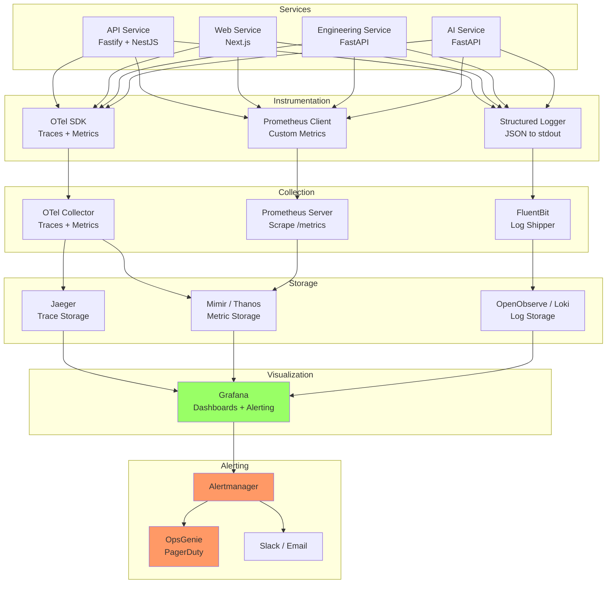
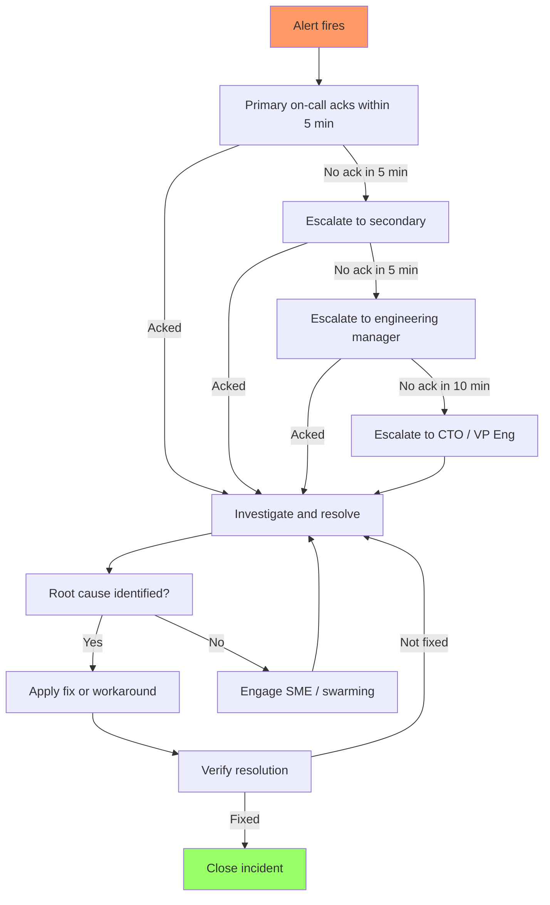
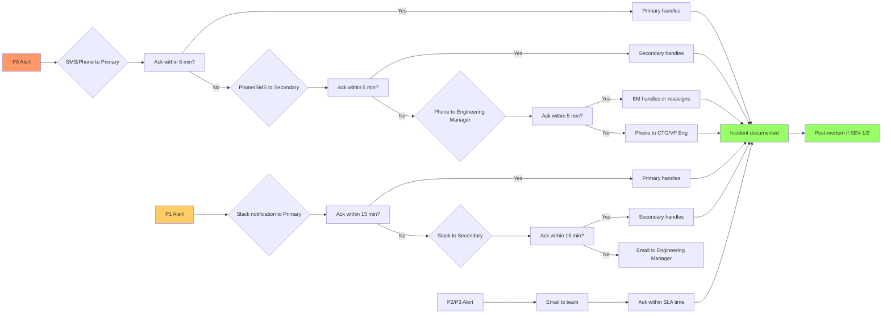

# 8. Observability Standards

> **Cross-References**: [Runtime Topology](../reference-architecture/06-runtime-topology.md)
>
> **Status**: Adopted · **Version**: 1.0.0 · **Last Updated**: 2026-06-26

---

## Table of Contents

1. [Logging](#1-logging)
2. [Metrics](#2-metrics)
3. [Tracing](#3-tracing)
4. [Alerting](#4-alerting)
5. [Dashboards](#5-dashboards)
6. [Correlation IDs](#6-correlation-ids)
7. [Health Checks](#7-health-checks)
8. [Service Level Objectives (SLO)](#8-service-level-objectives-slo)
9. [Service Level Agreements (SLA)](#9-service-level-agreements-sla)
10. [Error Budgets](#10-error-budgets)
11. [On-Call](#11-on-call)

---

## 1. Logging

### WHY

Logs provide the primary record of system behavior. Structured, consistent logging enables efficient debugging, auditing, and monitoring across all services.

### RATIONALE

Structured JSON logs are machine-parseable, queryable, and integrate seamlessly with log aggregation systems. Consistent log levels and required fields ensure every log entry can be correlated and understood without context switching.

### Structured JSON Logging

Every log entry MUST be a JSON object written to stdout (never to files in containers):

```json
{
  "timestamp": "2026-06-26T14:30:00.123Z",
  "level": "INFO",
  "service": "api",
  "correlation_id": "corr_abc123def456",
  "message": "Project created successfully",
  "user_id": "user_789ghi",
  "project_id": "proj_012jkl",
  "duration_ms": 45,
  "status_code": 201
}
```

### Log Level Definitions

| Level | Usage | When |
|-------|-------|------|
| ERROR | System is broken or data is corrupt | DB connection failure, unhandled exception, payment failure |
| WARN | Something unexpected but non-fatal | Rate limit approaching, retry attempt, deprecated API used |
| INFO | Notable state changes | User created, project saved, calculation completed |
| DEBUG | Detailed diagnostic information | Request parameters, intermediate values, decision points |
| TRACE | Step-by-step execution flow | Loop iterations, individual function calls (use sparingly) |

### Required Fields in Every Log Entry

| Field | Type | Description |
|-------|------|-------------|
| `timestamp` | ISO 8601 | Event time in UTC |
| `level` | string | Log level (uppercase) |
| `service` | string | Service name (e.g., `api`, `web`, `ai-service`) |
| `message` | string | Human-readable description |
| `correlation_id` | string | Traceable identifier across services |

### What to Log

- ALL HTTP requests (method, path, status, duration, user_id if authenticated)
- ALL authentication events (login, logout, MFA, password reset)
- ALL authorization failures (403 responses)
- ALL database operations that modify state (create, update, delete)
- ALL external API calls (provider, endpoint, status, duration)
- ALL errors and exceptions (stack trace at DEBUG level)
- ALL state transitions (status changes, workflow progress)
- ALL performance threshold violations

### What NOT to Log

- NEVER log passwords, even hashed ones
- NEVER log JWT tokens or session tokens
- NEVER log API keys, secrets, or encryption keys
- NEVER log full credit card numbers (log last 4 digits only if needed)
- NEVER log PII beyond what is strictly necessary (email, phone, address)
- NEVER log raw request bodies that may contain sensitive data
- NEVER log stack traces at ERROR level (use DEBUG for stack traces)
- NEVER log database connection strings with credentials

**GOOD example:**
```typescript
this.logger.info({
  event: 'PROJECT_CREATED',
  userId: user.id,
  projectId: project.id,
  projectName: project.name,
  durationMs: Date.now() - start,
}, 'Project created successfully');
```

**BAD example:**
```typescript
this.logger.error(`Error creating project: ${error.stack}`);
// No structured data, no correlation ID, full stack in ERROR level
```

```typescript
this.logger.info(`User logged in: ${email}, password: ${password}`);
// PII + password in logs
```

### Log Sampling for High-Volume

High-volume debug/access logs that would exceed 10 GB/day per service MUST be sampled:

| Volume Tier | Sampling Rate | Method |
|-------------|---------------|--------|
| < 100 req/s | 100% | Log everything |
| 100-1000 req/s | 10% | Random systematic sampling |
| > 1000 req/s | 1% | Head-based sampling with error auto-inclusion |

Errors are NEVER sampled - always log 100% of errors.

**GOOD example:**
```typescript
class SampledLogger {
  shouldLog(sampleRate: number): boolean {
    if (sampleRate >= 1) return true;
    return Math.random() < sampleRate;
  }

  debug(context: string, data: Record<string, unknown>, sampleRate = 1): void {
    if (this.shouldLog(sampleRate)) {
      this.logger.debug(data, context);
    }
  }
}
```

---

## 2. Metrics

### WHY

Metrics provide quantitative data about system health, performance, and usage. They enable trend analysis, capacity planning, and real-time alerting.

### RATIONALE

Prometheus is the industry standard for metrics collection. A consistent naming convention and metric type usage ensures that all teams can understand and query metrics across services.

### Custom Metrics via Prometheus

Every service MUST expose a `/metrics` endpoint in Prometheus format. Custom metrics follow the naming convention:

```
namespace_metricname_unit
```

Example:
```
xennic_http_requests_total counter
xennic_db_query_duration_seconds histogram
xennic_active_users gauge
```

### Metric Types

| Type | Description | Use Case | Example |
|------|-------------|----------|---------|
| **Counter** | Monotonically increasing value | Request counts, error counts, bytes processed | `xennic_projects_created_total` |
| **Gauge** | Point-in-time value that can go up or down | Active users, queue depth, memory usage | `xennic_active_users` |
| **Histogram** | Samples observations and counts them in configurable buckets | Request duration, response size | `xennic_http_request_duration_seconds` |
| **Summary** | Similar to histogram but calculates configurable quantiles | Latency percentiles (P50, P95, P99) | `xennic_api_latency_seconds` |

### RED Metrics (Rate, Errors, Duration) - Every Service

Every service MUST expose RED metrics:

```typescript
const httpRequestsTotal = new Counter({
  name: 'xennic_http_requests_total',
  help: 'Total HTTP requests',
  labelNames: ['method', 'path', 'status'],
});

const httpRequestErrorsTotal = new Counter({
  name: 'xennic_http_request_errors_total',
  help: 'Total HTTP request errors',
  labelNames: ['method', 'path', 'status'],
});

const httpRequestDurationSeconds = new Histogram({
  name: 'xennic_http_request_duration_seconds',
  help: 'HTTP request duration in seconds',
  labelNames: ['method', 'path', 'status'],
  buckets: [0.01, 0.05, 0.1, 0.5, 1, 2, 5, 10],
});

fastify.addHook('onResponse', (request, reply, done) => {
  const duration = reply.elapsedTime / 1000;
  const labels = {
    method: request.method,
    path: request.routeOptions.url ?? 'unknown',
    status: String(reply.statusCode),
  };

  httpRequestsTotal.inc(labels);
  httpRequestDurationSeconds.observe(labels, duration);

  if (reply.statusCode >= 400) {
    httpRequestErrorsTotal.inc(labels);
  }
  done();
});
```

### USE Metrics (Utilization, Saturation, Errors) - Resources

| Resource | Utilization | Saturation | Errors |
|----------|------------|------------|--------|
| CPU | `cpu_utilization_percent` | `cpu_load_average` | `cpu_throttled_events_total` |
| Memory | `memory_used_bytes` | `memory_swap_usage_bytes` | `memory_oom_events_total` |
| Disk | `disk_used_percent` | `disk_io_wait_seconds` | `disk_io_errors_total` |
| Network | `network_receive_bytes_total` | `network_drop_count_total` | `network_error_total` |
| Connection pool | `db_connections_active` | `db_connections_waiting` | `db_connection_errors_total` |

**GOOD example:**
```typescript
const dbPoolActive = new Gauge({
  name: 'xennic_db_pool_active_connections',
  help: 'Active database connections',
});

const dbPoolWaiting = new Gauge({
  name: 'xennic_db_pool_waiting_connections',
  help: 'Waiting database connections',
});

setInterval(async () => {
  const poolStatus = await prisma.$queryRaw`SELECT count(*) as active FROM pg_stat_activity`;
  dbPoolActive.set(Number(poolStatus[0].active));
}, 15000);
```

**BAD example:**
```typescript
console.log(`Active connections: ${activeConnections}`);
```

---

## 3. Tracing

### WHY

Distributed tracing follows requests across service boundaries. It is essential for debugging performance issues and failures in microservice architectures.

### RATIONALE

OpenTelemetry is the industry standard for distributed tracing. W3C TraceContext propagation ensures trace continuity across services regardless of language or framework.

### OpenTelemetry Distributed Tracing

Every service MUST be instrumented with OpenTelemetry:

```typescript
import { NodeSDK } from '@opentelemetry/sdk-node';
import { OTLPTraceExporter } from '@opentelemetry/exporter-trace-otlp-grpc';
import { Resource } from '@opentelemetry/resources';
import { SemanticResourceAttributes } from '@opentelemetry/semantic-conventions';
import { FastifyInstrumentation } from '@opentelemetry/instrumentation-fastify';
import { HttpInstrumentation } from '@opentelemetry/instrumentation-http';
import { PrismaInstrumentation } from '@prisma/instrumentation';

const sdk = new NodeSDK({
  resource: new Resource({
    [SemanticResourceAttributes.SERVICE_NAME]: 'api',
    [SemanticResourceAttributes.SERVICE_VERSION]: '1.0.0',
    [SemanticResourceAttributes.DEPLOYMENT_ENVIRONMENT]: process.env.NODE_ENV ?? 'development',
  }),
  traceExporter: new OTLPTraceExporter({
    url: process.env.OTEL_EXPORTER_OTLP_ENDPOINT ?? 'http://otel-collector:4317',
  }),
  instrumentations: [
    new FastifyInstrumentation(),
    new HttpInstrumentation(),
    new PrismaInstrumentation(),
  ],
});

sdk.start();
```

### Trace Context Propagation (W3C TraceContext)

All services MUST propagate the `traceparent` and `tracestate` headers:

```
traceparent: 00-0af7651916cd43dd8448eb211c80319c-b7ad6b7169203331-01
tracestate: xennic=1,congo=t61rcWkgMzE
```

- Fastify: OpenTelemetry middleware handles propagation automatically
- Outgoing HTTP: OpenTelemetry HTTP instrumentation propagates context
- Message queue: inject trace context into message headers

### Span Naming Conventions

| Span Name Pattern | Example |
|-------------------|---------|
| `HTTP {METHOD} {route}` | `HTTP POST /api/v1/projects` |
| `DB {operation} {table}` | `DB SELECT projects` |
| `MQ {action} {queue}` | `MQ PUBLISH calculation.results` |
| `RPC {service} {method}` | `RPC ai-service analyze` |
| `CACHE {action} {key}` | `CACHE GET project:123` |

### Span Attributes

Every span MUST include:

```typescript
span.setAttribute('service.name', 'api');
span.setAttribute('service.version', '1.0.0');
span.setAttribute('environment', process.env.NODE_ENV ?? 'development');

span.setAttribute('http.method', request.method);
span.setAttribute('http.url', request.url);
span.setAttribute('http.status_code', reply.statusCode);
span.setAttribute('http.route', request.routeOptions.url ?? 'unknown');

span.setAttribute('user.id', userId);
span.setAttribute('project.id', projectId);
span.setAttribute('workspace.id', workspaceId);
```

### Sampling Rate

| Environment | Default Sampling | Error Sampling |
|-------------|-----------------|----------------|
| Production | 1% (head-based) | 100% (tail-based) |
| Staging | 10% | 100% |
| Development | 100% | 100% |

```yaml
receivers:
  otlp:
    protocols:
      grpc: {}
processors:
  tail_sampling:
    decision_wait: 30s
    num_traces: 100
    policies:
      - name: errors-policy
        type: status_code
        config:
          status_code: ERROR
      - name: probabilistic-policy
        type: probabilistic
        config:
          sampling_percentage: 1
  batch:
    timeout: 1s
    send_batch_size: 1024
exporters:
  jaeger:
    endpoint: jaeger:14250
service:
  pipelines:
    traces:
      receivers: [otlp]
      processors: [tail_sampling, batch]
      exporters: [jaeger]
```

**GOOD example:**
```typescript
@Injectable()
export class CalculationService {
  constructor(@Inject(OTEL_TRACER) private readonly tracer: Tracer) {}

  async calculateVoltageDrop(input: VoltageDropInput): Promise<VoltageDropResult> {
    return this.tracer.startActiveSpan('calculate voltage_drop', async (span) => {
      span.setAttributes({
        'calculation.type': 'voltage_drop',
        'input.conductor_size': input.conductorSize,
        'input.current_a': input.currentA,
        'input.length_m': input.lengthM,
      });

      try {
        const result = await this.performCalculation(input);
        span.setAttribute('calculation.result', JSON.stringify(result));
        span.setStatus({ code: SpanStatusCode.OK });
        return result;
      } catch (error) {
        span.setStatus({
          code: SpanStatusCode.ERROR,
          message: (error as Error).message,
        });
        span.recordException(error as Error);
        throw error;
      } finally {
        span.end();
      }
    });
  }
}
```

**BAD example:**
```typescript
async calculateVoltageDrop(input: VoltageDropInput) {
  return this.performCalculation(input);
}
```

---

## 4. Alerting

### WHY

Alerting notifies the right people at the right time about system issues. Well-defined alert severity and thresholds prevent alert fatigue while ensuring critical issues are always addressed.

### RATIONALE

Every alert must be actionable. If an alert fires and no one takes action, it erodes trust in the alerting system. Clear severity definitions and notification channels ensure appropriate urgency.

### Alert Severity

| Severity | Definition | Notification | Response Time |
|----------|-----------|--------------|---------------|
| P0 | Critical - service down, data loss, security incident | SMS + Phone call | Immediate |
| P1 | High - significant degradation, feature unavailable | Slack + Email | < 15 min |
| P2 | Medium - partial degradation, non-critical error | Email | < 1 hour |
| P3 | Low - informational, pre-failure warning | Dashboard only | < 1 week |

### Alert Thresholds

| Alert | Severity | Threshold | Duration |
|-------|----------|-----------|----------|
| API error rate | P1 | > 5% of requests return 5xx | 5 minutes |
| API latency P99 | P1 | > 5 seconds | 5 minutes |
| Auth failure rate | P1 | > 10% of login attempts fail | 5 minutes |
| Service down | P0 | Health check fails | 1 minute |
| Database connection pool exhausted | P0 | > 90% of connections used | 2 minutes |
| Disk space | P1 | > 85% utilization | 10 minutes |
| Memory usage | P2 | > 90% utilization | 10 minutes |
| CPU usage | P2 | > 90% utilization | 10 minutes |
| Certificate expiry | P1 | < 7 days until expiry | - |
| Dependency vulnerability | P1 | Critical CVE detected | - |
| Error budget consumed | P1 | > 50% of monthly budget | - |

### Notification Channels

| Channel | Use For | Characteristics |
|---------|---------|-----------------|
| SMS / Twilio | P0 only | High urgency, 24/7 |
| Phone call (OpsGenie/PagerDuty) | P0 only | Maximum urgency, requires acknowledgment |
| Slack | P0, P1 | Real-time team notification |
| Email | P1, P2 | Persistent record, non-urgent |
| Dashboard / Grafana | P3 | Visual indicator only |

### Alert Fatigue Prevention

1. Every alert MUST have a runbook (documented resolution steps)
2. Alerts that never trigger action are deleted or reclassified
3. Flapping alerts are silenced until root cause is fixed
4. Maintenance windows suppress alerts during planned downtime
5. Quarterly alert review: prune stale alerts, adjust thresholds

### Silencing Rules

```yaml
silences:
  - matchers:
      - name: alertname
        value: "APIHighLatency|APIErrorRateHigh"
    starts_at: "2026-06-30T22:00:00Z"
    ends_at: "2026-07-01T06:00:00Z"
    comment: "Scheduled database migration maintenance window"
```

**GOOD example:**
```yaml
groups:
  - name: xennic-api
    rules:
      - alert: APIHighErrorRate
        expr: |
          sum(rate(xennic_http_request_errors_total[5m]))
          /
          sum(rate(xennic_http_requests_total[5m]))
          > 0.05
        for: 5m
        labels:
          severity: P1
        annotations:
          summary: "API error rate above 5%"
          runbook: "https://runbooks.xennic.com/api-high-error-rate"
```

**BAD example:**
```yaml
- alert: SomethingWrong
  expr: up == 0
```

---

## 5. Dashboards

### WHY

Dashboards provide at-a-glance visibility into system health, performance, and business metrics. They reduce mean-time-to-diagnosis (MTTD) during incidents.

### RATIONALE

Every service needs three tiers of dashboards. Tier 1 (always-on) gives immediate health status. Tier 2 (on-call) helps diagnose common issues. Tier 3 (deep-dive) supports detailed analysis.

### Required Dashboards Per Service

#### Tier 1: Overview Dashboard (Always On)

Visible in the operations center at all times:

- Uptime / health status (green/red)
- Request rate (RPS)
- Error rate (%)
- P50/P95/P99 latency
- Active users
- RED metrics (Rate, Errors, Duration)
- SLO compliance gauge

#### Tier 2: Resources Dashboard (On-Call)

Opened when investigating a Tier 1 alert:

- CPU, memory, disk, network utilization
- Database connection pool status
- Cache hit/miss ratio
- Queue depth and processing lag
- Garbage collection metrics (Node.js/Python)
- Event loop lag

#### Tier 3: Dependencies Dashboard

Opened when investigating integration issues:

- External API latency and error rate
- Database query performance (slow queries, connections)
- Redis/MQ throughput and latency
- AI/LLM provider latency and token usage
- File storage (S3/MinIO) latency and throughput

### Dashboard-as-Code (Grafana JSON)

All dashboards MUST be defined as JSON and version-controlled:

```json
{
  "title": "API Service Overview",
  "uid": "api-service-overview",
  "panels": [
    {
      "title": "Request Rate",
      "type": "timeseries",
      "targets": [{
        "expr": "sum(rate(xennic_http_requests_total[5m]))",
        "legendFormat": "RPS"
      }]
    },
    {
      "title": "Error Rate",
      "type": "timeseries",
      "targets": [{
        "expr": "sum(rate(xennic_http_request_errors_total[5m])) / sum(rate(xennic_http_requests_total[5m])) * 100",
        "legendFormat": "Error %"
      }]
    },
    {
      "title": "Latency P95",
      "type": "timeseries",
      "targets": [{
        "expr": "histogram_quantile(0.95, sum(rate(xennic_http_request_duration_seconds_bucket[5m])) by (le))",
        "legendFormat": "P95"
      }]
    }
  ]
}
```

### Observability Stack Architecture



### Dashboard Tiering

| Tier | Name | Purpose | Where Displayed | Refresh Rate |
|------|------|---------|----------------|--------------|
| Tier 1 | Service Overview | Immediate health check | Ops center big screen | 30s |
| Tier 2 | Service Resources | On-call diagnostics | On-call laptop | 60s |
| Tier 3 | Service Dependencies | Deep investigation | Anywhere | Manual |

**GOOD example:**
```json
{
  "title": "API Service Overview",
  "tier": 1,
  "tags": ["xennic", "api", "tier1"],
  "refresh": "30s",
  "panels": []
}
```

**BAD example:**
```json
{
  "title": "untitled dashboard",
  "panels": []
}
```

---

## 6. Correlation IDs

### WHY

Correlation IDs connect related events across services, enabling end-to-end tracing of requests. They are the glue that ties logs, metrics, and traces together.

### RATIONALE

A single identifier propagated through all services provides a complete picture of a request's journey. Including the correlation ID in error responses enables clients to report issues with a precise reference.

### Propagate X-Correlation-ID Through All Services

Every incoming request SHOULD receive a correlation ID, and every service MUST propagate it:

```typescript
fastify.addHook('onRequest', async (request, reply) => {
  let correlationId = request.headers['x-correlation-id'] as string;
  if (!correlationId || !isValidUUID(correlationId)) {
    correlationId = crypto.randomUUID();
  }
  request.correlationId = correlationId;
  reply.header('x-correlation-id', correlationId);
});

async function makeOutgoingRequest(url: string, correlationId: string) {
  return fetch(url, {
    headers: {
      'x-correlation-id': correlationId,
      'traceparent': getCurrentTraceParent(),
    },
  });
}
```

### Include in All Log Entries

```typescript
this.logger.info({
  correlationId: request.correlationId,
  event: 'SEARCH_EXECUTED',
  query: sanitizedQuery,
  resultsCount: results.length,
  durationMs: Date.now() - start,
}, 'Search completed');
```

### Include in Error Responses

```typescript
{
  "success": false,
  "error": {
    "code": "INTERNAL_ERROR",
    "message": "An unexpected error occurred",
    "correlationId": "corr_abc123def456"
  }
}
```

### Trace ID = Correlation ID in OpenTelemetry

When OpenTelemetry is active, the correlation ID MUST match the trace ID:

```typescript
const traceId = span.spanContext().traceId;
request.correlationId = traceId;
reply.header('x-correlation-id', traceId);
```

**GOOD example:**
```typescript
// User reports an error with correlation ID
// Support can look up the complete trace:
// - All log entries with that correlation ID
// - Trace in Jaeger with that trace ID
// - All services that handled the request
```

**BAD example:**
```typescript
// No correlation ID - support sees:
// "Something went wrong"
// No way to trace the request across services
```

---

## 7. Health Checks

### WHY

Health checks enable orchestration platforms (Kubernetes, load balancers) to determine service status and route traffic accordingly.

### RATIONALE

Liveness checks determine if the service is alive (if not, restart it). Readiness checks determine if the service can handle traffic (if not, stop routing to it). Separating these concerns prevents cascading failures.

### Liveness Endpoint (GET /healthz)

Returns 200 if the process is alive. No dependency checks. Kubernetes uses this to know when to restart the container.

```typescript
// Fastify health check - liveness
fastify.get('/healthz', async (request, reply) => {
  return reply.status(200).send({ status: 'ok', timestamp: new Date().toISOString() });
});
```

### Readiness Endpoint (GET /readyz)

Returns 200 only if ALL dependencies are healthy. Kubernetes uses this to know when to route traffic.

```typescript
interface HealthCheckResult {
  status: 'ok' | 'degraded' | 'unhealthy';
  version: string;
  uptime: number;
  dependencies: Record<string, { status: 'up' | 'down'; latency_ms?: number; error?: string }>;
}

fastify.get('/readyz', async (request, reply) => {
  const dependencies: Record<string, any> = {};
  let allHealthy = true;

  // Check database
  try {
    const start = Date.now();
    await prisma.$queryRaw`SELECT 1`;
    dependencies.database = { status: 'up', latency_ms: Date.now() - start };
  } catch (err) {
    dependencies.database = { status: 'down', error: (err as Error).message };
    allHealthy = false;
  }

  // Check Redis
  try {
    const start = Date.now();
    await redis.ping();
    dependencies.redis = { status: 'up', latency_ms: Date.now() - start };
  } catch (err) {
    dependencies.redis = { status: 'down', error: (err as Error).message };
    allHealthy = false;
  }

  // Check message queue
  try {
    const start = Date.now();
    await channel.checkQueue('calculations');
    dependencies.rabbitmq = { status: 'up', latency_ms: Date.now() - start };
  } catch (err) {
    dependencies.rabbitmq = { status: 'down', error: (err as Error).message };
    allHealthy = false;
  }

  const result: HealthCheckResult = {
    status: allHealthy ? 'ok' : 'degraded',
    version: process.env.APP_VERSION ?? 'unknown',
    uptime: process.uptime(),
    dependencies,
  };

  return reply.status(allHealthy ? 200 : 503).send(result);
});
```

### Health Check Response Format

```json
// 200 OK - All dependencies healthy
{
  "status": "ok",
  "version": "1.0.0",
  "uptime": 3600,
  "dependencies": {
    "database": { "status": "up", "latency_ms": 5 },
    "redis": { "status": "up", "latency_ms": 2 },
    "rabbitmq": { "status": "up", "latency_ms": 8 }
  }
}

// 503 Service Unavailable - Database down
{
  "status": "degraded",
  "version": "1.0.0",
  "uptime": 3600,
  "dependencies": {
    "database": { "status": "down", "error": "Connection refused" },
    "redis": { "status": "up", "latency_ms": 2 },
    "rabbitmq": { "status": "up", "latency_ms": 8 }
  }
}
```

**GOOD example:**
```yaml
# Kubernetes liveness and readiness probes
livenessProbe:
  httpGet:
    path: /healthz
    port: 3000
  initialDelaySeconds: 10
  periodSeconds: 15

readinessProbe:
  httpGet:
    path: /readyz
    port: 3000
  initialDelaySeconds: 5
  periodSeconds: 10
  failureThreshold: 3
```

**BAD example:**
```yaml
# Single health check - cannot distinguish liveness from readiness
livenessProbe:
  httpGet:
    path: /health
    port: 3000
```

---

## 8. Service Level Objectives (SLO)

### WHY

SLOs define the target reliability and performance levels for services. They quantify what "good enough" means and guide engineering prioritization.

### RATIONALE

Without SLOs, reliability is subjective. SLOs provide clear targets for development and operations. They enable data-driven decisions about when to ship features vs. invest in reliability.

### API Availability: 99.9%

- Uptime calculation: `(total_minutes - unavailable_minutes) / total_minutes * 100`
- Unavailable = any minute where error rate > 5%
- Excludes planned maintenance (with advance notice)
- Measurement window: rolling 30 days

### API Latency P95: < 1s

- 95% of all API requests complete within 1 second
- Measured from request receipt to response sent
- Excludes streaming endpoints and file uploads (> 10MB)
- Measurement window: rolling 7 days

### Search P95: < 3s

- 95% of search queries return results within 3 seconds
- Includes full-text search, faceted search, and filtered search
- Measurement window: rolling 7 days

### Ingestion Throughput: 100 docs/hour minimum

- Minimum sustained document ingestion rate
- Measured as documents processed per hour (rolling 24h average)
- Includes validation, enrichment, and indexing

### SLO Compliance Table

| SLO | Target | Measurement | Window | Owner |
|-----|--------|-------------|--------|-------|
| API Availability | 99.9% | Error rate < 5% per minute | 30 days rolling | Platform team |
| API Latency P95 | < 1s | Histogram P95 | 7 days rolling | Platform team |
| Search Latency P95 | < 3s | Histogram P95 | 7 days rolling | Search team |
| Ingestion Throughput | 100 docs/hour | Document count | 24h rolling | Data team |
| Calculation Accuracy | 99.99% | Automated validation tests | Per release | Engineering team |
| Uptime (Web) | 99.9% | Error rate < 5% per minute | 30 days rolling | Web team |

**GOOD example:**
```yaml
# SLO definition in YAML
slo:
  - name: api_availability
    target: 99.9
    sli:
      numerator: sum(rate(xennic_http_requests_total{status!~"5.."}[5m]))
      denominator: sum(rate(xennic_http_requests_total[5m]))
    window: 30d
```

**BAD example:**
```yaml
slo:
  - name: api_reliability
    target: 99
    # No SLI defined - cannot measure
```

---

## 9. Service Level Agreements (SLA)

### WHY

SLAs set external expectations with customers. They define what uptime and performance we guarantee and what happens if we fail to meet those guarantees.

### RATIONALE

SLAs are legal/business commitments backed by the SLOs. The SLA must be equal to or looser than the SLO to provide a buffer (SLO target < SLA target by at least 0.1%).

### External-Facing Commitments (GA Phase)

| Metric | SLA Target | SLO Target (Internal) | Buffer |
|--------|-----------|----------------------|--------|
| API Availability | 99.8% | 99.9% | 0.1% |
| API Latency P95 | < 2s | < 1s | 1s |
| Search P95 | < 5s | < 3s | 2s |
| Support response time (P0) | 30 min | 15 min | 15 min |

### Uptime Guarantee

- Monthly uptime percentage = (total minutes - downtime minutes) / total minutes * 100
- Downtime excludes: planned maintenance (48h notice), customer-caused issues, Force Majeure
- Partial downtime is prorated

### Response Time Guarantee

- P0 (Critical): response within 30 minutes
- P1 (High): response within 2 hours
- P2 (Medium): response within 8 hours
- P3 (Low): response within 48 hours

### Credits Policy

| Monthly Uptime | Service Credit |
|----------------|----------------|
| < 99.8% but >= 99.0% | 5% monthly credit |
| < 99.0% but >= 95.0% | 10% monthly credit |
| < 95.0% | 25% monthly credit |

**GOOD example:**
- SLO target: 99.9% availability
- SLA commitment: 99.8% availability
- If actual availability is 99.5% (below SLA): 5% service credit issued

**BAD example:**
- SLO target: 99.9% availability
- SLA commitment: 99.9% availability
- No buffer: any SLO miss is an SLA breach

---

## 10. Error Budgets

### WHY

Error budgets bridge the gap between innovation and reliability. They provide a data-driven mechanism to decide when to ship features vs. focus on stability.

### RATIONALE

An error budget is the acceptable amount of unreliability. If the budget is consumed, the team freezes feature work and focuses on reliability until the budget is replenished.

### Error Budget = 100% - SLO

For a 99.9% SLO, the error budget is 0.1% of total measurement time:

- Monthly error budget: 0.1% of 43,200 minutes = 43.2 minutes of downtime
- Weekly error budget: 0.1% of 10,080 minutes = 10.08 minutes
- Daily error budget: 0.1% of 1,440 minutes = 1.44 minutes

### Budget Consumption Tracking

```yaml
# Alert when error budget is being consumed too quickly
groups:
  - name: error-budget
    rules:
      - alert: ErrorBudgetBurningFast
        expr: |
          (1 - (sum(rate(xennic_http_requests_total{status=~"5.."}[1h]))
                / sum(rate(xennic_http_requests_total[1h]))))
          < 0.999
          AND
          (1 - (sum(rate(xennic_http_requests_total{status=~"5.."}[30d]))
                / sum(rate(xennic_http_requests_total[30d]))))
          < 0.999
        for: 1h
        labels:
          severity: P1
        annotations:
          summary: "Error budget burning fast for API service"
```

### Budget Consumption Policy

| Budget Remaining | Action |
|-----------------|--------|
| > 50% | Normal operations - ship features |
| 25% - 50% | Increase monitoring, review changes |
| 10% - 25% | Freeze non-critical features, prioritise reliability work |
| < 10% | Full feature freeze, all hands on reliability |
| 0% (exhausted) | Emergency mode, roll back risky changes, war room |

### Monthly Budget Window

- Error budget resets at the start of each calendar month
- Unused budget does NOT roll over
- Budget consumption is published weekly in the engineering all-hands

**GOOD example:**
```
Monthly error budget: 43.2 minutes
Consumed this month: 12 minutes (28%)
Action: Normal operations - monitor closely
```

**BAD example:**
```
Error budget: Unknown (not tracked)
Feature freeze policy: No policy
```

---

## 11. On-Call

### WHY

On-call ensures that incidents are responded to promptly, 24/7. A well-structured on-call process reduces burnout and improves incident response quality.

### RATIONALE

On-call rotation distributes the burden across the team. Clear escalation paths prevent delays. Runbooks ensure consistent response even for uncommon issues.

### Rotation Schedule

| Role | Schedule | Duration | Team |
|------|----------|----------|------|
| Primary on-call | Weekly rotation | Mon - Mon | Platform engineers |
| Secondary on-call | Weekly rotation | Mon - Mon | Platform engineers |
| Escalation lead | Monthly | Calendar month | Engineering manager |

Schedule: follow-the-sun model with handoff at end of each shift. Primary handles all alerts. Secondary handles when primary is unavailable. Escalation lead handles when primary/secondary cannot resolve.

### Escalation Policy



### Runbooks Requirement

Every alert MUST have a runbook. Runbooks live in the repository at `docs/runbooks/` and are linked from alert annotations.

```markdown
# Runbook: API High Error Rate

## Symptoms
- PagerDuty alert: "API High Error Rate"
- Grafana: API error rate > 5% for 5 minutes
- Users report 500 errors

## Initial Checks
1. Check deployment status - was there a recent deploy?
2. Check dependency health on /readyz endpoint
3. Check recent log entries for error patterns

## Common Causes
1. **Database connection pool exhaustion**
   - Check: `xennic_db_pool_active_connections`
   - Fix: Restart connection pool or scale database

2. **External API degradation**
   - Check: dependency latency on dependency dashboard
   - Fix: Circuit breaker should handle this - verify

3. **Memory pressure**
   - Check: memory usage > 90%
   - Fix: Scale service horizontally

## Escalation
If unresolved after 15 minutes, escalate to secondary on-call.
If database-related, page DBA team.
```

### Incident Classification

Every incident MUST be classified:

| Attribute | Values |
|-----------|--------|
| Severity | SEV-1 / SEV-2 / SEV-3 / SEV-4 |
| Category | availability / performance / security / data / bug |
| Impact | critical / high / medium / low |
| Source | monitoring / user-report / manual / pentest |

### Post-Mortem Requirement

- SEV-1 and SEV-2 incidents: post-mortem within 48 hours
- SEV-3 incidents: post-mortem within 1 week
- SEV-4 incidents: no post-mortem required (document in ticket)

Post-mortem template:

```markdown
## Post-Mortem: [Incident Title]

**Date**: YYYY-MM-DD
**Severity**: SEV-[1-4]
**Duration**: [start] -> [end] ([X] minutes)
**Incident Lead**: [Name]

### Summary
[One-paragraph summary of what happened]

### Timeline
| Time (UTC) | Event |
|------------|-------|
| HH:MM | Alert triggered |
| HH:MM | Primary on-call acknowledged |
| HH:MM | Root cause identified |
| HH:MM | Mitigation applied |
| HH:MM | Service fully restored |

### Root Cause
[Detailed description of root cause]

### Impact
- Users affected: [number]
- Services affected: [list]
- Data loss: [yes/no]
- Financial impact: [amount if applicable]

### What Went Well
- [Item 1]
- [Item 2]

### What Went Wrong
- [Item 1]
- [Item 2]

### Action Items
| Action | Owner | Due Date | Tracked In |
|--------|-------|----------|------------|
| [Action] | [Owner] | [Date] | [Link] |
```

### Alert Escalation Flow



**GOOD example:**
```yaml
# On-call schedule
schedule:
  rotation: weekly
  handoff_day: Monday
  handoff_time: "09:00 UTC"
  primary_role: platform-engineer
  secondary_role: platform-engineer
  escalation: engineering-manager
```

**BAD example:**
```yaml
# No on-call schedule
schedule: "ask someone when things break"
```

---

## References

- [OpenTelemetry Documentation](https://opentelemetry.io/docs/)
- [Prometheus Best Practices](https://prometheus.io/docs/practices/naming/)
- [RED Method (Tom Wilkie)](https://grafana.com/blog/2018/08/02/the-red-method-how-to-instrument-your-services/)
- [USE Method (Brendan Gregg)](https://www.brendangregg.com/usemethod.html)
- [Google SRE Book](https://sre.google/sre-book/table-of-contents/)
- [Grafana Dashboard Linter](https://github.com/grafana/grafana/blob/main/docs/sources/dashboards/)
- [Runtime Topology](../reference-architecture/06-runtime-topology.md)
