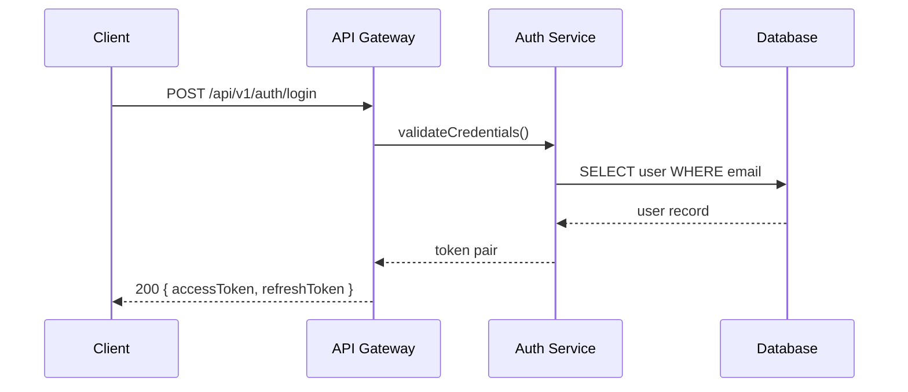
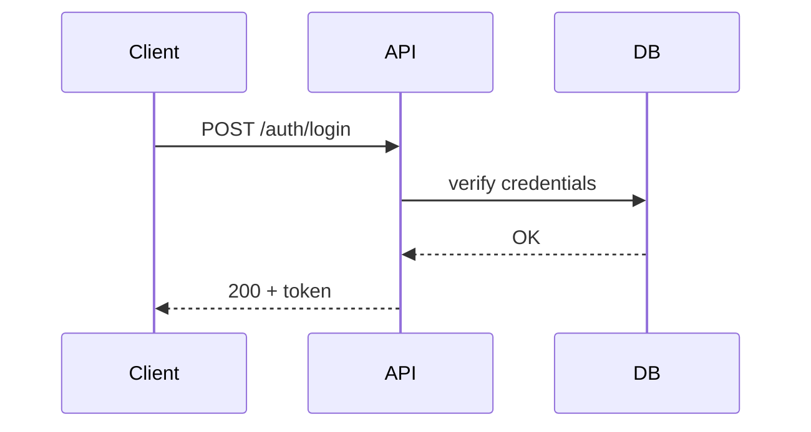

# Documentation Standards

> Cross-reference: → [docs/decisions/ADR-008-documentation-as-code.md](../../decisions/ADR-008-documentation-as-code.md)
>
> Adopts "docs-as-code" paradigm: documentation is treated with the same rigor as source code —
> versioned, reviewed, tested, and maintained alongside the codebase.

---

## 1. Markdown Conventions

### WHY

Consistent Markdown ensures documents are readable in any viewer, render predictably on GitHub
and in editors, and are machine-parseable for tooling (linting, link checking, table extraction).

### RATIONALE

Markdown is the lingua franca of documentation in open-source and internal projects. Without
enforced conventions, every author produces differently formatted output, making cross-referencing,
automated checking, and bulk updates unnecessarily difficult. These conventions balance readability
in raw form with beautiful rendered output.

### Heading structure

- **One H1 per document**: The title (first line) is the only `# Heading` in the file.
- **Sequential heading levels**: Never skip levels (e.g. H2 → H4 without H3).
- **No empty headings**: Every heading must have content beneath it before the next heading.
- **Spacing**: One blank line before each heading (except the document title), one blank line after.

### GOOD example

```markdown
# User Authentication Service

## Overview

Brief description of the authentication service.

### Responsibilities

- Login
- Logout
- Token refresh

### Constraints

- Must support OAuth 2.0
- Must be stateless
```

### BAD example

```markdown
# User Auth
## Overview
### Login Flow
#### Token Details  (skip: used H4 after H3 without H3 content, and no blank lines)
```

### Line length

- **Hard limit**: 100 characters per line.
- **Soft wrap**: Prefer semantic line breaks at sentence boundaries or natural clause breaks.
- **Exception**: Code blocks and long URLs may exceed 100 characters.

### GOOD example

```markdown
The authentication service delegates token validation to the identity provider
via the OAuth 2.0 introspection endpoint. If the token is invalid or expired,
the service returns a 401 Unauthorized response.
```

### BAD example

```markdown
The authentication service delegates token validation to the identity provider via the OAuth 2.0 introspection endpoint. If the token is invalid or expired, the service returns a 401 Unauthorized response.  (single line, 200+ chars)
```

### Bullet style

- Use `- ` (hyphen followed by space) for unordered lists.
- Use `1. ` for ordered lists.
- Sub-lists indent 2 spaces.
- No trailing punctuation on list items (unless they are complete sentences).
- Lists of 3 or fewer short items may be inline: `- foo, - bar, - baz`.

### GOOD example

```markdown
Available authentication methods:
- Password-based (username + password)
- OAuth 2.0 (Google, GitHub, Microsoft)
  - Authorization code flow
  - PKCE for mobile clients
- API key (service-to-service)
```

### BAD example

```markdown
* Password-based
* OAuth 2.0
  * Authorization code flow  (wrong bullet character, inconsistent indentation)
- API key;
```

### Code blocks with language

- Always specify the language after the opening triple backtick.
- Use lowercase language identifiers: `typescript`, `python`, `bash`, `json`, `yaml`, `prisma`, `sql`, `diff`.
- If no language, use `text`.
- Inline code uses single backticks.

### GOOD example

````markdown
```typescript
async function login(username: string, password: string): Promise<AuthToken> {
  const user = await userService.authenticate(username, password);
  return tokenService.generate(user);
}
```
````

### BAD example

````markdown
```
async function login(username, password) {
  return tokenService.generate(user);
}
```
````

### Table formatting

- Use pipes `|` and dashes `-`.
- Align columns with spaces for readability in raw form.
- Header row separated by `|---|---|---|`.
- No empty cells unless intentional.
- Keep tables under 6 columns; split into multiple tables if wider.

### GOOD example

```markdown
| Method | Endpoint           | Auth Required | Rate Limit |
|--------|--------------------|---------------|------------|
| POST   | /api/v1/auth/login | No            | 10/min     |
| POST   | /api/v1/auth/refresh | Yes         | 20/min     |
| POST   | /api/v1/auth/logout | Yes          | 30/min     |
```

### BAD example

```markdown
|Method|Endpoint|Auth Required|Rate Limit|Extra|Columns|Here|
|---|---|---|---|---|---|---|
|POST|/login|No|10/min|?|?|?|
```

### Link format

- **External links**: `[text](https://example.com)` — prefer descriptive text, not raw URLs.
- **Internal links**: `→ [docs/path/file.md#section](../../path/file.md#section)` — always use
  the reference arrow `→` for internal cross-references.
- **Anchor links**: `[text](#section-name)` — section name is kebab-case of the heading.
- **Relative paths only**: Never use absolute repository paths for internal links.

### GOOD example

```markdown
For authentication flow, see → [User Authentication](./09-documentation-standards.md#1-markdown-conventions).
Read the API specification at → [OpenAPI docs](../../openapi/v1/openapi.json).
```

### BAD example

```markdown
See docs/09-documentation-standards.md (not a clickable link)
Click here: https://github.com/xennic/xennic/blob/main/docs/...
```

### Bold / italic usage

- **Bold**: `**bold**` for emphasis on key terms, file names, UI labels.
- *Italic*: `*italic*` for introducing new terms, book/article titles, or mild emphasis.
- ***Bold italic***: `***bold italic***` only for very strong emphasis; use sparingly.
- Do not use bold for entire paragraphs.
- Do not use underscore-style `_italic_` — use asterisks only.

### GOOD example

```markdown
The **Definition of Done** checklist must be completed for every feature.
See *The Pragmatic Programmer* for background on technical debt.
The ***only*** exception is documentation-only PRs.
```

### BAD example

```markdown
__This is important__ (use ** instead)
*This is a critical rule that everyone must follow* (use ** for critical)
```

---

## 2. Mermaid Usage

### WHY

Diagrams communicate architecture, flow, and relationships more efficiently than prose. Mermaid
diagrams remain in Markdown (no image files), are version-controlled, and render natively on
GitHub and in many editors.

### RATIONALE

External diagramming tools produce binary or proprietary formats that cannot be diffed, reviewed
in code review, or kept in sync with code changes. Mermaid diagrams live alongside the text they
illustrate, making it trivial to update both simultaneously. They also render automatically in
GitHub Flavored Markdown, requiring no build step.

### When to use diagrams

Use a Mermaid diagram when:

| Diagram type     | When to use                                          |
|------------------|------------------------------------------------------|
| Architecture     | System context, container diagram, deployment view   |
| Flow             | Business process, request lifecycle, data pipeline   |
| Sequence         | Interaction between components, API call flow        |
| State            | State machine, workflow stages, lifecycle            |
| ER               | Entity relationships, database schema overview       |
| Class            | Domain model, service interfaces, type hierarchy     |

### Mermaid syntax rules

- **Indentation**: 2 spaces (matching project-wide EditorConfig).
- **Subgraphs**: Always label subgraphs with a descriptive title.
- **Styling**: Use CSS class definitions for consistent coloring; avoid inline styles.
- **Node IDs**: Use `camelCase` or `PascalCase` node identifiers.
- **Edge labels**: Label all edges that carry domain meaning; avoid trivial labels like "calls".
- **Comments**: Use `%%` for single-line Mermaid comments (will not render).

### GOOD example

````markdown

````

### BAD example

````markdown
```mermaid
graph
A->B
B->C  (no labels, no context, meaningless)
```
````

### Diagram placement

- Place the diagram **immediately after the relevant heading**, before the explanatory text.
- If the diagram illustrates a subsection, place it after the subsection heading.
- Keep diagrams compact: no more than 20-25 nodes in a single diagram.
- Split complex diagrams into multiple focused diagrams.

### GOOD example

```markdown
## Login Flow



The login flow begins with the client sending credentials...
```

### BAD example

```markdown
## Login Flow

The login flow begins with the client sending credentials... (diagram comes too late)

```mermaid
...diagram...
```
```

### Accessibility (alt text)

- Every Mermaid block must have a preceding `> **Diagram**: <description>` line.
- This serves as alt text for screen readers and shows when the diagram fails to render.

### GOOD example

````markdown
> **Diagram**: Sequence of the authentication login flow showing client, API gateway,
> auth service, and database interactions.

```mermaid
sequenceDiagram
    ...
```
````

### BAD example

````markdown
```mermaid
sequenceDiagram  (no alt text provided)
    ...
```
````

### Rendering verification

- Before committing, verify the diagram renders correctly using a Mermaid live editor or IDE
  preview.
- Check that no syntax errors exist — a broken diagram is worse than no diagram.
- Verify that the diagram fits within standard readme width (~800px).
- Use `mermaid-cli` or `mmdc` for automated verification in CI (planned).

---

## 3. ADR Format

### WHY

Architecture Decision Records capture the context and rationale behind every significant
architectural decision. Without ADRs, decisions are lost to tribal knowledge, and future
developers cannot understand why the system is designed as it is.

### RATIONALE

ADRs provide a written history of architectural reasoning. They prevent repeated debates over
already-decided topics, give new team members context, and serve as input for architectural
reviews. Following → [ADR-000](../../decisions/ADR-000-use-adrs.md), every decision must be
recorded.

### When ADR is required

An ADR is required for any of the following:

| Trigger                      | Example                                                  |
|------------------------------|----------------------------------------------------------|
| Architecture change          | Monolith to microservices, new module boundary           |
| Dependency addition          | New database, new message broker, new major library      |
| Breaking change              | API contract change, schema migration with data loss     |
| Technology choice            | Framework selection, language version upgrade, tool      |
| Security model change        | Auth strategy change, encryption algorithm change        |
| Infrastructure change        | Cloud provider, deployment strategy, CI/CD platform      |
| Deprecation                  | Removing a feature, end-of-life decision                 |

### ADR template

Every ADR must follow this template exactly:

```markdown
# ADR-NNN: Title

## Status

[Proposed | Accepted | Deprecated | Superseded]

> Supersedes ADR-NNN (if applicable)
> Superseded by ADR-NNN (if applicable)

## Context

What is the issue motivating this decision? What forces are at play?
What constraints exist? What options were considered?

## Decision

What is the change being proposed or implemented? Be specific.

## Consequences

What becomes easier or harder? What trade-offs are accepted?
What follow-up work is required?

## Compliance

How will compliance with this decision be enforced?
(automated lint rules, code review checklist items, CI checks, etc.)
```

### ADR numbering

- Sequential, zero-padded, three-digit: `ADR-001`, `ADR-002`, etc.
- Never reuse a number, even if the ADR is deprecated.
- The number is assigned at creation time (Draft status).
- Numbers never change, even if an ADR is superseded.

### ADR lifecycle

```
┌──────────┐    review     ┌──────────┐    approved    ┌──────────┐
│  Draft   │ ────────────> │ Proposed │ ─────────────> │ Accepted │
└──────────┘               └──────────┘                └──────────┘
                                                             │
                                                    superseded│
                                                             ▼
                                                   ┌──────────────┐
                                                   │  Superseded   │
                                                   └──────────────┘
                                                             ▲
                                                   deprecated │
                                                             │
                                                   ┌──────────────┐
                                                   │  Deprecated   │
                                                   └──────────────┘
```

- **Draft**: Being written, not yet circulated for review.
- **Proposed**: Circulated for review, awaiting approval.
- **Accepted**: Approved and active.
- **Deprecated**: No longer recommended, but still valid (replaced by alternative approaches).
- **Superseded**: Replaced by a newer ADR (linked via Supersedes/Superseded by).

### GOOD example

```markdown
# ADR-042: Use PostgreSQL for Event Store

## Status

Accepted

## Context

We need an event store for the engineering service's event sourcing.
Options considered: PostgreSQL, EventStoreDB, Kafka, DynamoDB.
PostgreSQL chosen due to existing infrastructure, team expertise,
and transactional guarantees.

## Decision

Use PostgreSQL as the event store backend, with events stored in
a dedicated `events` table using JSONB for payload storage.

## Consequences

- Simplifies infrastructure (no new database system)
- Limited to PostgreSQL's throughput (~5k events/sec per instance)
- Requires careful indexing on event types and timestamps
- Future migration to dedicated event store is possible if needed

## Compliance

- All event writes must go through the event store repository
- Schema changes require ADR approval
- Query performance reviewed quarterly
```

### BAD example

```markdown
# Use Postgres  (no ADR number)

We decided to use Postgres. It's good.

Consequences: none.
```

---

## 4. Cross-References

### WHY

Cross-references create a connected documentation graph. Readers can navigate between related
concepts, decisions, and code without searching. Automated link checking validates that the
graph has no broken edges.

### RATIONALE

In a codebase with hundreds of documents and thousands of source files, finding related
information is a primary productivity drain. Explicit cross-references solve this. They also
enable tooling to detect when a referenced document is moved, renamed, or deleted.

### Reference format

| Reference type | Format                                                  | Example                                              |
|----------------|---------------------------------------------------------|------------------------------------------------------|
| Document       | `→ [docs/path/file.md#section](../path/file.md#section)` | → [docs/decisions/ADR-008.md](../../decisions/ADR-008.md) |
| Code           | `→ [CODE] apps/api/src/auth/service.ts`                   | → [CODE] apps/api/src/auth/auth.service.ts:42         |
| Prisma model   | `→ [PRISMA] User`                                        | → [PRISMA] Workspace                                 |
| Architecture   | `→ [ARCH] Monolith`                                      | → [ARCH] Microservices                               |
| Decision       | `→ [ADR-008](../../decisions/ADR-008.md)`                | → [ADR-008](../../decisions/ADR-008-documentation-as-code.md) |

### Reference to code

- Always prefix with `[CODE]` followed by the relative path from repository root.
- Include line number when referencing a specific function or type: `[CODE] apps/api/src/auth/auth.service.ts:42`.
- Use permalinks for critical references (commit-specific) when the code might change.

### Reference to Prisma

- Always prefix with `[PRISMA]` followed by the model name in PascalCase.
- Example: `→ [PRISMA] Workspace` for the workspace model.
- This enables automated cross-reference resolution from the Prisma schema.

### Ensure references are valid

Before committing, verify that:

1. The referenced file exists at the given relative path.
2. The referenced anchor `#section-name` exists in the target file.
3. The referenced code path is valid and the line number (if given) points to the intended code.
4. Prisma model names match exactly (case-sensitive) as defined in `schema.prisma`.

This validation should be automated in CI (planned: `scripts/validate-doc-refs.sh`).

### GOOD example

```markdown
The authentication flow integrates with the → [PRISMA] User model.
Implementation is in → [CODE] apps/api/src/auth/auth.service.ts:42.
See → [ADR-008](../../decisions/ADR-008-documentation-as-code.md) for the docs-as-code strategy.
```

### BAD example

```markdown
See the User model in the database. (not cross-referenced)
The code is in auth.service.ts (no path, no repo-root reference)
```

---

## 5. Folder Structure

### WHY

A predictable folder structure means developers can find any document without guessing. It also
enables tooling (link checking, validation scripts) to operate on known paths.

### RATIONALE

Without an agreed structure, documents accumulate in ad-hoc locations, making discovery
impossible. The structure mirrors the codebase organization and the natural hierarchy of
engineering concerns.

### docs/ organization

```
docs/
├── README.md                     # Top-level index
├── engineering-constitution/      # This directory
│   ├── README.md
│   ├── 01-architecture-principles.md
│   ├── ...
│   └── 12-release-management.md
├── decisions/                    # ADR documents
│   ├── README.md
│   ├── ADR-000-use-adrs.md
│   ├── ADR-001-...
│   └── ADR-008-documentation-as-code.md
├── guides/                       # How-to guides
│   ├── README.md
│   ├── getting-started.md
│   ├── deployment.md
│   └── local-development.md
├── openapi/                      # Auto-generated OpenAPI specs
│   ├── README.md
│   └── v1/
│       └── openapi.json
└── api/                          # API documentation (supplements OpenAPI)
    ├── README.md
    ├── authentication.md
    ├── errors.md
    └── rate-limiting.md
```

### Naming convention

- All files: `kebab-case.md`.
- Top-level directories: lowercase, single word where possible.
- Nested directories: kebab-case.

### Index / README per directory

Every directory must have a `README.md` that:

- Lists all files and subdirectories in the directory.
- Provides a one-sentence description of each file.
- Indicates the target audience for the directory.
- Links to related directories.

Exception: The `openapi/` directory README may be auto-generated.

### Depth limit (max 3 levels)

- No directory should be nested deeper than 3 levels from `docs/`.
- Example: `docs/engineering-constitution/` = level 2 (valid).
- Example: `docs/guides/deployment/kubernetes/production/` = level 4 (invalid).
- Solution: Flatten deep hierarchies or consolidate into fewer directories.

---

## 6. Naming

### WHY

Consistent naming makes files discoverable, sortable, and referenceable from links and scripts.
It also makes the documentation hierarchy self-evident.

### RATIONALE

Poor naming leads to duplicate documents (authors cannot find existing ones), broken links
(when files are renamed), and confusion about document relationships. A strict naming convention
eliminates these problems.

### File naming

- **Ordered documents**: Prefix with two-digit number + hyphen: `01-introduction.md`.
- **Unordered documents**: Descriptive kebab-case only: `deployment-guide.md`.
- **ADR documents**: `ADR-NNN-title.md` where `NNN` is the zero-padded number.
- **README**: Always `README.md` (uppercase).

File name priority:
1. `01-` prefix for constitution docs (ordered as in the TOC).
2. Descriptive noun phrase, not verb phrase: `authentication.md` not `authenticating-users.md`.
3. Use the same key term as the document's H1 title.

### GOOD examples

```
01-architecture-principles.md
09-documentation-standards.md
12-release-management.md
deployment-guide.md
local-development.md
ADR-042-postgres-event-store.md
```

### BAD examples

```
doc1.md
FINAL_DOC.md
Authenticating_Users.md
architecture-principles-v2.md
my-doc-final-2.md
```

### Heading naming

- **Title case**: Every major word capitalized (nouns, verbs, adjectives, adverbs).
- **Section numbers**: Optional for long documents (>50 sections). Use `1.`, `1.1`, `1.1.1`.
- **Consistent with file name**: The H1 should match the file's topic descriptor.

### GOOD examples

```markdown
# Documentation Standards
## 1. Markdown Conventions
### 1.1 Heading Structure
### 1.2 Line Length
## 2. Mermaid Usage
```

### BAD examples

```markdown
# Documentation Standards for Xennic Platform
## a. Markdown Stuff
## b. How to Use Mermaid
```

### Link anchors (kebab-case from heading)

GitHub auto-generates anchors from headings by:
1. Lowercasing the heading.
2. Removing punctuation.
3. Replacing spaces with hyphens.
4. Removing repeated hyphens.

All internal links must use these auto-generated anchors. Verify they match.

| Heading                           | Anchor                            |
|-----------------------------------|-----------------------------------|
| ## Markdown Conventions           | `#markdown-conventions`           |
| ## 1. Markdown Conventions        | `#1-markdown-conventions`         |
| ## ADR Format                     | `#adr-format`                     |
| ## Folder Structure               | `#folder-structure`               |

### GOOD example

```markdown
See → [Markdown Conventions](#markdown-conventions) in this document.
See → [ADR Format](#adr-format) for the ADR template.
```

### BAD example

```markdown
See [Markdown Conventions](09-documentation-standards.md#Markdown-Conventions) (anchor is wrong)
```

---

## 7. Review Process

### WHY

Documentation that is not reviewed is documentation that is wrong. Just as code requires code
review, documentation requires doc review to ensure accuracy, clarity, and consistency.

### RATIONALE

Outdated, incorrect, or confusing documentation is worse than no documentation because it
actively misleads readers. A review process catches these issues before they reach readers.
Documentation that goes stale without review erodes trust in all documentation.

### Documentation PR required for new features

Every feature PR that introduces a new concept, endpoint, model, configuration, or dependency
MUST include or update documentation. A PR without documentation updates will be blocked.

Minimum documentation for a new feature:
1. API documentation (if new endpoint) — OpenAPI spec.
2. Concept documentation (if new concept) — one-page explanation in `docs/guides/`.
3. ADR (if architecture change) — as required by → [#3 ADR Format](#3-adr-format).
4. Changelog entry.

### Docs review checklist

Every documentation PR must be reviewed against this checklist:

- [ ] Spelling and grammar correct
- [ ] All links resolve (no broken cross-references)
- [ ] All code examples compile / run
- [ ] Mermaid diagrams render correctly
- [ ] Terminology consistent with glossary
- [ ] Line length within 100 characters
- [ ] Heading hierarchy correct (one H1, sequential levels)
- [ ] Cross-references use the → [REF] format
- [ ] ADR template followed (if ADR)
- [ ] No sensitive information exposed
- [ ] README updated if the document is a new addition

### Stale doc detection

- Every document has a `last-reviewed` date in its frontmatter.
- A weekly CI job (planned) checks documents not reviewed in 90 days and files a ticket.
- Quarterly manual audit of all documentation.
- Stale documents are tagged with a `> **Stale**: Last reviewed <date>` banner at the top.

### Doc update on ADR changes

When an ADR transitions from any status (e.g., Proposed → Accepted, or Accepted → Deprecated):

1. Update all documents that reference the ADR.
2. Update the ADR's `Consequences` section with any new insights.
3. Cross-reference the updated ADR in relevant documents.
4. Mark related documents for review (they may need updates due to the ADR change).

---

## 8. Documentation Lifecycle

### WHY

Documents have a lifespan. They are created, reviewed, published, become stale, and eventually
need archiving. Managing this lifecycle ensures readers always see current, accurate information
and are warned when a document may be outdated.

### RATIONALE

Without a lifecycle, the documentation set accumulates dead documents that confuse readers.
Archive removes clutter; staleness warnings build appropriate skepticism. The lifecycle also
triggers maintenance actions at predictable intervals.

### Lifecycle stages

```
Draft ──> Review ──> Published ──> Stale ──> Archived
                        │                        │
                        └── (update) ───> Published (re-review)
```

| Stage       | Description                                         | Visibility          |
|-------------|-----------------------------------------------------|---------------------|
| Draft       | Being written, not yet ready for review             | Editors only        |
| Review      | Under review, awaiting approval                     | Team only           |
| Published   | Approved and current                                | Everyone            |
| Stale       | Not reviewed in 90 days, may be outdated            | Everyone (with banner) |
| Archived    | No longer relevant, kept for historical reference   | Available on request, not in main index |

### Review frequency (quarterly)

- Every March, June, September, December: full documentation audit.
- Each document's `last-reviewed` is checked; documents > 90 days are marked as Stale.
- Document owners are notified 2 weeks before the review deadline.
- Review results are recorded in the document's frontmatter.

### Archiving rules

A document is archived when:

1. The feature it describes is removed or deprecated.
2. The decision it records is superseded by a newer ADR.
3. The guide it provides is replaced by a newer, more comprehensive guide.
4. The document has been Stale for 2 consecutive review cycles (6+ months) and no owner steps forward.

Archival process:
1. Move the file to `docs/archive/` preserving the original path structure.
2. Add a banner at the top: `> **Archived**: This document is no longer maintained.`
3. Remove all cross-references to this document from active documents.
4. Update the parent directory's README to note the archival.

### Frontmatter format (for lifecycle tracking)

```markdown
---
title: Documentation Standards
status: Published
last-reviewed: 2026-06-01
review-interval: 90
owner: docs-team
version: 2.1.0
---
```

---

## 9. Code Documentation

### WHY

Code documentation lives closest to the implementation and is the first place developers look
when understanding how a function, module, or API works. Good code documentation reduces
misuse, speeds onboarding, and serves as the source of truth for API consumers.

### RATIONALE

Comments that explain WHAT (not WHY) duplicate the code and rot quickly. The goal is to
document WHY — the reasoning, constraints, and non-obvious aspects of the implementation.
Public APIs additionally need WHAT documentation for consumers who cannot read the source.

### JSDoc for public APIs

All public functions, classes, interfaces, and methods exported from a module MUST have JSDoc
comments. Private/internal functions SHOULD have JSDoc when their behavior is non-obvious.

JSDoc requirements:
- `@param` for every parameter.
- `@returns` for return value.
- `@throws` for every thrown exception.
- `@example` for non-trivial usage.
- No `@author` tags (use git blame).

### GOOD example

```typescript
/**
 * Authenticates a user with the given credentials.
 *
 * Validates the username/password against the identity provider,
 * issues a JWT token pair, and records the login event.
 *
 * @param username - The user's email or username
 * @param password - The user's password (plaintext, will be hashed for comparison)
 * @returns A promise resolving to an AuthTokenPair
 * @throws {AuthenticationError} If credentials are invalid
 * @throws {AccountLockedError} If the account is locked due to too many attempts
 *
 * @example
 * const tokens = await authService.login('user@example.com', 'password123');
 */
async login(username: string, password: string): Promise<AuthTokenPair> {
```

### BAD example

```typescript
// Login function
// Takes username and password
// Returns tokens
async login(username, password) {
```

### README per package / module

Every package in `packages/*`, every app in `apps/*`, and every service in `services/*` MUST
have a `README.md` that includes:

1. **Purpose**: What this package does (one paragraph).
2. **Installation**: How to install / build.
3. **Usage**: Basic usage example.
4. **API**: Key exports / endpoints.
5. **Configuration**: Environment variables, config files.
6. **Development**: How to run tests, lint, build locally.
7. **Dependencies**: Key external dependencies and why they are used.

### Inline comments for WHY not WHAT

```typescript
// GOOD: Explains why this approach is taken
// Use manual ID generation instead of UUID because the legacy system
// requires sequential IDs for compatibility.
const id = idGenerator.next();

// BAD: States the obvious
// Increment the counter
counter++;
```

### Generated API docs

- TypeScript: Use **Typedoc** to generate API docs from JSDoc comments.
- Python: Use **pydoc** / **Sphinx** with Napoleon for Google-style docstrings.
- OpenAPI: Auto-generated from NestJS decorators; never edit `openapi.json` manually.
- Generated docs are checked into `docs/openapi/` and updated via `pnpm generate:openapi`.

---

## 10. Versioning

### WHY

Documentation versioning ensures readers know which version of the system a document applies
to, what has changed, and when the document was last verified.

### RATIONALE

System evolves, and documentation must track that evolution. Without version information,
readers cannot determine if a document applies to their current system version. Versioning
also enables automated staleness detection and changelog generation.

### Doc version in frontmatter

Every document MUST include a frontmatter block with version metadata:

```markdown
---
title: Documentation Standards
doc-version: 2.1.0
applies-to-version: ">=2.0.0 <3.0.0"
last-reviewed: 2026-06-01
review-interval: 90
owner: docs-team
status: Published
changelog:
  - version: 2.1.0
    date: 2026-06-01
    changes:
      - Added Mermaid alt text requirement
      - Updated review checklist
  - version: 2.0.0
    date: 2026-03-15
    changes:
      - Major rewrite for v2 platform
  - version: 1.0.0
    date: 2025-11-01
    changes:
      - Initial version
---
```

### Changelog per doc

- The changelog is part of the document frontmatter.
- Each entry records: version, date, and list of changes.
- Patch version bumps for minor corrections (typos, clarifications).
- Minor version bumps for significant additions (new sections, updated examples).
- Major version bumps for restructured or rewritten documents.

### Last-reviewed date

- Updated every time the document is reviewed (even if no changes are needed).
- Used by CI to flag documents that have not been reviewed in > 90 days.
- Format: `YYYY-MM-DD` (ISO 8601).

### Version compatibility notes

When a document describes features that differ across versions:

- Use version range notation: `[>=2.0.0 <3.0.0]`, `[1.x]`, `[current]`.
- Mark version-specific sections with `> **Version compatibility**: This section applies to v2.x only.`
- Use `> **Deprecated**: This feature was removed in v3.0.0.`

### GOOD example

```markdown
> **Version compatibility**: This section applies to v2.x only. For v3.x behavior,
> see → [New Auth Flow](./auth-v3.md).
```

### BAD example

```markdown
In the old version it was different but now it's new. (vague, no version reference)
```

---

## Compliance

Automated checks (planned for CI):

- `scripts/validate-doc-refs.sh` — validates all cross-references resolve.
- `scripts/check-doc-line-length.sh` — checks line length (100 chars).
- `scripts/check-mermaid-syntax.sh` — verifies Mermaid diagrams compile.
- `scripts/check-doc-frontmatter.sh` — ensures frontmatter is present and valid.
- `scripts/check-stale-docs.sh` — flags documents not reviewed in 90 days.
- `pnpm lint:md` — Markdown linting via markdownlint.
- `pnpm format:check` — Prettier check for Markdown files.

Manual enforcement:
- Code review: docs review checklist.
- Quarterly: full documentation audit.
- Onboarding: new developers review the Documentation Standards document.
