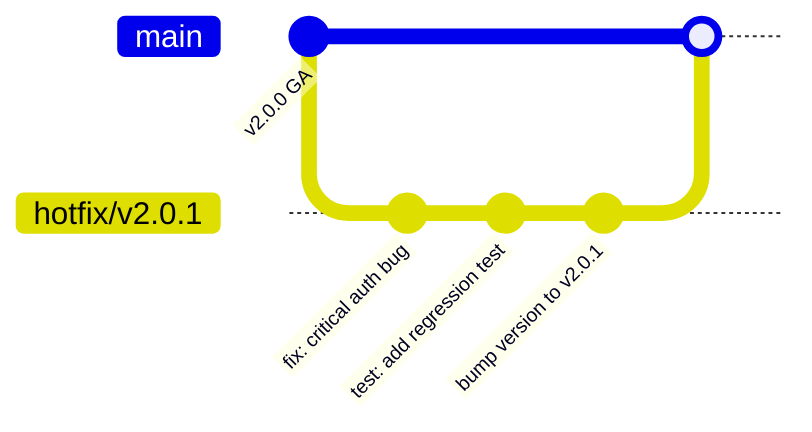
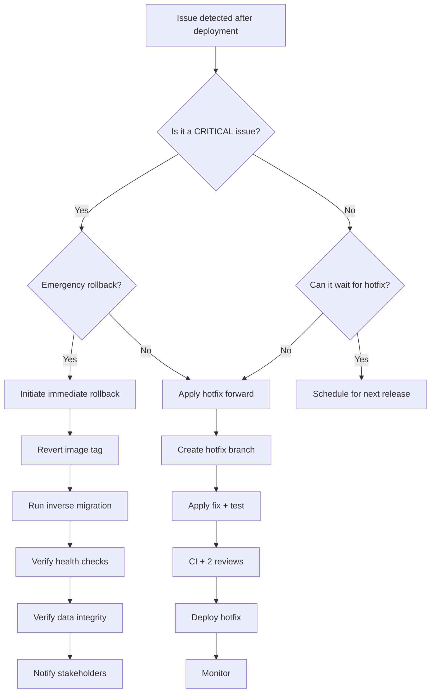

# Release Management

> Cross-reference: → [docs/engineering-constitution/10-ai-agent-development-rules.md](./10-ai-agent-development-rules.md),
> → [docs/engineering-constitution/11-definition-of-done.md](./11-definition-of-done.md),
> → [docs/decisions/ADR-008-documentation-as-code.md](../../decisions/ADR-008-documentation-as-code.md)

---

## 1. Release Types

### WHY

Different stages of software maturity require different release types. Classifying releases
sets clear expectations for stability, support, and audience, and enables parallel work on
current and future versions.

### RATIONALE

Without release type classification, consumers cannot distinguish between experimental and
production-ready software. A hotfix deployed with the same ceremony as a major release causes
unnecessary delay; a major release deployed with the same speed as a hotfix causes unnecessary
risk. Release types solve both problems.

### Release type definitions

| Type               | Code     | Audience            | Support level   | Stability  |
|--------------------|----------|---------------------|-----------------|------------|
| Alpha              | `alpha`  | Internal dev team   | None            | Unstable   |
| Private Alpha      | `palpha` | Invite-only testers | Best-effort     | Experimental |
| Beta               | `beta`   | Public preview      | Issue tracking  | Feature-complete |
| Release Candidate  | `rc`     | Staged rollout      | Full            | Stable     |
| General Availability | `ga`   | All users           | Full + SLA      | Production |
| Hotfix             | `hotfix` | All users (urgent)  | Emergency       | Production |

### GOOD example

```markdown
## Release v2.0.0-beta.1

This is a Beta release—feature-complete but not yet fully tested in production.
Report issues via GitHub Issues. No SLA applies.
```

### BAD example

```markdown
Release v2.0.0 (not yet stable, but called GA)
```

---

## 2. Release Cadence

### WHY

A predictable release cadence sets expectations for stakeholders, enables planning, and creates
a rhythm for the engineering team. Different cadences for different release types balance speed
with stability.

### RATIONALE

Without a cadence, releases happen ad-hoc — either too frequently (overwhelming consumers) or
too rarely (starving consumers of features). A cadence also creates natural deadlines that
focus engineering effort and prevent scope creep.

### Cadence schedule

| Release type    | Cadence          | Notes                                                  |
|-----------------|------------------|--------------------------------------------------------|
| Alpha           | Continuous       | On-demand from main branch                             |
| Private Alpha   | Bi-weekly        | Every other Friday, tagged from main                   |
| Beta            | Monthly          | First Monday of the month, release branch              |
| RC              | As needed        | Before each GA release, 1-3 RCs typical               |
| GA              | Quarterly        | March, June, September, December                       |
| Hotfix          | As needed        | Emergency, within 24 hours of confirmation             |

### Release day schedule

- **Branch cut**: Tuesday 10:00 UTC
- **Code freeze**: Tuesday 12:00 UTC (only bug fixes accepted)
- **Testing**: Tuesday 12:00 - Wednesday 12:00 UTC
- **Staging deploy**: Wednesday 12:00 UTC
- **Smoke tests**: Wednesday 12:00 - 16:00 UTC
- **Production deploy**: Thursday 08:00 UTC
- **Monitoring**: Thursday 08:00 - Friday 08:00 UTC

### GOOD example

```
March 2026 GA Schedule:
- Branch cut: March 3 (Tue) 10:00 UTC
- Code freeze: March 3 (Tue) 12:00 UTC
- Staging deploy: March 4 (Wed) 12:00 UTC
- Production deploy: March 5 (Thu) 08:00 UTC
```

### BAD example

```
Release when it's ready (no set schedule, no predictability)
```

---

## 3. Release Checklist

### WHY

A repeatable release checklist prevents human error and ensures every release meets quality
standards. Releasing is a high-risk operation; a checklist reduces the risk to near zero.

### RATIONALE

In high-stakes domains (aviation, medicine), checklists are proven to reduce errors. Software
releases are similarly high-stakes — a single missed step can cause production downtime or data
loss. The checklist ensures every release follows the same rigorous process.

### Pre-release checklist

- [ ] Code frozen (only bug fixes since branch cut)
- [ ] All CI pipelines green (lint, typecheck, test, build)
- [ ] Performance benchmarks meet targets (no regression > 5%)
- [ ] Security scan clean (no HIGH/CRITICAL vulnerabilities)
- [ ] Documentation updated (API docs, README, guides)
- [ ] Changelog generated (all changes listed since last release)
- [ ] Version bumped per semver rules
- [ ] Release notes drafted (highlights, breaking changes, deprecations)
- [ ] Rollback plan confirmed (steps documented, tested)
- [ ] Deployment runbook current (all steps verified)
- [ ] Dependencies audited (no new vulnerabilities in transitive deps)
- [ ] Migration tested in staging (forward and reverse)
- [ ] Monitoring dashboards verified (all metrics flowing)
- [ ] Alerts configured for new services/endpoints
- [ ] Stakeholders notified (release schedule, expected downtime)

---

## 4. Deployment Checklist

### WHY

A structured deployment process ensures consistency, minimizes human error, and provides
a clear sequence of steps that can be followed by any team member, even under pressure.

### RATIONALE

Deployment is the moment of highest risk in the release lifecycle. A checklist ensures that
pre-deploy conditions are met, the deploy itself is executed correctly, and post-deploy
verification confirms success.

### Pre-deploy (T-1 hour)

- [ ] Backup database (automated, verify backup exists)
- [ ] Verify monitoring is operational (check dashboards)
- [ ] Check disk space on all target servers (> 20% free)
- [ ] Check memory/cpu on all target servers (no pre-existing issues)
- [ ] Review migration plan (SQL scripts, estimated duration, rollback)
- [ ] Notify stakeholders (deployment starting, expected duration)
- [ ] Check incident response team is available
- [ ] Verify rollback procedure documented and tested
- [ ] Confirm release image tag is correct (no `latest` tags)

### Deploy (T+0)

- [ ] Pull Docker image: `docker pull ghcr.io/xennic/api:<tag>`
- [ ] Tag image: `docker tag ghcr.io/xennic/api:<tag> xennic-api:<new-tag>`
- [ ] Run database migration: `pnpm db:apply` (verify success)
- [ ] Restart service: `docker compose up -d api`
- [ ] Verify service started: `docker compose ps`
- [ ] Verify health check: `curl -f http://localhost:3000/api/v1/health`
- [ ] Verify health of upstream dependencies (DB, Redis, RabbitMQ)
- [ ] Warm caches (if applicable)
- [ ] Enable traffic (if blue/green, switch router)

### Post-deploy (T+15 min)

- [ ] Run smoke tests: `pnpm test:e2e` (critical user flows)
- [ ] Verify API response format: `curl /api/v1/health`
- [ ] Check error rate in monitoring dashboard (< 0.1% increase)
- [ ] Check response latency in monitoring dashboard (no regression)
- [ ] Check logs for errors (no new ERROR-level logs)
- [ ] Verify migration completed (check schema version)
- [ ] Confirm rollback procedure still valid (database state may have changed)
- [ ] Notify stakeholders: deployment complete
- [ ] Update deployment status in release tracking system

---

## 5. Hotfix Process

### WHY

Hotfixes address critical production issues that cannot wait for the next regular release.
A streamlined process gets the fix to users quickly while maintaining quality gates.

### RATIONALE

In an emergency, speed matters — but cutting corners creates new emergencies. The hotfix
process preserves essential quality gates (tests, review, CI) while eliminating non-essential
steps. It also ensures the fix is permanently integrated (merged to main) so it is not lost.

### Hotfix branch flow



### Hotfix procedure

1. **Branch**: Create `hotfix/<version>` from the tagged release commit.
2. **Fix**: Apply the minimal fix needed (one concern per hotfix).
3. **Test**: Write regression test that proves the fix.
4. **CI**: Run full CI pipeline (same gates as regular release).
5. **Review**: Two peer reviewers minimum (architecture + domain expert).
6. **Merge**: Merge to release branch AND to main (or a dedicated `backport` branch).
7. **Tag**: Tag the hotfix version (`v2.0.1`).
8. **Deploy**: Deploy with priority (within 24 hours of confirmation).
9. **Post-mortem**: Written within 5 business days, identifying root cause and prevention.

### Hotfix eligibility criteria

A hotfix is justified when the issue is:

- **Critical bug**: Core functionality completely broken for all users.
- **Security vulnerability**: Exploitable vulnerability with CVSS >= 7.0.
- **Data loss**: Production data corruption or loss.
- **SLO breach**: Error rate > 5% or latency > 10x p99.

### HOTFIX checklist

- [ ] Minimal fix (no scope creep, no refactoring)
- [ ] Regression test added
- [ ] CI green for the hotfix branch
- [ ] Reviewed by 2 peers (architecture + domain)
- [ ] Merged to main (or backport branch created)
- [ ] Version bumped (patch)
- [ ] Deployed within 24 hours
- [ ] Post-mortem scheduled

### GOOD example

```
Hotfix v2.0.1 - Critical Auth Bypass

Issue: CVE-2026-0123 - JWT token validation missing in refresh endpoint
Fix: Added token validation check in AuthService.refreshToken()
Reviewed by: @arch-lead, @sec-eng
Deployed: 2026-03-06 14:30 UTC
Post-mortem: #post-mortem-042
```

### BAD example

```
Hotfix v2.0.1 - Fix bugs (too vague, multiple unrelated fixes bundled)
```

---

## 6. Rollback Process

### WHY

Every release must have a documented, tested rollback plan. When a release causes problems,
speed of rollback directly impacts user experience and data integrity.

### RATIONALE

Even with the best testing, production issues can emerge. The question is not _if_ a rollback
will be needed, but _when_. A pre-defined rollback process eliminates decision-making under
pressure and ensures the rollback is executed correctly.

### Rollback triggers

A rollback MUST be initiated if any of the following are detected:

| Trigger                             | Threshold                                      |
|-------------------------------------|------------------------------------------------|
| Critical bug                        | Core feature broken for > 1% of users          |
| Security vulnerability              | Active exploitation detected or confirmed      |
| Data loss                           | Any data loss or corruption detected           |
| SLO breach                          | Error rate > 5% or latency > 10x p99 for > 5 min |
| Migration failure                   | Schema migration fails or causes data issues   |
| Dependency failure                  | Critical dependency (DB, Redis, Queue) degraded |

### Rollback decision tree



### Rollback steps

1. **Decision**: Release manager or on-call engineer declares rollback.
2. **Communicate**: Notify team and stakeholders via #releases channel.
3. **Revert image**: Deploy the previous release's Docker image tag.
4. **Inverse migration**: Run the down migration (if the release included a schema migration).
5. **Verify health**: Check health endpoints for all services.
6. **Verify data integrity**: Check that data is consistent and complete.
7. **Monitor**: Watch error rates, latency, and logs for 30 minutes.
8. **Post-mortem**: Schedule within 5 business days.

### Rollback window

- **Hotfix rollback**: Within 10 minutes of detection.
- **Regular release rollback**: Within 30 minutes of detection.
- **Major release rollback**: Within 60 minutes of detection.

After these windows, evaluate whether to roll forward with a hotfix instead.

---

## 7. Release Automation

### WHY

Automation eliminates human error from the release process, accelerates delivery, and frees
engineers from repetitive manual steps. Every step that can be automated should be automated.

### RATIONALE

Manual releases are slow, error-prone, and require a human with deep knowledge of the process.
Automation makes releases fast, repeatable, and delegable to any team member. It also enables
more frequent releases (the primary metric for DevOps maturity).

### CI/CD pipeline stages

```
┌─────────┐    ┌──────────┐    ┌─────────┐    ┌──────────┐    ┌──────────┐
│  Lint   │ -> │ Typecheck│ -> │  Test   │ -> │  Build   │ -> │  Security│
└─────────┘    └──────────┘    └─────────┘    └──────────┘    └──────────┘
                                                                    │
                                                                    v
┌──────────┐    ┌──────────┐    ┌────────────┐    ┌───────────────┐
│  Publish │ <- │  Tag     │ <- │  Deploy    │ <- │  Integration  │
│  Artifact│    │  Release │    │  Staging   │    │  Tests        │
└──────────┘    └──────────┘    └────────────┘    └───────────────┘
                                    │
                                    v
                            ┌───────────────┐
                            │  Manual       │
                            │  Promotion    │
                            │  to Production│
                            └───────────────┘
```

### Artifact management

- **Container images**: Published to `ghcr.io/xennic/` with tags: `<version>`, `<version>-<arch>`.
- **npm packages**: Published to GitHub Packages for `packages/*`.
- **Python packages**: Published to `pypi.xennic.local` (internal registry).
- **OpenAPI spec**: Published as release artifact (`openapi-v1.json`).

### Container registry tags

| Tag pattern          | Example              | Purpose                   |
|----------------------|----------------------|---------------------------|
| `<version>`          | `v2.0.0`            | Immutable release         |
| `<version>-rc.<N>`   | `v2.0.0-rc.1`       | Release candidate         |
| `<version>-beta.<N>`  | `v2.0.0-beta.1`     | Beta release              |
| `<version>-alpha.<N>` | `v2.0.0-alpha.1`    | Alpha release             |
| `main-<sha>`         | `main-a1b2c3d4`      | Per-commit build (dev)    |
| `latest`             | `latest`             | Latest stable GA release  |

### Release tags (git)

- **GA**: `v<major>.<minor>.<patch>` (e.g., `v2.0.0`, `v2.1.0`).
- **Pre-release**: `v<major>.<minor>.<patch>-<pre>.N` (e.g., `v2.0.0-beta.1`).
- **Hotfix**: `v<major>.<minor>.<patch+1>` (e.g., `v2.0.1`).

### Automated release notes

Release notes are auto-generated from conventional commits between the last release tag and
the current tag:

```markdown
## v2.1.0 (2026-06-26)

### Features
- feat(auth): add refresh token rotation (#456)
- feat(api): add pagination to project list (#457)

### Bug Fixes
- fix(calc): handle division by zero in short circuit (#458)

### Performance
- perf(db): add index on events.created_at (#459)

### Documentation
- docs(release): add release management guide (#460)
```

---

## 8. Post-Release

### WHY

The period immediately after a release is the highest-risk window. Structured monitoring and
review during this period catches issues early and feeds improvements back into the process.

### RATIONALE

Post-release activities serve two purposes: (1) detect and respond to issues introduced by
the release, and (2) improve the release process itself. Both are essential for continuous
improvement.

### Monitoring period

| Release type    | Monitoring period | Escalation              |
|-----------------|-------------------|-------------------------|
| Hotfix          | 2 hours           | On-call engineer        |
| Regular release | 24 hours          | Release manager         |
| Major release   | 72 hours          | Engineering leadership  |

During the monitoring period:
- Error rate checked every 5 minutes.
- p50/p95/p99 latency checked every 5 minutes.
- Business metrics (signups, calculations, API calls) checked hourly.
- Logs reviewed for new error patterns.
- On-call engineer is primary responder.

### Post-release metrics review

72 hours after release, review these metrics:

- **Deployment frequency**: How often we deploy to production.
- **Lead time**: Time from commit to production.
- **Change failure rate**: Percentage of releases causing incidents.
- **Mean time to recovery**: Average time to recover from incidents.
- **Error budget consumption**: How much of the SLO error budget was consumed.

### Incident log review

- Cross-reference release changes with incident logs.
- Identify any incidents caused or exacerbated by the release.
- Document lessons learned in the release retrospective.

### Release retrospective

Every GA release gets a retrospective within 2 weeks:

- What went well?
- What went wrong?
- What could be improved in the release process?
- Action items with owners and deadlines.

### Improvement actions

From each retrospective, at minimum:

- One process improvement (update release checklist, add automation).
- One monitoring improvement (add alert, improve dashboard).
- One documentation improvement (update runbook, clarify process).

---

## 9. Semantic Versioning Rules

### WHY

Semantic versioning (SemVer) communicates the nature of changes to consumers at a glance.
Following SemVer consistently builds trust and enables automated dependency management.

### RATIONALE

Without SemVer, consumers cannot tell if an upgrade is safe. Every version bump becomes a
research project. SemVer eliminates this: patch = safe, minor = new features, major = breaking
changes. Consistency is critical — violating SemVer erodes trust.

### Version format

```
<major>.<minor>.<patch>[-<pre-release>.<id>]

Examples:
2.0.0
2.1.0
2.1.0-beta.1
2.1.1
```

### Major version increment (breaking)

Triggered by:
- Breaking API contract changes (endpoint removed, request/response shape changed).
- Breaking database schema changes (column removed, data type changed).
- Major feature removal (end-of-life feature dropped).
- Backward-incompatible dependency upgrade (e.g., NestJS v10 → v11).
- Major architectural change (module split, service extraction).

### Minor version increment (non-breaking)

Triggered by:
- New API endpoint (backward compatible).
- New feature (backward compatible).
- New module or service (backward compatible).
- New configuration option (default preserves existing behavior).
- Deprecation of existing feature (still works, will be removed in next major).

### Patch version increment (backward-compatible bug fix)

Triggered by:
- Bug fix (backward compatible).
- Performance improvement (backward compatible).
- Security patch (backward compatible).
- Dependency update (non-breaking).
- Documentation update (code-related, not purely docs).
- Test additions.

### Pre-release identifiers

- `alpha.N` — Internal development, breaking changes expected.
- `beta.N` — External preview, feature-complete, bugs expected.
- `rc.N` — Release candidate, final testing, no expected breaking changes.

Pre-release versions have lower precedence than the release version:
`2.0.0-alpha.1 < 2.0.0-beta.1 < 2.0.0-rc.1 < 2.0.0`

### GOOD example

```markdown
## v2.1.0 (2026-06-26)

### Added
- feat(api): POST /api/v1/workspaces/{id}/members (new endpoint)

### Changed
- refactor(auth): internal token validation (no API change)
```

### BAD example

```markdown
## v2.1.0 (2026-06-26)

### Changed
- feat(api): removed GET /api/v1/users endpoint  (breaking change — should be v3.0.0)
```

---

## 10. Release Communication

### WHY

Clear, timely communication about releases sets expectations, reduces support inquiries, and
helps consumers plan their upgrades. Different audiences need different information.

### RATIONALE

Silent releases confuse users and create distrust. When a new version ships with breaking
changes and users are not notified, they experience unexpected failures and blame the product.
Over-communication is better than under-communication.

### Release notes format

```markdown
# Release v2.1.0

**Release date**: 2026-06-26
**Type**: Minor (feature release)
**Deployment window**: Thursday 2026-06-26 08:00-10:00 UTC
**Estimated downtime**: None (rolling deployment)

## Highlights

- New workspace member management API
- Performance improvements to calculation engine (30% faster)
- Security patches for dependency vulnerabilities

## What's New

- POST /api/v1/workspaces/{id}/members — add member to workspace
- DELETE /api/v1/workspaces/{id}/members/{userId} — remove member

## Breaking Changes

None

## Deprecations

- GET /api/v1/workspace-members (v1 endpoint) — use GET /api/v1/workspaces/{id}/members instead.
  Will be removed in v3.0.0.

## Upgrade Notes

No action required. The new endpoint is additive.

## Full Changelog

https://github.com/xennic/xennic/releases/v2.1.0
```

### Stakeholder notification

| Audience        | Channel          | Content                        | Timing                |
|-----------------|------------------|--------------------------------|-----------------------|
| Internal team   | #releases Slack  | All details + runbook link     | 24h before deploy     |
| Beta testers    | Email            | Highlights + upgrade notes     | Same day as beta      |
| All users       | Changelog        | Full changelog                 | At GA release         |
| API consumers   | API changelog    | API-specific changes           | At GA release         |
| Security team   | #security Slack  | Security-related changes       | Immediately           |
| Executives      | Monthly digest   | Highlights + metrics           | Monthly               |

### Changelog publication

- Changelog lives at `CHANGELOG.md` in the repository root.
- Updated by the release manager during the release process.
- Follows [Keep a Changelog](https://keepachangelog.com/) format.
- Each release links to the full release notes on GitHub.

### API changelog

- Published at `docs/api/CHANGELOG.md`.
- Focuses on API contract changes (endpoints, request/response shapes, error codes).
- Lists deprecation notices with target removal versions.

### Deprecation announcements

When a feature is deprecated:

1. Announce in release notes: "Feature X is deprecated and will be removed in vN.0.0."
2. Add deprecation header to API response: `Deprecation: true` and `Sunset: <date>`.
3. Update API changelog with deprecation notice.
4. Remove the feature in the specified major version (never earlier).

---

## Release Pipeline Flow

```mermaid
flowchart LR
    A[Feature branch] -->|PR merged| B[Main branch]
    B -->|CI: lint, typecheck, test, build, security| C{Pass?}
    C -->|Yes| D[Create release branch]
    C -->|No| A
    D --> E[Code freeze]
    E --> F[Staging deploy]
    F --> G[Smoke tests + integration tests]
    G --> H{Pass?}
    H -->|Yes| I[Create release tag]
    H -->|No| E
    I --> J[Pre-prod deploy]
    J --> K[Manual approval]
    K --> L[Production deploy]
    L --> M[Monitoring period]
    M --> N{Issues?}
    N -->|Yes| O{Rollback?}
    O -->|Yes| P[Rollback]
    O -->|No| Q[Hotfix]
    P --> M
    Q --> R[Hotfix release]
    N -->|No| S[Release complete]
    S --> T[Post-release review]
    R --> S
```



---

## Version History

| Version | Date       | Changes                                               |
|---------|------------|-------------------------------------------------------|
| 1.0.0   | 2026-06-26 | Initial version — comprehensive release management    |
