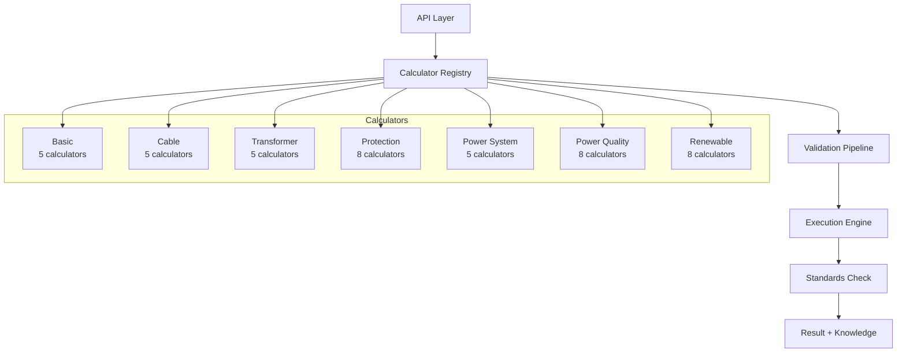
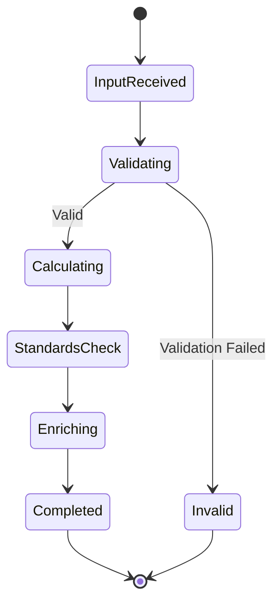

# موتور محاسبات — Calculation Engine

**نسخه**: ۱.۰.۰ | **وضعیت**: Approved | **آخرین بروزرسانی**: خرداد ۱۴۰۵

---

## Purpose

موتور محاسبات مهندسی پلتفرم Xennic را توصیف می‌کند.

---

## Scope

NestJS API Engineering Module, Python Engineering Service.

---

## معماری



---

## Calculator Lifecycle



---

## Calculator Registry

```python
class CalculatorRegistry:
    _instance = None
    _calculators: dict[str, BaseCalculator] = {}
    
    def __new__(cls):
        if cls._instance is None:
            cls._instance = super().__new__(cls)
            cls._instance._register_all()
        return cls._instance
    
    def _register_all(self):
        # Auto-register all calculators at startup
        self._register(OhmsLawCalculator())
        self._register(CableAmpacityCalculator())
        self._register(TransformerSizingCalculator())
        # ...
    
    def get(self, calculator_id: str) -> BaseCalculator:
        if calculator_id not in self._calculators:
            raise CalculatorNotFoundError(calculator_id)
        return self._calculators[calculator_id]
```

---

## Validation Pipeline

```python
class ValidationPipeline:
    def validate(self, inputs: dict, rules: list[ValidationRule]):
        for rule in rules:
            result = rule.check(inputs)
            if not result.is_valid:
                return ValidationResult(
                    is_valid=False,
                    errors=[result.error]
                )
        return ValidationResult(is_valid=True)
```

---

## Standards Integration

| Calculator | Standard | Organization |
|------------|----------|-------------|
| Ampacity | IEC 60287 | IEC |
| Voltage Drop | IEC 60364 | IEC |
| Short Circuit | IEC 60949 | IEC |
| Transformer | IEC 60076 | IEC |
| MCCB Selection | IEC 60947 | IEC |
| Arc Flash | IEEE 1584 | IEEE |
| Grounding | IEEE 80 | IEEE |
| Solar PV | IEC 62548 | IEC |
| Lighting | EN 12464 | CEN |

---

## Related Documents

| سند | مسیر |
|-----|------|
| Engineering Engine | `engineering/ENGINEERING_ENGINE.md` |
| Formulas | `engineering/FORMULAS.md` |
| Validation Rules | `engineering/VALIDATION_RULES.md` |
| Calculator Catalog | `engineering/XENNIC_CALCULATION_CATALOG_v1.md` |

---

## Revision History

| نسخه | تاریخ | تغییرات |
|------|-------|---------|
| ۱.۰.۰ | خرداد ۱۴۰۵ | انتشار اولیه |
