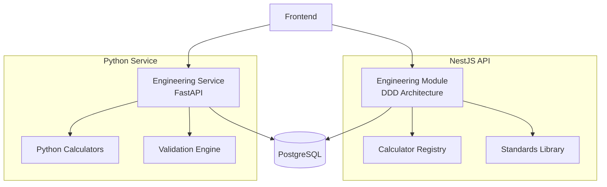

# موتور مهندسی — Engineering Engine

**نسخه**: ۱.۰.۰ | **وضعیت**: Approved | **آخرین بروزرسانی**: خرداد ۱۴۰۵

---

## Purpose

موتور کامل مهندسی برق پلتفرم Xennic را توصیف می‌کند.

---

## Scope

تمامی محاسبات مهندسی، استانداردها، validation.

---

## Architecture



---

## Supported Standards

### International
| استاندارد | دامنه |
|-----------|-------|
| IEC 60076 | Power Transformers |
| IEC 60287 | Cable Ampacity |
| IEC 60364 | Low Voltage Installations |
| IEC 60909 | Short Circuit Currents |
| IEC 60947 | Low Voltage Switchgear |
| IEC 61439 | Switchgear Assemblies |
| IEC 62548 | Photovoltaic Arrays |
| IEEE 80 | Grounding |
| IEEE 519 | Power Quality |
| IEEE 1584 | Arc Flash |
| NFPA 70E | Electrical Safety |
| EN 12464 | Lighting |

## Calculation Lifecycle
```
Input → Validation → Standards Reference → Execute → Result → Knowledge → Report
```

## Related Documents
| سند | مسیر |
|-----|------|
| Calculation Engine | `engineering/CALCULATION_ENGINE.md` |
| Formulas | `engineering/FORMULAS.md` |
| Validation Rules | `engineering/VALIDATION_RULES.md` |
| Engineering Service | `services/engineering-service.md` |
| Engineering Spec | `engineering/XENNIC_ENGINEERING_ENGINE_SPEC_v1.md` |

## Revision History
| نسخه | تاریخ | تغییرات |
|------|-------|---------|
| ۱.۰.۰ | خرداد ۱۴۰۵ | انتشار اولیه |
