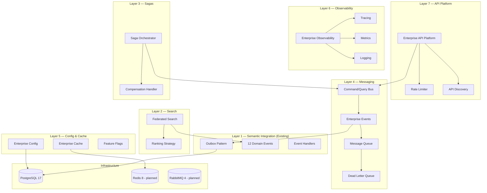
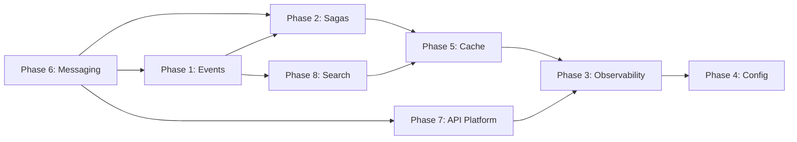
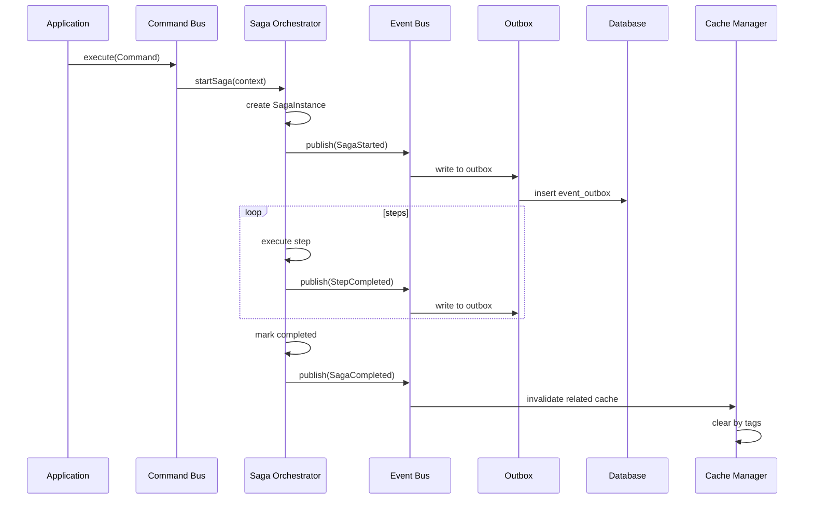
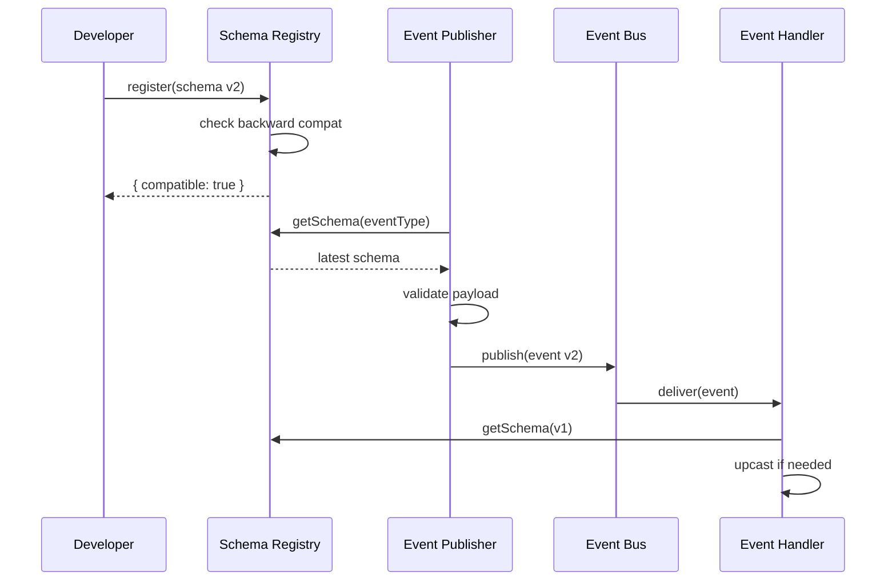
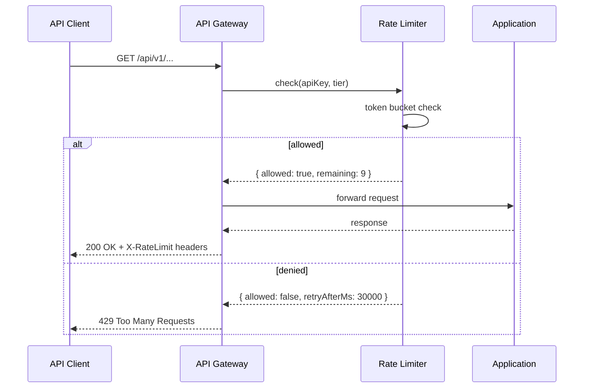

# Sprint E1 — Enterprise Platform Architecture

## Overview

Sprint E1 transforms the Xennic platform from a collection of modules into a fully integrated Enterprise Platform. Eight phases build on the Sprint K4 foundation to deliver a unified architecture spanning messaging, events, sagas, caching, observability, configuration, API management, and search federation.

## Architecture Diagram



## Phase Dependency Graph



## Module Structure

```
apps/api/src/modules/
├── enterprise-messaging/          # Phase 6: Command/Query/Message buses
├── enterprise-event-architecture/ # Phase 1: Schema registry, replay
├── enterprise-saga/               # Phase 2: Saga orchestration + compensation
├── enterprise-cache/              # Phase 5: Unified cache + invalidation
├── enterprise-observability/      # Phase 3: Tracing + metrics + logging
├── enterprise-config/             # Phase 4: Feature flags + config store
├── enterprise-api-platform/       # Phase 7: API discovery + rate limiting
├── enterprise-search-federation/  # Phase 8: Federated search + ranking
└── semantic-integration/          # Existing: Outbox + 12 events + 2 handlers
```

## Sequence Diagram: Event Flow with Saga



## Event Schema Compatibility Flow



## Rate Limiting Flow



## Implementation Status

| Phase | Module | Status | Lines of Code |
|-------|--------|--------|---------------|
| Phase 6 | Enterprise Messaging | Complete | ~250 |
| Phase 1 | Enterprise Event Architecture | Complete | ~200 |
| Phase 2 | Enterprise Saga | Complete | ~250 |
| Phase 5 | Enterprise Cache | Complete | ~200 |
| Phase 3 | Enterprise Observability | Complete | ~200 |
| Phase 4 | Enterprise Config | Complete | ~200 |
| Phase 7 | Enterprise API Platform | Complete | ~170 |
| Phase 8 | Enterprise Search Federation | Complete | ~180 |

## Key Design Decisions

1. **In-process first**: All buses use in-process implementation initially. Redis/RabbitMQ adapters can be added without API changes.
2. **Interface-driven**: All modules define pure TypeScript interfaces with DI tokens for testability.
3. **Global modules**: Messaging, Cache, and Observability are `@Global()` — available everywhere without explicit imports.
4. **Extends existing**: Event Architecture builds on the existing Semantic Integration outbox pattern rather than replacing it.
5. **No external dependencies**: All implementations use built-in Node.js and NestJS features. No new npm packages required.

## Production Readiness

| Aspect | Status | Notes |
|--------|--------|-------|
| Interfaces defined | ✅ | All modules have clean interfaces |
| In-process implementation | ✅ | Working without external infra |
| Redis adapter | 📋 Planned | Phase E2 |
| RabbitMQ adapter | 📋 Planned | Phase E2 |
| Persistent saga storage | 📋 Planned | PostgreSQL saga-store |
| OpenTelemetry exporter | 📋 Planned | Jaeger/Zipkin integration |
| Prometheus scrape endpoint | 📋 Planned | /metrics endpoint |
| Distributed cache invalidation | 📋 Planned | Redis Pub/Sub |
