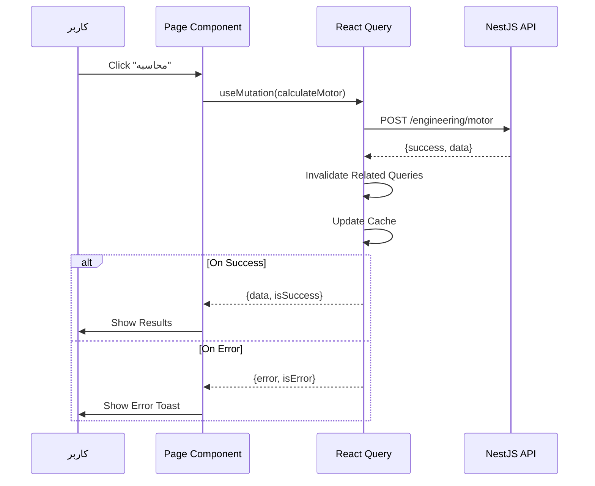

# مدیریت State — State Management

**نسخه**: ۱.۰.۰ | **وضعیت**: Approved | **آخرین بروزرسانی**: خرداد ۱۴۰۵

---

## Purpose

استراتژی مدیریت State (وضعیت) در فرانت‌اند Xennic را توصیف می‌کند.

---

## Scope

Zustand (Client State), TanStack Query (Server State), React Context.

---

## State Categories

| نوع State | ابزار | مثال |
|-----------|-------|------|
| **Server State** | TanStack Query | user data, calculations, knowledge articles |
| **Client State** | Zustand | UI state, auth tokens, theme |
| **Form State** | React Hook Form | form inputs, validation |
| **URL State** | Next.js Router | search params, page |
| **Context** | React Context | theme, i18n, toast |

---

## Server State (TanStack Query)

```typescript
import { useQuery, useMutation } from '@tanstack/react-query';

// Fetch
const { data, isLoading } = useQuery({
  queryKey: ['calculations', 'motor', id],
  queryFn: () => api.getMotorCalculation(id),
});

// Mutate
const mutation = useMutation({
  mutationFn: (data) => api.createMotorCalculation(data),
  onSuccess: () => {
    queryClient.invalidateQueries({ queryKey: ['calculations'] });
  },
});
```

### Query Keys Convention
```typescript
['user', 'profile']
['user', id, 'permissions']
['workspace', id, 'settings']
['engineering', 'calculations', { page, limit }]
['knowledge', id, 'versions']
['ai', 'conversations', id, 'messages']
```

---

## Client State (Zustand)

```typescript
import { create } from 'zustand';

interface AuthState {
  user: User | null;
  token: string | null;
  setAuth: (user: User, token: string) => void;
  logout: () => void;
}

export const useAuthStore = create<AuthState>((set) => ({
  user: null,
  token: null,
  setAuth: (user, token) => set({ user, token }),
  logout: () => set({ user: null, token: null }),
}));
```

### Zustand Stores

| Store | State | Persist |
|-------|-------|---------|
| `auth.store` | user, token, permissions | localStorage |
| `toast.store` | toasts, addToast, removeToast | - |
| `settings.store` | theme, language | localStorage |

---

## State Flow Diagram

```mermaid
graph TB
    subgraph "Client State (Zustand)"
        AUTH["Auth Store\nuser, token"]
        TOAST["Toast Store\nnotifications"]
        SETT["Settings Store\ntheme, locale"]
    end
    
    subgraph "Server State (React Query)"
        USERS["User Queries"]
        CALCS["Calculation Queries"]
        KNOW["Knowledge Queries"]
        AI["AI Queries"]
    end
    
    subgraph "Cache"
        QC["Query Client\nCache + Invalidation"]
    end
    
    Client State --> Pages
    Server State --> Pages
    Pages --> QC
```

---

## Data Flow



---

## Performance Considerations

- **Query Deduplication**: TanStack Query auto-deduplicates requests
- **Stale Time**: تنظیم `staleTime` مناسب برای هر query
- **Garbage Collection**: `gcTime` برای پاکسازی خودکار
- **Prefetching**: بارگذاری پیش‌دست داده‌ها
- **Optimistic Updates**: به‌روزرسانی خوش‌بینانه برای UX بهتر

---

## Related Documents

| سند | مسیر |
|-----|------|
| UI Architecture | `frontend/UI_ARCHITECTURE.md` |
| Routing | `frontend/ROUTING.md` |
| Component Guide | `frontend/COMPONENT_GUIDE.md` |

---

## Revision History

| نسخه | تاریخ | تغییرات |
|------|-------|---------|
| ۱.۰.۰ | خرداد ۱۴۰۵ | انتشار اولیه |
