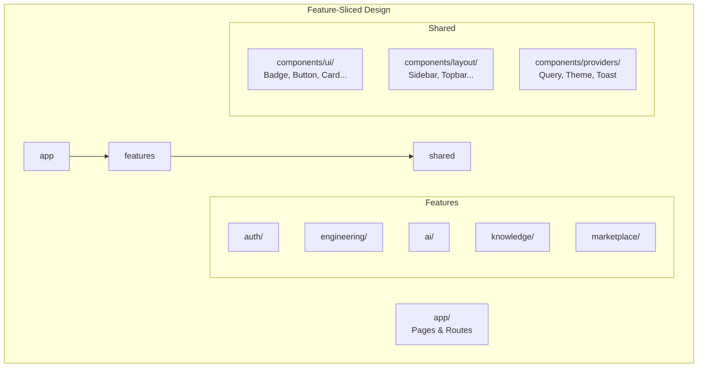

# معماری رابط کاربری — UI Architecture

**نسخه**: ۱.۰.۰ | **وضعیت**: Approved | **آخرین بروزرسانی**: خرداد ۱۴۰۵

---

## Purpose

معماری رابط کاربری (UI) فرانت‌اند Xennic را توصیف می‌کند.

---

## Scope

Next.js App Router, Component Architecture, Feature-Sliced Design.

---

## Tech Stack

| کتابخانه | نسخه | کاربرد |
|----------|------|--------|
| Next.js | ۱۴ | فریم‌ورک (App Router) |
| React | ۱۸ | UI Library |
| Tailwind CSS | ۳ | استایل Utility-first |
| shadcn/ui | - | کامپوننت‌های پایه |
| Radix UI | - | کامپوننت‌های headless |
| next-intl | - | بین‌المللی‌سازی |

---

## Component Architecture



---

## Page Structure

```
app/[locale]/
├── (landing)/        # Landing page (public)
├── (public)/         # Public pages (about, contact, knowledge)
├── (auth)/           # Auth pages (login, register)
├── (dashboard)/      # Protected dashboard
└── (admin)/          # Admin panel
```

---

## Component Types

| نوع | دایرکتوری | مثال | State |
|-----|-----------|------|-------|
| **UI** | `components/ui/` | Button, Card, Input | بدون state |
| **Layout** | `components/layout/` | Sidebar, Topbar | Layout state |
| **Feature** | `features/{name}/` | CalculatorForm, BillAnalyzer | Domain state |
| **Page** | `app/.../page.tsx` | Dashboard, Settings | Page state |

---

## Styling Strategy

```typescript
// Tailwind CSS + cn() utility
import { cn } from '@/lib/utils';

export function Button({ className, ...props }) {
  return (
    <button
      className={cn(
        "inline-flex items-center justify-center rounded-md",
        "bg-primary text-primary-foreground",
        "hover:bg-primary/90",
        "px-4 py-2 text-sm font-medium",
        className
      )}
      {...props}
    />
  );
}
```

---

## Theming

```typescript
// Dark/Light mode with next-themes
"use client";
import { useTheme } from "next-themes";

function ThemeToggle() {
  const { theme, setTheme } = useTheme();
  return (
    <button onClick={() => setTheme(theme === 'dark' ? 'light' : 'dark')}>
      {theme === 'dark' ? '🌞' : '🌙'}
    </button>
  );
}
```

---

## Responsive Design

| Breakpoint | عرض | هدف |
|------------|------|------|
| `sm` | ۶۴۰px | موبایل |
| `md` | ۷۶۸px | تبلت |
| `lg` | ۱۰۲۴px | دسکتاپ |
| `xl` | ۱۲۸۰px | دسکتاپ عریض |

---

## Future Improvements

1. **Server Components**: استفاده بیشتر از RSC
2. **Streaming SSR**: بهبود تجربه کاربری با streaming
3. **PWA**: قابلیت نصب به عنوان اپلیکیشن
4. **Animation**: افزودن Framer Motion
5. **Storybook**: کتابخانه کامپوننت‌ها

---

## Related Documents

| سند | مسیر |
|-----|------|
| State Management | `frontend/STATE_MANAGEMENT.md` |
| Routing | `frontend/ROUTING.md` |
| Component Guide | `frontend/COMPONENT_GUIDE.md` |
| Features Catalog | `frontend/FEATURES_CATALOG.md` |

---

## Revision History

| نسخه | تاریخ | تغییرات |
|------|-------|---------|
| ۱.۰.۰ | خرداد ۱۴۰۵ | انتشار اولیه |
