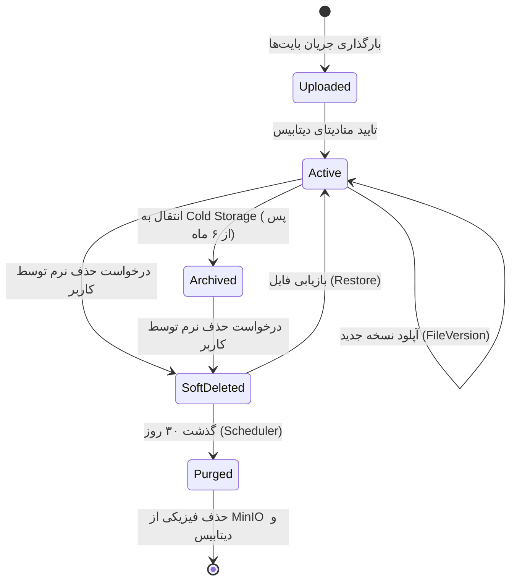
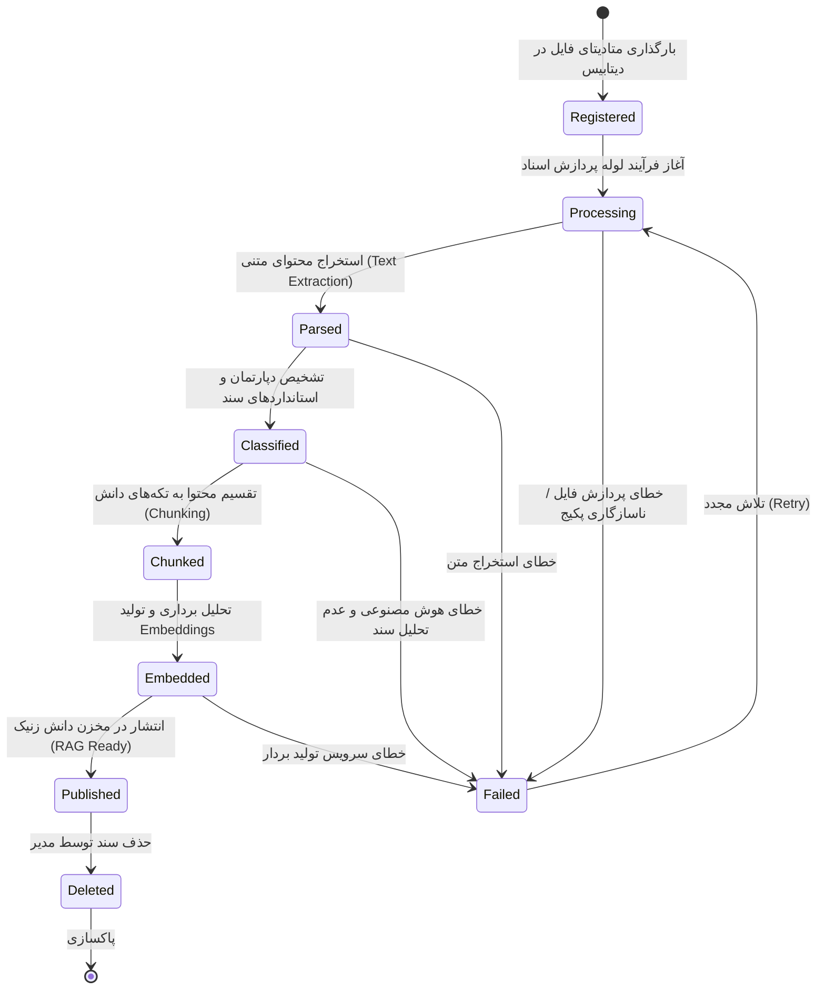
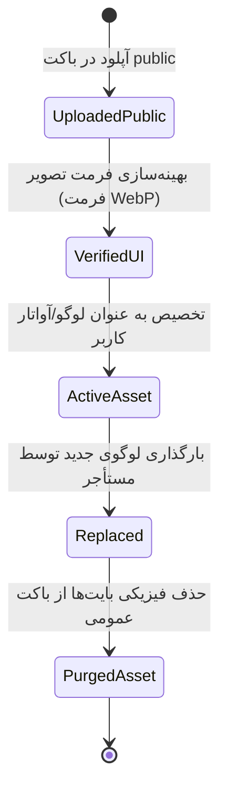

# مستند ماشین وضعیت چرخه حیات فایل و سند (Storage Lifecycle State Machines)

========================================================================

**شناسه سند:** XENNIC-STORAGE-LIFE-001  
**تاریخ سند:** ۲۸ تیر ۱۴۰۵ (2026-07-18)  
**نسخه:** 1.0.0  
**مسئول تدوین:** دستیار معماری و حاکمیت Storage (شناسه: `XENNIC-STORAGE-ARCH-001`)  
**وضعیت:** تایید شده (APPROVED)

این مستند مدل چرخه حیات (Lifecycle) و نمودار ماشین وضعیت رکوردهای فیزیکی و متادیتای موجودیت‌های پلتفرم استوریج را مشخص می‌کند.

---

## ۱. چرخه حیات فایل و نسخه‌ها (File and Version Lifecycle)

پایه‌ای‌ترین چرخه حیات متعلق به موجودیت فایل خام (`FileEntity`) است. این ماشین وضعیت وظیفه هدایت بایت‌های باینری از زمان ورود به دیسک استوریج تا نابودی کامل را عهده‌دار است.

### شرح جزئیات وضعیت‌ها و انتقال‌ها (Transitions):

- **Uploaded:** بایت‌ها با موفقیت در باکت استاندارد MinIO قرار گرفته‌اند اما تراکنش دیتابیس هنوز تایید نشده است.
- **Active:** تراکنش دیتابیس با موفقیت ثبت شده و فایل به عنوان منبع زنده برای سیستم شناخته می‌شود.
- **Archived:** فایل به کلاس ذخیره‌سازی ابری ارزان‌تر انتقال یافته است. لینک‌های دانلود همچنان معتبر هستند اما لود اولیه ممکن است با کمی تاخیر انجام شود.
- **SoftDeleted:** فیلد `deleted_at` با تاریخ زمان فعلی مقداردهی می‌شود. فایل از جست‌وجوهای کلاینت حذف گردیده ولی بایت‌های آن در MinIO محفوظ می‌ماند.
- **Purged (Hard-Deleted):** فرآیند نهایی نابودی فیزیکی. در این مرحله بایت‌های شیء از MinIO حذف سخت شده و رکوردهای دیتابیس به صورت Cascade پاکسازی می‌گردند.

---

## ۲. چرخه حیات اسناد کارخانه دانش (Knowledge Document Lifecycle)

موجودیت سند هوش مصنوعی (`KnowledgeDocument`) دارای چرخه‌ای پیچیده و غنی‌تر است که وضعیت پردازش اسناد متنی را مشخص می‌سازد.

### جزئیات گام‌های شکست پردازش (Failed State Handling):

- در صورت وقوع هرگونه خطای سیستمی (مثلاً قطعی کلاینت پایتون یا اورفلو شدن توکن‌های ال‌ال‌ام)، سند در وضعیت **Failed** قرار می‌گیرد و پیغام خطا در ستون `error_message` ثبت می‌شود.
- سیستم هوشمند کارخانه دانش دارای مکانیزم تلاش مجدد خودکار (Auto-Retry) تا سقف ۳ مرتبه در پس‌زمینه (توسط صف‌های BullMQ) است.

---

## ۳. چرخه حیات دارایی‌های عمومی برندینگ (Brand Asset Lifecycle)

تصاویری که به عنوان لوگو، آیکون و آواتارها بارگذاری می‌شوند، مستقیماً با لایه نمایش فرانت‌اند در ارتباطند و چرخه‌ای کاملاً ایمن و سبک دارند.

### جزئیات بهینه‌سازی تصاویر (VerifiedUI):

- در زمان ورود تصاویر عمومی، سیستم بک‌اند موظف به اجرای یک پردازشگر تصویر سبک جهت بهینه‌سازی حجم و فرمت تصاویر به فرمت‌های وب‌پسند مانند `image/webp` یا `image/png` است تا پهنای باند شبکه بهینه‌سازی شود.
- با آپلود لوگوی جدید، لوگوی قبلی مستقیما به وضعیت **Replaced** وارد شده و بایت‌های فیزیکی آن پس از ۷ روز برای جلوگیری از گسست کش مرورگرها، به شکل سخت از باکت عمومی پاکسازی می‌گردند.
